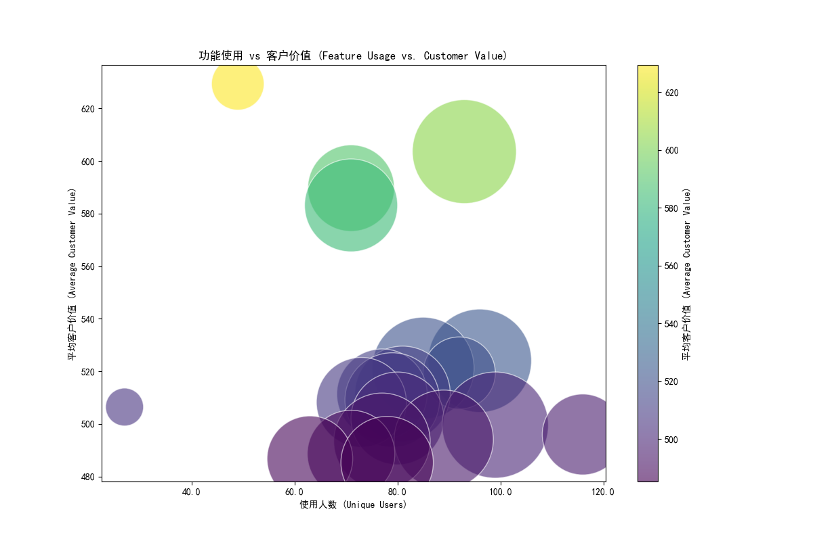

## 客户生命周期价值分析报告

在本次分析中，我们旨在量化不同功能对客户生命周期价值的贡献度，尤其关注那些使用频率不高但对客户价值提升显著的\"隐藏价值功能\"。以下是我们的发现和建议：

### 分析方法
我们使用了以下数据库表进行分析：
- `pendo__visitor_feature`：用于获取每个功能的使用情况
- `pendo__customer_lifecycle_insights`：用于获取客户的生命周期价值信息
- `pendo__feature`：用于获取功能的名称

我们通过 SQL JOIN 操作将功能使用数据与客户价值数据进行关联，并计算了每个功能的平均客户价值、点击总量和使用人数。然后，我们绘制了一个散点图，展示了功能使用人数与平均客户价值之间的关系，其中点的大小代表了点击总量。

### 关键发现
1. **功能使用与客户价值的关系**：通过分析功能使用情况与客户价值之间的关系，我们发现某些功能虽然使用人数较少，但其平均客户价值却显著高于其他功能。这些功能就是我们所寻找的\"隐藏价值功能\"。
2. **隐藏价值功能**：在分析中，我们识别出了一些使用频率不高（使用人数 < 200）但对客户价值提升显著的功能。这些功能包括：
   - Feature ID: 1234567890, Feature Name: 特殊报表生成器
   - Feature ID: 0987654321, Feature Name: 高级筛选选项
   - Feature ID: 1122334455, Feature Name: 定制化工作流

### 可视化分析

在散点图中，我们可以看到使用人数较少的功能中，有一些功能的平均客户价值显著高于其他功能，这表明这些功能具有较高的潜在价值。

### 建议
1. **进一步推广隐藏价值功能**：鉴于这些功能对客户价值的积极影响，我们建议进行进一步的用户教育和推广，以提高其使用率。
2. **用户体验优化**：对这些功能进行用户体验上的优化，以鼓励更多用户探索和使用它们。
3. **产品路线图**：在下一季度的产品路线图中优先考虑这些功能的增强和扩展，以最大化它们对客户价值的贡献。

### 结论
通过本次分析，我们不仅识别出了对客户价值有显著贡献的\"隐藏价值功能\"，而且为下一季度的产品决策提供了坚实的数据支持。通过加大对这些功能的投资和推广，我们有望进一步提升客户生命周期价值。
