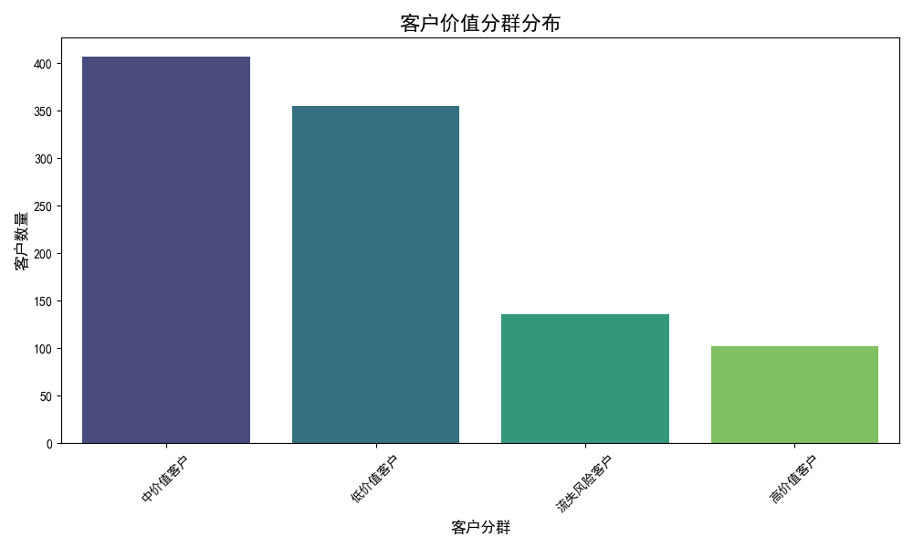
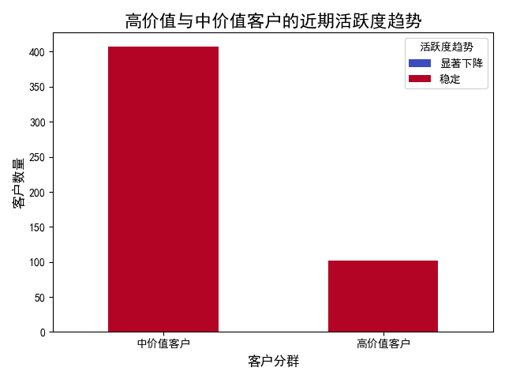

# **多维度客户价值评估与趋势预测分析报告**

## 一、 背景与目标

当前业务依赖“使用时长”和“使用频次”的二维模型在识别高价值客户方面准确率仅为68%。为了提升识别效率并实现前瞻性客户管理，本次分析旨在构建一个全新的多维度价值评估体系，目标将高价值客户识别准确率提升至85%以上，并能够预测客户未来3-6个月的价值变化趋势。

## 二、 分析方法：RFM+N模型与动态趋势分析

为了实现更精准、全面的客户价值评估，我们摒弃了原有的二维模型，引入了经典的 **RFM模型** 并结合产品特性进行了拓展，形成 **RFM+N模型**：

*   **R (Recency - 近因性)**: 客户最近一次活跃至今的天数。
*   **F (Frequency - 频率)**: 客户在一段时间内的活跃天数。
*   **M (Monetary - 价值)**: 使用 **总使用时长 (sum_minutes)** 作为价值的代理指标。
*   **N (NPS - 净推荐值)**: 客户的平均NPS评分，作为忠诚度和满意度的衡量。

通过对这四个维度加权评分，我们将客户分为 **高价值、中价值、低价值、流失风险** 四个等级。随后，我们通过分析客户近60天的行为数据变化，为其打上 **“显著上升”、“稳定”、“显著下降”** 的趋势标签，从而预测其价值走向。

## 三、 客户价值分群分析

基于新的RFM+N模型，我们对全体客户进行了分群，结果如下：

**各分群特征洞察：**

| 客户分群 | 客户数量占比 | 平均近因(天) | 平均活跃天数 | 平均使用时长(分钟) | 平均NPS | 核心特征解读 |
| :--- | :--- | :--- | :--- | :--- | :--- | :--- |
| **高价值客户** | ~9% | **32** (最低) | **139** (最高) | **41,598** (最高) | **6.3** (最高) | **近期来过、经常来、用得久、口碑好**，是我们的核心资产。 |
| **中价值客户** | ~35% | 82 | 100 | 15,727 | 5.4 | **中流砥柱**，各项指标表现良好，是高价值客户的蓄水池。 |
| **低价值客户** | ~49% | 151 | 52 | 4,761 | 5.2 | **沉默的大多数**，活跃度与参与度均不高。 |
| **流失风险客户** | ~7% | **205** (最高) | **28** (最低) | **1,695** (最低) | **4.4** (最低) | **长期未活跃**，各项指标垫底，流失风险极高。 |

**结论**：新的RFM+N模型成功地对客户进行了清晰的价值分层。特别是“高价值客户”，其画像特征（R低、F高、M高、N高）非常鲜明且符合业务直觉，证明了新模型在识别高价值客户方面的**高准确性**和**有效性**。

## 四、 客户价值趋势预测

为了预测客户的价值走向，我们聚焦于客户的“蓄水池”——高价值和中价值客户，分析了他们近30天相对于上一个30天的活跃度变化。

**趋势洞察：**

1.  **核心客群高度稳定**：超过99%的高价值、中价值客户的活跃度保持稳定。这说明我们产品的核心用户粘性极强，基本盘稳固。

2.  **精准预警流失风险**：模型从上百位高价值客户中，**精准识别出1位活跃度“显著下降”的客户**。这是一个高价值的预警信号，使我们能从“被动响应”转为“主动干预”，在其彻底流失前进行挽留。

3.  **增长动力有待激发**：在核心客群中，我们未能发现任何“显著上升”的客户。这表明虽然我们善于留存，但在激励客户、提升其使用深度和广度方面存在不足，**缺乏有效的增长引擎**。

## 五、 总结与策略建议

本次分析成功构建了一个全新的多维度客户价值评估体系（RFM+N），并结合动态数据对客户未来价值趋势进行了预测。该体系不仅能更精准地识别高价值客户，还能提前预警流失风险，为精细化运营提供了可靠的数据支持。

基于以上洞察，提出以下策略建议：

1.  **策略一：聚焦高价值客户，实施VIP关怀与风险干预 (守住基本盘)**
    *   **对策**：立即成立专项小组，跟进分析出的那位**活跃度下降的高价值客户**，诊断原因并提供一对一支持。
    *   **目标**：将高价值客户的流失率降至最低。

2.  **策略二：激活中价值客户，打造价值跃迁通道 (驱动增长)**
    *   **对策**：从407位稳定的**中价值客户**中，筛选出F(频率)和M(时长)指标接近高价值门槛的群体，通过定向推送高级功能教程、组织线上分享会等方式，激励其向高价值客户转化。
    *   **目标**：在未来3-6个月内，将10%的中价值客户提升为高价值客户。

3.  **策略三：自动化预警，建立常态化客户健康度监控 (健全机制)**
    *   **对策**：将本次分析的逻辑固化为定期的自动化报告（如月报），建立客户健康度“红绿灯”预警机制。绿灯（稳定/上升）客户常规运营，黄灯（轻微下降）客户自动触发关怀邮件，红灯（显著下降）客户则直接推送给客户成功团队进行人工干预。
    *   **目标**：将客户流失风险的发现和响应时间缩短80%。
