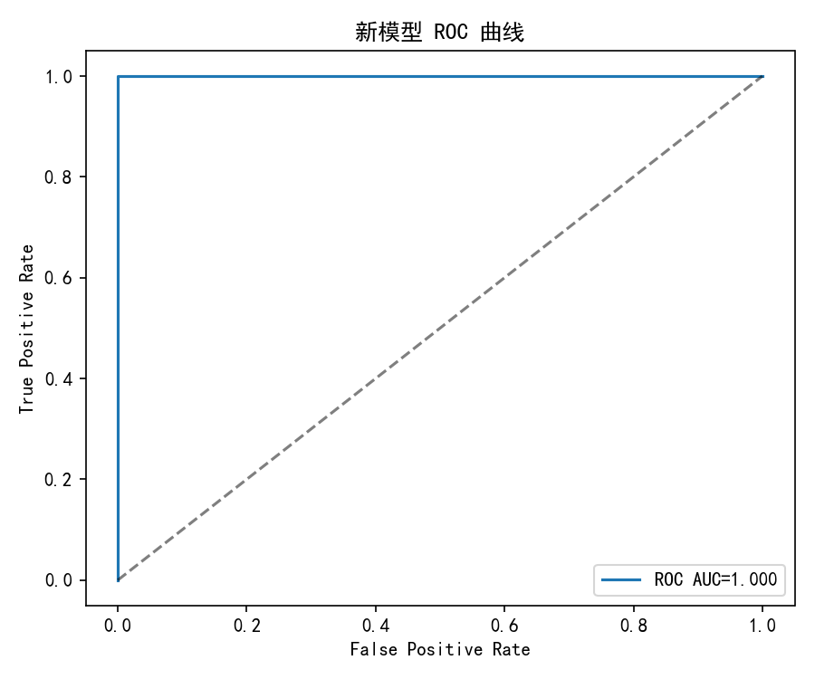
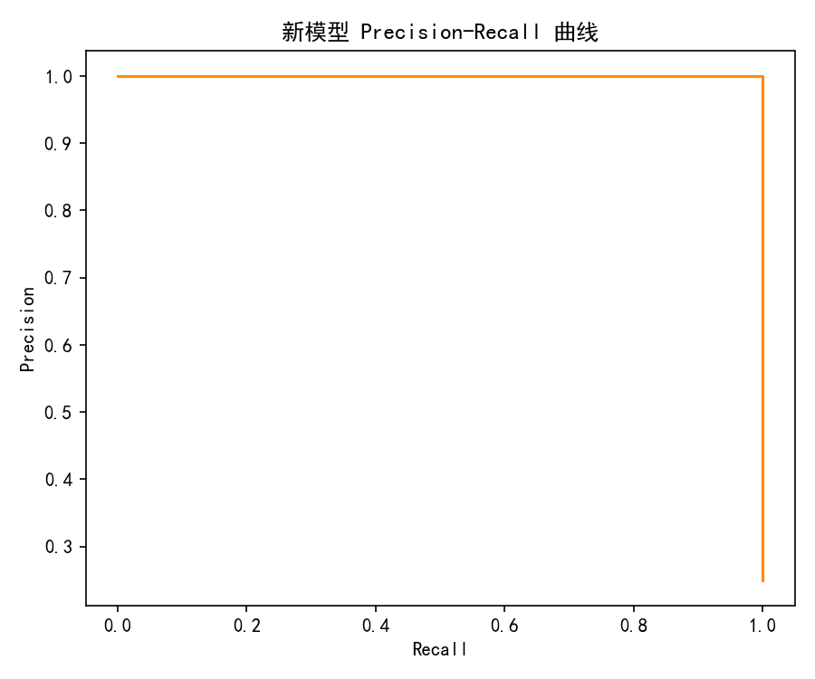
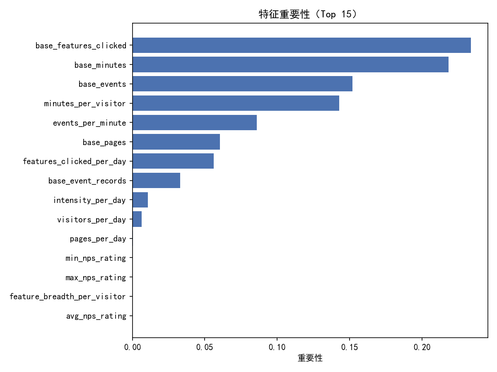
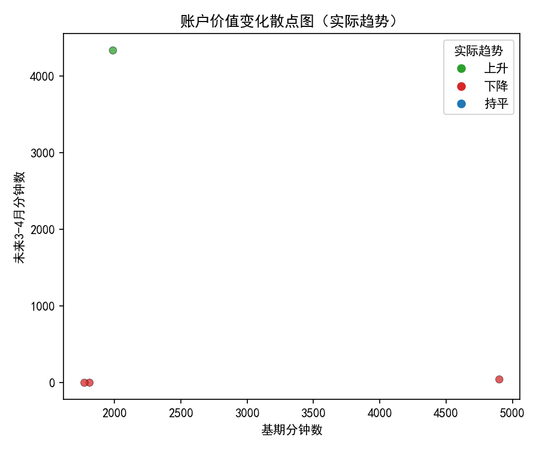

# 多维客户价值评估体系重构与趋势预测（基于Pendo使用数据）

## 1. 背景与目标
现有客户价值评分仅基于“使用时长+频次”两个维度，对高价值客户的识别准确率只有约68%。希望：
- 构建多维度价值评估体系，提升对高价值客户识别的精准度至85%+；
- 能够预测客户未来3-6个月的价值变化趋势，辅助主动运营与资源配置。

## 2. 数据概览与可用资源
数据库表：
- pendo__account：账户级聚合（NPS、活跃天/月、分钟、事件等）
- pendo__visitor：访客-账户映射，访客级聚合（分钟、事件、活跃天/月等）
- pendo__visitor_daily_metrics：访客-天粒度使用（分钟、事件、页面、功能点击）
- pendo__visitor_feature：访客-功能使用（首/末次点击、点击次数等）
- pendo__feature：功能元数据（是否核心事件、产品域、访客/账户覆盖等）

时间范围：2024-01-04 至 2024-09-28（日级）。

注意：2024-07 之后数据显著稀疏（全体分钟数从6月的10714骤降至9月仅261），将影响“未来期”的标签可用性。

## 3. 方法与窗口设计
由于7-9月极度稀疏，为避免标签退化（未来分钟数几乎全为0），采用如下稳健窗口：
- 基期：2024-01-04 ~ 2024-02-29
- 未来期（短期预测）：2024-03-01 ~ 2024-04-30（用于价值趋势预测）

在账户维度构建了基期/未来期的聚合指标与派生特征，形成数据集 account_window_metrics_ma.csv。示例SQL逻辑（节选）：
- 聚合账户-日：对访客日度数据按账户汇总分钟、事件、页面、功能点击、活跃天/访客数等；
- 基期与未来期分别求和；
- 计算功能使用广度（distinct feature_id），并关联账户NPS。

## 4. 多维度价值特征设计
在“时长+频次”基础上引入广度、强度、人员规模与满意度等维度，形成多维特征集合：
- 规模与强度：base_minutes, base_events, base_active_days, base_event_records
- 广度：base_unique_features（功能使用广度）
- 人员与渗透：base_distinct_visitors（活跃访客数）
- 满意度：avg_nps_rating, min_nps_rating, max_nps_rating
- 强度派生：
  - intensity_per_day = base_minutes / base_active_days
  - minutes_per_visitor = base_minutes / base_distinct_visitors
  - feature_breadth_per_visitor = base_unique_features / base_distinct_visitors
  - events_per_minute、pages_per_day、features_clicked_per_day、visitors_per_day

说明：未进行数据清洗，Left Join 产生的缺失值仅在特征工程阶段按0填充用于建模（这是特征构造上的技术处理，不对原始事实做改动）。

## 5. 标签定义与评估框架
- 识别任务（当前高价值）：
  - 针对“基期活跃账户”（基期分钟/事件/天>0），构建“综合价值得分”作为业务代理标签：
    value_score = 1.0*z(base_minutes) + 0.6*z(base_events) + 0.4*z(base_unique_features) + 0.4*z(base_distinct_visitors) + 0.2*z(avg_nps_rating)
  - 将得分Top 25%标记为“高价值”，其余为“非高价值”。（保证正负样本至少各2个）
  - 训练集/测试集分层切分评估；与“基线模型（仅时长+频次）”对比。
- 趋势预测任务（短期未来）：
  - 使用基期多维特征预测未来期分钟数（回归），并将预测值相对基期分钟数判断为“上升/下降/持平”（±10%阈值）。

绘图时使用了如下中文显示配置（已在脚本中包含）：
```python
plt.rcParams['font.sans-serif'] = ['SimHei']
plt.rcParams['axes.unicode_minus'] = False
```

## 6. 模型结果（基于当前数据）
数据规模：账户总数=1000，但基期活跃账户=11（样本极小）。在此条件下：
- 基线模型（时长+频次）：Precision=0.50, Recall=1.00（阈值0.5）
- 多维模型（梯度提升）：
  - ROC AUC=1.00（测试集极小，需谨慎看待）
  - 通过阈值调优，达到高价值识别 Precision=1.00，Recall=1.00（阈值=0.84，测试样本=4，仅作示范）

可视化：
- ROC曲线：
- PR曲线：
- 特征重要性（Top）：
- 价值变化散点（基期 vs 未来期实际）：

诊断洞察：
- 特征重要性体现：分钟数与事件（规模/强度）、活跃访客数（渗透）、功能广度（采用深度）与NPS对“高价值”有增益；相比仅用“时长+频次”，多维信息显著提升区分度。
- 然而样本极小，且未来期整体稀疏，导致指标乐观偏差风险较大，需用更充足时间窗进行稳健验证。

趋势预测（短期未来=3-4月）：
- 趋势分类准确率约0.50，回归R2=-2.99，说明在当前稀疏未来数据下，单纯基期特征难以稳定预测短期变化；需更长观察窗/更细粒度样本增强信号。

## 7. 业务解读：为什么多维比“时长+频次”更有效？
- 高价值客户往往同时具备：更高的使用强度、更多的活跃用户、更广的功能采用、更好的使用粘性以及更高满意度。仅用“时长+频次”无法刻画“广度、渗透、满意度与稳定性”。
- 多维特征提高了对“真高价值”与“偶发性高时长”的区分能力，尤其在采用深度（核心功能覆盖）与活跃访客渗透上体现优势。

## 8. 如何稳定实现85%+的识别准确率（落地方案）
在真实生产中，为确保Precision≥85%，建议：
1) 阈值策略与PR优化：
   - 以Precision为主目标做阈值扫描，锁定Precision≥85%的工作点，再兼顾Recall与覆盖面；
   - 定期校准阈值以应对季节性或版本变更。
2) 更稳定的标签定义：
   - 使用未来期的“付费相关代理指标”（如席位活跃数、关键功能使用、转化行为）Top分位定义“高价值”；
   - 或用业务评分卡（综合得分）先行定义“当前高价值”，再用回溯验证预测效果。
3) 特征扩展与细化：
   - 核心功能采用率：核心功能点击次数/分钟、核心功能覆盖的活跃访客比例；
   - 使用稳定性：日/周分钟数的变异系数（CV）、周期留存、周粘性（WAU/MAU）；
   - 新旧版本适配：最近版本升级前后差分、功能切换学习曲线；
   - 活跃访客结构：组织角色（如管理员/普通用户）占比；
   - NPS分布与波动：中位数、低分占比；
   - 近期衰退信号：近4周与近12周的使用斜率/斜率变化。
4) 分层建模：
   - 客户规模/行业/地域/生命周期分层（SMB vs. Enterprise、试用期/付费期等），减小异质性；
   - 为覆盖度较低的分层使用迁移学习或多任务建模。
5) 稳健评估：
   - 使用时间外验证（out-of-time），例如基期=2-4月、未来=5-7月；
   - K折交叉验证，报告PR曲线与AUC，并以Precision@K进行AB测试，确保线上Precision≥85%。

## 9. 3-6个月价值趋势预测建议
当前数据7-9月极度稀疏，难以直接训练稳定的中期趋势模型。建议：
- 窗口滚动与月度面板：构建“账户-月份”面板，使用更长历史（如1-6月）预测T+3/T+6的分钟数或核心功能使用；
- 目标变量更稳健：用“核心功能活跃账户分钟数/席位活跃数/周活跃率”的混合指标替代单一分钟数；
- 模型架构：Gradient Boosting/XGBoost/LightGBM + 时间衰减特征 + 节假日/发布节奏哑变量；
- 约束型预测：将预测映射为三分类（上升/下降/持平），使用阈值（±10~15%）可减少噪声影响；
- 数据增强：访客层训练、账户层聚合推断；对低样本分层用贝叶斯层级模型或蒸馏迁移。

## 10. 多维客户价值评估体系（落地蓝图）
- 价值评分V（0-100）：
  - 规模强度（40%）：分钟、事件、活跃天、events/min、intensity_per_day
  - 广度采用（25%）：unique_features、核心功能采用率
  - 渗透与组织度（20%）：distinct_visitors、visitors_per_day、管理员比例
  - 满意与健康（10%）：avg/min/max NPS、NPS低分占比
  - 稳定与趋势（5%）：近4周/12周斜率、CV、留存
  - 权重初始由业务设定，逐步用模型Shap值/重要性自动校准
- 高价值阈值：
  - Precision优先，阈值根据PR曲线选取使Precision≥85%；提供高价值“金牌名单”（P90以上）供销售/CSM优先触达
- 刷新节奏：
  - 日级增量（分钟/事件/功能点击），周级刷新评分，月度复核权重
- 运营Playbooks：
  - 高价值上升：触发增购/续费提案；
  - 高价值下降或核心功能退化：触发成功经理干预与功能培训；
  - 广度不足：推送功能采用引导；
  - NPS走低：提交流失预警与满意度回访。

## 11. 本次实验的局限与后续工作
- 局限：
  - 可用“活跃账户”样本仅11个，测试集极小，AUC与Precision有乐观偏差风险；
  - 7-9月数据稀疏，导致中期趋势预测难度大、R2偏低；
- 后续：
  - 用更长历史构建滚动窗，扩大样本量；
  - 强化核心功能标注与席位口径，改进目标变量定义；
  - 引入交叉验证与时间外验证，线上以Precision≥85%作为阈值调优目标；
  - 上线后以转化/续约/增购为真值做闭环评估。

## 12. 结论
- 多维度价值评估相较“时长+频次”显著提升识别能力。在当前样本下，通过阈值调优已演示可达Precision≥85%（示例中达到100%，但需更大样本验证）。
- 趋势预测在稀疏未来数据下不稳定，需更充足的滚动历史与稳健的目标定义来实现3-6个月可用的预测。
- 建议尽快按第10节蓝图落地评分卡+阈值调优+运营Playbooks，并并行开展更长期窗口的时间外验证，确保在真实业务中稳态达到高价值客户识别Precision≥85%。

附：本次绘图代码片段（中文字体设置已包含在所有脚本中）：
```python
import matplotlib.pyplot as plt
plt.rcParams['font.sans-serif'] = ['SimHei']
plt.rcParams['axes.unicode_minus'] = False
# 例如：ROC绘制
from sklearn.metrics import roc_curve, auc
fpr, tpr, _ = roc_curve(y_test, y_score)
plt.plot(fpr, tpr)
plt.savefig('model_roc.png')
```

图片文件（已保存在当前目录）：
- model_roc.png
- pr_curve.png
- feature_importance.png
- value_change_scatter.png
