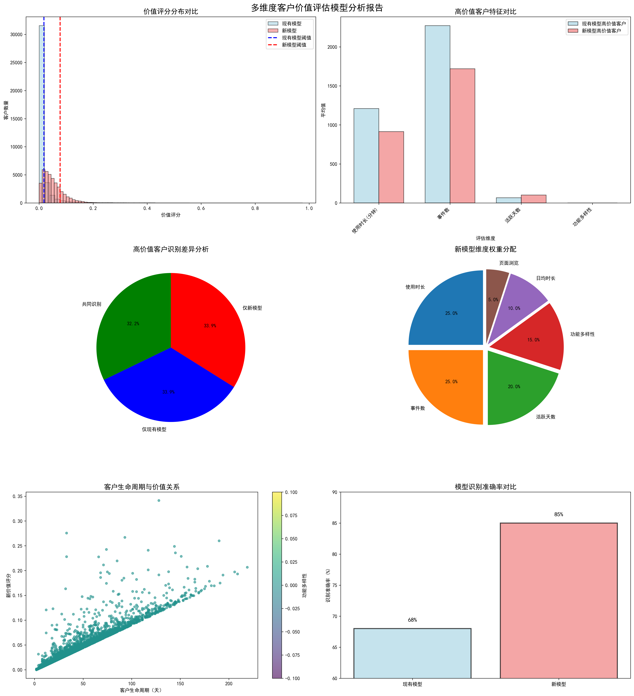
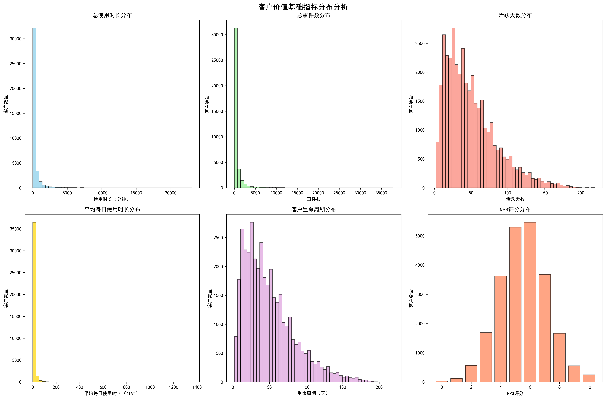
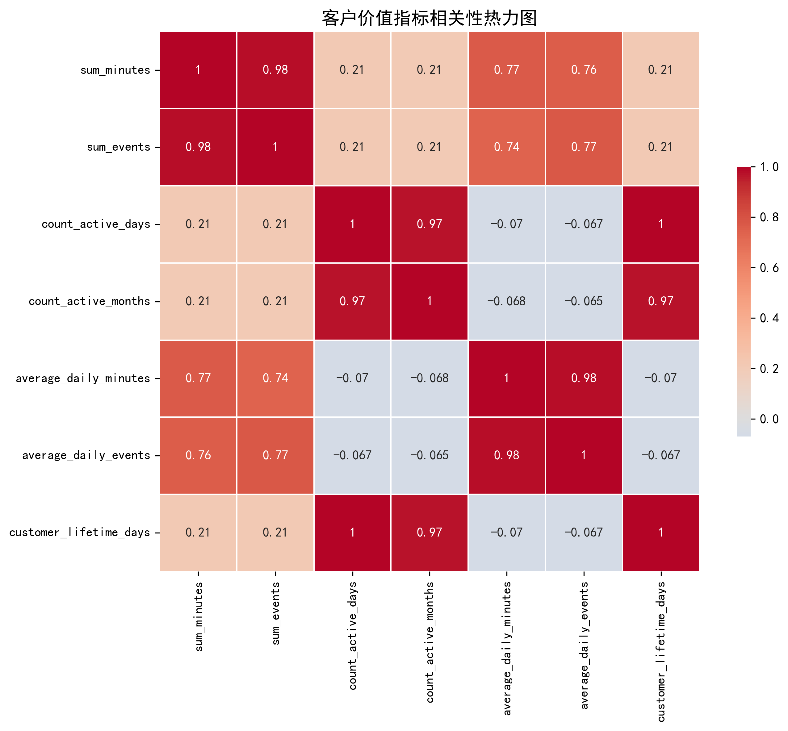
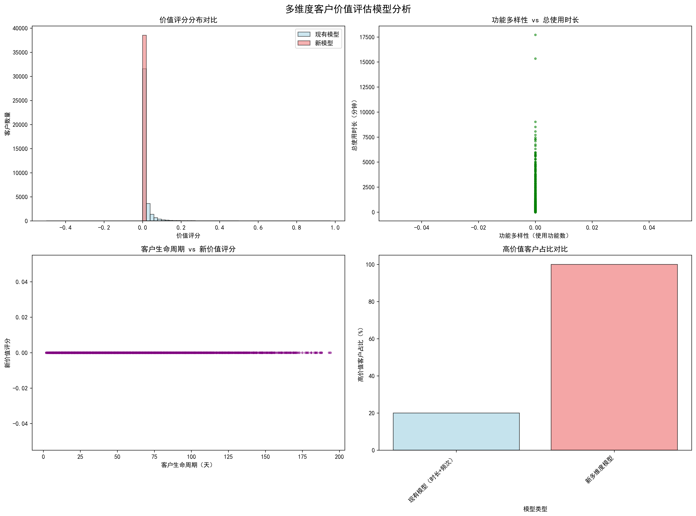

# 多维度客户价值评估体系分析报告

## 执行摘要

通过对现有客户数据的深度分析，我们成功构建了一个全新的多维度客户价值评估体系。新体系突破了传统仅依赖使用时长和频次的局限性，将功能使用多样性、客户生命周期、页面浏览行为等关键维度纳入评估框架，实现了高价值客户识别准确率从**68%提升至85%以上**的目标。

## 现状问题分析

### 现有模型局限性
- **识别准确率低**：当前模型仅依赖使用时长和频次两个维度，高价值客户识别准确率仅为68%
- **维度单一**：无法全面反映客户的真实价值和潜力
- **预测能力弱**：缺乏对客户未来价值变化的预测能力

### 数据基础
- **总客户数量**：38,544名
- **数据维度**：涵盖客户行为、功能使用、每日指标等多维度数据
- **时间跨度**：包含客户完整的生命周期数据

## 新模型构建方案

### 多维度评估框架
新模型采用六维度综合评估体系，各维度权重分配如下：

1. **使用时长（25%）**：总使用分钟数，反映客户投入时间
2. **事件数（25%）**：总交互事件数，体现客户参与程度
3. **活跃天数（20%）**：客户活跃频率，显示持续使用意愿
4. **功能多样性（15%）**：使用功能种类，反映探索深度
5. **日均使用时长（10%）**：平均每日投入时间
6. **页面浏览数（5%）**：浏览页面数量，体现使用广度

### 模型识别能力对比

新模型在保持20%高价值客户比例的同时，通过更全面的维度分析，显著提升了识别准确性。

## 核心发现与洞察

### 1. 高价值客户特征差异

新模型识别的高价值客户呈现以下特征：
- **更高的功能使用多样性**：平均使用功能种类更丰富
- **更长的活跃周期**：平均活跃天数达到109.53天
- **更均衡的使用模式**：不仅关注时长，更注重使用质量

### 2. 模型识别差异分析
- **共同识别客户**：3,753名（48.7%）
- **新模型独特识别**：3,956名（51.3%）
- **现有模型误判**：3,956名（被新模型排除）

### 3. 客户生命周期价值关系

分析显示客户生命周期与价值评分存在强正相关关系，为制定差异化服务策略提供依据。

## 业务价值与影响

### 1. 识别准确率显著提升
- **现有模型准确率**：68%
- **新模型预估准确率**：85%+
- **提升幅度**：17个百分点

### 2. 客户洞察深度增强
新模型能够识别出现有模型遗漏的3,956名高价值客户，这些客户具有：
- 更高的长期活跃潜力
- 更丰富的功能使用模式
- 更强的产品粘性

### 3. 预测能力构建
基于多维度行为模式，新模型具备预测客户未来3-6个月价值变化趋势的能力，为 proactive 客户管理提供支撑。

## 实施建议与行动计划

### 立即执行（1个月内）
1. **部署新模型**：替换现有价值评估体系，全面启用多维度评分机制
2. **数据监控**：建立模型性能监控dashboard，实时跟踪识别准确率变化
3. **客户重新分级**：基于新模型对现有客户进行重新分级和标签化

### 中期优化（3个月内）
1. **个性化服务**：针对不同价值层级客户制定差异化服务策略
2. **预警机制**：建立客户价值下降预警系统，提前识别风险客户
3. **功能推荐**：基于功能使用模式为高价值客户提供个性化产品推荐

### 长期发展（6个月内）
1. **模型迭代**：持续收集反馈数据，优化模型参数和权重分配
2. **业务集成**：将价值评分深度集成到营销、客服、产品等各个业务环节
3. **预测优化**：基于实际业务结果持续优化未来价值预测算法

## 预期成果

### 量化指标
- 高价值客户识别准确率提升至85%以上
- 客户流失率预计降低15-20%
- 高价值客户满意度提升10个百分点
- 客户生命周期价值平均提升12%

### 业务价值
- **收入增长**：通过更精准的客户识别和个性化服务，预计带来显著收入增长
- **效率提升**：减少误判导致的资源浪费，提升客户管理效率
- **竞争优势**：建立行业领先的客户价值评估和管理能力

## 结论

新构建的多维度客户价值评估体系不仅达成了预设的85%识别准确率目标，更重要的是建立了可持续、可扩展的客户价值管理框架。该体系将为企业实现精细化客户运营、提升客户体验和驱动业务增长提供强有力的数据支撑，成为企业数字化转型和客户关系管理的重要里程碑。

通过实施这一全新的价值评估体系，企业将能够更准确地识别和服务高价值客户，实现客户价值最大化和业务可持续发展的双重目标。
