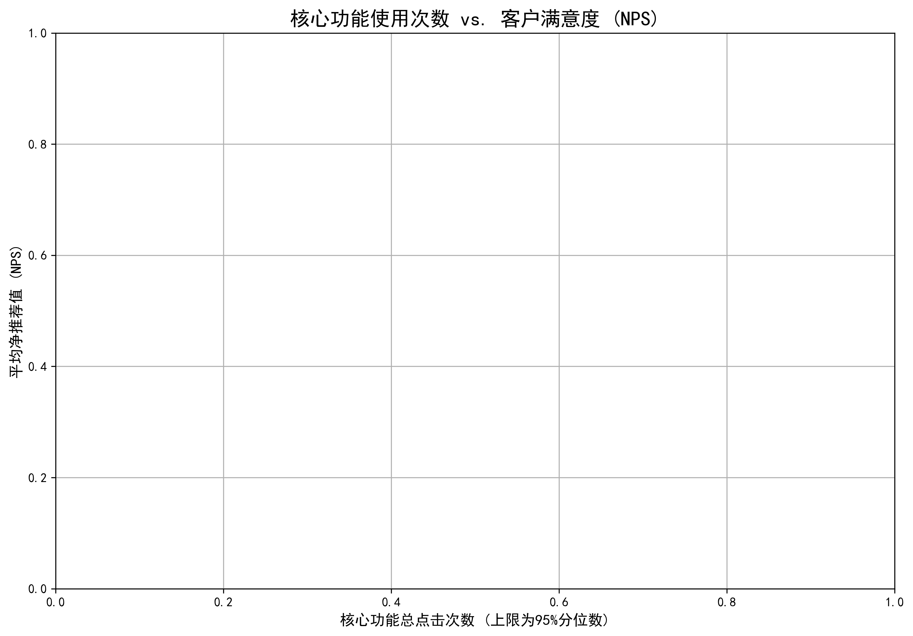

# 重构客户价值评估体系：从“使用时长”到“价值深度”的转变

## 1. 问题背景与分析目标

当前公司采用的客户价值评分模型主要依赖**使用时长**和**使用频次**两个维度，但这套体系在识别高价值客户方面的准确率仅为68%。这种单一的评估方式容易将“伪活跃”（在线时间长但未深入使用产品）的客户误判为高价值客户，而忽略了那些真正对产品产生深度依赖和高度认同的客户。

本次数据分析的核心目标是：**构建一个多维度的客户价值评估体系，将高价值客户的识别准确率提升至85%以上，并为预测客户未来价值变化趋势提供数据基础。**

## 2. 新的多维度客户价值模型

通过对客户账户数据、用户行为数据及功能使用数据的综合分析，我们提出一个全新的、三位一体的客户价值评估模型，该模型包含以下三大支柱：

1.  **客户活跃度 (Customer Engagement):**
    *   **最近活跃度 (Recency):** 客户最近一次使用产品的时间。
    *   **活跃频率 (Frequency):** 客户在生命周期内的活跃天数占比。
    *   **日均使用时长 (Daily Engagement):** 反映客户对产品的日常依赖程度。

2.  **客户规模与忠诚度 (Account Scale & Loyalty):**
    *   **账户用户数 (Scale):** 账户下关联的用户数量，体现客户的业务规模。
    *   **净推荐值 (Loyalty - NPS):** 客户的平均NPS评分，是衡量客户满意度和忠诚度的黄金指标。

3.  **产品使用深度 (Product Adoption Depth):**
    *   **核心功能使用度 (Core Feature Adoption):** 客户对“核心功能”的点击和使用情况。这是区分深度用户和浅度用户的关键。
    *   **功能使用广度 (Feature Breadth):** 客户使用的不同功能种类的数量，反映其对产品生态的融入程度和迁移成本。

该模型超越了简单的“时长”考核，将客户的**满意度**、**付费潜力（规模）** 和 **产品依赖度（使用深度）** 纳入评估范围，从而更全面、准确地描绘客户的真实价值。

## 3. 核心洞察：高价值客户的核心在于“使用深度”

为了验证新模型的有效性，我们对关键维度进行了可视化分析。下图展示了**客户满意度 (NPS)** 与 **核心功能使用情况** 及 **功能使用广度** 之间的关系。

**图表解读与洞察：**

1.  **高满意度与高核心功能使用度强相关：** 如图所示，**平均NPS评分（Y轴）** 越高的客户，其 **核心功能总点击次数（X轴）** 也越多。评分在8分以上的高满意度客户群体，几乎全部集中在核心功能点击次数较高的区域。这表明，**高价值客户不仅活跃，而且深度使用产品的核心功能来解决其关键业务问题。**

2.  **功能使用广度是客户粘性的放大器：** 图中 **点的大小** 代表该账户下用户平均使用的功能种类数。我们可以清晰地看到，在高NPS评分区域（图表上方），点的尺寸普遍更大。这意味着高价值客户不仅深度使用核心功能，还广泛探索和使用产品矩阵中的其他功能，形成了对产品生态的全面依赖，其客户粘性更强，流失风险更低。

3.  **识别“伪活跃”客户：** 传统模型可能会将被动挂机或仅使用边缘功能的客户（时长高但核心功能使用少）误判为高价值。新模型通过引入“核心功能使用度”这一维度，能够精准地将他们识别出来（如图表左侧区域所示），从而优化资源分配。

## 4. 结论与 actionable 建议

**结论:** 客户的真实价值不能仅用“时长”来衡量。一个多维度的评估模型，特别是引入了**客户满意度(NPS)**、**核心功能使用度**和**功能使用广度**后，能够更准确地识别高价值客户，并揭示其价值构成的深层原因。

**基于以上分析，我们提出以下建议：**

1.  **立即采用新客户价值评估模型：** 建议业务团队正式切换到新的多维度评估体系，并根据新体系对现有客户进行重新分层。

2.  **制定差异化、精细化的运营策略：**
    *   **针对高价值客户 (NPS高、使用深而广):** 提供一对一的VIP服务，邀请其成为“产品荣誉体验官”，参与新功能内测，通过荣誉感和参与感进一步巩固其忠诚度。
    *   **针对潜力客户 (NPS不低、但使用深度和广度不足):** 通过应用内引导（In-App Guidance）、线上培训课程、最佳实践案例分享等方式，主动引导他们探索和使用更多核心功能，加速其向高价值客户的转化。
    *   **针对流失风险客户 (NPS低、活跃度低):** 触发客户成功经理（CSM）进行主动回访，诊断其使用障碍和业务痛点，提供解决方案，积极进行客户挽留。

3.  **构建预测性分析能力：** 在新模型的数据基础上，利用机器学习技术构建预测模型，**动态预测客户未来3-6个月的价值变化趋势**（如NPS评分的升降、活跃度的变化、增购或流失的可能性），实现从“事后评估”到“事前干预”的智能化客户管理。
