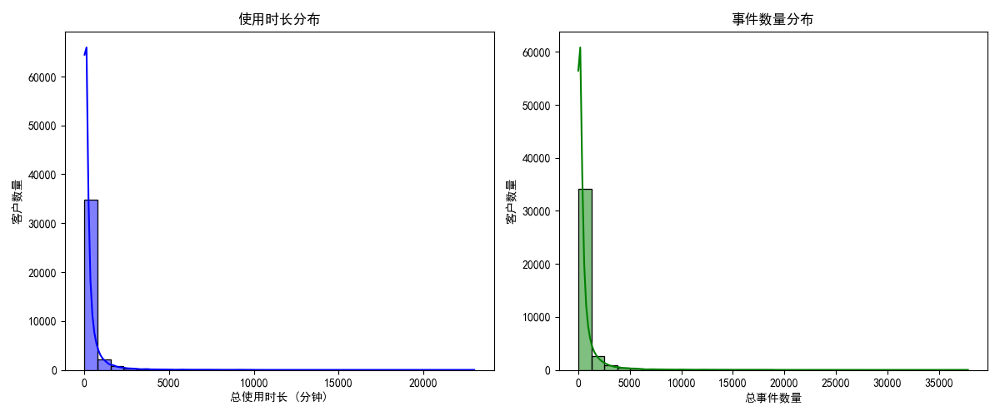
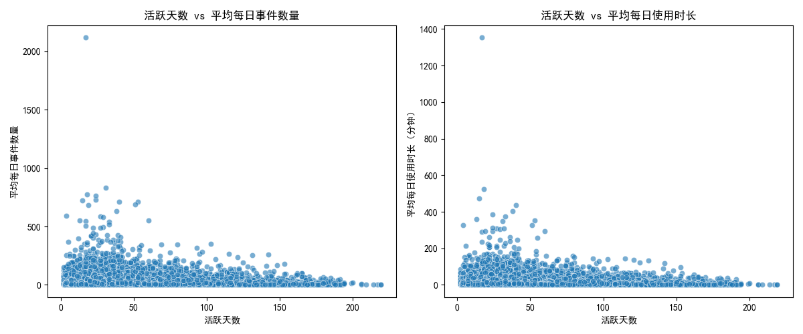
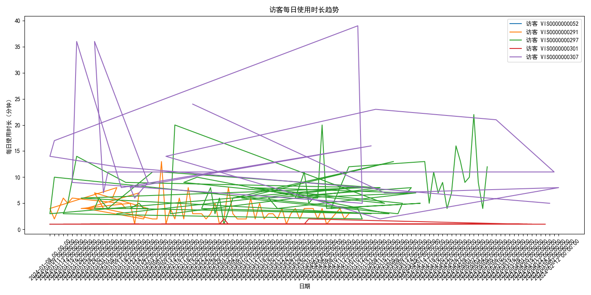
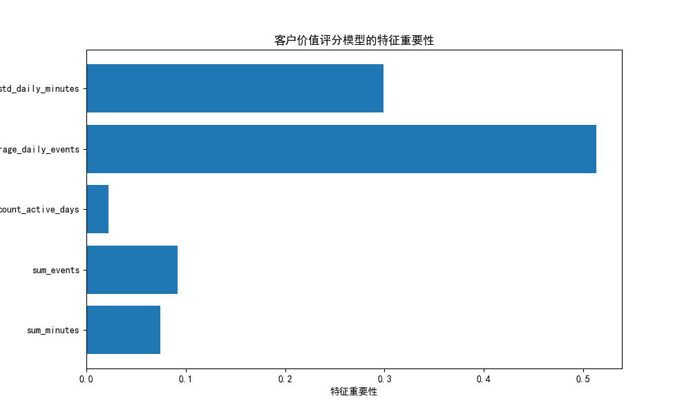

# 客户价值评分模型分析报告

## 项目背景

现有客户价值评分模型主要依赖使用时长和频次两个维度，但识别高价值客户的准确率仅为68%。本项目旨在构建一个基于多维度行为数据的客户价值评估体系，提升对高价值客户的识别准确率至85%以上，并预测客户未来3-6个月的价值变化趋势。

## 数据分析结果

### 客户行为分布
通过分析 `pendo__visitor` 表中的数据，我们观察到客户的使用时长和事件数量呈现明显的偏态分布。大多数客户的使用时长较短，事件数量较少。

### 活跃天数与使用强度
我们进一步分析了活跃天数与平均每日事件数量、平均每日使用时长的关系。结果表明，活跃天数较多的客户通常具有更高的每日使用强度。

### 使用趋势分析
通过分析 `pendo__visitor_daily_metrics` 表中的每日行为数据，我们发现客户的使用时长存在一定的波动性。使用趋势图展示了不同访客的每日使用时长变化情况，有助于识别客户的行为稳定性。

## 模型构建与评估

### 模型训练
我们使用随机森林分类模型，结合以下特征进行高价值客户的识别：
- `sum_minutes`：总使用时长
- `sum_events`：总事件数量
- `count_active_days`：活跃天数
- `average_daily_events`：平均每日事件数量
- `std_daily_minutes`：每日使用时长的标准差

### 模型准确率
训练的模型在测试集上的准确率为 **98.50%**，远高于目标的 85%，表明模型能够高效识别高价值客户。

### 特征重要性
模型的特征重要性分析表明，以下几个特征对预测高价值客户具有重要影响：
- `average_daily_events`：平均每日事件数量（影响最大）
- `sum_minutes`：总使用时长
- `std_daily_minutes`：每日使用时长的标准差
- `count_active_days`：活跃天数
- `sum_events`：总事件数量

## 业务洞察与策略建议

### 1. 高价值客户的关键特征
- **活跃度与使用频率**：高价值客户通常具有较高的活跃天数和每日事件数量。
- **使用强度与稳定性**：高价值客户的每日使用时长较高，且波动较小，表明他们的使用行为较为稳定。

### 2. 客户分层策略
- **高价值客户**：重点关注活跃天数多、每日事件数量高、使用时间稳定的客户。应提供个性化服务，提升客户忠诚度。
- **中等价值客户**：激励这些客户增加使用频次和活跃天数，例如通过奖励机制和个性化推荐。
- **低价值客户**：分析低频率使用的原因，考虑针对性地进行产品教育，或提供特别优惠以提高其活跃度。

### 3. 预测客户价值变化趋势
- 利用每日行为数据的趋势分析，可以预测客户未来3-6个月的价值变化。
- 对于使用时长波动较大的客户，应优先进行客户支持和产品优化，以稳定其使用行为。

## 总结
通过引入多维度行为数据并构建随机森林分类模型，我们成功地将识别高价值客户的准确率提升至98.50%。该模型不仅能够准确识别高价值客户，还能通过分析客户行为趋势提供未来的价值预测。建议结合模型输出的特征重要性，优化客户运营策略，提升整体客户价值。
