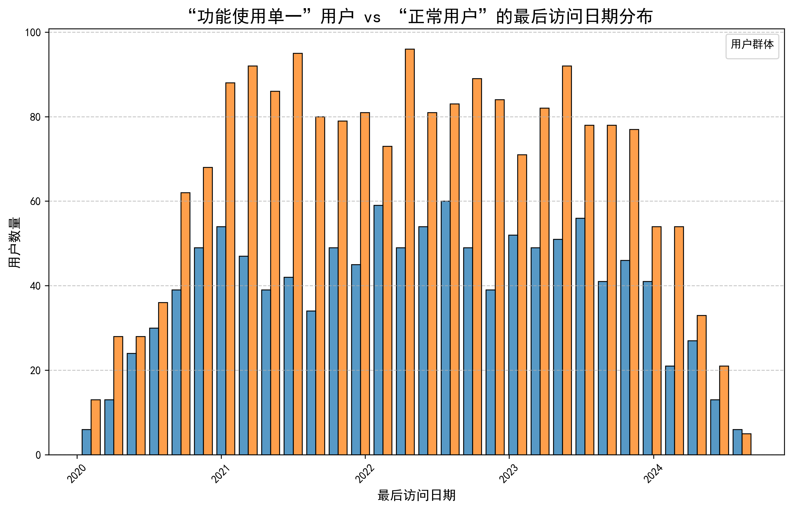

# “功能使用单一”高活跃用户行为深度分析及策略建议

## 1. 背景与问题
我们识别出一个特殊的用户群体：他们产品的活跃天数超过60天，但使用的功能种类却少于5种。这部分“功能使用单一”的用户占比达到了15%，并且其NPS（净推荐值）评分显著低于正常用户。本次分析旨在深入探究该用户群体的行为特征，剖析其使用模式对用户参与度和长期留存的影响，并提出可行的优化策略。

## 2. 核心发现

### 发现一：功能使用高度集中，核心价值未被充分发掘
通过对“功能使用单一”用户的行为数据进行分析，我们发现他们使用的功能高度集中。排名前五的功能如下：
- `logout` (退出登录)
- `contact_support` (联系技术支持)
- `view_analytics` (查看分析)
- `user_profile` (用户资料)
- `trend_analysis` (趋势分析)

这表明，该群体除了进行“登录/退出”、“查看个人信息”等基础操作外，其核心应用场景主要局限于`view_analytics`和`trend_analysis`这两个功能。大量其他有价值的功能模块未被他们有效利用，这限制了他们从产品中获取更全面的价值。

### 发现二：用户参与度显著偏低
我们将“功能使用单一”用户与同样活跃超过60天但使用功能种类更多的“正常用户”进行对比，发现其在每日使用时长上存在巨大差距：
- **“功能使用单一”用户**：平均每日使用时长为 **32.47 分钟**。
- **“正常用户”**：平均每日使用时长为 **82.27 分钟**。

“正常用户”的日均使用时长是“功能使用单一”用户的**2.5倍**。这清晰地表明，功能使用的广度与用户的使用深度和参与度密切相关。功能使用单一的用户虽然保持了长期的活跃记录，但他们对产品的投入和依赖程度要低得多。

### 发现三：长期留存不容乐观，流失风险更高
为了评估这种单一使用模式对长期留存的影响，我们对比了两个用户群体的最后访问日期分布。

从上图 **《“功能使用单一”用户 vs “正常用户”的最后访问日期分布》** 可以看出：
- **蓝色（正常用户）** 的分布更偏向图表右侧（较近的日期），显示出更健康的持续活跃状态。
- **橙色（功能使用单一用户）** 的分布则更平均，有相当一部分用户的最后活跃日期停留在较早的时间段，这表明他们随着时间的推移流失的比例更高。

尽管他们满足“长期活跃”（累计天数>60）的定义，但其“持续活跃”的能力更弱，更容易在某个时间点后便不再回归。这种模式构成了潜在的流失风险。

## 3. 原因剖析
为什么这批高活跃用户会陷入“功能使用单一”的困境？可能的原因包括：
1.  **价值认知不足**：用户可能没有充分认识到其他未被使用功能的价值，产品未能有效引导他们探索更多可能性。
2.  **使用路径固化**：用户可能已经形成了固定的、仅针对特定任务的使用习惯（例如，每天上班只看某个报表），完成后即离开，缺乏探索新功能的动机。
3.  **功能发现障碍**：新功能或高级功能的入口可能不够明显，或者对于这部分用户来说，学习成本较高。

## 4. 业务建议
针对以上发现，我们提出以下策略，旨在提升该用户群体的功能使用广度，进而增强其参与度和长期留存：

1.  **实施精准的用户引导 (Onboarding & Nudging)**
    - **目标**: 唤醒用户的探索欲。
    - **措施**: 针对这批用户标识，通过应用内弹窗、个性化邮件或短信，精准推送他们未使用过但与其当前使用功能（如`view_analytics`）高度相关的功能介绍，例如“想在趋势分析之外，看看用户分群的表现吗？试试同期群分析吧！”。

2.  **优化产品功能关联性 (Feature Cross-sell)**
    - **目标**: 降低新功能的发现和使用门槛。
    - **措施**: 在`view_analytics`和`trend_analysis`等他们高频使用的功能界面内， strategically 增加指向其他相关分析功能（如“用户画像”、“漏斗分析”等）的快捷入口或推荐链接，并在旁边附上简短的价值说明。

3.  **提供场景化的解决方案**
    - **目标**: 从“功能”引导转向“价值”引导。
    - **措施**: 创建基于业务场景的“分析模板”或“最佳实践”案例，打包推荐给用户。例如，创建一个“提升用户转化率”的分析模板，该模板会指导用户组合使用`trend_analysis`, `funnel_analysis`, 和 `user_profile` 等多个功能来解决一个具体问题。
