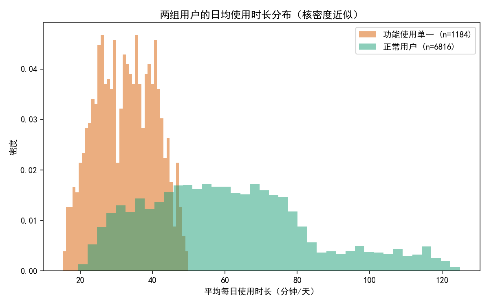
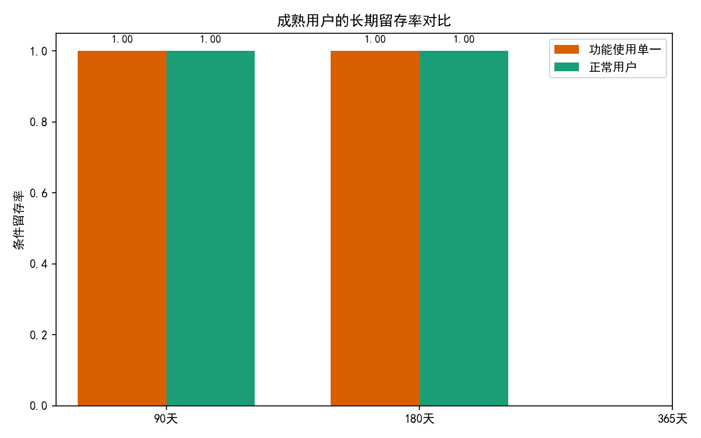
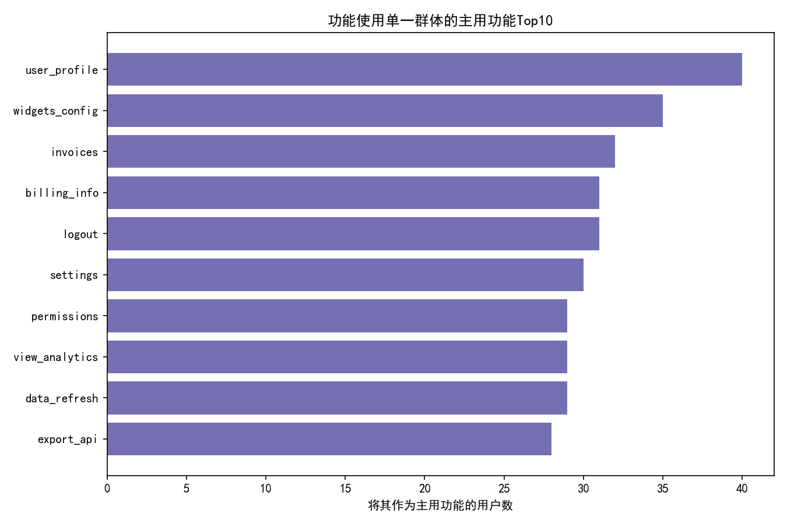
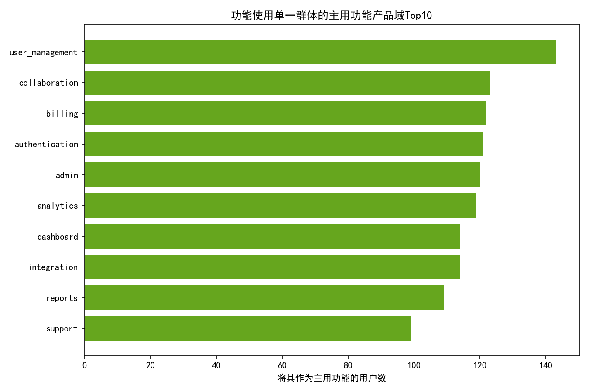

# 活跃60天以上但功能点击种类少于5的“功能使用单一”用户深度分析

作者：数据分析

概述
- 研究对象：活跃天数 > 60 且功能点击种类 < 5 的用户（简称“功能使用单一”群体）。
- 数据来源：SQLite 数据库 dacomp-079.sqlite（pendo__visitor / pendo__visitor_feature / pendo__feature）。
- 研究目标：
  1) 他们主要集中使用哪些功能/产品域；
  2) 平均每日使用时长是否异常；
  3) 这种使用模式对长期留存的影响。

核心发现
- 规模与满意度
  - 占比：功能使用单一用户 1184/8000，占 14.8%（与“约15%”一致）。
  - NPS：功能使用单一用户平均 NPS = 5.583，对照组（非单一）= 7.279，低 1.696 分，显著偏低，说明“功能使用单一”用户的满意度明显受限。
- 使用时长（强烈异常，显著偏低）
  - 日均时长（均值/中位数）：单一组 32.468/32.596 分钟，对照组 60.904/58.631 分钟，约低 45%～47%。
  - 分位数：单一组 P25=25.836、P75=39.087；对照组 P25=43.628、P75=74.253。分布整体左移，见图“两组用户的日均使用时长分布”。
- 主要使用的功能与产品域（“行政/配置/计费/鉴权/分析浏览”类特征突出）
  - 单一组主用功能Top10（合计覆盖该群体约26.5%）：user_profile、widgets_config、invoices、billing_info、logout、settings、permissions、view_analytics、data_refresh、export_api（详见图“主用功能Top10”）。
  - 主用产品域Top10（覆盖全部单一用户主用功能）：user_management、collaboration、billing、authentication、admin、analytics、dashboard、integration、reports、support（见图“主用功能产品域Top10”）。
  - 解释：该群体多集中在“账号/权限/计费/配置/查看类分析”的行政或支撑性操作，较少涉及更广泛/更深层的业务功能探索。
- 留存影响（当前样本期内未观察到差异，但受限于数据边界）
  - 本次使用“条件留存率”（仅在“tenure≥90/180天”的成熟用户中评估近90/180天是否仍活跃）作为近似指标。
  - 结果：单一组与对照组在90/180天条件留存均为 1.00；365天因样本不足（成熟度限制）未出结果。
  - 解读：本数据期极可能临近观测窗口末端（days_since_last 的平均/中位均为0），导致成熟用户都仍在观测期内活跃，因而无法区分两组的长期留存差异。
  - 建议：需要更长时间窗（拉长右侧观察窗）或按“注册月/首活跃月”的标准留存分群进行复核。

可视化
1) 两组用户的日均使用时长分布对比（单一组整体显著偏低）
- 图片：usage_dist.png
- 说明：单一组分布整体左移，峰值集中在 25–40 分钟/天区间；对照组分布更为右偏，长尾更长。



2) 成熟用户的长期留存率对比（90/180/365天）
- 图片：retention_comparison.png
- 说明：在当前样本期内，90/180天条件留存均为 1.0；365天缺样本。此为数据边界所致，并不代表两组无差异。



3) 功能使用单一群体的主用功能Top10
- 图片：top_features.png
- 说明：Top10合计覆盖该群体约 26.5%（314/1184）。代表性功能多为“账号/配置/计费/权限/分析查看”等支撑性操作。



4) 功能使用单一群体的主用功能产品域Top10
- 图片：top_product_areas.png
- 说明：主用产品域集中在 user_management、collaboration、billing、authentication、admin、analytics、dashboard、integration、reports、support。



关键数据表述（摘自分析输出）
- 分组样本与均值
  - 单一组：N=1184；平均NPS=5.583；平均/中位日均时长=32.468/32.596；P25/P75=25.836/39.087
  - 对照组：N=6816；平均NPS=7.279；平均/中位日均时长=60.904/58.631；P25/P75=43.628/74.253
- 条件留存率（成熟用户中）
  - 单一组：R90=1.00，R180=1.00（R365因样本不足为NaN）
  - 对照组：R90=1.00，R180=1.00（R365因样本不足为NaN）

方法与口径
- 单一用户判定：count_active_days > 60 且 功能点击种类（distinct feature_id）< 5。
- 日均时长：pendo__visitor.average_daily_minutes。
- 主用功能判定：在 pendo__visitor_feature 中按 sum_minutes（若相同再按 sum_clicks）为该访客排序，取排名第一的 feature 作为“主用功能”。
- 留存近似：以数据期末（全体用户 last_event_on 的最大日期）为观察点，定义
  - tenure_days = 期末 − first_event_on；
  - days_since_last = 期末 − last_event_on；
  - 仅在 tenure≥90/180/365 的群体中，若 days_since_last ≤ 90/180/365 则视为保持活跃，计算条件留存率。
- 限制说明：本次数据窗口紧邻期末，成熟用户的 days_since_last 多为0，导致条件留存率难以拉开差异。需更长观察窗或按注册/首活跃 Cohort 重算。

业务解读与诊断
- 为什么这些用户NPS更低、时长更短？
  - 功能集中在“配置/管理/计费/基础浏览”，往往是职责性、任务性场景，价值点偏“必须完成”，非“深度价值创造”，因此对产品的“心智价值感知”与“沉浸时长”较低。
  - 功能单一限制了“价值发现”，用户无法接触到更具业务产出的高级能力（如更深入的分析、自动化、集成流、协作闭环等）。
  - 从Top功能看，logout/settings/permissions 等入口类操作偏多，可能还存在流程/权限/稳定性/性能的摩擦点，影响满意度。
- 留存层面
  - 在当前样本边界下看不出显著差异，不代表无差异。基于经验，功能多样性更高的用户在长期留存上通常更稳健（更多价值锚点）。建议拉长时间窗进行验证。

行动建议（可落地）
1) 在产品内引导“功能扩展”
   - 场景化引导：当用户连续两周仅在同一产品域/功能停留，触发“相邻能力”推荐（例如从 user_management/permissions 引导到 collaboration/analytics 的常见下一步）。
   - 任务链路设计：在 settings/billing_info/user_profile 等页面内嵌“下一步价值任务”，例如“完成权限配置后，创建首个团队报告/仪表板”。
   - 微学习与Checklists：提供 3–5 分钟上手清单与微任务，鼓励完成多功能路径（提升 feature_variety）。
2) 角色画像驱动个性化
   - 识别 Admin/Finance/Analyst 等角色，针对性推荐操作与模板，降低跨功能探索的认知负担。
   - 为“计费/权限”高频用户提供“实用模板”（报表模板、协作工作流、集成脚本），缩短“从配置到产出”的路径。
3) 降摩擦、提感知价值
   - 关注 Top 单一功能的可用性（如 logout、settings、permissions、billing_info）：减少跳转、优化加载、提供就地指引。
   - 在“查看类分析”页面（view_analytics/dashboard/reports）增加“行动化组件”（如一键导出、分享、订阅、自动化触发），提升互动深度与留存粘性。
4) 营销与客户成功联动
   - 针对“功能使用单一”账户推送定向教育邮件/视频；CS 定期举办角色化培训。
   - 设定成功指标：单一组在4周内 feature_variety 提升到≥5；日均时长提升≥20%；NPS 提升≥0.5；并通过A/B实验验证对长期留存的因果影响。
5) 数据与测量
   - 拉长观察窗或以“首活跃月 Cohort”重算 30/60/90/180/365 天留存与生存曲线；
   - 看穿透：对“主用产品域”各自建立漏斗，分析从“配置/登陆/计费”到“核心产出功能”的跨越率与卡点。

附：用于绘图的Python代码片段
说明：以下代码从CSV读取、计算统计并绘制4张图，图片已保存到当前目录（usage_dist.png、retention_comparison.png、top_features.png、top_product_areas.png）。注意包含中文显示设置。

```python
import pandas as pd
import numpy as np
import matplotlib.pyplot as plt

# 字体设置，保证中文显示
plt.rcParams['font.sans-serif'] = ['SimHei']
plt.rcParams['axes.unicode_minus'] = False

df = pd.read_csv('visitors_derived2.csv')

# 安全类型转换
for c in ['single_use_flag','latest_nps_rating','average_daily_minutes',
          'matured_90','matured_180','matured_365',
          'retained_90_cond','retained_180_cond','retained_365_cond',
          'tenure_days','days_since_last']:
    if c in df.columns:
        df[c] = pd.to_numeric(df[c], errors='coerce')

# 条件留存（仅在成熟用户中评估）
def cond_rate(df, mature_col, retained_col):
    mask = df[mature_col] == 1
    if mask.sum() == 0:
        return np.nan
    return df.loc[mask, retained_col].mean()

# 可视化1：两组日均使用时长分布
plt.figure(figsize=(8,5))
bins = 40
for flag, label, color in [(1, '功能使用单一', '#d95f02'), (0, '正常用户', '#1b9e77')]:
    sub = df[df['single_use_flag']==flag]['average_daily_minutes'].dropna()
    plt.hist(sub, bins=bins, alpha=0.5, density=True, label=f\"{label} (n={len(sub)})\", color=color)
plt.title('两组用户的日均使用时长分布（核密度近似）')
plt.xlabel('平均每日使用时长（分钟/天）')
plt.ylabel('密度')
plt.legend()
plt.tight_layout()
plt.savefig('usage_dist.png', dpi=150)
plt.close()

# 聚合比较成熟留存
ret_compare = []
for flag, sub in df.groupby('single_use_flag'):
    r90 = cond_rate(sub, 'matured_90', 'retained_90_cond')
    r180 = cond_rate(sub, 'matured_180', 'retained_180_cond')
    r365 = cond_rate(sub, 'matured_365', 'retained_365_cond')
    ret_compare.append({'single_use_flag': flag, 'r90': r90, 'r180': r180, 'r365': r365})
ret_compare = pd.DataFrame(ret_compare)

# 可视化2：长期留存率对比
labels = ['90天', '180天', '365天']
x = np.arange(len(labels))
width = 0.35
r_single = [ret_compare.loc[ret_compare['single_use_flag']==1, 'r90'].values[0],
            ret_compare.loc[ret_compare['single_use_flag']==1, 'r180'].values[0],
            ret_compare.loc[ret_compare['single_use_flag']==1, 'r365'].values[0]]
r_norm = [ret_compare.loc[ret_compare['single_use_flag']==0, 'r90'].values[0],
          ret_compare.loc[ret_compare['single_use_flag']==0, 'r180'].values[0],
          ret_compare.loc[ret_compare['single_use_flag']==0, 'r365'].values[0]]

plt.figure(figsize=(8,5))
plt.bar(x - width/2, r_single, width, label='功能使用单一', color='#d95f02')
plt.bar(x + width/2, r_norm, width, label='正常用户', color='#1b9e77')
plt.xticks(x, labels)
plt.ylim(0, 1.05)
plt.ylabel('条件留存率')
plt.title('成熟用户的长期留存率对比')
plt.legend()
plt.tight_layout()
plt.savefig('retention_comparison.png', dpi=150)
plt.close()

# 可视化3：功能使用单一群体的主用功能Top榜
topf = pd.read_csv('single_use_primary_features_top20.csv')
topf['feature_name'] = topf['feature_name'].fillna('未知功能')
topf = topf.sort_values(['visitors','total_minutes'], ascending=[False, False]).head(10)
plt.figure(figsize=(9,6))
plt.barh(topf['feature_name'][::-1], topf['visitors'][::-1], color='#7570b3')
plt.xlabel('将其作为主用功能的用户数')
plt.title('功能使用单一群体的主用功能Top10')
plt.tight_layout()
plt.savefig('top_features.png', dpi=150)
plt.close()

# 可视化4：主用功能产品域Top榜
topar = pd.read_csv('single_use_primary_product_areas_top20.csv')
topar['product_area_name'] = topar['product_area_name'].fillna('未知产品域')
topar = topar.sort_values(['visitors','total_minutes'], ascending=[False, False]).head(10)
plt.figure(figsize=(9,6))
plt.barh(topar['product_area_name'][::-1], topar['visitors'][::-1], color='#66a61e')
plt.xlabel('将其作为主用功能的用户数')
plt.title('功能使用单一群体的主用功能产品域Top10')
plt.tight_layout()
plt.savefig('top_product_areas.png', dpi=150)
plt.close()
```

结论
- 功能使用单一的用户占比约15%，满意度显著更低（NPS 低约1.7分），且平均每日使用时长显著偏低（约低45%～47%）。
- 该群体主要集中使用“账号/配置/计费/权限/分析查看”类功能，未能形成对更深层业务功能的多点价值锚定。
- 在当前样本期内无法显著观察长期留存差异，推测与观察窗边界有关；建议延长时间窗或从 Cohort 维度重算。
- 应重点通过产品内引导、角色化个性化、任务链路、教育与CS联动来提升功能多样性与深度使用，从而改善 NPS 与中长期留存。
