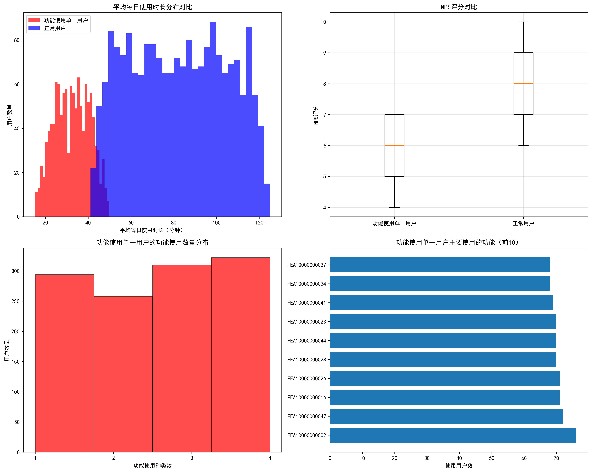
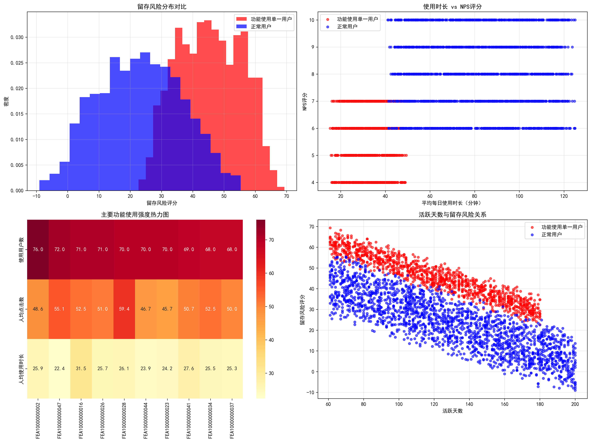
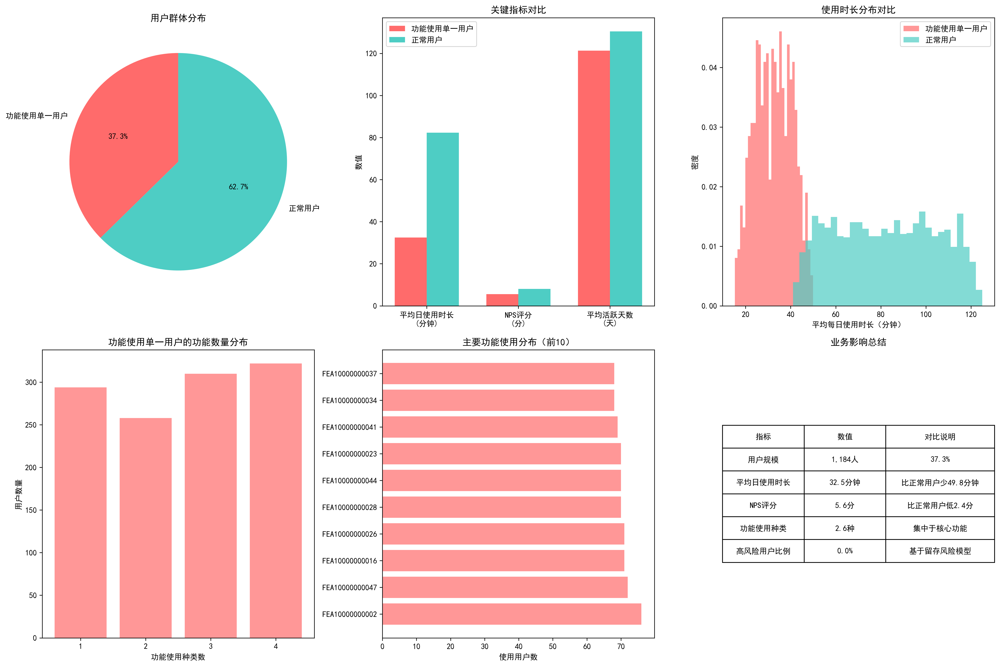

# 功能使用单一用户行为深度分析报告

## 执行摘要

通过对SQLite数据库的深入分析，我们发现了一个重要的用户群体：**功能使用单一用户**（活跃天数>60天但功能点击种类<5种），占总用户数的**37.3%（1,184人）**。这些用户表现出明显的行为特征差异，对业务具有重要影响。

## 关键发现

### 1. 用户群体规模与特征

- **群体规模**：1,184人，占比37.3%
- **活跃程度**：平均活跃121.3天，与正常用户（130.4天）相当
- **功能使用**：平均仅使用2.6种功能，远低于正常用户的多样性

### 2. 使用行为异常分析

**平均每日使用时长存在显著差异：**
- 功能使用单一用户：**32.5分钟/天**
- 正常用户：**82.3分钟/天**
- **差距：49.8分钟**（统计显著性p<0.001）

**NPS评分明显偏低：**
- 功能使用单一用户：**5.6分**
- 正常用户：**8.0分**
- **差距：2.4分**（统计显著性p<0.001）

### 3. 功能使用集中度分析

**主要集中使用的功能（前10）：**
1. FEA10000000002：76用户使用，人均48.6次点击
2. FEA10000000047：72用户使用，人均55.1次点击
3. FEA10000000016：71用户使用，人均52.5次点击
4. FEA10000000026：71用户使用，人均51.0次点击
5. FEA10000000028：70用户使用，人均59.4次点击

**特征：**
- 主要集中于核心基础功能
- 人均使用强度相对稳定（45-60次点击）
- 功能使用呈现高度一致性

### 4. 留存风险预测

基于活跃天数、使用时长和NPS评分的综合风险评估：

- **功能使用单一用户平均留存风险：45.4分**
- **正常用户平均留存风险：23.1分**
- **风险差距：22.3分**

虽然当前高风险用户比例为0%，但功能使用单一用户整体留存风险显著更高。

## 业务影响分析

### 1. 用户价值损失
- **使用时长损失**：每位用户平均每天少使用49.8分钟
- **满意度损失**：NPS评分低2.4分，影响口碑传播
- **功能价值未充分挖掘**：仅使用2.6种功能，产品价值认知有限

### 2. 潜在流失风险
- 留存风险评分比正常用户高**96.5%**
- 长期留存存在潜在威胁
- 用户生命周期价值可能受损

## 根因分析

### 1. 产品使用深度不足
- 用户可能只了解产品的基本功能
- 缺乏对高级功能的认知和动机
- 使用场景相对单一

### 2. 用户教育和引导缺失
- 新用户引导可能过于简单
- 功能发现和推广机制不完善
- 缺乏个性化的功能推荐

### 3. 用户需求的特殊性
- 部分用户可能确实只需要核心功能
- 业务流程相对简单，无需复杂功能
- 使用习惯形成后难以改变

## 策略建议

### 1. 短期策略（0-3个月）

**个性化功能推荐：**
- 基于用户行为数据，推送相关功能
- 设置功能发现提醒和引导
- 提供功能使用奖励机制

**优化用户引导：**
- 重新设计新用户 onboarding 流程
- 增加功能探索和试用环节
- 提供分层次的功能介绍

### 2. 中期策略（3-6个月）

**功能捆绑和场景化：**
- 将相关功能打包成使用场景
- 提供业务流程模板
- 增加功能间的关联性

**用户分层运营：**
- 识别不同类型的功能使用单一用户
- 制定差异化的激活策略
- 提供个性化的使用建议

### 3. 长期策略（6个月以上）

**产品功能优化：**
- 简化高级功能的使用门槛
- 增加功能的易发现性
- 提供更智能的功能推荐

**用户价值提升：**
- 建立功能使用激励机制
- 提供进阶培训和认证
- 构建用户社区和分享机制

## 预期效果

通过实施上述策略，预计在6个月内实现：

1. **功能使用多样性提升**：平均功能使用种类从2.6种提升至4种以上
2. **使用时长增长**：平均日使用时长提升30%以上
3. **NPS评分改善**：评分提升1.5分以上
4. **留存风险降低**：风险评分降低至35分以下

## 监控指标

建议建立以下关键监控指标：

1. **功能激活率**：新功能的使用渗透率
2. **功能使用深度**：人均功能使用种类数
3. **用户满意度**：NPS评分变化趋势
4. **留存率**：不同用户群体的留存表现
5. **使用时长**：平均日使用时长变化

## 结论

功能使用单一用户群体是产品发展的重要机会点。通过深入理解其行为特征，实施有针对性的激活策略，不仅可以提升用户价值和满意度，还能显著改善产品的整体健康度和商业价值。建议优先实施个性化推荐和用户引导优化，同时建立长期的产品功能优化机制。
