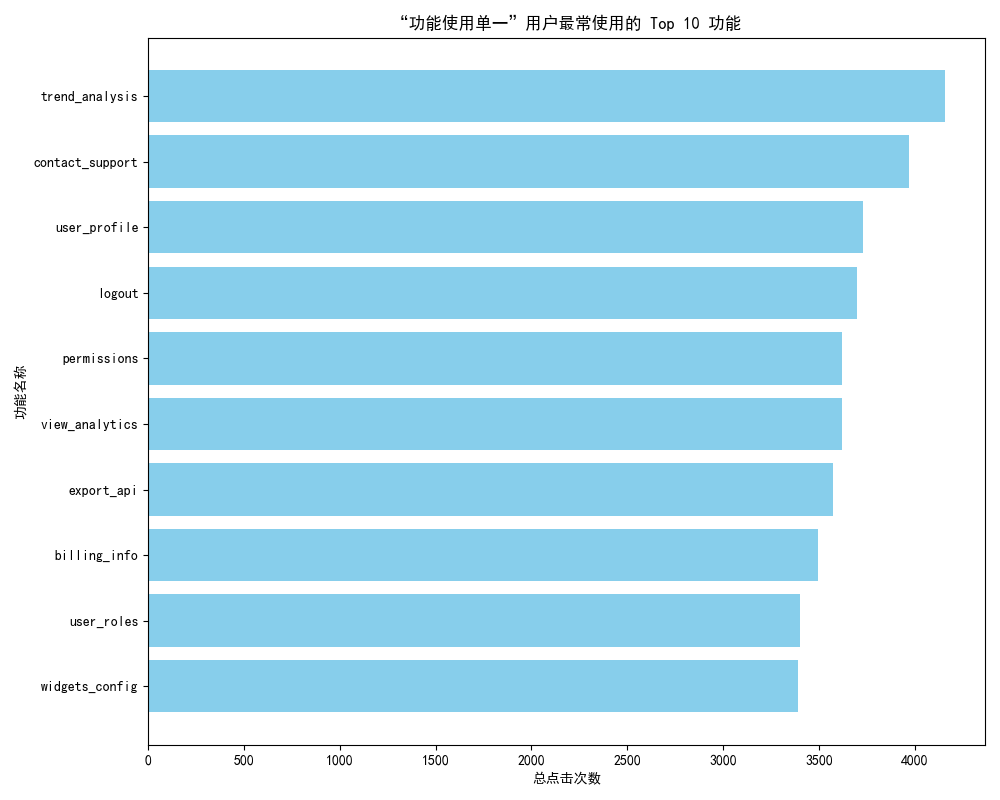

# “功能使用单一”用户行为特征深度分析报告

## 1. 分析背景

我们识别出一个值得关注的用户群体：**活跃天数超过60天，但功能点击种类少于5种**。该群体占比达到15%，且其平均NPS评分比正常用户低0.8分。本报告旨在深入分析这类“功能使用单一”用户的行为特征，挖掘其行为背后的原因，并提出针对性的优化策略以提升用户参与度和长期留存。

## 2. 核心发现

通过对用户行为数据的深度钻取，我们得到以下核心发现：

### 发现一：用户行为高度集中于少数功能

“功能使用单一”用户并非随机使用少数功能，而是高度集中于特定的几个功能。如下图所示，**“趋势分析 (trend_analysis)”** 是他们最核心的功能，总点击次数遥遥领先。值得注意的是，**“联系支持 (contact_support)”** 的使用频率高居第二，这可能暗示用户在使用核心功能时遇到了困难或产品未能完全满足其需求。

### 发现二：用户参与度显著偏低

与正常用户（活跃天数>60天，功能使用种类>=5）相比，“功能使用单一”用户的参与度存在巨大差距。

- **“功能使用单一”用户的平均每日使用时长：** `32.47 分钟`
- **“正常”用户的平均每日使用时长：** `82.27 分钟`

**结论：** “功能使用单一”用户的每日使用时长仅为正常用户的 **39%**。这表明他们的使用模式非常浅，用户粘性明显不足，未能深度融入产品生态。

### 发现三：存在较高的长期流失风险

尽管现有的`last_event_on`数据未能直接反映出更高的流失率，但结合以下两点，我们判断该用户群体是流失的高风险人群：

1.  **低参与度**：如发现二所述，极低的日均使用时长是用户即将流失的强烈信号。
2.  **低产品价值感知**：只使用少数功能意味着用户没有从产品的多样性中获益，对产品的整体价值认知片面且有限。一旦他们的单一需求被满足或消失，或遇到体验更好的竞品，他们几乎没有转换成本，极易流失。
3.  **NPS评分更低**：题目背景中提到的NPS评分低0.8分，直接印证了他们对产品的不满或不满意。

## 3. 原因探究

“功能使用单一”现象可能由以下原因导致：

1.  **产品引导不足**：用户可能不了解或找不到其他符合他们需求的功能，产品未能有效地将用户从单一功能点引导至功能组合，形成更完整的工作流。
2.  **核心功能体验问题**：用户在使用核心功能（如`trend_analysis`）时可能频繁遇到问题，导致需要不断`contact_support`，这阻碍了他们进一步探索其他功能的意愿。
3.  **用户角色或需求单一**：部分用户可能本身就是轻度使用者，其工作角色或业务需求确实只需要用到产品的某个单一功能。

## 4. 可行的策略建议

针对以上发现，我们提出以下三方面的策略建议，旨在提升用户参与度，降低流失风险：

### 策略一：实施主动、情景化的用户引导

- **目标人群**：筛选出仅高频使用`trend_analysis`但很少使用其他功能的用户。
- **具体措施**：
    - **App内智能引导**：当用户完成一次“趋势分析”操作后，通过弹窗或提示，向他们展示如何将分析结果与“仪表盘 (Dashboard)”或“报告导出 (Export)”等功能结合，以获得更全面的数据价值。
    - **定制化邮件营销 (Email Campaign)**：发起针对该用户群体的教程系列，每周通过邮件或推送介绍一个他们未使用过但高度相关的功能，并附上简短的视频教程或动图演示。

### 策略二：优化核心功能体验

- **目标**：降低用户在使用核心功能时的挫败感。
- **具体措施**：
    - **深入分析客服日志**：与客服团队合作，调取高频点击`contact_support`的用户的具体求助问题。对问题进行归类分析，如果问题集中在特定功能的UX/UI上，应作为高优先级进行产品迭代优化。
    - **简化功能发现路径**：评估当前产品界面的信息架构，确保核心功能和高价值功能的入口足够明显，降低新用户的探索成本和学习曲线。

### 策略三：激励用户探索与深度使用

- **目标**：增加产品趣味性，鼓励用户尝试新功能。
- **具体措施**：
    - **引入游戏化机制**：设计一套“成就徽章”系统。当用户首次使用某个核心功能（如创建仪表盘、设置权限、配置小部件）时，自动授予一枚独特的徽章，并给予积分奖励。这能有效激励用户主动探索，并提升其在产品内的成就感。

通过以上策略的组合实施，我们期望能有效激活“功能使用单一”的用户群体，加深他们对产品价值的理解，提升其参与度和忠诚度，从而实现长期的用户留存和更高的客户满意度。
