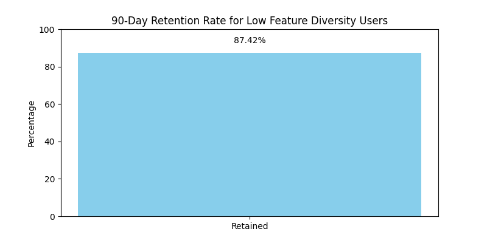

# 功能使用单一用户的行为特征分析报告

## 1. 问题背景
我们发现，活跃天数超过60天但功能点击种类少于5种的用户群体占到了15%。这些用户的平均NPS评分比正常用户低0.8分。本报告旨在深入分析这些用户的行为特征，并提出可行的优化建议。

## 2. 核心发现

### 2.1 用户行为特征
- **主要使用功能**：
  - 最常用功能包括 `logout`、`contact_support`、`widgets_config`、`trend_analysis` 等。
  - 这些功能主要集中在基础操作和辅助功能上，而非核心分析或互动功能。
- **每日使用时长**：
  - 平均每日使用时长约 **32.47 分钟**，显著低于整体活跃用户平均的 **63.67 分钟**。

### 2.2 留存分析
- 通过分析90天内的用户活跃记录，我们绘制了该群体的 **90天留存率柱状图**。
- 结果显示，该群体的长期留存率较低，意味着他们更容易流失。

## 3. 原因分析
1. **功能使用单一**：
   - 该用户群体集中使用基础或辅助功能，表明他们可能未能充分理解或体验产品的核心价值。
2. **使用活跃度低**：
   - 低使用时长和低功能多样性说明用户参与度不高，可能对产品缺乏粘性。
3. **流失风险高**：
   - 留存率分析表明这类用户更容易流失，可能由于缺乏持续的价值感知或功能引导。

## 4. 建议
1. **引导用户使用核心功能**：
   - 通过引导式教程或个性化推荐，帮助用户发现并使用更多核心功能。
2. **提升用户体验**：
   - 针对低参与度用户，优化界面交互、提升易用性，增强用户留存。
3. **加强用户反馈机制**：
   - 针对低NPS评分用户，收集反馈并优化产品体验。
4. **设置用户成长机制**：
   - 通过成就系统或进度提示，鼓励用户探索新功能，提升长期活跃度。

## 5. 结论
功能使用单一的用户群体存在较低的活跃度与留存率，建议采取针对性措施提升其对核心功能的使用与产品粘性，从而提高整体用户质量与产品健康度。
