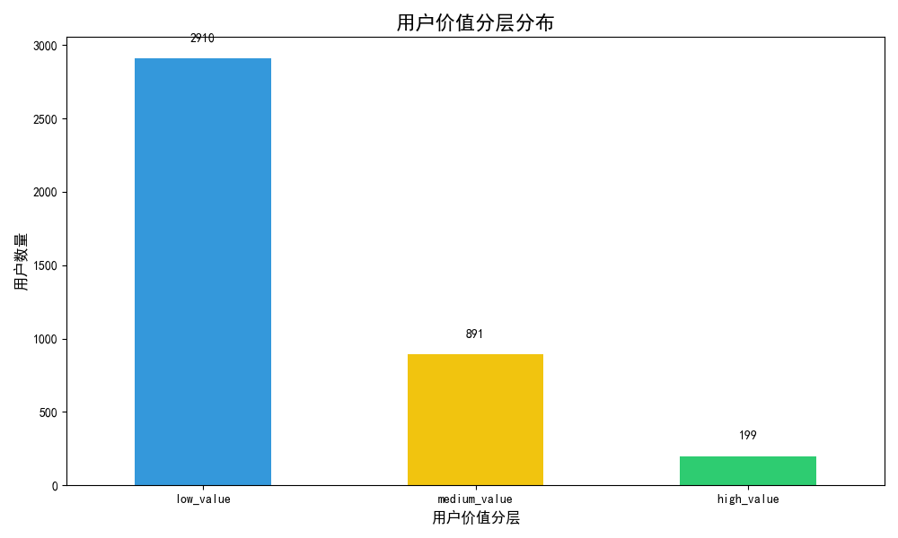
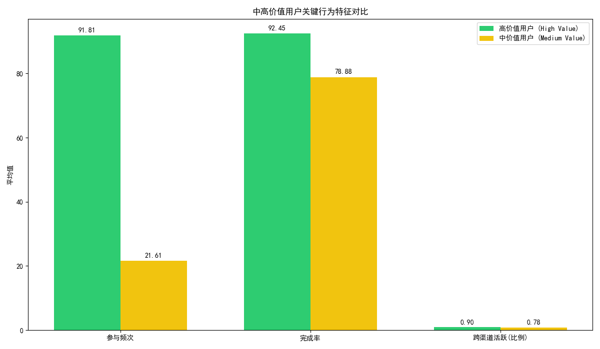

# 用户价值分析与增长策略报告

## 1. 分析背景与目标

为了深入理解用户参与度的分层现象，并有效提升用户生命周期价值，我们构建了一个多维度的用户价值评分模型。本次分析旨在：
1.  **量化用户价值**：基于用户的历史参与频次、完成率及跨渠道活跃度，计算综合价值评分。
2.  **识别转化路径**：挖掘从“中价值”用户向“高价值”用户转化的关键行为特征。
3.  **洞察客群差异**：分析不同语言和地域用户在价值转化路径上的表现。
4.  **制定增长策略**：基于以上洞察，提出具体的用户分层运营策略和个性化激励方案。

## 2. 用户价值模型与分层结果

我们基于以下三个核心维度构建了用户价值评分模型（0-100分制）：

*   **参与频次 (Frequency)**：用户完成调查的总次数，反映其活跃度和粘性。
*   **完成质量 (Completion Rate)**：用户参与调查的平均完成度，反映其参与深度和意愿。
*   **跨渠道活跃度 (Cross-channel Activity)**：用户是否同时在Email和SMS等多个渠道上完成过调查，反映其参与广度。

根据最终得分，我们将用户划分为三个价值层级：`低价值 (Low Value)`、`中价值 (Medium Value)` 和 `高价值 (High Value)`。用户分布情况如下图所示：

分析显示，`中价值`用户构成了我们用户群体的主体，而`高价值`用户虽然数量最少，但正如业务背景所述，他们是贡献核心价值的群体。因此，如何有效地将`中价值`用户向`高价值`转化，是用户运营工作的重中之重。

## 3. 核心洞察：从“中价值”到“高价值”的转化引擎

为了找到驱动用户价值提升的关键因素，我们对比了`中价值`与`高价值`用户在三个核心行为维度上的表现差异。

从上图可以清晰地看到：

*   **参与频次是决定性因素**：`高价值`用户的平均参与频次（91.8次）是`中价值`用户（21.6次）的**4.25倍**。这是两者之间最悬殊的差距，表明**高频次的互动是用户价值跃迁的核心引擎**。
*   **完成质量是基础保障**：`高价值`用户的完成率（92.4%）同样优于`中价值`用户（78.9%），但差距不如频次明显。这说明高质量的参与是成为高价值用户的必要条件，但非决定性因素。
*   **跨渠道活跃度是加分项**：`高价值`用户中有90%是跨渠道活跃者，略高于`中价值`用户的78%。这表明广泛的渠道触达能进一步巩固用户价值。

**结论**：**引导用户更频繁地参与互动，是推动用户从`中价值`向`高价值`转化的最有效路径。**

此外，通过对不同语言用户的价值评分分析，我们发现**德语(DE)、荷兰语(NL)和中文(ZH)用户群体表现出更高的平均价值**，这可能与产品在当地的文化契合度、市场成熟度或竞争环境有关，值得进一步做区域化深耕。

## 4. 战略建议与个性化激励方案

基于以上分析，我们提出以下用户分层运营策略和激励方案：

### 用户分层运营策略

1.  **高价值用户 (High Value)**：
    *   **策略**：**精细化维护与荣誉激励**。
    *   **措施**：提供VIP专属客服、新功能/产品优先体验权、定期赠送品牌荣誉勋章或积分奖励，建立高端用户社群，增强其归属感和忠诚度。

2.  **中价值用户 (Medium Value)**：
    *   **策略**：**重点激励与转化促进**。
    *   **措施**：核心目标是**提升其参与频次**。实施下述个性化激励方案，通过任务、挑战等形式引导用户完成更多互动。

3.  **低价值用户 (Low Value)**：
    *   **策略**：**简化引导与沉默唤醒**。
    *   **措施**：降低参与门槛，推送简单、易完成的入门级任务。对于长期沉默用户，通过邮件或短信推送“回归好礼”等强引流活动，尝试重新激活。

### 个性化激励方案：聚焦提升“参与频次”

为了将庞大的`中价值`用户群体向`高价值`转化，我们建议设计一套以提升“频次”为目标的激励体系：

*   **推出“参与里程碑”挑战**：
    *   **机制**：设置一系列参与次数的里程碑，例如“完成10次调查”、“月度参与15次”等。
    *   **奖励**：每当用户达到一个里程碑，即可获得积分、优惠券或解锁更高级别任务的权限。这将用户的长期行为目标分解为多个短期、可实现的小目标，用即时反馈持续激励用户。

*   **实施“连续参与”奖励（Streaks）**：
    *   **机制**：鼓励用户“连续每周”或“连续N天”参与调查。
    *   **奖励**：连续参与天数越长，每日获得的基础奖励越高。一旦中断，则重新计算。这种游戏化机制已被证明能有效培养用户习惯，提升应用粘性。

*   **引入“跨渠道参与”加成**：
    *   **机制**：当用户首次通过一个新的渠道（如从Email到SMS）完成调查时，给予一次性额外奖励。
    *   **目的**：鼓励用户拓宽参与场景，增强与品牌的多点联系，使其成为更稳固的`高价值`用户。

通过实施上述策略，我们预期能够系统性地提升用户活跃度和生命周期价值，逐步扩大`高价值`用户群体的规模，为业务的长期健康发展提供坚实支撑。
