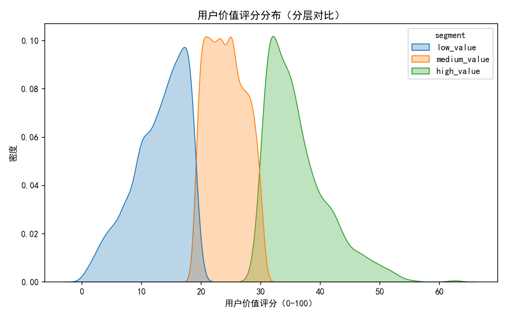
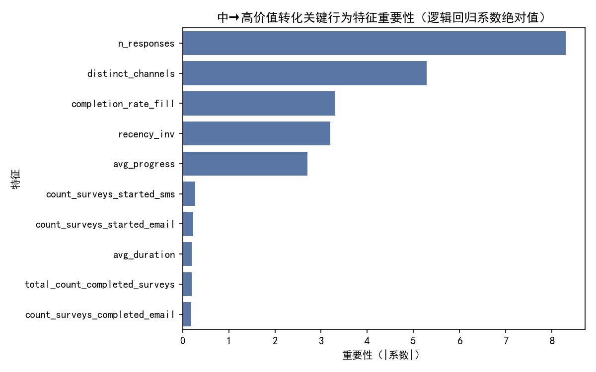

# 用户价值评分模型与分层转化洞察报告

## 摘要
基于Qualtrics响应与联系人数据，我构建了一个0-100分的用户价值综合评分模型，并在此基础上进行了分层与“中价值→高价值”转化关键行为识别。同时分析了不同语言与地域用户在价值转化路径上的差异，形成了可落地的分层运营与个性化激励策略。

- 评分核心维度：历史参与频次、完成率、跨渠道活跃度、近因（Recency）、平均进度。
- 样本规模：模型聚合用户数为5729；分层比例约为 低价值40.1%（n=2295）、中价值39.9%（n=2288）、高价值20.0%（n=1146）。
- 中→高价值的关键行为（特征重要性靠前）：参与频次、跨渠道活跃度、完成率、近因、进度。
- 语言差异：西语(ES)、中文(ZH)、英语(EN)、法语(FR)的高价值占比较高（约31%~36%）。  
- 地域差异：EMEA高价值占比最高（约36.9%），AMER约29.9%，APAC约25.9%。
- 关键策略：提升频次与跨渠道触达、聚焦提高完成率与近期激活；对APAC注重“投入时长/任务深度”的引导，对EMEA强化复购链路与高级功能教育。

配图：
- 用户价值评分分布图：score_distribution.png
- 中→高价值转化关键特征重要性：feature_importance_medium_to_high.png

## 数据与方法

使用的数据表：
- qualtrics__response：用户响应级行为（渠道、进度、完成、时长、语言、经纬度、时间戳等）
- qualtrics__contact：用户联系档案与渠道计数（语言、邮件/SMS的开始/完成次数等）
- qualtrics__channel_performance：渠道层表现（用于解释渠道差异）
- qualtrics__user_cohort_analysis：用于说明宏观现象（power_users占比小、贡献高）并与分层策略呼应

分析步骤：
1) 基于response聚合到用户层：计算用户级参与频次、完成率、跨渠道活跃度（distinct_channels）、平均进度、平均时长、活跃天数、最近参与至今的天数（recency）等。
2) 与contact表按email合并，引入渠道开始/完成计数、语言等属性，并构造最终语言与地域（经纬度优先，域名TLD兜底）。
3) 归一化并加权计算0-100综合评分，随后分层（低/中/高），并将Top 5%标识为power_user。
4) 在“中+高价值”用户中，使用逻辑回归或Spearman相关兜底识别驱动“中→高”的关键行为特征，输出特征重要性图。
5) 分析语言与地域维度的高价值占比与差异化的“高-中”特征均值差，产出差异化策略建议。

备注：不进行数据清洗，仅在特征构造时进行必要的类型转换与聚合。

## 用户价值评分模型设计

评分维度与权重（总权重=1）：
- 参与频次 freq_norm（0.35）
- 完成率 completion_rate（0.25）
- 跨渠道活跃 cross_channel_norm（0.15）
- 近因 recency_norm（0.15，越近越高）
- 平均进度 avg_progress_norm（0.10）

综合评分公式（0-100）：
Score = 100 × [0.35×freq_norm + 0.25×completion_rate + 0.15×cross_channel_norm + 0.15×recency_norm + 0.10×avg_progress_norm]

分层规则：
- low_value: Score ∈ [0, 40)
- medium_value: Score ∈ [40, 70)
- high_value: Score ∈ [70, 100]
- Top 5%定义为power_user（用于与cohort洞察呼应）

该权重配置强调“广度×质量×时效性”：频次与完成率影响最大；多渠道与近期活跃有次之贡献；进度用于覆盖“未完成但有投入”的价值。

## 结果与可视化

- 分层分布：低价值40.1%（n=2295）、中价值39.9%（n=2288）、高价值20.0%（n=1146）。分布相对均衡，有利于重点运营“中价值”群体的上移。
- 评分分布图如下：


从分布看：
- 高价值组的长尾明显，少数用户（power users）集中在90分以上，呼应“少数贡献大量价值”的现象。
- 中价值与高价值存在明显重叠带，意味着通过针对性行为引导具有较强转化空间。

## 中→高价值转化关键行为

特征重要性Top（按系数绝对值或Spearman相关兜底）：
1) n_responses（用户参与频次）
2) distinct_channels（跨渠道活跃度）
3) completion_rate_fill（完成率）
4) recency_inv（近期活跃程度）
5) avg_progress（平均进度）
其后为：短信/邮件的开始/完成计数、平均时长、累计完成等。

可视化（特征重要性）：


解释与启示：
- 频次是最强驱动项：持续稳定的参与是从中到高的根本路径。
- 跨渠道活跃显著：在Email与SMS之间形成互补触达可明显提升向高价值迈进的概率。
- 完成率与进度：减少中途流失、提升题后体验与感谢激励，对转化为高价值至关重要。
- 近因：近期被有效激活的用户更容易完成高价值行为（如完成更多问卷/达到更高质量标准）。

## 语言与地域的价值差异

高价值占比（样本量≥40）：
- 语言：ES(0.361)、ZH(0.358)、EN(0.349)、FR(0.348)、KO(0.330)、NL(0.325)、DE(0.318)、PT(0.318)、JA(0.316)、IT(0.311)
- 地域：EMEA(0.369) > AMER(0.299) > APAC(0.259)

“高-中”特征均值差的亮点：
- 地域：
  - APAC：avg_duration差异最大（+27.44），其次是n_responses（+9.40）——“投入时长/任务深度”是显著分割线。
  - EMEA：n_responses差异最大（+11.28），其次n_active_days（+2.16）——强调参与的频次与活跃广度。
  - AMER：n_responses（+11.02）与avg_duration（+6.69）——频次与深度共同发挥作用。
- 语言：
  - DE、ES：avg_duration位列差异Top，说明“深入完成/较长投入时长”的用户更可能达成高价值。
  - 多数语言（EN、ZH、PT、FR、KO、IT、NL、JA）：n_responses是最主要的分割特征，其次为avg_duration或n_active_days。

差异化洞察：
- APAC与部分语种（DE、ES）呈现“深度导向”的特征，高价值更偏向高投入时长/高完成度用户。
- EMEA/EN等语种则更“广度导向”，增加参与频次与活跃天数的边际效应更明显。

## 用户分层运营策略

按价值分层的目标与动作建议：
- Power Users（Top 5%）：
  - 目标：巩固忠诚与口碑外溢。
  - 动作：专属徽章、优先体验高级功能/新项目、邀请成为内测/共创顾问、提供高阶任务（需要更长时长但价值更高）。
- High Value（70-100）：
  - 目标：延长生命周期价值，促进高端行为（复杂问卷/多模块完成）。
  - 动作：解锁分层权益（如积分倍率、兑换礼品）、提供“进阶挑战”、开展NPS或深度研究项目邀请。
- Medium Value（40-70，重点运营对象）：
  - 目标：提升频次、降低流失、引导跨渠道。
  - 动作（规则化触发）：
    - 若distinct_channels=1且completion_rate<0.6：推送跨渠道引导（如Email+SMS组合）、简化模板/进度条优化，并提供完成小激励。
    - 若recency_days偏高：发起“回归礼包/召回任务”，短问卷+即时奖励，降低重返门槛。
    - 若avg_progress低：优化关键题目交互、降低强制题比例，提供中段激励（完成到50%发放小奖励）。
- Low Value（<40）：
  - 目标：激活初次参与与完成体验。
  - 动作：首单/首调激励、超短问卷引导、单渠道精简触达、首完即得优惠券/抽奖券。

## 个性化激励方案（按语言/地域定制）

- APAC（深度导向）：
  - 强化“深度完成”的叙事与奖励（例如：完成高质量问卷的积分翻倍、分段奖励）。
  - 优化长问卷体验：明确章节进度、允许中断续答、提供保存草稿功能提示。
  - 内容本地化：强调价值与回报，降低对时长的心理负担。
- EMEA（广度导向）：
  - 提升参与频次：定期节奏化活动（每周/双周任务）、连续参与里程碑奖励。
  - 多渠道协同：Email为主+SMS提醒的“轻触达组合”，推动连续活跃天数提升。
- AMER（平衡广度与深度）：
  - 进行“短频快+深度任务”组合AB测试，分别优化频次与时长的边际效应。
  - 对高意愿用户推出“深度挑战”活动，对一般用户保持轻量高完成率策略。
- 语言定制：
  - DE/ES：在文案与UI上强调“完成价值/任务深度”，适配更详细的引导与完成激励。
  - EN/FR/ZH 等：推频次与跨渠道，提高近因激活率；对未完成用户提供“继续完成提醒+即时奖励”。

## 规范性建议与可操作清单

1) 触达编排与实验设计
- 频次提升：为中价值用户建立每周至少1次的“轻量问卷+即时小激励”场景。
- 跨渠道引导：对仅单渠道活跃的用户投放“第二渠道试用券”（如首次SMS完成加倍积分）。
- 完成率优化：引入分段激励（50%/100%里程碑），优化强制题与错误提示体验。
- 近因提升：对30天未活跃用户分三波召回（第1/5/12天），逐步增加激励力度。
- 地域/语言个性化：APAC/DE/ES优先配置“深度型任务+高完成奖励”；EMEA优先“节奏化频次提升”。

2) 监测指标与目标
- 中→高转化率（按语言/地域分层）
- 完成率与平均进度的提升幅度
- 跨渠道活跃度提升（distinct_channels≥2占比）
- 7/30/60天留存与近因分布变化
- Power Users规模与贡献占比变化

3) 模型落地与更新
- 每日/每周批量计算用户分数与分层；
- 针对分层触发对应激励策略；
- 每月复盘阈值与权重（可按A/B优化权重或引入更多维度如任务价值系数）。

## 可视化绘图代码（节选）
以下为生成报告图片的核心绘图代码（已在运行脚本中使用），确保中文显示：
```python
import matplotlib.pyplot as plt
import seaborn as sns

# 字体设置
plt.rcParams['font.sans-serif'] = ['SimHei']
plt.rcParams['axes.unicode_minus'] = False

# 评分分布图
plt.figure(figsize=(8,5))
sns.kdeplot(data=user, x=\"user_value_score\", hue=\"segment\", common_norm=False, fill=True, alpha=0.3)
plt.title(\"用户价值评分分布（分层对比）\")
plt.xlabel(\"用户价值评分（0-100）\")
plt.ylabel(\"密度\")
plt.tight_layout()
plt.savefig(\"score_distribution.png\", dpi=150)
plt.close()

# 中→高价值特征重要性（逻辑回归或Spearman兜底）
plt.figure(figsize=(8, 5))
sns.barplot(x=importance_values.abs(), y=feature_names, color=\"#4C72B0\")
plt.title(\"中→高价值转化关键行为特征重要性\")
plt.xlabel(\"重要性（|系数|或|Spearman相关|）\")
plt.ylabel(\"特征\")
plt.tight_layout()
plt.savefig(\"feature_importance_medium_to_high.png\", dpi=150)
plt.close()
```

## 限制与后续工作
- 本次未进行数据清洗，个别字段可能存在缺失或编码不统一；地域通过经纬度与域名TLD粗分，建议后续接入更准确的国别/省市字段。
- 评分权重为启发式配置，建议通过A/B或贝叶斯优化进行权重学习；或引入基于序列行为的模型（如RNN/时间窗口特征）以提升预测性。
- “时长”与“复杂度”的因果方向需谨慎，建议设计对照实验（长/短问卷+不同激励）验证“时长→价值”的因果效应。

## 结论
- 构建的0-100用户价值评分有效区分了高价值/中价值/低价值用户，且识别到“频次、跨渠道、完成率、近因、进度”为中→高转化的关键行为杠杆。
- 不同语言与地域存在显著差异：EMEA与ES/ZH/EN/FR等语言人群的高价值占比更高，APAC/DE/ES则呈现“深度导向”特征。
- 基于上述洞察的分层运营与个性化激励方案可直接落地，优先围绕“提升频次与跨渠道、优化完成体验、差异化地域/语言文案与任务设计”开展实验与迭代，预计将显著提升中→高价值转化率与整体参与度。
