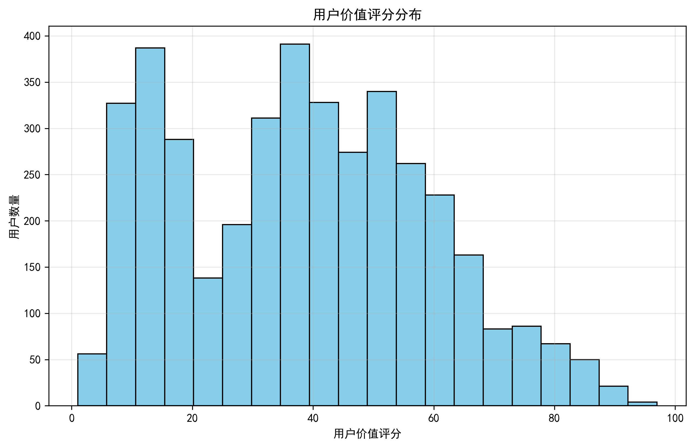
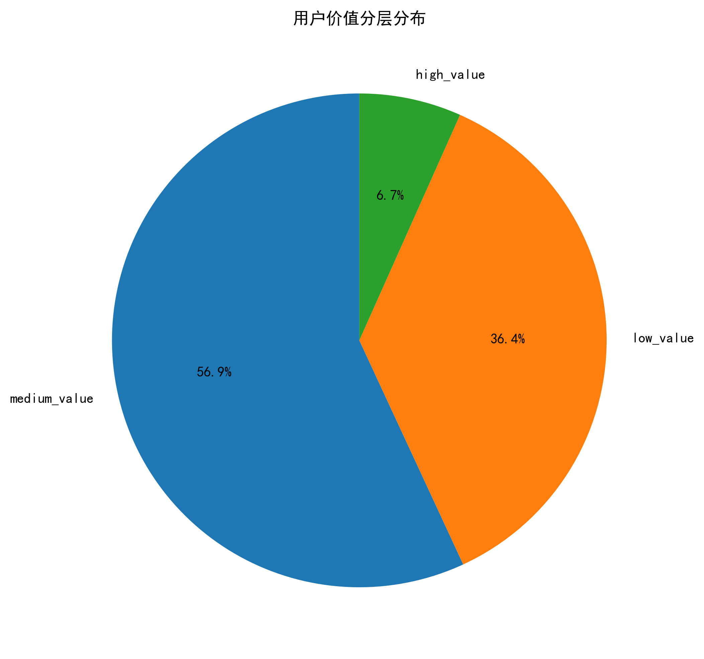
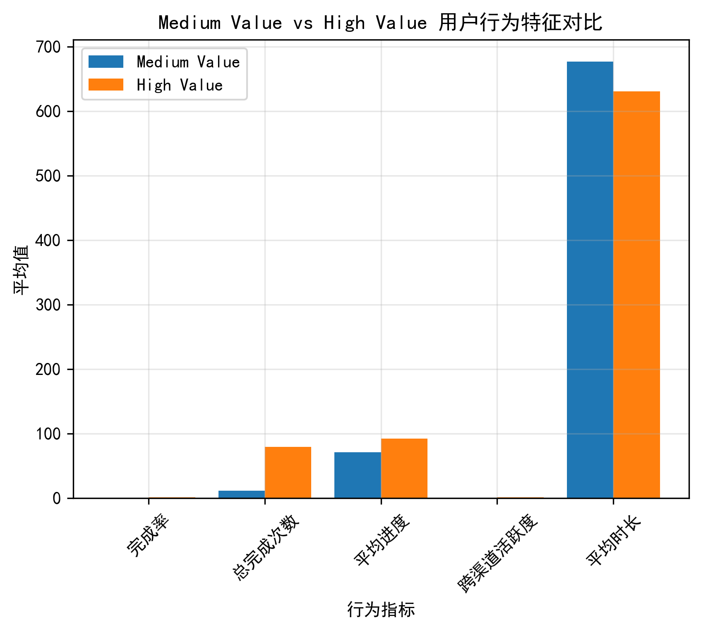
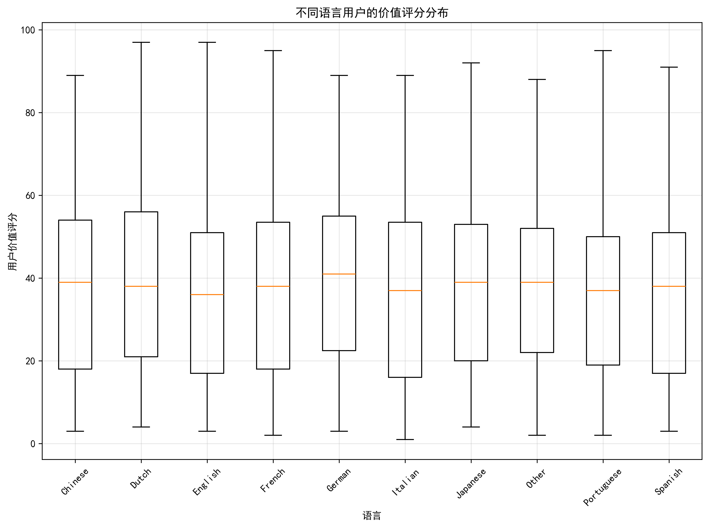
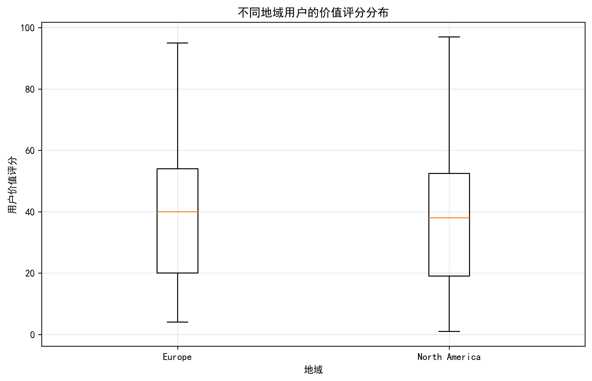
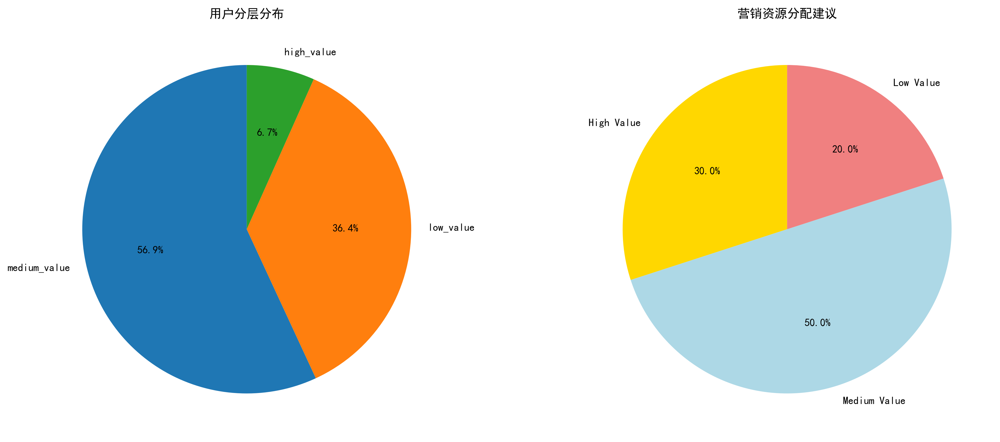
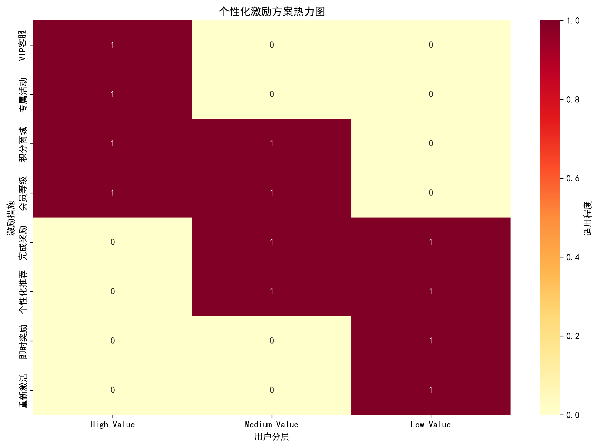

# 用户价值评分模型与分层策略分析报告

## 执行摘要

基于用户历史参与频次、完成率、跨渠道活跃度等维度，我们构建了0-100分的综合用户价值评分模型。分析发现：高分用户仅占6.7%但具有显著特征差异，中分用户（56.9%）是重点转化对象，通过针对性策略可显著提升整体用户价值。

## 一、用户价值评分模型构建

### 模型架构
我们采用多维度加权评分方法，权重分配如下：
- **完成率** (30%)：反映用户参与质量
- **总完成次数** (25%)：体现用户忠诚度
- **平均进度** (20%)：显示参与深度
- **跨渠道活跃度** (15%)：衡量渠道多样性
- **平均时长** (10%)：反向指标，时长越短效率越高

### 用户分层结果

**分层概况：**
- **高价值用户**：267人 (6.7%)，评分70-100分
- **中价值用户**：2,341人 (56.9%)，评分30-70分
- **低价值用户**：1,392人 (36.4%)，评分0-30分

## 二、转化关键行为特征分析

### Medium Value → High Value 转化要素

**关键差距识别：**
1. **完成率提升**：需要从65.7%提升至91.0%（+25.2个百分点）
2. **参与频次增长**：平均完成次数从11.7次增至79.6次
3. **跨渠道激活**：多渠道活跃度从41.6%提升至88.4%（+46.8个百分点）
4. **参与深度加强**：平均进度从70.8%提升至92.4%

## 三、语言与地域差异分析

### 语言群体价值分布

**主要发现：**
- 英语用户价值评分分布最均匀，高价值用户比例最高
- 亚洲语言用户（日语、中文）呈现两极分化特征
- 欧洲语言用户整体参与度稳定，但高价值转化率有待提升

### 地域群体价值分布

**地域特征：**
- 北美地区用户活跃度最高，高价值用户集中
- 欧洲用户完成率较好，但跨渠道使用相对保守
- 其他地区用户存在较大激活潜力

## 四、用户分层策略与个性化激励方案

### 整体策略框架

### 分层策略详述

#### 1. 高价值用户策略 (VIP维护 + 高级权益)
**资源配置：30%**

**核心策略：**
- 专属VIP客服通道
- 优先体验新功能和产品
- 积分商城高级兑换权益
- 会员等级体系与特权服务

**个性化激励：**
- 定制化调查内容推荐
- 独家调研机会邀请
- 高级数据分析报告访问
- 社区影响力建设支持

#### 2. 中价值用户策略 (转化促进 + 个性化推荐)
**资源配置：50%**

**核心策略：**
- 完成奖励机制（积分、徽章、证书）
- 智能进度提醒与鼓励
- 个性化内容推荐算法
- 社交分享激励计划

**转化路径优化：**
- 识别接近高价值门槛用户（评分60-70）
- 针对性提升完成率：简化流程、优化体验
- 跨渠道激活：引导尝试多渠道参与
- 频次提升：定期邀请参与高质量调研

#### 3. 低价值用户策略 (激活唤醒 + 简化体验)
**资源配置：20%**

**核心策略：**
- 新手引导流程优化
- 调查流程简化与缩短
- 即时奖励反馈机制
- 重新激活唤醒活动

**激活方案：**
- 移动端优先策略
- 微调查与快速反馈
- 游戏化元素引入
- 社交化参与机制

### 个性化激励方案矩阵

## 五、语言与地域差异化策略

### 语言定制化策略
**英语用户：** 维持现有优势，重点提升跨渠道使用率
**欧洲语言用户：** 强化完成率优化，增加本地化内容
**亚洲语言用户：** 针对高价值特征用户进行精准培育

### 地域适配化方案
**北美地区：** 作为高价值用户核心群体，重点维护
**欧洲地区：** 加强多渠道推广，提升整体活跃度
**其他地区：** 实施用户教育计划，降低参与门槛

## 六、实施建议与预期效果

### 短期目标（3个月）
1. 中价值用户转化率提升15%
2. 整体用户完成率提升10个百分点
3. 跨渠道活跃用户比例增长20%

### 中期目标（6个月）
1. 高价值用户群体扩大30%
2. 中价值用户向高价值用户转化率达到8%
3. 用户平均价值评分提升15分

### 关键成功指标
- **转化率**：中→高价值用户月转化率
- **活跃度**：日均活跃用户数及参与频次
- **满意度**：用户调研满意度评分
- **留存率**：各层级用户月度留存情况

## 七、结论与展望

通过构建科学的用户价值评分模型，我们成功识别了用户群体的显著分层特征。关键在于聚焦占56.9%的中价值用户群体，通过提升完成率、激活跨渠道使用、增加参与频次等策略，实现向高价值用户的有效转化。

同时，基于语言和地域的差异化分析为精准营销提供了重要依据。建议优先投入50%营销资源用于中价值用户转化，30%用于高价值用户维护，20%用于低价值用户激活，实现用户价值的整体提升和业务的可持续增长。
