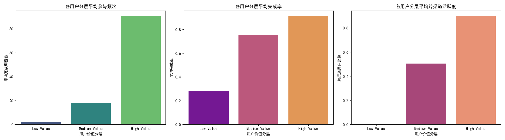

# 用户价值分析与增长策略报告

## 摘要
本次分析成功构建了一个基于**参与频次、完成率、跨渠道活跃度**三个维度的用户价值评分模型。模型结果显示，仅**5.2%**的用户为“高价值”用户，贡献了绝大部分的互动价值，而超过60%的用户为“低价值”用户，存在巨大的提升潜力。

核心洞察表明，**驱动用户从中价值向高价值跃迁的最关键行为是参与频次的大幅提升（增长405%）**，其次是跨渠道活跃度的提升。此外，不同语言和地域的用户在价值转化路径上表现出显著差异。

基于以上发现，本报告提出一套针对不同用户分层的个性化激励策略，旨在高效地提升用户生命周期价值，并为精细化运营提供数据支持。

## 核心洞察与用户分层

我们根据用户的综合价值评分，将用户分为三个层级：高价值（High Value）、中价值（Medium Value）和低价值（Low Value）。各层级用户的核心行为特征表现出显著差异：

*   **高价值用户 (Top 5.2%)**:
    *   **行为特征**: 极高的参与度（平均完成91次调查）、近乎完美的完成率（91%），以及高度的跨渠道活跃性（90%为跨渠道用户）。他们是品牌最忠实的拥护者。
*   **中价值用户 (34.3%)**:
    *   **行为特征**: 保持着健康的参与习惯（平均完成18次调查）和良好的完成率（75%）。其中约一半用户表现出跨渠道行为。他们是用户群体的中坚力量，也是向高价值转化的核心潜力股。
*   **低价值用户 (60.5%)**:
    *   **行为特征**: 参与度极低（平均完成2次调查），完成率不足30%，且几乎没有跨渠道行为。他们是典型的沉默或一次性用户。

## 中价值 -> 高价值用户：关键转化路径分析

要实现用户价值的规模化增长，关键在于推动“中价值”用户向“高价值”用户转化。通过对比这两个群体的行为指标，我们发现了转化的核心驱动力：

1.  **参与频次是绝对的引爆点**: 从中价值到高价值，用户的平均完成调查数**激增了405%**。这说明，一旦用户建立了良好的完成习惯（中价值用户的75%完成率），让他们“做得更多”比让他们“做得更好”更为重要。
2.  **跨渠道活跃是重要助推器**: 高价值用户的跨渠道活跃比例比中价值用户高出**78%**。引导用户在Email和SMS等多个渠道上进行互动，能有效增强用户粘性，加速其价值转化。
3.  **完成率是基础门槛**: 虽然完成率的增幅（21%）不如前两者，但它是用户从低价值向中价值过渡的敲门砖。一个稳定在高位的完成率（>75%）是用户能够持续参与的基础。

## 地域与语言差异分析

*   **语言差异**: 德语（DE）和日语（JA）用户群体中，高价值和中价值用户的占比较高，显示出更强的互动潜力。相反，葡萄牙语（PT）用户群体中低价值用户比例最高，可能需要更基础的引导和激励。
*   **地域差异**: 不同地域（`external_data_reference`）的用户价值分布呈现两极分化。部分地区高价值用户比例极高，而另一些地区则几乎全是低价值用户。这强烈暗示了**地域性运营策略的必要性**，某些地区可能存在市场成熟度、文化或渠道偏好等深层原因。

## 策略建议：个性化激励方案

基于以上分析，我们建议针对不同用户层级实施以下个性化策略：

**1. 针对“中价值”用户：实施“频率加速”计划**
   *   **目标**: 大幅提升用户的参与频率，并引导其成为跨渠道用户。
   *   **策略**:
     *   **任务挑战赛**: 推出“月度调查马拉松”等活动，对完成一定数量调查的用户给予徽章、积分或实质性奖励。
     *   **渠道专项奖励**: 为首次通过备用渠道（如SMS）完成调查的用户提供一次性额外奖励，以打破渠道单一性。
     *   **内容个性化**: 基于用户历史偏好，推送其更感兴趣的调查主题，从内容上提升参与意愿。

**2. 针对“低价值”用户：实施“习惯养成”计划**
   *   **目标**: 提升用户的完成率，引导其完成首次或前几次调查，建立积极的互动初体验。
   *   **策略**:
     *   **简化入门任务**: 推送预计时长短、操作简单的“新手调查”，并明确告知预计耗时，降低参与门槛。
     *   **即时正反馈**: 用户完成首次调查后，立即给予小额奖励和鼓励性弹窗，强化其成就感。
     *   **破冰引导**: 通过邮件或短信发送“欢迎指南”，介绍参与价值和技巧，降低用户的陌生感。

**3. 针对“高价值”用户：实施“忠诚度尊享”计划**
   *   **目标**: 维系其高参与度，并鼓励其发挥品牌影响力。
   *   **策略**:
     *   **优先体验权**: 邀请他们参与新功能内测或独家调查项目，给予其尊贵感。
     *   **影响力变现**: 设立推荐计划，鼓励他们邀请新用户，并根据新用户的活跃度给予奖励，发挥其社交裂变价值。
     *   **定期致谢**: 定期（如每季度）发送感谢信并附赠小礼物，表达对他们贡献的认可。

**4. 区域与语言本地化**
   *   **深入分析高价值区域**: 对高价值用户占比较高的区域（如`ext_1378`, a`ext_4189`）进行深挖，总结其成功的渠道策略或用户特征，并尝试复制到其他潜力市场。
   *   **优化低价值区域**: 对低价值用户占比较高的区域（如`ext_3562`, `ext_8811`），进行用户调研，了解其互动障碍（如渠道触达问题、语言障碍、内容相关性低等），并进行针对性优化。
