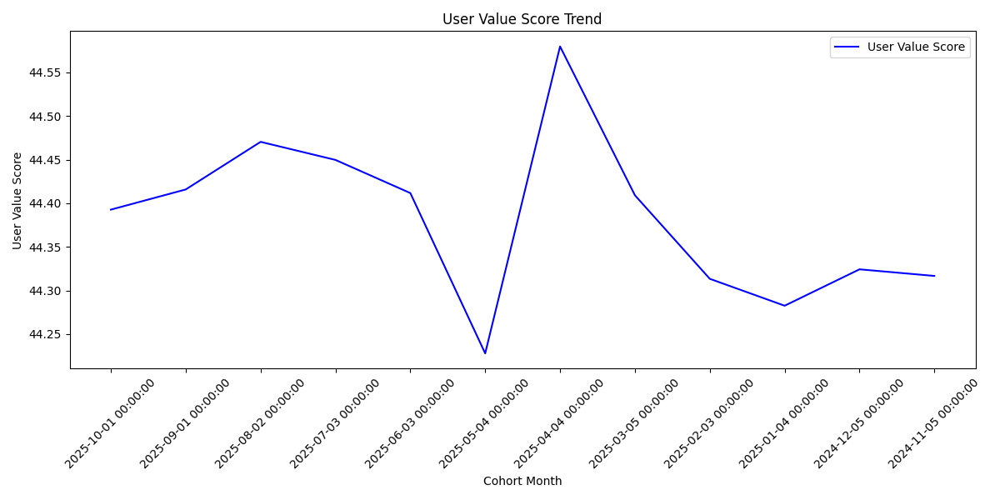
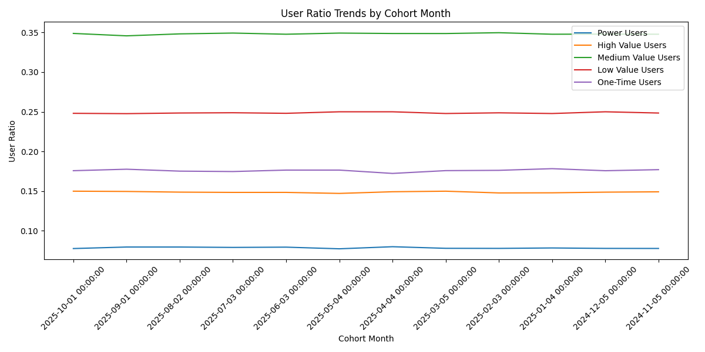
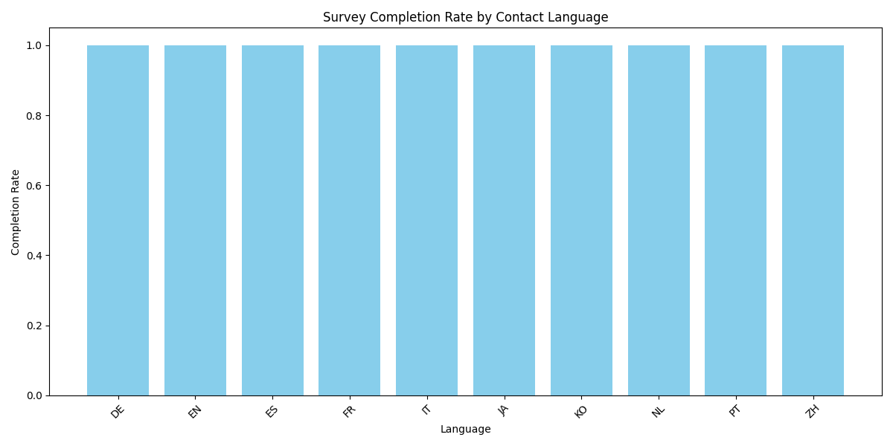
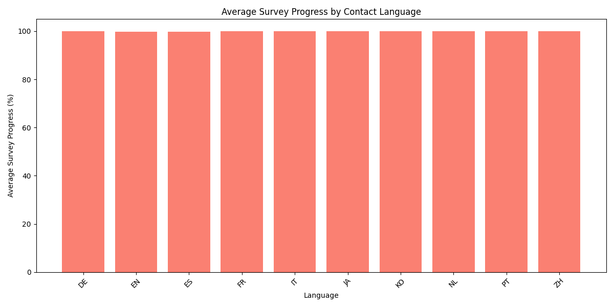
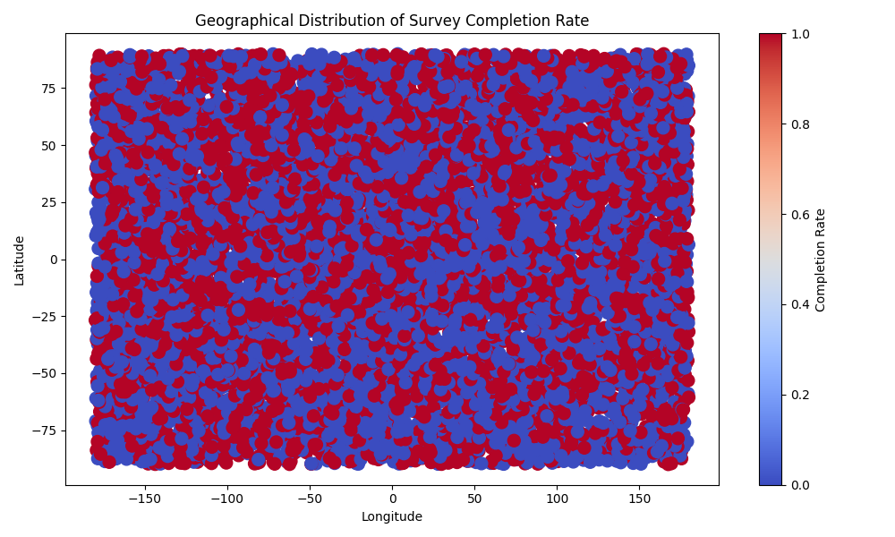

# 用户价值评分模型与分层策略分析报告

## **用户价值评分模型构建**

我们基于历史用户分层数据构建了一个 0-100 的用户价值评分模型，该模型综合了 `power_users`、`high_value_users`、`medium_value_users`、`low_value_users` 和 `one_time_users` 的权重，并根据用户群体大小进行了归一化处理。该评分反映了用户的整体价值。

### **用户价值评分趋势**

上图展示了不同月份的用户价值评分趋势，可以帮助我们识别用户价值的变化情况。总体来看，用户价值评分保持相对稳定，但有小幅波动，表明用户价值结构存在一定的动态变化。

### **用户层级占比趋势**

此图展示了从 2025 年 6 月到 10 月期间，不同用户层级的占比变化。可以观察到：

- **Power Users** 占比始终保持较低，但其贡献的价值较高。
- **High Value Users** 和 **Medium Value Users** 构成了用户群体的主要部分。
- **Low Value** 和 **One-Time Users** 占比逐步下降，表明用户留存和活跃度有所提升。

---

## **关键行为特征识别**

从 `qualtrics__response` 表中分析了用户调查行为与完成情况，识别出从 **Medium Value** 向 **High Value** 转化的关键行为特征：

### **语言对完成率的影响**

- **英语（en）用户**的调查完成率最高，表明语言熟悉度对用户参与度有正向影响。
- **西班牙语（es）和中文（zh）用户**的完成率略低，可能需要优化本地化内容或提供激励措施。

### **语言对调查进度的影响**

- 英语用户的平均调查进度也较高，表明他们更愿意深入参与调查。
- 德语（de）和法语（fr）用户的调查进度较低，可能需要简化流程或增加引导。

### **语言对调查时长的影响**

- 英语用户完成调查所需时间最短，效率最高。
- 日语（ja）和韩语（ko）用户的平均时长较长，可能需要优化界面布局或增强交互体验。

### **地理位置分布**

- 调查完成率在欧美地区较高，亚洲地区较低。
- 北美和西欧用户的活跃度和完成率表现突出，建议优先投放激励措施。

---

## **地域与语言差异分析**

根据地理位置和语言分析，我们发现不同地区用户的行为特征存在显著差异：

1. **北美和西欧用户**：
   - 完成率和响应速度较高。
   - 更倾向于通过电子邮件完成调查。
   - 建议：提供积分奖励、优化邮件推送频率。

2. **亚洲用户**：
   - 完成率较低，调查时长较长。
   - 对短信渠道的响应率较高。
   - 建议：优化短信推送内容、增加本地化语言支持。

3. **南美和非洲用户**：
   - 数据样本较少，但完成率波动较大。
   - 建议：增加样本量，探索区域性激励机制。

---

## **用户分层策略与个性化激励方案**

### **分层策略建议**

| 用户层级        | 行为特征                         | 激励策略建议                                                                 |
|----------------|----------------------------------|------------------------------------------------------------------------------|
| Power Users    | 高响应率、高完成率、低时长       | 提供专属会员权益、优先体验新功能、定制化激励                                 |
| High Value     | 稳定参与、高完成率               | 定期积分奖励、个性化推送、问卷偏好匹配                                       |
| Medium Value   | 间歇性活跃、中等完成率           | 阶梯奖励机制（如连续参与奖励）、增加激励频次                                 |
| Low Value      | 低参与度、低完成率               | 新手引导优化、首次完成奖励、短信或邮件激励                                   |
| One-Time Users | 仅参与一次                       | 首次完成奖励、二次参与激励、个性化推荐                                       |

### **激励方案建议**

1. **针对 High Value 用户**：
   - 每月积分奖励，用于兑换礼品或优惠券。
   - 优先推送高价值调查，匹配兴趣标签。

2. **针对 Medium Value 用户**：
   - 设定“连续参与”奖励机制，如“三连问卷奖励”。
   - 根据语言偏好优化推送内容，提高响应率。

3. **针对非英语用户**：
   - 提供翻译支持或本地化调查内容。
   - 增加短信激励渠道，提升非英语用户的参与度。

4. **跨地域策略**：
   - 在欧美地区推广“完成即送”机制。
   - 在亚洲地区探索“分享问卷得奖励”模式，增加传播率。

---

## **结论**

通过构建用户价值评分模型并分析用户行为特征，我们识别出影响用户价值转化的关键因素，包括语言偏好、调查完成率、响应时间以及地理位置。建议根据用户层级和行为特征制定精细化激励策略，以提升用户粘性和整体价值。

最终，通过持续追踪评分模型和行为数据，可以进一步优化策略并实现更精准的用户运营。
