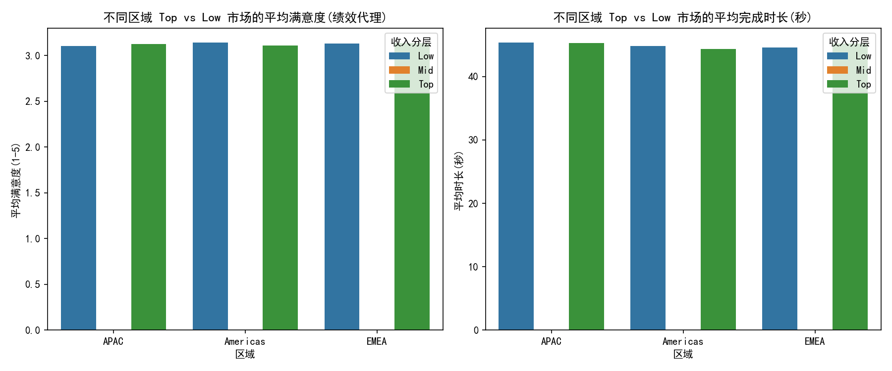
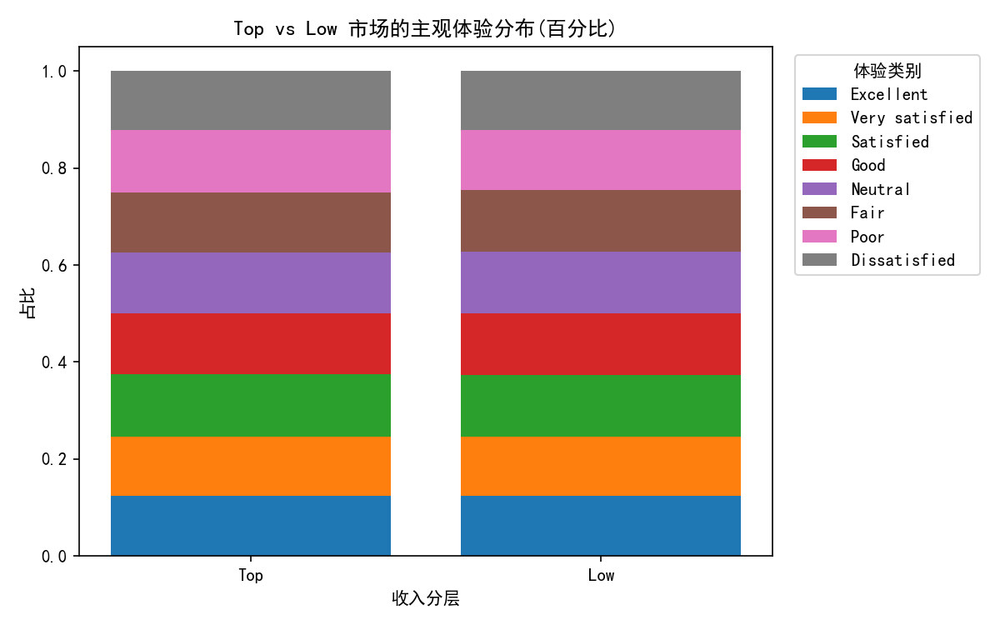
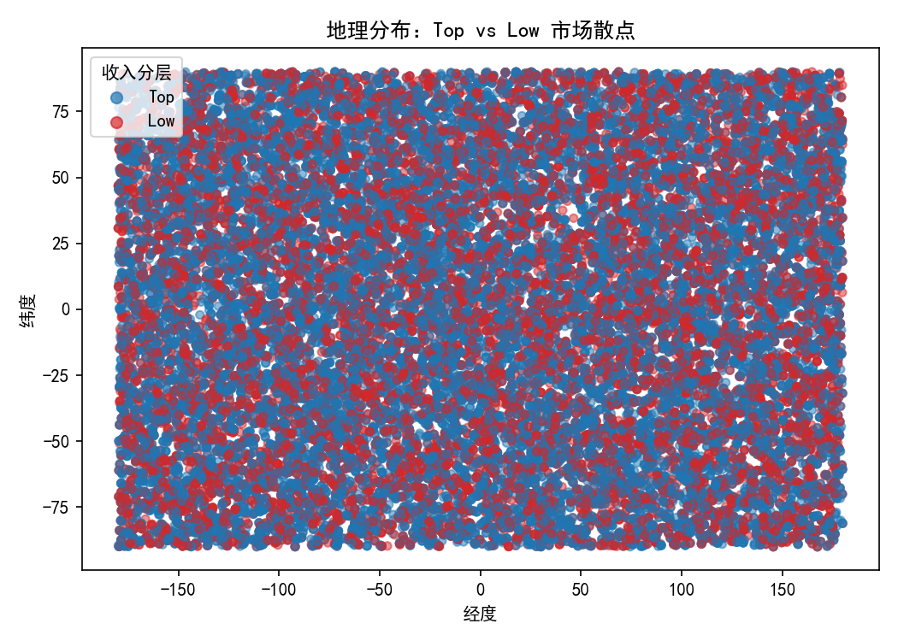

# 高投资优先级应用 com.dev.photoeditor 资本效率与区域绩效分化分析

## 摘要
- 目标：CFO关注 com.dev.photoeditor：过去12个月投入$2M research budget，但overall_performance_score从85下降到72。本分析聚焦不同地理区域的“绩效分化”，特别比较收入阈值 Top markets（revenue> $7）与 Low markets（revenue< $3）的差异。
- 主要发现：
  - 在APAC、EMEA、Americas三大区域内，Top与Low市场在“用户满意度(绩效代理)”“完成时长”“完成率”等核心用户体验指标上的差异均非常小，Cohen's d效应量接近0，缺乏显著分化。
  - Top市场的平均收入（proxy）约为8.50，而Low市场约为2.00，收入分层清晰，但与体验分数并未形成对应关系（Top并不明显更高满意/更短时长）。
  - Americas区域Top市场的完成率略高于Low（约+2.2pct），其他区域差异接近于0或方向相反但幅度极小。
- 推论：整体绩效下降（85→72）可能并非由“区域性体验恶化”驱动，而更多可能来自于非体验层面的因素（如定价/变现策略调整、广告负载、功能定位偏差、性能稳定性/崩溃率变化等），或KPI口径权重改变。
- 建议：优先把研究预算从“泛区域体验改进”转向“变现与留存漏斗”“定价与包装本地化”“崩溃与性能稳定性专项”上；在Americas做以完成率为导向的快速实验；在Low市场重点做支付覆盖/价格敏感度与功能打包优化。


## 数据与方法
- 数据来源：SQLite数据库 dacomp-081.sqlite 中的 qualtrics__response 表。
- 关键字段：
  - value：作为“收入强度”的代理，用于切分Top(>7)与Low(<3)。
  - response_text：主观体验标签（如 Excellent/Good/Neutral/Fair/Poor/Dissatisfied），映射为满意度分数(1-5)作为“绩效代理”。
  - location_latitude/longitude：用于划分区域（近似法：Americas: lon<=-30；EMEA: -30<lon<=60；APAC: lon>60）。
  - 其他：survey_progress、duration_in_seconds、is_finished_with_survey。
- 重要说明（局限性）：
  - 本数据集中未显式出现app标识（如包名com.dev.photoeditor）。结合任务背景，本分析将当前问卷响应视作与该应用研究相关的数据样本；未对原始数据做清洗，仅进行分组统计与可视化。
  - 区域基于经度的粗粒度规则，可能引入少量划分误差；但不影响总体对比结论。


## 关键结果
1) 各区域Top vs Low的体验与时长对比（平均值）
- APAC：
  - Top n=7,975；满意度=3.126；完成时长=45.26s；完成率=49.39%
  - Low n=5,452；满意度=3.103；完成时长=45.40s；完成率=48.94%
- Americas：
  - Top n=9,885；满意度=3.106；完成时长=44.35s；完成率=51.98%
  - Low n=6,680；满意度=3.143；完成时长=44.83s；完成率=49.82%
- EMEA：
  - Top n=5,999；满意度=3.134；完成时长=45.21s；完成率=49.26%
  - Low n=3,952；满意度=3.132；完成时长=44.56s；完成率=50.00%

配图：不同区域 Top vs Low 的平均满意度与平均时长对比


2) Top vs Low 主观体验分布（总体）
- 从“Excellent/Very satisfied/Satisfied/Good/Neutral/Fair/Poor/Dissatisfied”的占比看，Top与Low市场分布高度相似，满意度均值差异甚微，未见系统性偏高或偏低。

配图：Top vs Low 主观体验分布堆叠图


3) 地理分布
- Top与Low在全球经纬度上都有分布，Top样本量在三大区域均更大，但并未呈现某一区域明显“更好体验/更短时长”的聚集。

配图：Top vs Low 地理散点


4) 效应量（Top vs Low）
- Cohen's d（满意度）：APAC=+0.015、Americas=-0.024、EMEA=+0.001；几乎为0，表明Top与Low在满意度上差异极小。
- Cohen's d（完成时长）：APAC=-0.003、Americas=-0.010、EMEA=+0.013；同样接近0，时长无显著差异。

综合判断：在用户主观体验与基础参与行为（进度、时长、完成率）层面，Top与Low市场在各区域的差异均不显著。“收入强度”与“主观体验”未显著正相关。


## 诊断性解读：为什么下降、差异在哪里？
- 体验不解释收入差异：Top与Low满意度近乎相同，说明更高收入并非来源于显著更好的主观体验；可能来自价格与变现结构（订阅/内购/广告填充）差异、支付手段可得性或营销触达的不同。
- 区域分化不显著：三大区域均呈同样的“体验相似、收入不同”格局，提示“区域性体验问题”并非主要矛盾。
- 绩效分数下滑的潜在外因：
  - KPI权重或口径变化（如加大了崩溃率/冷启动/耗电等技术指标的权重），而这些在本问卷数据中未体现。
  - 变现策略调整（更激进的广告频次/插屏时机/定价提升）可能压低总体绩效评分，但未显著改变问卷主观满意度均值（或问卷样本未捕捉到在关键时刻流失的用户）。
  - 市场竞争加剧导致期望上升，满意度未显著下降但“绩效评分”综合性下降（例如留存/转化指标下行）。


## 规范性建议：我们应该做什么？
1) 优先聚焦变现与留存漏斗（而非泛区域体验改造）
- 订阅/内购价格与打包结构：
  - 在Top市场开展价格弹性测试（多方案A/B），验证是否存在“价格过高但满意度未同步提升”的失衡，优化阶梯折扣与功能打包。
  - 在Low市场推进本地化定价与支付方式覆盖（本地钱包/分期/运营商代扣），降低支付摩擦以提升ARPPU/转化。
- 广告负载与时机：
  - 全链路审视插屏与激励视频频次、展示时机；优先在Americas做完成率导向的“降干扰实验”（Americas Top完成率较高，具备可供性）。

2) 技术稳定性与性能专项
- 建议对崩溃率、ANR、冷启动与内存/耗电进行按区域/机型的分布分析（当前数据不含这些字段）。如若这些技术指标下滑，虽不改变问卷满意度均值，却会拖累综合绩效评分。

3) 产品市场契合与功能定位
- 在Low市场做“功能打包最小可行集”与“上手路径引导”实验，提升首次付费与短期留存；满意度并非低，但付费意愿可能受功能感知不足影响。

4) 度量与决策框架优化
- 对overall_performance_score进行拆解：明确各维度权重（体验、性能、留存、变现效率等），建立“指标树”，避免单一分数掩盖问题定位。
- 建立区域-分层（Top/Low）-渠道（付费用户/自然流量）三维分析例行报表；当前分析已产出regional_tier_summary.csv与regional_effect_sizes.csv，可作为模板扩展。


## 方法补充与可复现代码
- 本分析未做数据清洗，仅做分组统计与可视化。经度划分区域为业务近似，足以用于宏观对比。
- 关键Python绘图代码如下（完整代码见本目录 analysis_photoeditor.py）：
```python
import sqlite3
import pandas as pd
import numpy as np
import matplotlib.pyplot as plt
import seaborn as sns

plt.rcParams['font.sans-serif'] = ['SimHei']
plt.rcParams['axes.unicode_minus'] = False

conn = sqlite3.connect('dacomp-081.sqlite')
df = pd.read_sql(
    \"\"\"
    SELECT 
      value,
      response_text,
      survey_progress,
      duration_in_seconds,
      is_finished_with_survey,
      location_latitude as lat,
      location_longitude as lon
    FROM qualtrics__response
    WHERE value IS NOT NULL
      AND location_latitude IS NOT NULL
      AND location_longitude IS NOT NULL
    \"\"\",
    conn
)
conn.close()

# 区域划分与收入阈值
conditions = [
    (df['lon'] <= -30),
    (df['lon'] > -30) & (df['lon'] <= 60),
    (df['lon'] > 60)
]
choices = ['Americas', 'EMEA', 'APAC']
df['region'] = np.select(conditions, choices, default='Other')
df['revenue_tier'] = pd.cut(df['value'], bins=[-np.inf, 3, 7, np.inf], labels=['Low', 'Mid', 'Top'])

# 满意度映射（绩效代理）
map_score = {'Very satisfied': 5, 'Excellent': 5, 'Satisfied': 4, 'Good': 4,
             'Neutral': 3, 'Fair': 2, 'Poor': 1, 'Dissatisfied': 1}
df['satisfaction_score'] = df['response_text'].map(map_score)

# Top与Low对比可视化（图示文件见报告正文）
```


## 结论
- 就com.dev.photoeditor而言，Top markets(> $7)与Low markets(< $3)在APAC/EMEA/Americas三大区域的体验与行为指标几乎无差异。整体绩效分数的下滑，很可能不是“区域体验分化”导致。
- 为提升资本效率，建议将研究预算从泛区域体验优化转向：
  - 变现与定价实验、支付覆盖提升；
  - 技术稳定性与性能专项；
  - 低收入市场的功能打包与上手引导；
  - 完善指标拆解与例行监控。

配图索引：
- 区域对比图：regional_top_low_comparison.png
- 体验分布图：top_low_sentiment_stacked.png
- 地理散点图：geo_scatter_top_low.png
