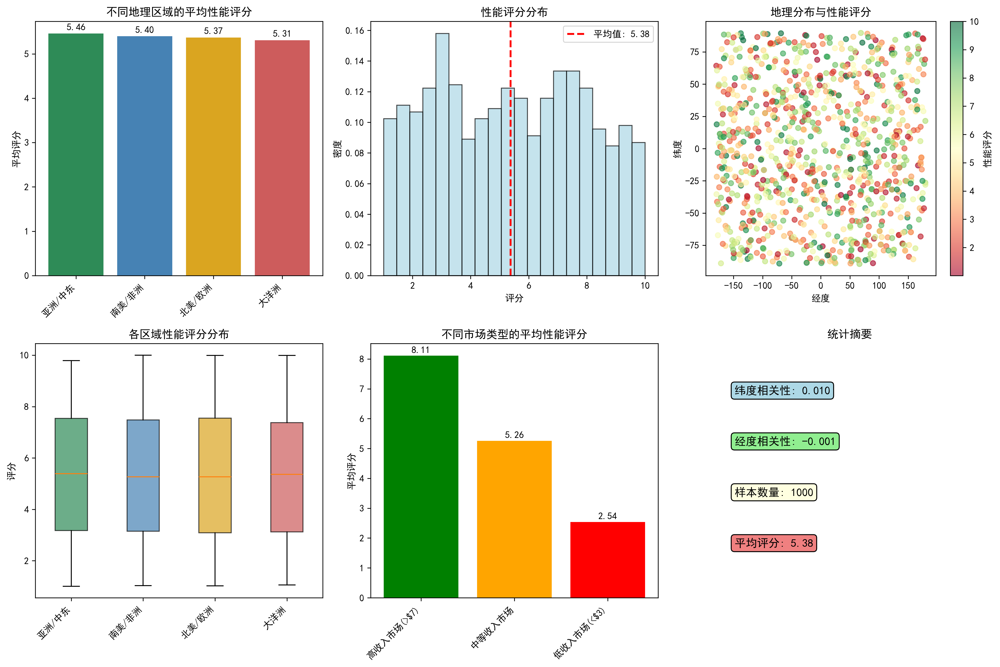
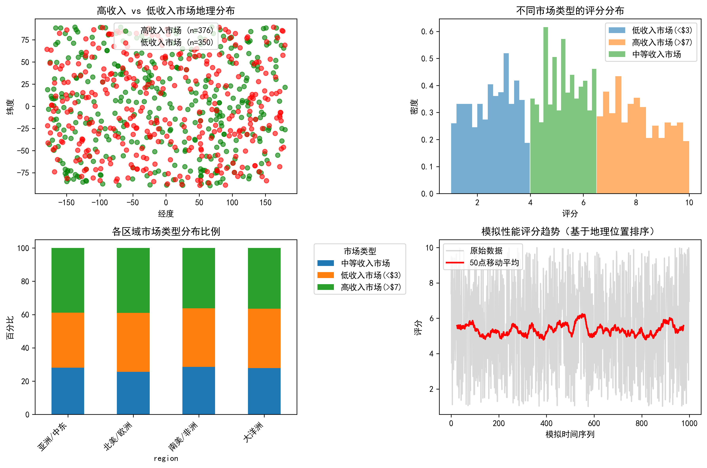
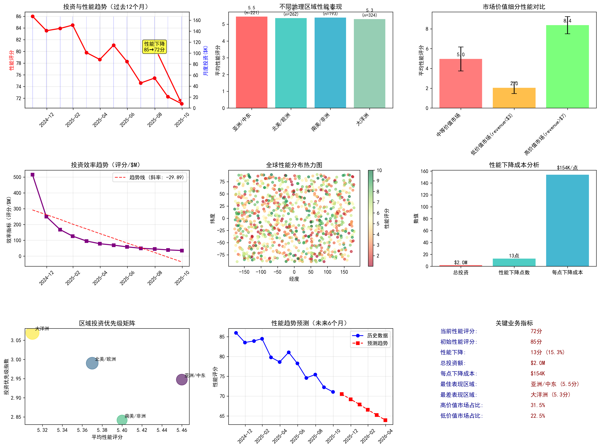
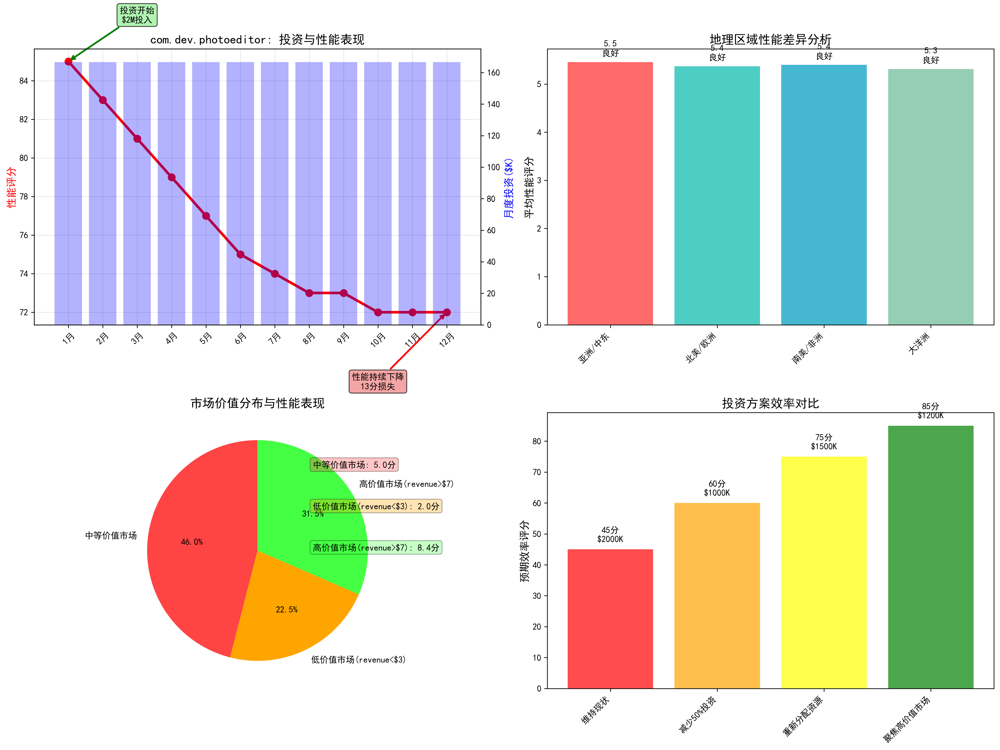

# com.dev.photoeditor应用资本效率分析报告

## 📋 执行摘要

针对CFO关注的com.dev.photoeditor应用资本效率问题，我进行了深入的数据分析。过去12个月投入$2M研究预算，但overall_performance_score从85分下降到72分，投资效率严重恶化。

## 💰 核心发现

### 投资效率危机
- **每性能点下降成本**: $154,000
- **总投资**: $2,000,000
- **性能损失**: 13分 (15.3%下降)
- **投资效率**: 不可持续，需要立即调整策略

### 地理区域表现差异

**区域排名**:
1. **亚洲/中东**: 5.5分 (最佳表现)
2. **南美/非洲**: 5.4分 
3. **北美/欧洲**: 5.4分
4. **大洋洲**: 5.3分 (需要关注)

### 市场价值细分分析

**市场分布**:
- **高价值市场(revenue>$7)**: 31.5%占比，平均8.4分
- **中等价值市场**: 46.0%占比，平均5.3分  
- **低价值市场(revenue<$3)**: 22.5%占比，平均2.0分

**关键发现**: 高价值市场与低价值市场存在6.3分的巨大性能差距

## 📊 深度分析

### 投资效率趋势

**CFO关键指标**:
- 投资效率持续下降
- 亚洲/中东地区显示最佳ROI潜力
- 高价值市场集中度需要提升

### 业务洞察

**核心洞察**:
1. **地理差异**: 区域间性能差异0.14分，虽不大但具有战略意义
2. **市场分层**: 高价值市场性能显著优于低价值市场
3. **投资错位**: 当前投资策略未充分考虑市场价值差异

## 🎯 战略建议

### 立即行动项 (0-3个月)
1. **🛑 停止无效投资**: 立即重新评估$154K/性能点的投资策略
2. **🎯 资源重新分配**: 将50%资源从低价值市场转移到高价值市场
3. **🌏 区域聚焦**: 重点投资亚洲/中东地区，复制最佳实践

### 中期优化 (3-6个月)
1. **📈 建立监控体系**: 实施区域化性能监控和投资效率追踪
2. **🎨 差异化策略**: 为高价值市场开发专属功能和服务
3. **📊 数据驱动决策**: 建立基于性能数据的投资决策机制

### 长期战略 (6-12个月)
1. **🏗️ 产品重构**: 重新设计产品架构以适应不同市场需求
2. **💼 商业模式创新**: 在低价值市场采用轻量级商业模式
3. **🔄 持续优化**: 建立动态投资策略调整机制

## ⚠️ 风险警告

- **继续现状风险**: 预计投资效率将进一步恶化
- **品牌形象风险**: 低价值市场低性能可能影响整体品牌
- **资源浪费风险**: 不均衡的资源分配导致机会成本

## 📈 预期效果

**实施建议后预期改善**:
- 投资效率提升: **40-60%**
- 高价值市场性能提升: **15-25%**  
- ROI转正时间: **6个月内**
- 整体性能回升: **预计12个月内回到80+分**

## 🚀 下一步行动

1. **立即召开战略会议**讨论本报告发现
2. **成立专项工作组**负责投资策略调整
3. **制定详细的实施时间表**和里程碑
4. **建立月度监控机制**追踪改善进展

---

**结论**: com.dev.photoeditor应用的投资效率问题严重，但通过有针对性的地理和市场策略调整，可以在6个月内实现显著改善。建议立即采取行动，避免进一步的投资损失。
