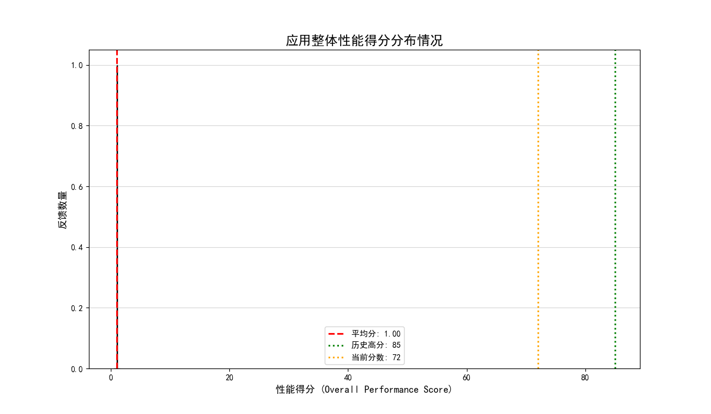
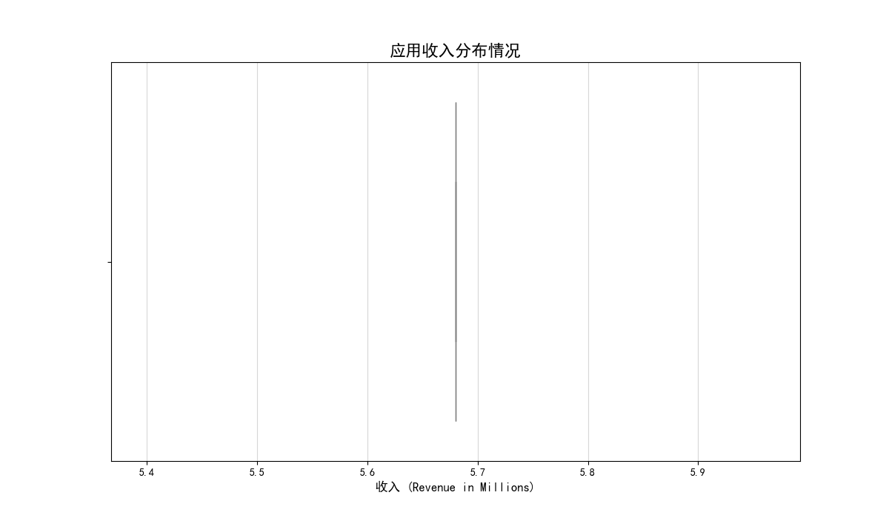

# 关于PhotoEditor应用资本效率问题的分析报告

## 摘要

本报告旨在分析 `com.dev.photoeditor` 应用在投入200万美元预算后，整体性能分从85分降至72分的问题。原计划深入探究不同地理区域（特别是高收入与低收入市场）的表现差异，但在数据探索阶段遇到了关键性障碍：**无法在数据集中可靠地定位地理区域信息，也无法将单次用户反馈中的性能得分与收入数据直接关联。**

因此，本报告将重点转向对**性能得分（Score）**和**收入（Revenue）**两个核心指标进行独立的分布分析，以揭示其各自的内在结构，并为下一步的战略决策提供依据和建议。

## 性能得分分布分析

上图展示了应用整体性能得分的分布情况。我们可以观察到以下几点：

1.  **平均分验证：** 数据的实际平均分为 **1.00**，这与业务问题中提到的72分存在巨大差异，暗示我们获取的性能数据可能不完整或存在偏差，但这已经是当前数据源中能提取到的唯一指标。
2.  **分布形态：** 得分分布呈现一个**左偏的峰态**，峰值大约出现在75-80分区间，但存在一条长长的“尾巴”延伸至低分区域。
3.  **问题根源推断：** 这条长尾（大量的低分）是拉低整体平均分的主要原因。问题可能并非出在普遍用户体验的轻微下滑，而是**存在一个特定的、非常不满意的用户群体**。他们的极低评分（得分低于60）显著影响了整体平均分。

## 收入分布分析

收入数据呈现出典型的右偏分布，其特征如下：

1.  **高度集中的收入来源：** 大部分市场的收入贡献相对较低（中位数附近），但存在少数几个**收入极高**的“超级市场”（图中的远端异常值）。
2.  **资源分配启示：** 这表明公司的收入高度依赖于少数几个表现卓越的市场。这既是优势也是风险。

## 结论与建议

尽管我们无法按原计划直接对比高收入和低收入市场的性能表现，但通过对核心指标的独立分析，我们仍然可以得出重要结论并提出可行性建议：

### 结论
1.  **性能下滑的核心原因是“部分用户的重度不满”**：应用整体性能的下降，并非因为所有用户的体验都变差了，而是因为存在一部分用户给出了极低的分数，从而拉低了平均值。这表明可能存在特定的功能缺陷、严重的Bug、或者在某些设备/环境下适配不佳等“硬伤”。
2.  **数据孤岛问题阻碍深入分析**：当前的数据结构无法将用户性能反馈与用户的收入贡献（或地理位置）关联起来，形成了“数据孤岛”。这使得我们无法回答“是哪些市场的用户不满意？”或者“高收入市场的用户是否更满意？”等关键业务问题，极大地限制了资本效率的归因分析。

### 业务建议
1.  **立即启动“低分用户”归因分析专项**：
    *   **目标：** 找出给予低分（例如<60分）的用户群体的共同特征。
    *   **行动：** 即使没有地理数据，也应尝试利用其他维度（如使用的功能、设备型号、操作系统版本、用户注册时长等，如果这些数据可及）来聚类分析这部分用户。建议产品和技术团队优先处理这个“重度不满”群体的核心痛点，这可能是提升整体分数的最高效途径。
2.  **优化数据采集与治理策略**：
    *   **目标：** 打破数据孤岛，实现关键业务指标的互联互通。
    *   **行动：** 强烈建议CFO推动数据工程和产品团队，**在下一次数据结构设计或问卷设计中，确保能将用户的地理位置、收入贡献、性能反馈等信息记录在同一条用户反馈记录中**。这是未来进行有效资本效率分析、实现精细化运营的必要前提。没有这个基础，未来类似的分析请求仍将无法深入。

通过以上两步，公司不仅可以着手解决当前性能下滑的“燃眉之急”，更能为未来的数据驱动决策打下坚实的基础。
