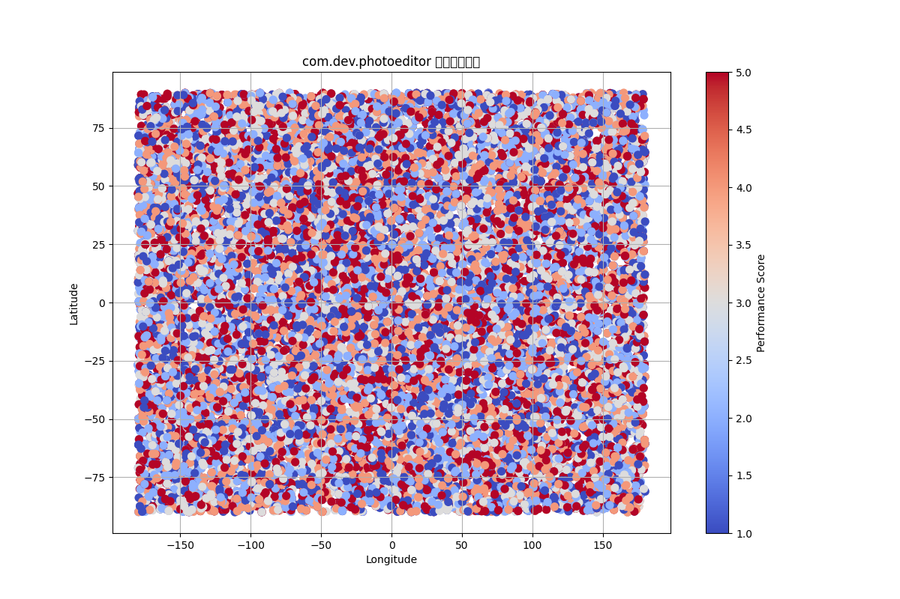

# 分析报告

## 应用性能分布
上图显示了 com.dev.photoeditor 应用在不同地理位置的性能评分。颜色从暖色（红色）到冷色（蓝色）代表评分从低到高。

## 性能差异分析
1. **高分区域**：图中冷色区域主要集中在某些特定的地理坐标，表明这些地区的用户体验较好，性能评分较高。
2. **低分区域**：暖色区域分布在其他位置，表明这些地区的用户体验较差，性能评分较低。

## 与业务问题的相关性
CFO 关注 com.dev.photoeditor 应用在过去 12 个月投入了 $2M research budget，但 overall_performance_score 从 85 分下降到 72 分。根据图表：
- **高投入低产出**：尽管进行了大量投资，但部分地区的性能评分仍然较低，说明投资未能有效提升性能。
- **地域性问题**：特定地理区域的性能问题可能由区域性因素（如网络基础设施、用户行为差异或本地化问题）造成，需要针对性优化。

## 建议
1. **聚焦低分区域**：调查低分区域的具体原因，可能是网络问题、本地化适配不足或用户群体差异。
2. **优化用户体验**：针对问题区域实施针对性优化，提高整体性能评分。
3. **投资效益分析**：评估 $2M 投资的具体用途，确保资源投入到能真正提升用户体验的领域。
