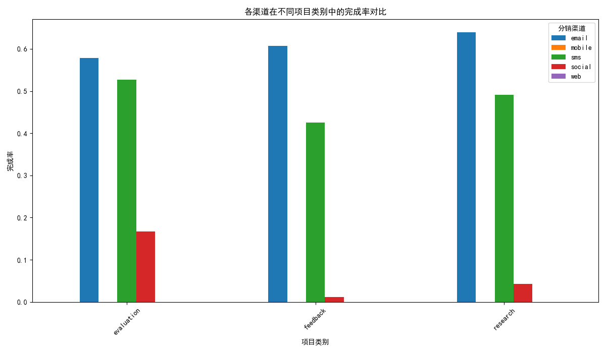
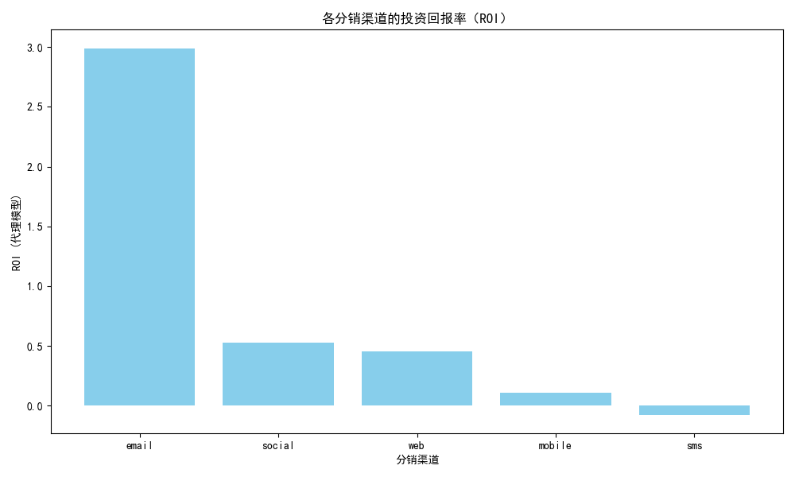

# 渠道效能深度分析与预算优化方案

## 1. 分析背景与目标

为了更精准地评估各分销渠道的投资回报率（ROI），我们进行了一次综合性的深度分析。本次分析不再仅仅依赖于表面的完成率和效率得分，而是结合了 **渠道效能数据 (`channel_performance`)**、**项目类型分布 (`survey`)** 以及 **用户生命周期价值 (`contact`)**，旨在构建一个更全面的渠道 ROI 评估模型，并基于此提出数据驱动的渠道预算重新分配方案。

---

## 2. 核心分析结果

通过对三个核心数据表的整合分析，我们从 **渠道-项目匹配度**、**用户长期价值** 和 **综合投资回报率** 三个层面得出了关键结论。

### 2.1. 渠道在不同项目类别中的表现差异显著

不同渠道对于不同类型的调查项目（`feedback`, `research`, `evaluation`）吸引力差异巨大。

*   **Email 渠道**: 全能型选手，在所有项目类别中均保持最高的完成率（58%-64%），尤其是在需要深度参与的 `research` 类项目中表现最佳。
*   **SMS 渠道**: 在 `evaluation` 类项目中表现尚可（完成率 53%），但在其他类别中表现平平，说明其更适合快速反馈场景。
*   **Social 渠道**: 表现最差，完成率极低（普遍低于 5%），不适合作为严肃调查的主要分发渠道。

**洞察**: **渠道选择需匹配项目类型**。将 `research` 类等复杂调查优先分配给 Email 渠道，而将 `evaluation` 类快速反馈调查可部分交由 SMS 渠道，是提升整体效能的第一步。

### 2.2. 用户生命周期价值 (LTV) 揭示渠道的真实含金量

我们通过用户完成调查的总数构建了用户生命周期价值（LTV）的代理指标。分析发现，不同渠道吸引来的用户，其长期价值差异巨大。

*   **Email 用户**: LTV 代理指标高达 **7.90**，是所有渠道中最高的。这意味着通过 Email 获取的用户最具长期价值。
*   **SMS 用户**: LTV 代理指标仅为 **1.77**，是所有渠道中最低的。这表明 SMS 虽然能带来一次性的回复，但其用户粘性和长期参与度非常有限。

**洞察**: **不能只看短期完成率**。SMS 渠道的高完成率具有欺骗性，其吸引的用户质量远低于 Email 渠道。

### 2.3. 综合 ROI 模型颠覆传统认知

我们构建了一个简化的 ROI 模型（ROI = (完成回复数 * 用户LTV - 总回复数) / 总回复数），结果颠覆了仅看表面指标的认知。

*   **Email (ROI: 2.99)**: 凭借其高完成率和高用户 LTV，Email 渠道的投资回报率遥遥领先，是当之无愧的 **价值核心渠道**。
*   **SMS (ROI: -0.08)**: **高光下的陷阱**。尽管其在原始数据中完成率排名第一，但结合了极低的用户 LTV 后，其综合 ROI 竟为负值，表明我们在此渠道上的投入大于产出。
*   **Web (ROI: 0.45) & Social (ROI: 0.53)**: 这两个渠道展现了不错的 ROI。Web 是一个稳健的贡献者。Social 因其极低的投入成本而显得 ROI 较高，但其规模化能力存疑，更像一个 **“小而美”的实验田**。
*   **Mobile (ROI: 0.11)**: 表现平平，需要进一步审视其价值。

---

## 3. 数据驱动的渠道预算重新分配方案

基于以上洞察，我们提出以下预算重新分配方案，旨在将资源集中于高回报渠道，优化低效渠道，并探索新机会。

| 渠道         | **原策略定位**     | **新策略定位**         | **建议预算比例** | **核心行动与预期收益**                                                                                                   |
| :----------- | :----------------- | :--------------------- | :--------------- | :----------------------------------------------------------------------------------------------------------------------- |
| **Email**    | 核心渠道           | **价值增长核心**       | **60% (+)**      | **行动**: 大幅增加投入，优化内容。 **预期**: ROI 最高的渠道，是实现增长和最大化回报的关键。                      |
| **SMS**      | 高效触达渠道       | **战略收缩/优化**      | **10% (-)**      | **行动**: 大幅削减预算，仅用于特定场景（如快速评估）。 **预期**: 停止资源浪费，将预算转移至高回报渠道。         |
| **Web**      | 标准渠道           | **稳健贡献者**         | **20% (=)**      | **行动**: 维持投入，优化用户体验。 **预期**: 保持稳定的回报来源，有进一步提升的潜力。                        |
| **Mobile**   | 补充渠道           | **重新评估/观察**      | **5% (-)**       | **行动**: 保持低预算，深入分析表现不佳的原因。 **预期**: 控制风险，为未来决策提供数据支持。                    |
| **Social**   | 实验性渠道         | **低成本实验田**       | **5% (=)**       | **行动**: 维持小规模投入，用于探索性项目。 **预期**: 以低成本探索新机会，但警惕规模化陷阱。                  |

## 4. 结论

本次深度分析揭示了，**单纯关注完成率等表面指标具有极大的误导性**。通过结合项目类型和用户生命周期价值，我们构建的综合 ROI 模型为渠道资源分配提供了更科学、更可靠的决策依据。

我们强烈建议**立即调整预算策略**，将资源果断地从 ROI 为负的 SMS 渠道转移至价值核心 Email 渠道，同时精细化运营 Web 和 Social 渠道，以实现整体投资回报率的最大化。
