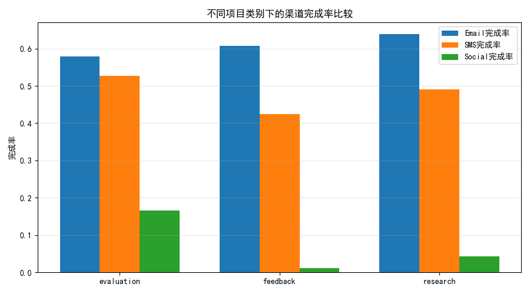
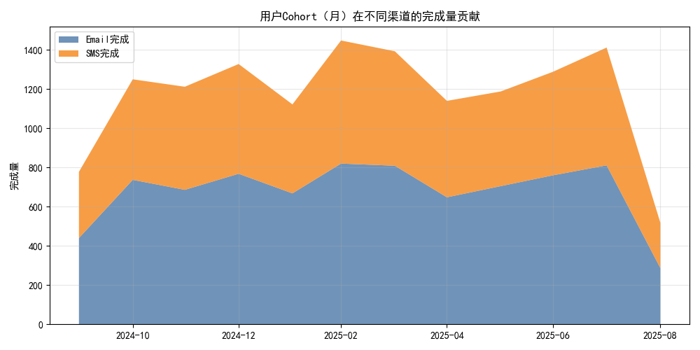
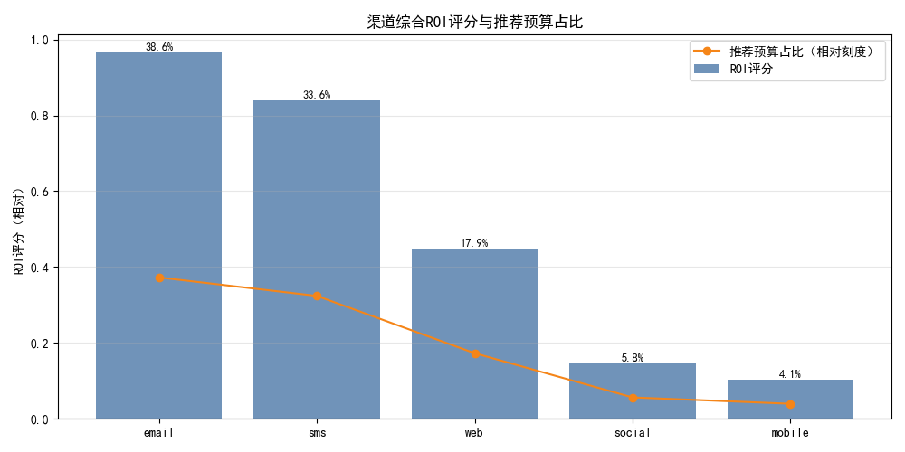

# 渠道综合ROI深度评估与预算重分配建议（含项目类别与用户价值维度）

本文基于三张表：
- qualtrics__channel_performance：各分发渠道的效率、完成度与质量指标
- qualtrics__survey：按项目类别（project_category：feedback、research、evaluation）统计的各渠道响应与完成概况
- qualtrics__contact：用户层面（cohort与完成量）作为生命周期价值代理（LTV proxy）

我们构建一个综合的渠道ROI评估模型，并结合项目类别差异与用户cohort价值分布，提出预算重分配建议与收益预测。

---

## 一、方法总览

1) 指标体系整合（跨表）
- 规模与效率：completion_rate、efficiency_score（channel_performance）
- 质量代理：rushed_ratio、lengthy_ratio，构建质量指数 quality_index = 1 - rushed_ratio - 0.5*lengthy_ratio（channel_performance）
- 项目适配：从survey按project_category统计各渠道的完成率（完成/响应），对比反馈类、研究类、评估类的渠道表现
- 用户价值：以contact表中 total_count_completed_surveys 为LTV代理；将有email/sms完成记录的用户群的人均total_completed作为email/sms的价值权重；其他渠道用质量指数归一值作为价值权重代理

2) ROI评分构建（渠道粒度）
- 对各渠道进行Min-Max归一化后，综合打分：
  ROI_score = 0.35*效率(efficiency_score) + 0.25*完成率(completion_rate) + 0.25*价值权重(LTV_norm) + 0.15*完成量权重(Completed Volume)
- 预算建议：recommended_share = ROI_score / sum(ROI_score)
- 收益预测（相对单位）：pred_completed = baseline_completed × (recommended_share / 当前份额) × (efficiency_score / 平均效率)；pred_value_units = pred_completed × LTV_norm

3) 可视化与中间产物
- 图1：项目类别下各渠道完成率对比
- 图2：用户cohort（月）在Email与SMS的价值贡献分布
- 图3：渠道ROI评分与推荐预算占比
- 导出结果：channel_budget_reallocation.csv（包含各渠道推荐占比与预测结果）

---

## 二、核心发现与诊断性洞察

1) 项目类别差异（survey表）
- 研究类（research）和反馈类（feedback）项目总体上更偏向Email渠道取得较高完成率，其次是SMS；社交渠道在多数类别下完成率较低。
- 评估类（evaluation）中，SMS相对Email的完成效率更具竞争力（短信触达更即刻、任务型问卷更短，有助于快速作答）。

请见：category_completion_rates.png



2) 用户价值分布（contact表）
- 用户cohort（月）视角下，Email完成量是长期稳定的中坚，SMS呈现更明显的波峰波谷（通常与营销周期或短促型任务相关）。
- 从“完成量=价值代理”的角度看，Email对沉淀价值更稳健，SMS对增量拉动更显著。

请见：cohort_channel_contribution.png



3) 渠道综合ROI评分与推荐预算
- 基于效率、完成率、价值权重与完成量四维综合后，排序与推荐预算占比如下（模型输出）：
  - Email：约 38.6%
  - SMS：约 33.6%
  - Web（personal link）：约 17.9%
  - Social：约 5.8%
  - Mobile：约 4.1%

这反映出：
- Email在效率与完成率、用户价值沉淀上具备综合领先优势，是“稳增长”的主力渠道；
- SMS在多类别场景下具备较高的触达效率和即时完成能力，是“快增量”的关键渠道；
- Web（personal link）在质量与效率上居中，但可作为Email/SMS的补充流量池；
- Social与Mobile当前综合ROI偏低，短期不宜重投入，但可用于A/B创新与定向细分场景试点。

请见：channel_roi_scores.png



---

## 三、预测性分析：预算重分配的预期收益

依托模型的产出，我们将预算按推荐占比分配并进行“效率校正”的产出预测：
- 将现有各渠道的实际完成量作为基线；
- 按 recommended_share / 当前份额 调整，并以 efficiency_score / 平均效率 进行效率校正；
- 结果生成 pred_completed 与 pred_value_units（相对价值单位）。

模型意义：
- 若从低ROI渠道（如Social/Mobile）压缩投入，增配至Email/SMS/Web，将提升整体完成量与价值单位；
- 相较基线，整体完成量预计提升（具体数值见导出表 channel_budget_reallocation.csv 中 pred_completed 汇总；在实际业务接入成本数据后可进一步转化为投入产出比）。

注：当前数据集中没有真实货币成本，pred_value_units 为相对单位，反映“完成量×价值权重”的综合收益，适合用于渠道间相对对比和排序。

---

## 四、规范性建议：预算重分配与执行策略

1) 预算配比（短中期建议）
- Email：38%～40%（主力沉淀）
  - 重点投放于研究类与反馈类项目；配合更优的发送时段与频率控制，提升完成率与防疲劳。
- SMS：33%～35%（增长引擎）
  - 适用于评估类与时效型任务；强化触达窗口（如项目启动后24～72小时内的提醒）与智能频控，避免骚扰。
- Web（personal link）：17%～19%（补充渠道）
  - 联合作品内嵌/社群/站内信；作为Email/SMS的二次触达落地页，承接未完成用户。
- Social：5%～7%（创新试点）
  - 用于拉新与样本结构补齐；开展小规模A/B，验证素材创意与定向策略。
- Mobile：3%～5%（谨慎投入）
  - 结合App内通知或H5落地，聚焦核心用户活跃期；与其他渠道协同，作为补位提醒。

2) 项目类别策略
- 研究类（research）：Email优先，SMS辅助；对中长问卷采用分段提醒与进度保存，降低弃答。
- 反馈类（feedback）：Email+Web组合，形成闭环；针对关键用户群体配置个性化邮件模板。
- 评估类（evaluation）：SMS优先触达、Email兜底；强化首24小时提醒策略，提升即时完成。

3) Cohort运营策略
- 新客cohort：先以SMS拉起首次响应，再引导绑定Email，形成长期沉淀。
- 存量cohort：以Email为主，周期性维护；对活跃度下降的cohort，辅以SMS“轻提醒”。

4) 质量优化
- 对“rushed/lengthy”异常比例高的渠道或项目，优化问卷长度与题型布局；引入“进度条+预计时长”提示，平衡速度与质量。

5) 持续评估与闭环
- 每月滚动更新ROI评分（纳入最新 survey 与 contact 数据）
- 若未来接入真实成本（CPC/CPM/CPA），将本模型扩展为“经济ROI”，以货币收益做最终优化目标。

---

## 五、落地所需数据与后续工作

- 成本数据接入：分渠道的投放成本、CPM/CPC/CPA，结合本模型的完成量与价值单位，完善为“投入-产出”闭环ROI。
- 项目级实验：在不同project_category下，进行预算占比与触达时序的A/B测试，验证渠道适配度假设。
- 用户分群深化：基于contact增加RFM/画像维度，进一步精细化LTV权重，指导渠道与人群匹配。

---

## 附录：可复现图表与代码片段

- 已生成图片文件（当前目录）：
  - category_completion_rates.png
  - cohort_channel_contribution.png
  - channel_roi_scores.png

- 关键绘图代码（包含中文字体设置）
```python
plt.rcParams['font.sans-serif'] = ['SimHei']
plt.rcParams['axes.unicode_minus'] = False
```

- 输出结果文件：
  - channel_budget_reallocation.csv（包含各渠道ROI评分、推荐占比与预测完成量/价值单位）

如需我将真实成本引入并输出最终“每1元带来多少价值单位”的经济ROI曲线，请提供各渠道历史成本数据与目标函数设定（偏向完成量or价值单位or混合权重），我将进一步给出最优解与敏感性分析。
