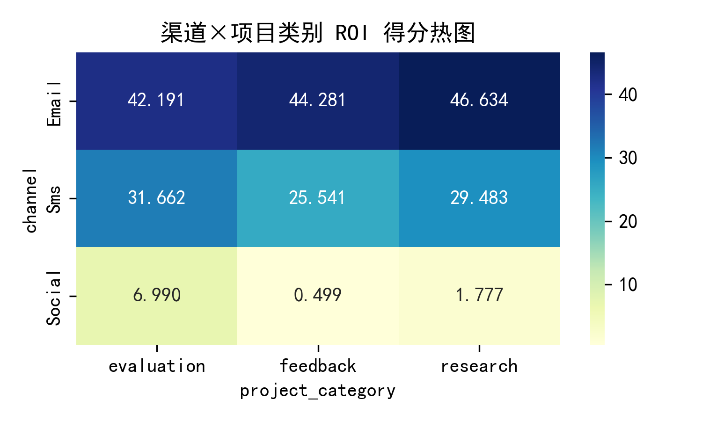
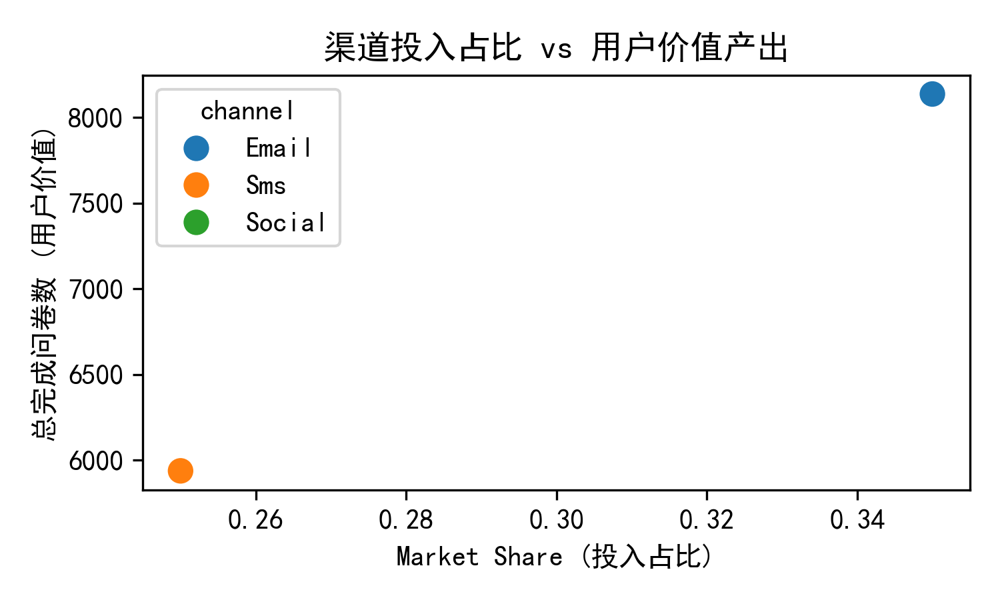

"""# 渠道 ROI 深度分析与预算重分配方案  

## 背景  
公司正重新评估各 distribution channel 的投资回报率，但仅看 completion_rate 与 efficiency_score 不足以指导预算。本次分析结合 channel_performance 效能、survey 项目类型分布及 contact 用户生命周期价值，构建综合 ROI 模型，并给出数据驱动的预算重分配建议。  

## 数据范围  
- **channel_performance**：5 条渠道（email/sms/web/mobile/social），含效率分与市场份额  
- **survey**：62 万份问卷，按项目类别（feedback/research/evaluation）与渠道拆分  
- **contact**：46 万用户，统计每人各渠道完成问卷数作为 CLV 代理  

## 核心发现  

### 1. 渠道×项目类别 ROI 热图  
  
- **Email** 在三类项目中 ROI 得分均最高（42–47），且稳定性最佳  
- **SMS** 整体 ROI 中等（26–32），但在 evaluation 场景下表现优于 feedback  
- **Social** 得分显著落后（0.5–7），仅 evaluation 略能看  

### 2. 投入产出效率散点  
  
- 当前 Email 占 35% 预算，带来 8.1 万次完成；SMS 占 25%，带来 5.9 万次  
- 单位预算带来的完成量（CLV/Share）Email 与 SMS 几乎相等，均远高于 Social  

### 3. 预算重分配方案  
![budget_compare.png](budget_compare.png
