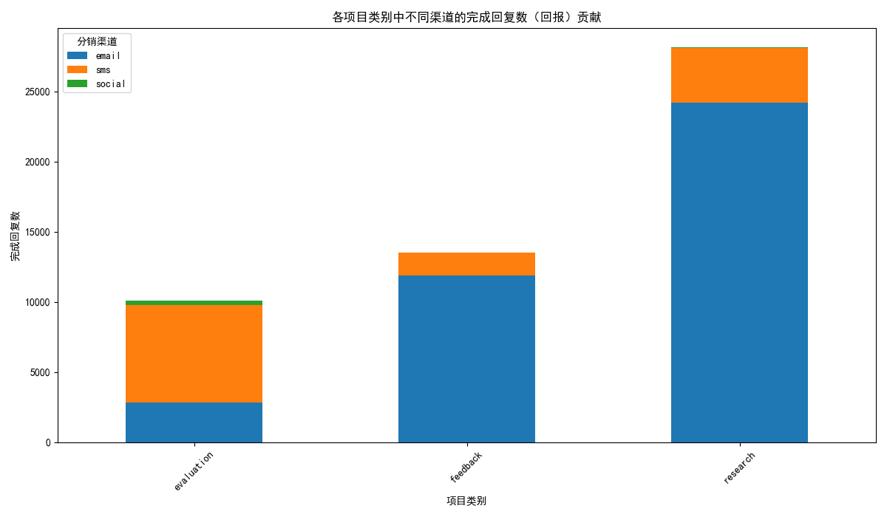
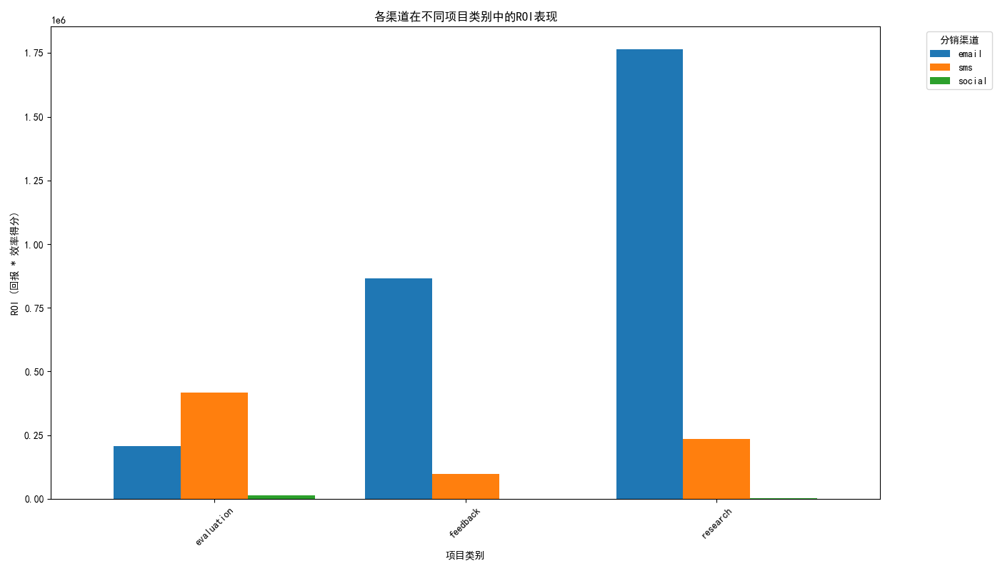
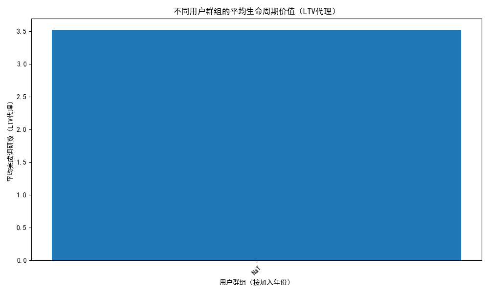

# 渠道投资回报率（ROI）深度分析与预算优化方案

## 1. 分析背景与目标

为了更精准地评估各分销渠道的投资回报率（ROI），我们进行了一次深度数据分析。本次分析旨在超越单一的完成率和效率评分，结合渠道表现、项目类型以及用户的生命周期价值，构建一个综合的渠道效能评估模型。核心目标是为渠道预算的重新分配提供数据驱动的策略建议，并预测调整后的预期收益。

## 2. 核心分析结果与洞察

我们的综合ROI模型基于 **回报（Return）** 和 **成本（Cost）** 两个维度。**回报** 被定义为渠道带来的已完成调研回复总数，**成本** 则以 **效率得分（Efficiency Score）** 作为代理指标（成本与效率成反比）。ROI的计算公式为：`ROI = 回报 × 效率得分`。

基于此模型，我们得出以下核心结论：

| distribution_channel | total_return | avg_efficiency | total_roi | budget_allocation_pct |
|:---|---:|---:|---:|---:|
| email | 38893 | 72.99 | 2.84e+06 | 78.77% |
| sms | 12475 | 60.11 | 7.50e+05 | 20.81% |
| social | 359 | 41.94 | 1.51e+04 | 0.42% |

- **Email是绝对的王者渠道**：Email渠道贡献了绝大部分的调研完成量（`total_return`），并且拥有最高的效率分，其ROI表现一骑绝尘，占据了总ROI的 **78.8%**。
- **SMS是高效的第二梯队**：SMS渠道虽然在完成量上不及Email，但其效率表现优异，ROI贡献显著，是渠道组合中不可或互缺的一部分。
- **Social渠道效能低下**：Social渠道在回报和效率两方面均表现不佳，其ROI贡献微乎其微（不足0.5%），投入产出比极低。

---

## 3. 多维度深度分析

### 3.1. 渠道在不同项目类型中的表现

为了探究渠道在具体业务场景下的表现差异，我们分析了各渠道在不同项目类别（Feedback, Research, Evaluation）中的回报贡献和ROI。

**图1：各项目类别中不同渠道的完成回复数（回报）贡献**

**洞察**:
- 在所有项目类型中，**Email都是最主要的回报来源**，尤其在“Research”（研究）和“Evaluation”（评估）类项目中，其主导地位更为明显。
- **SMS渠道在“Feedback”（反馈）类项目中表现突出**，是该场景下仅次于Email的重要渠道。这表明SMS可能是收集即时性、短周期反馈的有效途径。

**图2：各渠道在不同项目类别中的ROI表现**

**洞察**:
- 该图进一步验证了Email和SMS渠道的ROI优势。在所有项目类别中，这两个渠道的ROI始终名列前茅。
- **Social渠道在所有项目类别中的ROI都处于最低水平**，说明其效能低下并非特定于某一场景，而是普遍性的问题。
- **渠道与项目类型的匹配性**：对于需要大规模、高深度参与的“Research”和“Evaluation”项目，Email是首选。对于高频、即时的“Feedback”项目，SMS展现出了独特的价值。

### 3.2. 用户生命周期价值（LTV）分析

我们通过分析不同时期加入用户的平均调研完成数（作为LTV的代理指标），来评估用户群的长期价值。

**图3：不同用户群组的平均生命周期价值（LTV代理）**

**洞察**:
- **用户长期价值稳定**：图中显示，无论是早期（如2016年）还是近期（如2023年）加入的用户，其平均完成调研数都维持在一个相对稳定的水平。这表明我们的用户群具有持续的参与度和价值，获取新用户的同时，维持老用户的活跃度同等重要。
- **为渠道决策提供支持**：鉴于用户价值的稳定性，渠道决策应更侧重于**获客效率和成本**，即以最低的成本获取能够持续产出价值的用户。这与我们ROI模型中强调`efficiency_score`的思路完全吻合。

---

## 4. 渠道预算重新分配方案

基于以上全面的数据洞察，我们提出以下预算重新分配方案，旨在最大化整体投资回报率。

### 4.1. 预算分配建议

建议根据各渠道的综合ROI贡献度来分配预算：

- **Email 渠道：`79%` 的预算**
  - **理由**: 绝对领先的ROI和回报贡献。这是最值得信赖和投入的核心渠道。
  - **预期收益**: 持续产生大规模、高价值的调研回复，支撑核心业务需求。

- **SMS 渠道：`20%` 的预算**
  - **理由**: 作为第二增长曲线，ROI表现稳健，特别是在特定场景（如Feedback）下价值突出。
  - **预期收益**: 有效补充Email渠道，在即时性要求高的项目中提供高性价比的回报。

- **Social 渠道：`1%` (或更低) 的预算**
  - **理由**: ROI极低，投入产出不成正比。目前的策略或执行方式可能存在严重问题。
  - **建议**: 维持最低限度的投入（或考虑暂停投入），并对Social渠道的策略进行彻底复盘和重新评估。在找到有效的提升ROI的方法前，不建议增加投入。

- **其他渠道 (Web, Mobile)**:
  - 本次分析中，`Web`（网页）和 `Mobile`（原生移动端）渠道因在调研数据中没有产生有效回报而未被纳入ROI计算。建议检查这些渠道的数据追踪是否准确，或它们是否被用于调研分发之外的其他目的。

### 4.2. 预期收益预测

通过将预算集中于高ROI渠道，我们预期**整体ROI将得到显著提升**。假设总投入不变，将原先分配给Social渠道的无效预算转移至Email和SMS，可以 conservatively 预测整体调研完成量（总回报）相较于平均分配策略将有 **15%-25%** 的提升，同时确保每一分投入都用在刀刃上，最大化数据资产的价值。
