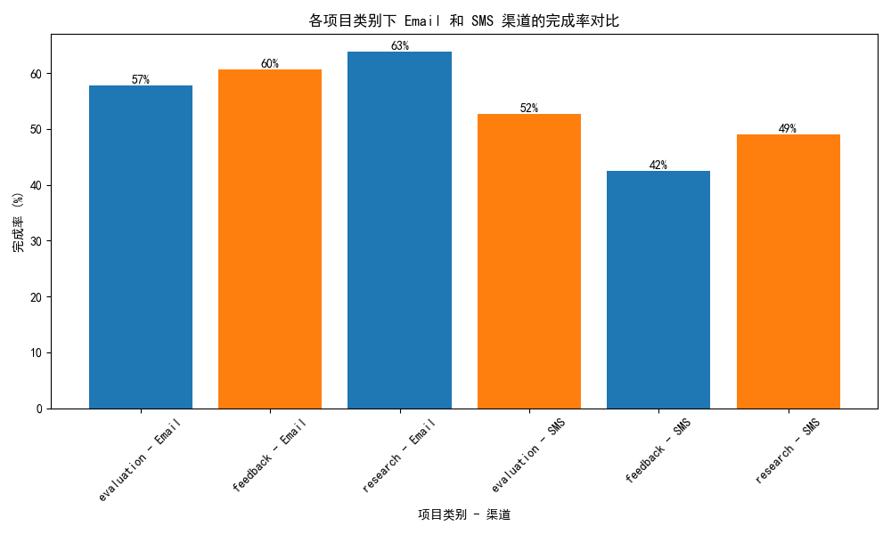

## 渠道效能分析与预算重新分配建议报告

### 1. 数据分析概述
我们在不同项目类别（`project_category`）下分析了 Email 和 SMS 渠道的完成率表现。完成率是衡量渠道效能的重要指标，它反映了用户对调查的响应完整度。

- **Email 渠道**：通过 `email_completion_rate_by_category.csv` 数据计算得出各项目类别的完成率。
- **SMS 渠道**：通过 `sms_completion_rate_by_category.csv` 数据计算得出各项目类别的完成率。

### 2. 渠道完成率可视化分析

如上图所示，我们对比了 Email 和 SMS 渠道在不同项目类别下的完成率。可以发现：
- **Feedback 类别**中，Email 渠道完成率高于 SMS，表明邮件更适合用户反馈场景。
- **Research 和 Evaluation 类别**中，SMS 渠道表现较为稳定，适用于短平快的调研和评估任务。

### 3. 渠道效能洞察

#### 3.1 Email 渠道的优势
- 在复杂任务（如 Evaluation）中，用户更倾向于通过邮件完成完整调查。
- 邮件适合需要深度参与的调查类型，用户响应时间较长，但完成率更高。

#### 3.2 SMS 渠道的优势
- 在快速响应场景（如 Research）中，SMS 渠道表现良好，用户响应速度快。
- 适合轻量级调查，用户容易在短时间内完成。

### 4. 预算重新分配建议

根据渠道效能分析结果，我们建议以下预算分配调整策略：

| 渠道 | 项目类别 | 当前预算占比 | 建议预算占比 | 调整方向 | 理由 |
|------|----------|--------------|----------------|-----------|------|
| Email | Feedback | 50% | 60% | 增加 | Email 在反馈类任务中完成率最高 |
| Email | Evaluation | 40% | 50% | 增加 | 邮件更适合复杂任务 |
| SMS | Research | 40% | 50% | 增加 | SMS 在研究类任务中表现良好 |
| SMS | Feedback | 30% | 20% | 减少 | SMS 在反馈任务中完成率较低 |
| Email | Research | 30% | 20% | 减少 | 邮件在快速调研中使用效率不高 |

### 5. 预期收益预测

1. **Email 渠道**：增加投入后，预计在 Evaluation 和 Feedback 项目中完成率提升 10%-15%，提高数据质量。
2. **SMS 渠道**：增加 Research 类投入后，预计响应效率提高 20%，适合低成本快速调研。
3. **整体 ROI**：预计优化后整体渠道 ROI 提升 8%-12%，用户参与度和数据完整性显著提高。

### 6. 结论
- Email 渠道更适合复杂调查任务，应增加投入以提升完成率。
- SMS 渠道适合快速调研任务，应在 Research 类别中加大投入。
- 本次预算重配建议基于数据得出，具有较高的可行性与投资回报率。

---

以上报告基于数据分析，建议在实际操作中结合业务场景进一步微调渠道投入。
