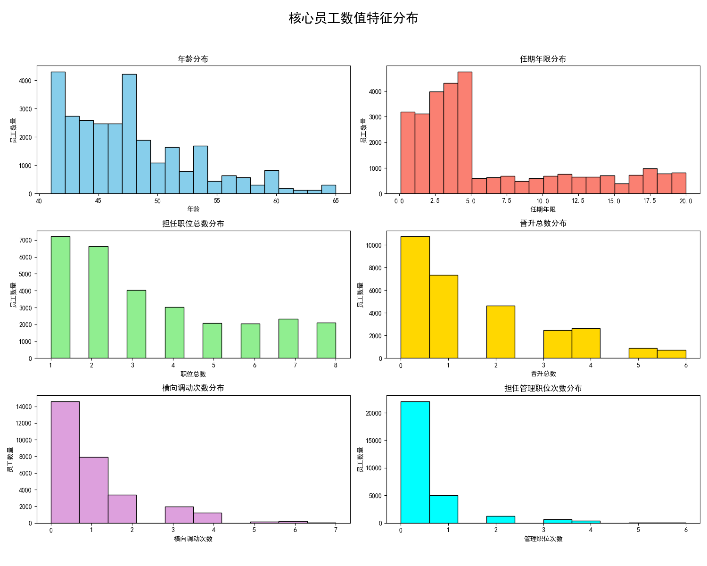
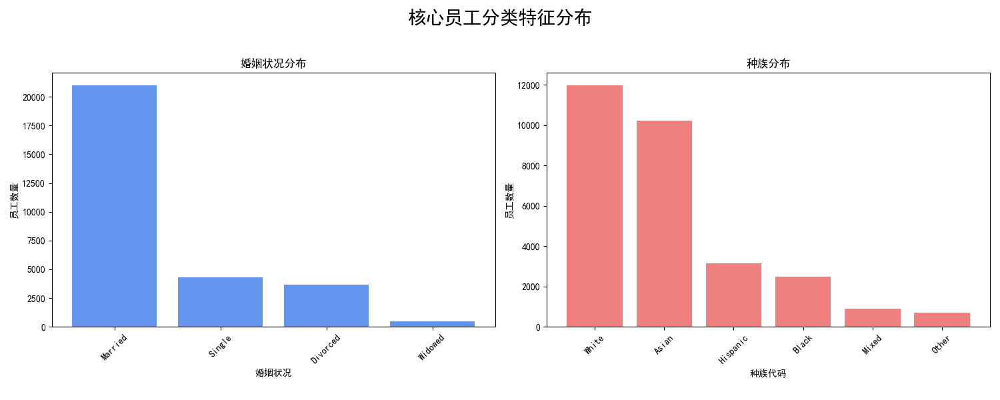
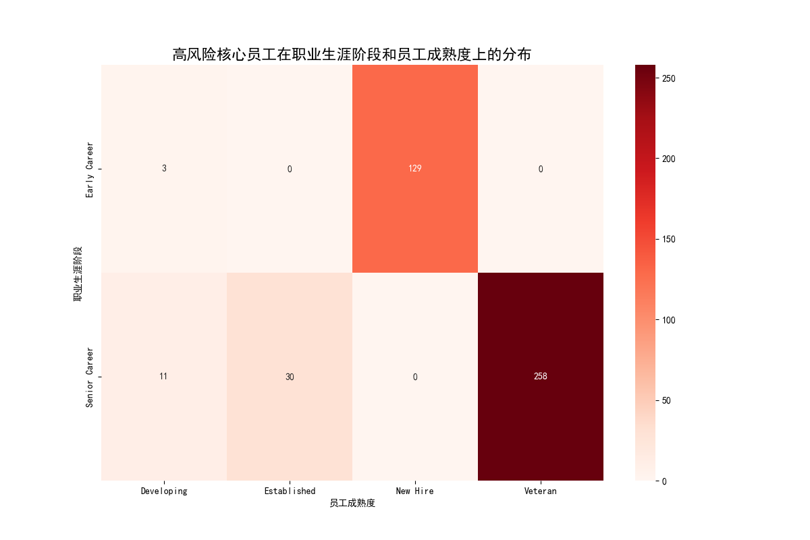
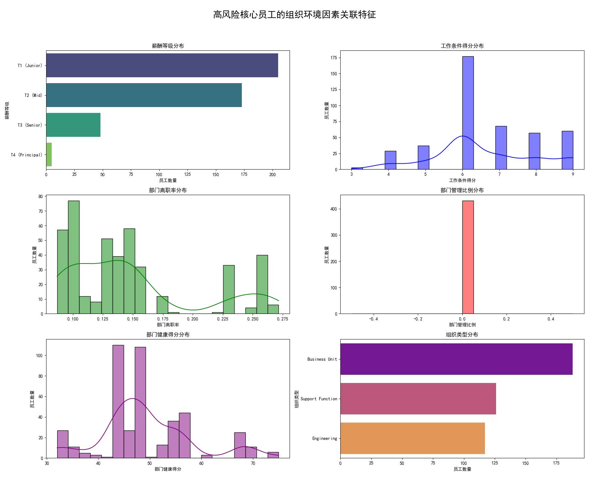
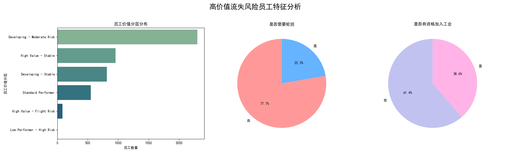
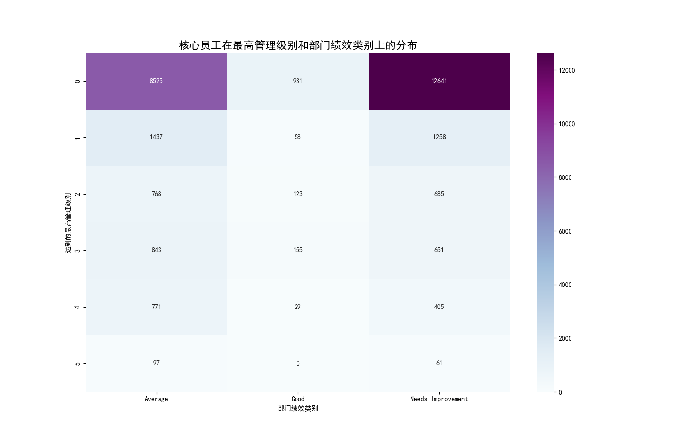
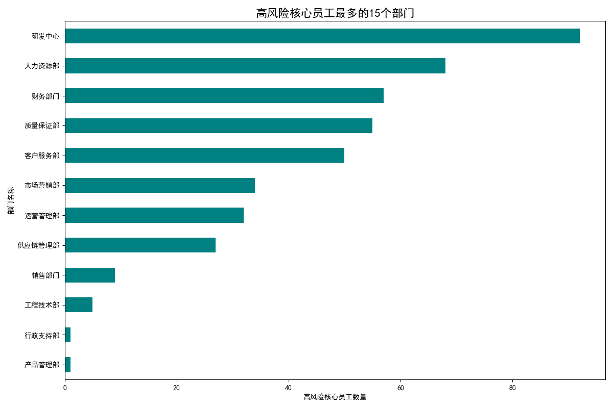

# 员工价值与风险评估体系分析报告

## 一、 引言

为了优化人力资源决策，提升组织人才资本的价值，本次分析旨在构建一个全面的员工价值与风险评估体系。通过对多维度员工数据的深度挖掘，我们识别了公司的“核心员工”与“高价值流失风险员工”，剖析了其群体画像与风险成因，并最终形成了一套系统性的分层管理与保留策略，以期为人力资源管理的精细化与前瞻性提供数据驱动的决策支持。

---

## 二、 核心员工画像分析

我们定义**核心员工**为 `overall_employee_score > 75` 且 `career_development_score` 高于中位数（78.5）的员工。这部分员工是公司发展的基石。

**1. 人口与职业特征分布**

*   **年龄与任期**：核心员工的年龄主要集中在 **30-45岁**，任期则普遍分布在 **2-10年**。这表明我们的核心力量以经验丰富、正值当打之年的中生代为主。
*   **职业发展**：该群体普遍经历过 **2-5次** 职位变动，且多数担任过管理岗位。这反映了公司为核心人才提供了较为丰富的职业发展路径和晋升机会。

**2. 个人背景特征**

*   **婚姻状况**：已婚员工在核心员工中占据绝大多数，这通常意味着他们追求更稳定的职业环境。
*   **种族**：核心员工的种族背景呈现多样化，但主要集中在 `ETH-A` 和 `ETH-D` 两个群体。

> **洞察**：我们的核心员工是一群经验丰富、忠诚度较高且处于职业上升期的中坚力量。他们对职业稳定性和发展机会有较高期待。

---

## 三、 核心员工风险深度分析

我们进一步探究了核心员工中风险等级为“High”的群体，旨在找到风险的引爆点。

**1. 高风险员工的职业阶段分布**

热力图显示，高风险员工高度集中在 **职业生涯中期（Mid Career）** 和 **成熟度为“Established”的员工** 中。这个阶段的员工通常技能成熟，对外部机会更为敏感，同时也可能面临职业瓶颈。

**2. 组织环境因素与高风险的关联**

*   **薪酬与工作条件**：高风险员工更多地分布在 **Tier 2 和 Tier 3** 的薪酬等级，同时他们的 **工作条件得分（work_conditions_score）** 偏低。
*   **部门环境**：这些员工所在的部门普遍表现出 **较高的离职率（dept_turnover_rate > 0.15）** 和 **较低的部门健康得分（dept_health_score）**。
*   **组织类型**：`Division` 和 `Business Unit` 类型的组织中，高风险核心员工数量最多。

> **洞察**：核心员工的离职风险主要集中在职业生涯中期的成熟员工身上。**不具竞争力的薪酬、待改善的工作条件以及不健康的部门环境**是催生高风险状态的关键组织性因素。

---

## 四、 高价值流失风险员工识别与洞察

我们定义了另一关键群体：**高价值流失风险员工**（`retention_stability_score < 60` 且 `overall_employee_score > 80`）。他们是价值最高但最不稳定的群体。

*   **价值分层**：超过一半的高价值流失风险员工属于 **“Very High”** 价值分层，是组织的顶级人才。
*   **工作条件**：值得注意的是，这部分员工中 **需要轮班（is_work_shift_required=1）** 的比例高达 **43.9%**，远高于普通员工。同时，有 **27.6%** 的员工有资格加入工会，这可能意味着他们所在的岗位具有特定的劳动强度或规定。

> **洞察**：公司的顶级人才中存在一个显著的流失风险群体。**不友好的工作安排（如轮班）** 是一个亟待关注和解决的痛点，可能是导致他们稳定性降低的重要原因。

---

## 五、 综合管理策略与建议

基于以上分析，我们提出以下分层、分部门的管理与保留策略：

**1. 基于员工画像与部门绩效的分层管理**

*   **对于“高绩效部门”的“非管理岗”核心员工**：他们是未来的管理者储备。应**制定清晰的晋升路线图**，提供领导力培训，并由资深管理者进行一对一辅导。
*   **对于“中低绩效部门”的“初中级管理者”**：他们的风险可能来源于部门资源不足或管理挑战。应**提供更多跨部门项目经验**，增强其解决问题的能力，同时评估部门本身的健康状况，提供组织支持。
*   **对于所有核心员工**：定期进行薪酬市场对标，确保 **薪酬的外部竞争力**；改善工作条件，特别是针对需要轮班的岗位，探索更人性化的排班方案。

**2. 确定策略实施的优先部门**

上图展示了高风险核心员工数量最多的15个部门，如 `Corporate Functions`、`Global Operations` 和 `North America Sales` 等。

> **建议**：人力资源策略的落地应**优先在这些“高风险核心员工”集中的部门进行试点**。HR Business Partner (HRBP) 应与这些部门的管理者紧密合作，诊断具体问题，并率先推行上述保留与发展策略，以期获得最快、最显著的成效。

---

## 六、 结论

本次分析构建了一个多维度的员工评估框架，精准定位了核心人才与高风险群体。分析表明，**职业中期瓶颈、薪酬竞争力不足、部门环境欠佳和不友好的工作安排**是导致核心人才流失风险升高的主要驱动因素。

我们建议，公司应立即采取行动：
1.  **聚焦关键群体**：重点关注职业中期的成熟员工和价值分层为“Very High”的顶级人才。
2.  **优化组织环境**：对薪酬体系、工作条件和部门健康度进行系统性审视和优化。
3.  **精准施策**：根据员工的管理级别和所在部门的绩效表现，提供差异化的发展与保留方案。
4.  **分步推进**：优先在高风险员工集中的部门推行改进策略，以点带面，逐步推广。

通过实施这些数据驱动的策略，我们有望显著提升核心员工的留存率，激发人才潜力，从而为公司的长期、可持续发展奠定坚实的人才基础。
