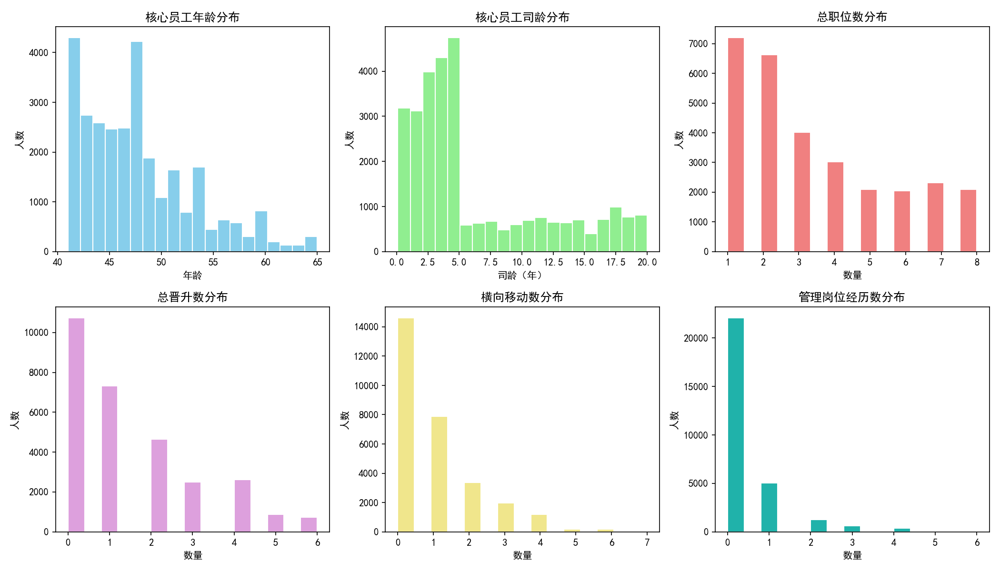
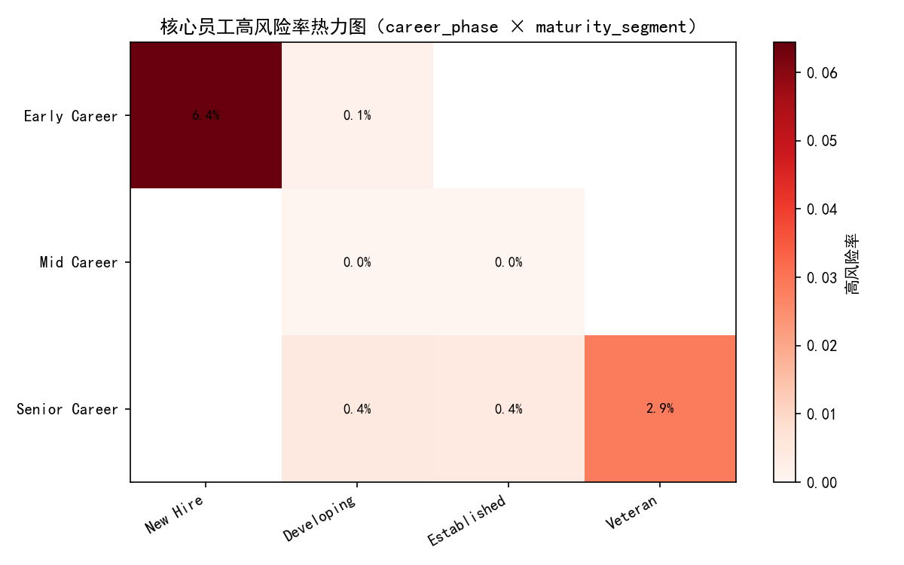
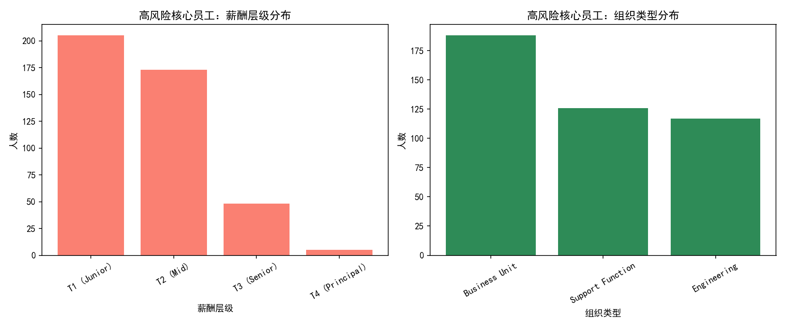
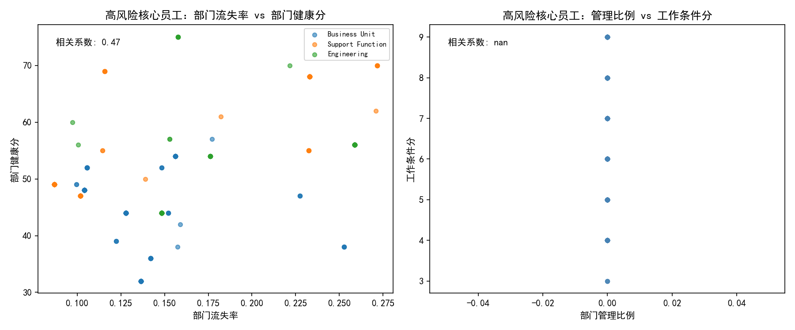
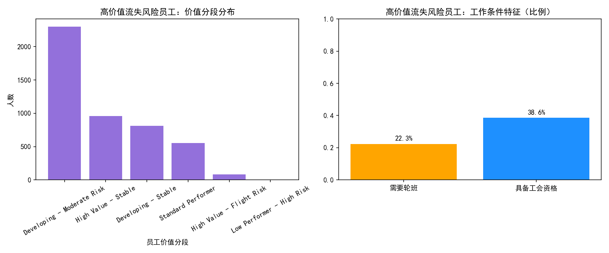

# 员工价值与风险评估体系（核心员工与高价值流失风险员工）

> 说明：以下分析基于数据库 workday__employee_overview 表。核心员工定义为 overall_employee_score>75 且 career_development_score 超过全体中位数（78.50）。高价值流失风险员工定义为 retention_stability_score<60 且 overall_employee_score>80。所有分析均在原始数据基础上完成，不进行数据清洗。

## Python绘图环境设置说明

为满足中文显示与负号显示，绘图代码中包含如下设置（已用于生成报告中的所有图片）：

```python
plt.rcParams['font.sans-serif'] = ['SimHei']
plt.rcParams['axes.unicode_minus'] = False
```

---

## 一、数据规模与总体概览

- 核心员工规模：29,438 人
- 核心员工高风险人数：431 人，高风险率：1.46%
- 高价值流失风险员工（HVLE）规模：4,706 人
- 核心员工中位数阈值：career_development_score 中位数≈78.50

整体看，核心员工总体风险率不高，但在特定生涯阶段与成熟度组合中存在明显“风险波峰”。

---

## 二、核心员工画像（年龄、司龄与职业轨迹特征）

下图展示了核心员工在年龄、司龄、职位数、晋升数、横向移动与管理岗位经历的分布概貌，用于识别人才结构与发展节奏。



洞察要点：
- 核心员工年龄与司龄呈较集中分布，说明主力人才带有稳定的职业阶段集中性。
- 职位与晋升分布显示多数核心员工处于较低—中等的岗位与晋升频次，提示“稳健发展+有限晋升机会”的典型结构。
- 管理岗位经历人数较少，管理路径尚未成为核心群体的主流（与后文 T1/T2 薪酬层级的占比一致）。

---

## 三、风险分布模式：career_phase × employee_maturity_segment

我们对核心员工按照 career_phase（Early/Mid/Senior Career）与 employee_maturity_segment（New Hire/Developing/Established/Veteran）进行交叉分组，计算高风险率：



关键结果（Top组合）：
- Early Career × New Hire：高风险率 6.44%（2,003 人中的 129 人），为风险最高的组合。
- Senior Career × Veteran：高风险率 2.85%（9,050 人中的 258 人），体量大且风险不低，提示“资深但可能出现发展平台期”的风险点。
- Senior Career × Developing 与 × Established 的风险率均在 0.45%以下，显著低于前两项。
- Mid Career × Developing/Established 的高风险率接近 0，呈现较为稳定的态势。

诊断解读：
- 新入职的早期人才在融入与发展期风险显著偏高，可能与适应成本、岗位匹配与发展路径不清晰相关。
- 资深“Veteran”群体的风险非最低，可能出现发展“平台期”导致离心力升高，需要高阶成长路径与认可机制。

---

## 四、高风险核心员工的组织环境关联特征

我们聚焦核心员工中的高风险子集，分析其在薪酬层级、组织类型以及部门流失率、部门健康分、管理比例、工作条件分等方面的关联：

- 薪酬与组织类型分布：



结论：高风险核心员工集中在较低薪酬层级（T1/T2）。统计显示：T1 (Junior) 205 人，T2 (Mid) 173 人，T3 (Senior) 48 人，T4 (Principal) 5 人。这与“早期新员工风险高”的结果一致。

- 组织环境散点与相关分析：



结论与解读：
- 部门流失率 vs 部门健康分的相关系数≈0.47（中度正相关）。这在直觉上不常见，提示“健康分”可能受多维指标影响（例如业务绩效、流程完备度），并非单纯反映人力稳定；也可能存在“高绩效部门吸引外部挖角”的现象。建议在人力稳定评价中对“健康分”的组成进行拆解，避免指标偏差。
- 管理比例 vs 工作条件分的相关系数为 NaN，显示管理比例数据在该子集中为 0 或缺失，难以得出关联结论。需补全管理结构数据以进行更稳健的分析。

- 按组织类型的环境画像（高风险核心员工）：
  - Business Unit：流失率 0.131，健康分 44.28，高风险人数 188（健康分最低）。
  - Engineering：流失率 0.189（最高），健康分 51.32，高风险人数 117。
  - Support Function：流失率 0.136，健康分 54.56，高风险人数 126。

诊断要点：业务单元“健康分低”与工程部门“流失率高”分别代表两种不同的风险构型，需要差异化干预：组织健康与流程、工程人才市场竞争与工作负荷治理。

- 部门实施优先级（高风险人数 × 平均流失率 × (100 - 平均健康分)）：
  - 客户服务部（ORG_006）：优先级 570.58（高风险数 50，流失率 0.260，健康分 56.08）
  - 人力资源部（ORG_003）：优先级 511.84（高风险数 68，流失率 0.132，健康分 43.09）
  - 研发中心（ORG_009）：优先级 483.53（高风险数 92，流失率 0.104，健康分 49.55）
  - 质量保证部（ORG_011）：优先级 456.93（高风险数 55，流失率 0.148，健康分 44.00）
  - 市场营销部（ORG_005）：优先级 281.83（高风险数 34，流失率 0.232，健康分 64.29）

---

## 五、“高价值流失风险员工”（HVLE）画像



- 规模：4,706 人
- 价值分段分布：
  - Developing - Moderate Risk：2,301 人（占比最高）
  - High Value - Stable：956 人
  - Developing - Stable：813 人
  - Standard Performer：552 人
  - High Value - Flight Risk：83 人（需重点保留）
- 工作条件特征：
  - 需要轮班占比≈22.27%
  - 具备工会资格占比≈38.59%

诊断与建议：
- HVLE 群体以“发展中”占比大，须将发展路径透明化（岗位技能栈、晋升门槛、试点轮岗）以降低不确定性驱动的离心力。
- 针对“High Value - Flight Risk”这类小而关键群体，需实施定制化保留包：市场化薪酬校准、关键项目锚定、导师制与高可见度机会、灵活工作与轮班优化。

---

## 六、分层管理建议体系（基于管理层级×部门绩效×组织子类型）

从组合结果看，高风险率靠前的样本包括（需注意样本量局限）：
- 最高管理级别=0、部门绩效=Good、组织子类型=Quality Assurance：高风险率 75%（样本 8）
- 最高管理级别=3、绩效=Average、组织子类型=Data & Analytics：高风险率 50%（样本 4）
- 最高管理级别=3、绩效=Needs Improvement、组织子类型=Marketing & Growth：高风险率 22.22%（样本 9）
- 最高管理级别=0、绩效=Needs Improvement、子类型=Quality Assurance：高风险率 17.30%（样本 318）
- 最高管理级别=0、绩效=Needs Improvement、子类型=Human Resources：高风险率 7.69%（样本 741）
- 最高管理级别=0、绩效=Needs Improvement、子类型=Customer Operations：高风险率 5.53%（样本 2,424）

针对不同类型核心员工的策略建议：

1) 早期/新员工（Early Career × New Hire，风险率最高）
- 入职前 90 天“加密”辅导：双导师制（岗内+跨岗），周任务与反馈节奏明确化。
- 发展路径透明化：明确技能栈与晋升门槛，建立“微晋升/微认证”机制，缩短认可周期。
- 薪酬与福利校准：集中校准 T1/T2 层级的外部竞争力；对关键岗位提供试点留任奖金或签约激励。
- 工作条件改善：优化排班与轮班连续性，提升工作条件分（配套设备、工作流程、休假安排）。

2) 资深/平台期群体（Senior Career × Veteran）
- 建立“高级技术轨/专家轨”与“管理贡献轨”双通道，避免单一管理路径造成发展瓶颈。
- 强化认可与影响力：关键技术评审、跨部门赋能项目、技术布道与专利/论文支持。
- 灵活化安排：允许项目制轮换与短期外派，降低长期岗位停滞产生的离心力。

3) 组织类型定制化：
- Business Unit（健康分较低）：管理能力建设与流程再造，聚焦“工作设计”的健康度（节奏、工具、流程简化）。
- Engineering（流失率较高）：人才竞争强，需工作负荷治理与技术成长加速包（学习预算、内训、技术社区），并进行薪酬市场化校准。
- Support Function：重视职业价值感与内部流动渠道，建立跨部门轮岗与技能认证。

4) 高价值流失风险员工（HVLE）
- 针对“High Value - Flight Risk”群体：
  - 立即开展保留面谈与个人发展计划（IDP），锁定 12 个月关键项目与可见度机会。
  - 灵活工作/排班优化，必要时引入个性化福利包（学习预算、签约/留任奖金）。
  - 对具备工会资格的群体，在合规框架下通过协商与共识机制优化排班与福利条款。

5) 管理分层组合（最高管理层级×绩效×组织子类型）
- 在“质量保证、客户运营、人力资源”等 Needs Improvement 的组合中，部署“三线干预包”：
  - 第一线：班组长/主管管理能力提升（反馈、一对一辅导、排班管理）。
  - 第二线：工作设计与流程优化（岗位负荷、工具链、质量标准、在岗学习）。
  - 第三线：成长节奏（微晋升、技能认证、跨岗实践），在 3–6 个月内形成可见提升。

---

## 七、实施优先级与预期效果评估（部门维度）

参考优先级榜单（客户服务部>人力资源部>研发中心>质量保证部>市场营销部），建议按以下场景目标进行评估：

- 客户服务部（ORG_006）：若将部门流失率降低 20%（至约 0.208）并将健康分提升 10 分（至约 66.08），则优先级评分可由约 570.58 降至约 352.45，降幅约 38%。这将显著缓解高风险核心员工的聚集效应。
- 人力资源部（ORG_003）：若将流失率降低 15%（至约 0.112）并将健康分提升 10 分（至约 53.09），优先级评分由约 511.84 降至约 358.9，降幅约 30%。
- 研发中心（ORG_009）：侧重健康分提升与技术成长机制，可预期优先级评分出现显著下降（同时辅以薪酬市场化校准）。

评估指标建议：
- 领先指标：Early Career 新员工 90/180 天留任率、工作条件分、内部流动率（横向移动与微晋升）。
- 滞后指标：部门流失率、健康分、核心员工高风险率、HVLE 群体规模变化。

---

## 八、治理与数据改进建议

- 管理比例数据缺失或为 0，导致相关性无法评估，需补齐管理结构（主管/经理人占比）以更准确诊断“管理密度—工作条件”的关系。
- 拆解健康分的构成维度（流程完备度、工作负荷、人员稳定、绩效等），避免误读与共线性，建立更清晰的组织健康指标体系。
- 建立“微晋升/技能认证”数据埋点，追踪干预后的成长节奏与留任效果，支持规范性决策闭环。

---

## 九、结论与行动清单

- 风险重点在 Early Career × New Hire 与 Senior Career × Veteran 两个组合；同时高风险核心员工集中在 T1/T2，组织层面需同步推进薪酬校准与成长路径建设。
- 组织类型上：Business Unit 的健康分偏低、Engineering 的流失率偏高，各需差异化干预（流程与管理 vs 竞争与负荷）。
- HVLE 群体以“发展中”为主，需通过发展路径透明化与灵活工作条件，降低离心力；对“High Value - Flight Risk”必须落地定制化保留包。
- 部门实施优先级明确：客户服务部、人力资源部、研发中心、质量保证部、市场营销部。建议在 3–6 个月内完成试点与复盘，以优先级评分下降为阶段性目标。

附：本报告使用的图片文件
- 
- 
- 
- 
- 

行动闭环建议：以“生涯阶段 × 成熟度 × 组织环境 × 管理分层组合”为支架，建立标准化干预包和部门优先级执行清单，按季度滚动评估高风险率与优先级评分的下降幅度，形成持续优化的人才保留与发展体系。
