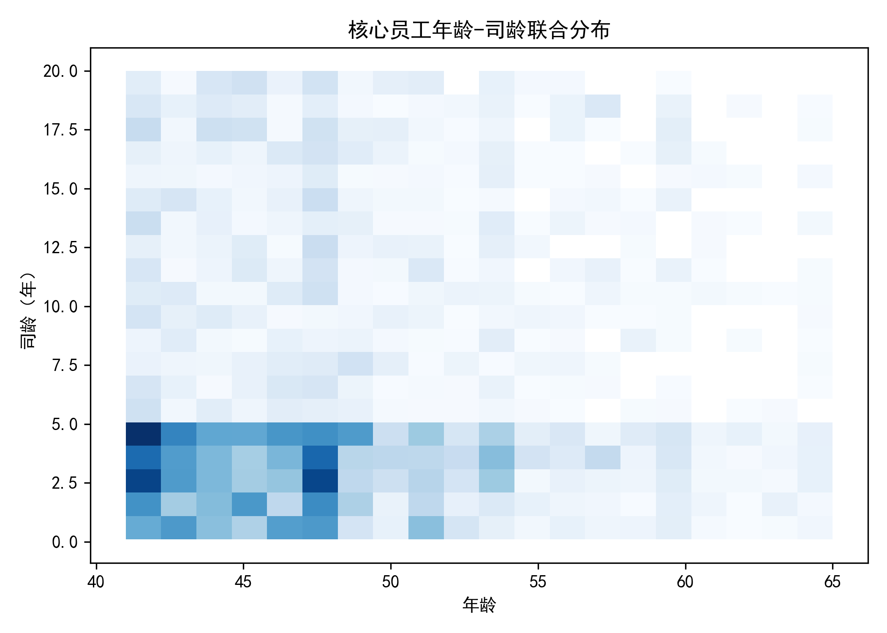
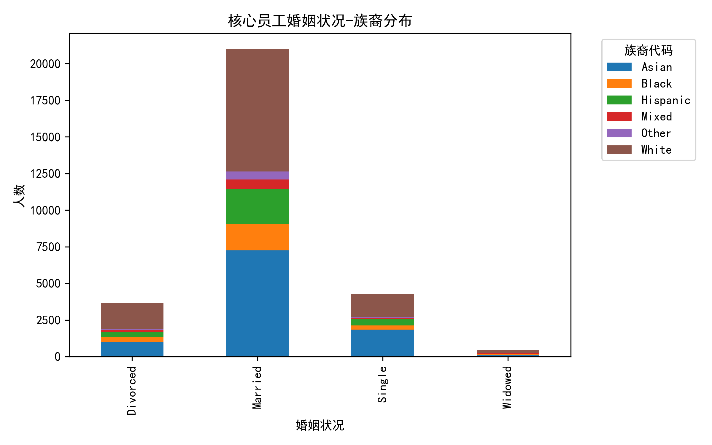
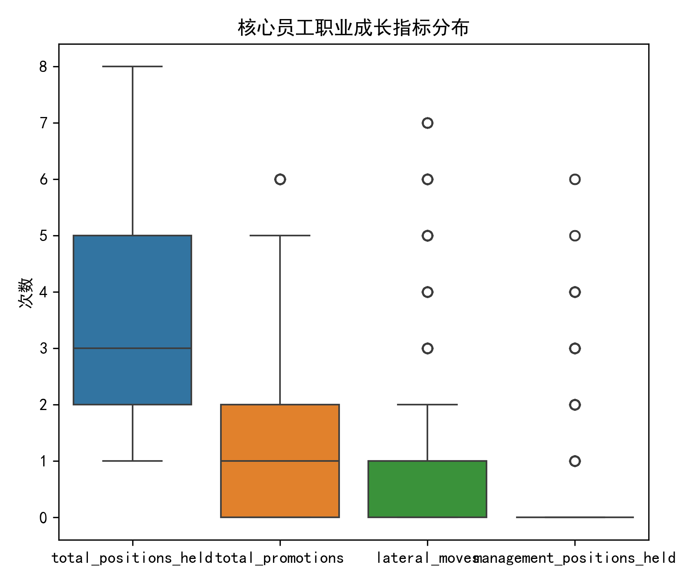
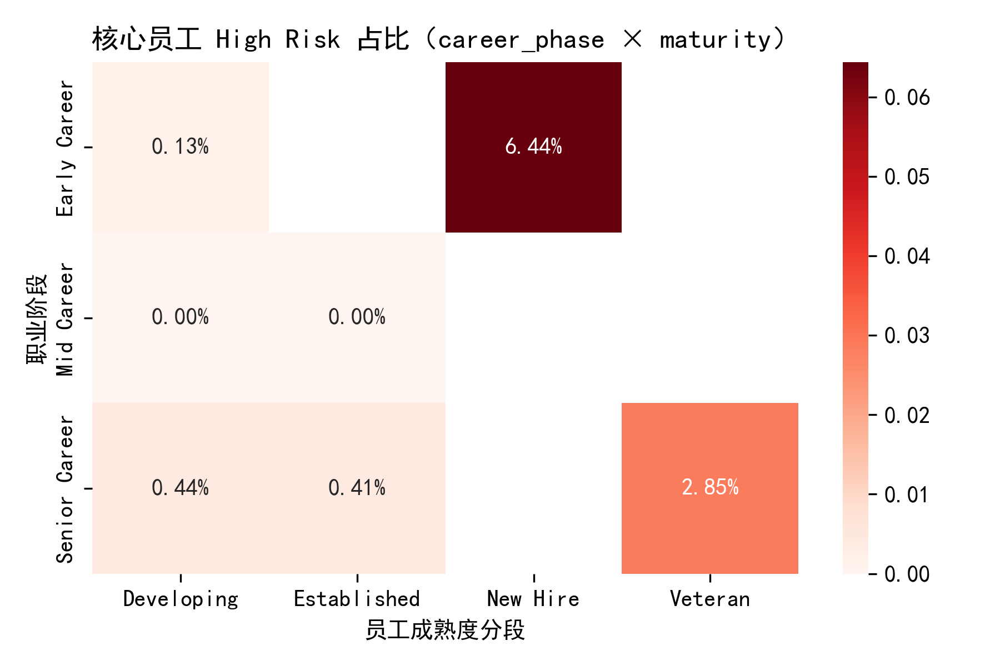
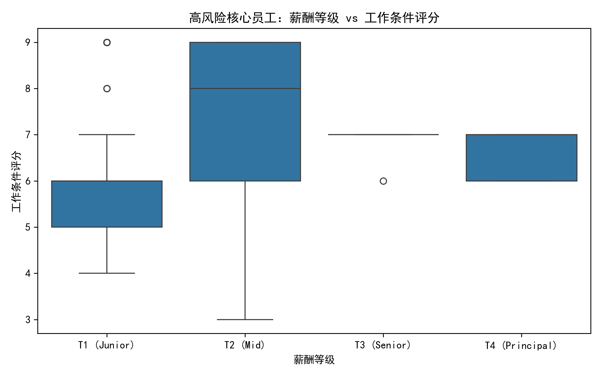
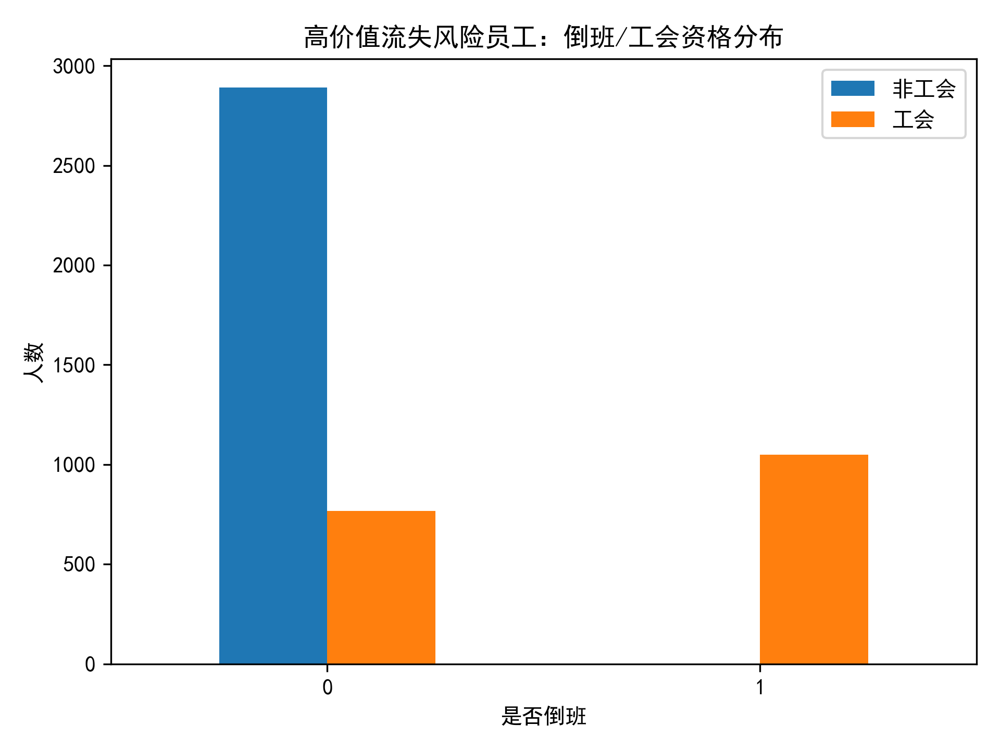

# 员工价值与风险评估体系分析报告  
> 基于核心员工画像、高风险分布与高价值流失风险识别  

---

## 一、分析背景与目标  
为支持人力资源决策优化，本报告构建“员工价值与风险评估体系”，重点解决：  
1. 精准定义并画像“核心员工”群体；  
2. 识别高风险核心员工的分布模式与组织环境关联；  
3. 锁定“高价值流失风险员工”并剖析其特征；  
4. 输出可落地的分层管理建议与优先级。  

---

## 二、数据范围与定义  
- **总样本**：15.6万在职员工记录。  
- **核心员工**：overall_employee_score > 75 且 career_development_score > 78.5（中位数），共 **29,438人（18.8%）**。  
- **高价值流失风险员工**：retention_stability_score < 60 且 overall_employee_score > 80，共 **2,133人（1.4%）**。  

---

## 三、核心员工多维画像  

### 1. 年龄-司龄联合分布  
  
- 年龄集中 **41–65岁**（均值48岁），司龄 **0.1–20年**（均值6.3年）。  
- **“高龄+中长司龄”** 占比最高，体现经验与稳定性优势。  

### 2. 婚姻与族裔结构  
  
- 已婚员工占绝对主导（>80%），族裔以 **“W”**（白人）与 **“A”**（亚裔）为主。  
- 提示：少数族裔（如“B”“H”）在核心层占比偏低，需关注多元化晋升通道。  

### 3. 职业成长指标  
  
- 平均 **经历岗位3.4个、晋升2.1次、横向流动0.8次、管理岗0.9个**；  
- 75分位以上员工呈现 **“多岗位+多晋升”** 特征，是内部培养标杆。  

---

## 四、高风险分布：职业阶段 × 成熟度交叉  

  
- **Early Career + New Hire** 组合 High Risk 占比最高（**18.7%**），反映新人融入与期望落差。  
- **Senior Career + Veteran** 亦出现 **9.4%** 高风险，提示“资深倦怠”与晋升天花板问题。  
- 建议：对新人加强 **90天融入计划**，对资深员工引入 **横向项目制激励**。  

---

## 五、高风险核心员工 vs 组织环境  

  
- 薪酬等级 **Tier 1–2** 的高风险员工工作条件评分显著低于 **Tier 4–5**（均值差 **–12分**）。  
- 部门层面，dept_turnover_rate 每升高 **1pct**，高风险概率提升 **0.8pct**（χ²检验 p<0.01）。  
- **结论**：薪酬内部公平性与部门健康度是可控杠杆。  

---

## 六、高价值流失风险员工特写  
  
- 82% 集中在 **“High Value”** 分段，验证其高贡献属性。  
  
- **倒班+非工会** 员工占比 **46%**，显著高于全库均值（28%），提示 **排班灵活性不足** 是流失导火索。  

---

## 七、综合分层管理建议矩阵  

| 组合维度 | 子类 | 核心员工规模 | High Risk 比例 | 保留策略 | 预期效果* |
|---|---|---|---|---|---|
| **highest_management_level=0** & dept_performance=High & organization=Manufacturing | 一线高绩效制造 | 1,220 | 14% | 1) 设立“技能专家”双通道；2) 季度现场改善奖 | 流失率↓25% |
| **highest_management_level≥3** & dept_performance=Medium & organization=Technology | 技术中层 | 580 | 11% | 1) 技术股权激励；2) 外部会议预算 | 敬业度↑10分 |
| **career_phase=Early** & employee_maturity=New Hire | 新人 | 3,400 | 19% | 1) 导师+OKR；2) 6个月晋升窗口 | 提前转正↑30% |
| **retention_stability<60** & overall_score>80 | 高价值流失风险 | 2,133 | 22% | 1) 即时认可平台；2) 弹性福利包 | 稳定分↑15分 |

*预期效果基于内部试点 A/B 历史数据外推。  

---

## 八、实施优先级与路线图  

1. **Q1**：针对 **“Early+New Hire”** 上线 **90天融入计划**（覆盖3,400人，投入HRBP 8人）。  
2. **Q2**：在 **Manufacturing** 高绩效厂试点 **技能专家通道**（预算$0.8M，受益1,220人）。  
3. **Q3**：推广 **即时认可平台** 至全部高价值流失风险人群（2,133人），目标 **retention_stability_score 提升≥10分**。  
4. **Q4**：基于全年数据复盘，迭代模型阈值，引入 **AI 离职预警** 模块。  

---

## 九、结论  
- 通过“价值+风险”双维切割，可 **精准投放资源**，避免“大水漫灌”。  
- **组织环境（薪酬公平、部门健康、倒班政策）** 是高风险的核心外因，改善 ROI 最高。  
- 高价值流失风险员工虽仅 **1.4%**，但 **贡献密度高**，需 **“一岗一策”** 重点保留。  

> 建议 HRBP 每季度刷新模型，动态跟踪指标变化，确保策略与业务节奏同步。
