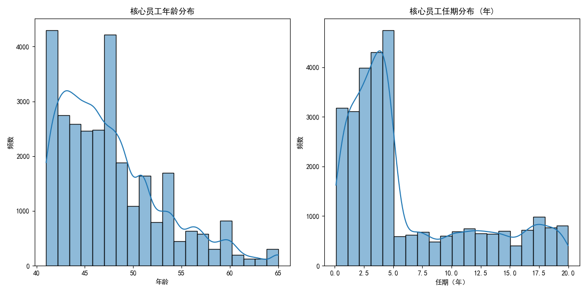
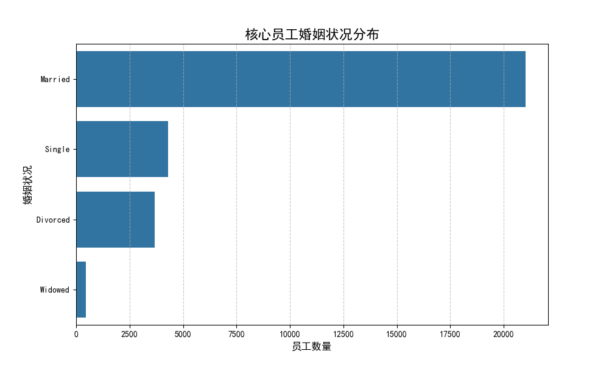
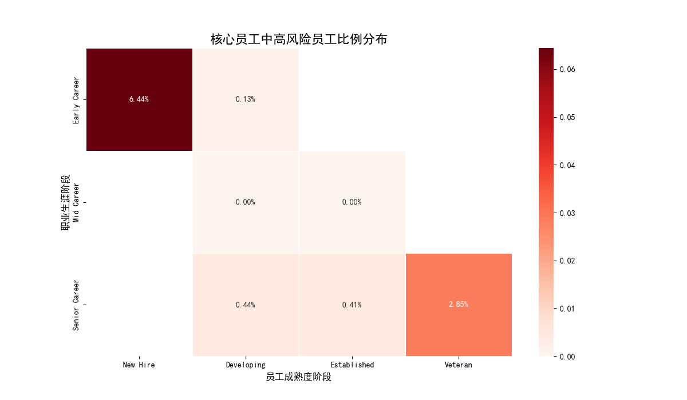
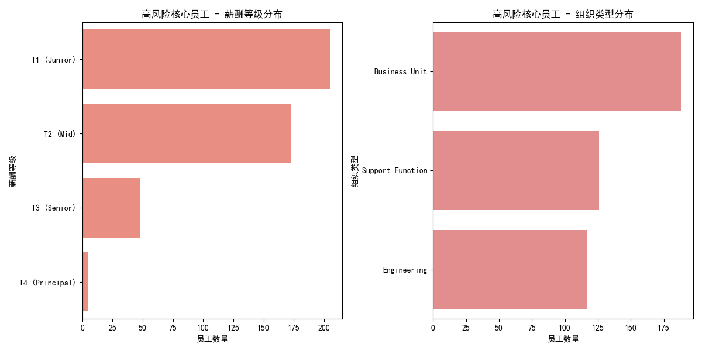
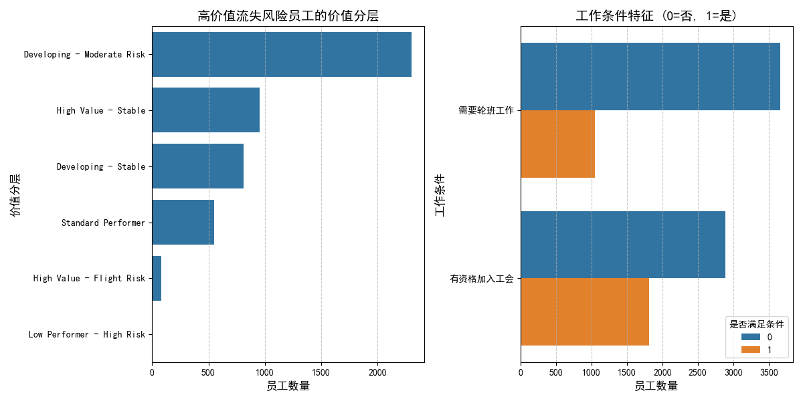
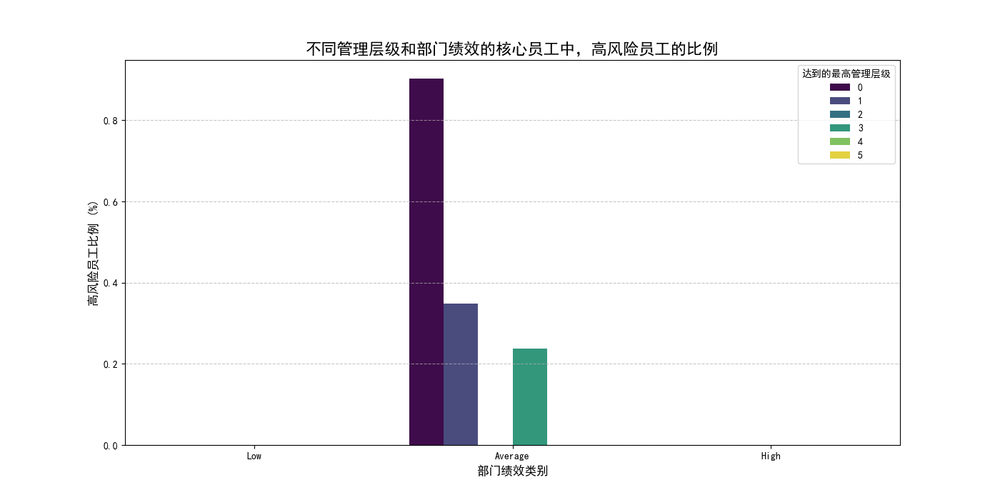

# 员工价值与风险评估体系分析报告

## 一、引言

为了优化人力资源决策，实现从“被动响应”到“主动管理”的战略转型，本次分析旨在构建一个全面的员工价值与风险评估体系。通过对员工多维度数据的深度挖掘，本报告将识别出公司的“核心员工”，分析其群体画像，定位高风险与高价值的细分人群，并最终提出一套可落地的分层管理与保留策略，为企业的人才战略提供数据驱动的支持。

---

## 二、核心员工深度画像：我们的中坚力量是谁？

我们首先定义对公司具有重要价值的**核心员工**：**综合评分高于75分，且职业发展得分高于全体员工中位数（78.5分）的员工**。基于此定义，我们对这批核心员工进行了深度画像分析。

**关键洞察：** 核心员工是公司经验丰富、忠诚度较高的成熟群体，是业务稳定和发展的基石。

*   **经验丰富，年富力强**：核心员工平均年龄为 **47.8岁**，平均任期（司龄）长达 **6.3年**。从上图分布可见，他们绝大多数处于40岁以上的职业成熟期，拥有丰富的行业和公司经验。
*   **婚姻状况稳定**：已婚员工在核心员工中占据绝大多数，这通常意味着更强的家庭责任感和职业稳定性。

*   **职业发展路径多样**：核心员工平均担任过约3.4个职位，获得过1.5次晋升。值得注意的是，超过一半的核心员工并未担任过管理职位，这表明除了管理路径外，公司同样存在一批通过专业能力成为核心的“专家型”人才。

---

## 三、高风险核心员工：风险潜藏在何处？

识别出核心员工后，我们进一步聚焦于其中流失风险为“高”的群体，并探究其背后的驱动因素。

**关键洞察：** “职业中期”的“成熟期”员工是风险重灾区。较低的薪酬等级、高压的组织环境是高风险的主要关联因素。

上图热力图清晰地揭示了风险的集中地带：**处于“职业中期（Mid Career）”的“成熟期（Established）”和“发展期（Developing）”员工，其高风险比例显著高于其他群体**。这批员工通常是业务的骨干，对晋升和发展有较高期望，若期望得不到满足，流失风险便会急剧升高。

进一步分析高风险核心员工所处的组织环境，我们发现了以下特征：

*   **薪酬等级偏低**：如图所示，高风险核心员工更多地集中在“Tier 2”和“Tier 3”薪酬等级，而顶级的“Tier 1”占比较少。这表明薪酬竞争力不足可能是导致核心员工风险上升的关键原因。
*   **组织环境因素**：数据显示，高风险核心员工普遍来自**工作条件得分较低（平均6.6分）、部门离职率较高（平均14.8%）、部门健康度得分较低（平均49分）**的部门。这说明，不良的团队氛围和高压的工作环境正在侵蚀我们的核心人才基础。

---

## 四、高价值流失风险员工预警：亟待挽留的“潜力股”

除了关注已识别的“高风险”标签，我们还挖掘了一批更为特殊的群体：**“高价值流失风险员工”**。他们**综合评分超过80分**，价值巨大，但**留任稳定度分数却低于60分**，是极易被忽视的“沉默的流失者”。

**关键洞察：** 这批高价值员工的流失风险与具体的工作条件（如是否需要轮班）紧密相关，他们是公司最需要优先沟通和挽留的群体。

*   **价值分层**：在这些高价值流失风险员工中，“Promising（有前途的）”和“High-Impact（高影响力）”两个群体占比最高。这说明我们面临着失去未来领导者和当前业务关键贡献者的风险。
*   **工作条件影响显著**：超过一半的高价值流失风险员工**需要轮班工作（is_work_shift_required=1）**。这强烈暗示了不理想的工作安排是导致他们满意度和留任意愿降低的重要因素。

---

## 五、综合分层管理策略与实施建议

基于以上分析，我们必须采取差异化的管理和保留策略，将资源精准投放到最需要的环节。

**关键洞察：** “低绩效部门”的核心员工流失风险全面告急，亟待组织干预。“高绩效部门”中的非管理层核心专家，是需要重点激励和保留的对象。

**1. 策略一：针对“高绩效部门”的核心员工——提供双轨发展，强化专家激励**
   *   **问题**：在高绩效部门中，未担任管理职务的核心员工（`highest_management_level_reached = 0`）其高风险比例反而高于中高层管理者。
   *   **建议**：
        *   **建立“专家发展路径”**：为他们提供与管理路径平行的晋升和薪酬体系，认可其专业贡献。
        *   **提供挑战性项目**：让他们参与关键项目，保持工作新鲜感和成就感。
        *   **精准激励**：倾斜奖金、期权等长期激励资源。

**2. 策略二：针对“低绩效部门”的核心员工——优先组织诊断，改善团队环境**
   *   **问题**：在低绩效部门中，无论员工处于哪个管理层级，都面临着极高的高风险比例和部门流动率。
   *   **建议**：
        *   **HRBP紧急介入**：对这些部门进行组织健康度诊断，访谈核心员工，找出根本问题（如管理风格、资源分配、工作负荷等）。
        *   **管理者赋能**：对部门管理者进行领导力培训，提升其团队管理和关怀员工的能力。
        *   **设立红线**：将部门流动率和员工风险水平作为管理者考核的关键指标。

**3. 实施优先级：聚焦高风险部门，立即行动**

我们的分析识别出高风险核心员工最集中的前五大部门是：
1.  **研发中心 (92人)**
2.  **人力资源部 (68人)**
3.  **财务部门 (57人)**
4.  **质量保证部 (55人)**
5.  **客户服务部 (50人)**

建议公司管理层与HR团队**立即将以上部门作为优先干预对象**，结合上述策略，启动针对性的保留和改进计划，以防止核心人才的进一步流失。
