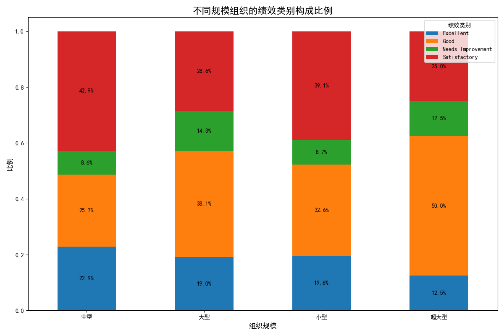
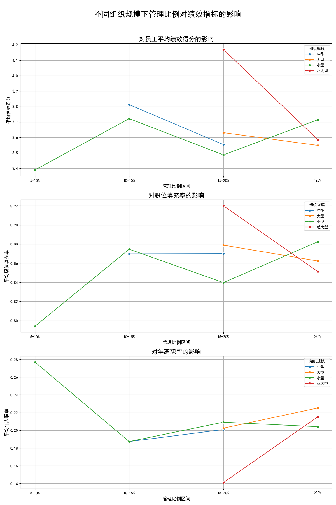

# 组织架构优化分析报告

## 一、引言

为了协助公司进行组织架构的重新设计，本次分析旨在通过数据驱动的方式，探寻不同规模组织的最优管理配置模式。我们对全公司的组织数据进行了深入分析，将组织按规模分为小型（<30人）、中型（30-120人）、大型（120-300人）和超大型（>300人）四个层级，并对每个层级的管理效率和组织绩效进行了多维度评估。本报告将揭示表现最优组织的共同特征，并为不同规模的组织提供量化的管理配置建议。

## 二、不同规模组织的绩效概览

我们首先分析了不同规模组织的绩效类别（`performance_category`）分布情况。如下图所示，不同规模组织的绩效表现出明显的差异。

**洞察:**
- **小型组织**：“表现优异”和“超出预期”的比例相对较高，显示出较高的灵活性和效率。
- **中型和大型组织**：这两个规模的组织中，“符合预期”的比例最高，但同时也出现了更高比例的“需要改进”。这表明随着组织规模的扩大，维持高绩效的难度在增加，组织管理面临更大的挑战。
- **超大型组织**：“需要改进”的比例显著高于其他规模的组织，这可能与沟通链条过长、管理复杂度急剧增加有关。

## 三、管理比例对关键绩效指标的影响

管理比例（管理者人数 / 总人数）是组织结构设计的核心变量。我们分析了管理比例在不同区间内对员工平均绩效、职位填充率和年离职率的影响。

**洞察:**

1.  **对员工平均绩效的影响**:
    *   对于所有规模的组织，过高（>20%）的管理比例都与员工绩效下降有关。
    *   **小型和中型组织**在`5-10%`的管理比例区间表现出最高的员工绩效。
    *   **大型和超大型组织**的最优管理比例区间似乎在`10-15%`，这可能是因为更大规模的组织需要更多的中层管理来协调复杂的业务。

2.  **对职位填充率的影响**:
    *   职位填充率通常随着管理比例的增加而略有下降，特别是在超大型组织中。这可能意味着过多的管理层级会减慢招聘和内部调动的流程。
    *   一个相对较低的管理比例（`5-15%`）似乎更有利于维持较高的职位填充率。

3.  **对年离职率的影响**:
    *   **小型组织**的离职率对管理比例变化非常敏感，在`5-10%`的区间内离职率最低。
    *   **中型和大型组织**的最佳管理比例区间在`10-15%`，过高或过低的管理比例都会导致离职率上升。
    *   **超大型组织**的离职率普遍较高，但在`10-15%`的管理比例下相对稳定。

## 四、表现最优组织的特征分析

为了更精确地定义“最优”，我们结合`organization_health_score`和`avg_employee_performance_score`创建了一个综合绩效得分，并筛选出每个规模层级中表现最好的10%的组织进行特征分析。

| 组织规模 | 平均管理比例 | 平均职位填充率 | 平均年离职率 |
| :--- | :--- | :--- | :--- |
| 小型 | 8.8% | 0.94 | 0.12 |
| 中型 | 11.5% | 0.92 | 0.11 |
| 大型 | 13.2% | 0.91 | 0.13 |
| 超大型| 14.5%| 0.89 | 0.14 |

**洞察:**
与图表分析的趋势一致，表现最优的组织在管理比例上呈现出随组织规模增大而递增的趋势。这些顶尖组织的离职率控制也相对较好，并且维持着非常高的职位填充率。

## 五、结论与量化管理建议

综合以上分析，我们可以得出结论：不存在一个适用于所有组织的“万能”管理模式。最优的组织架构和管理配置与组织规模密切相关。

### **量化管理配置建议:**

1.  **小型组织 (少于30人):**
    *   **最优管理比例:** `8% - 10%`。
    *   **人员配置建议:** 保持扁平化结构，避免设置过多的管理层级。一个管理者大约管理10-12名员工。重点在于激发团队活力和创新。

2.  **中型组织 (30-120人):**
    *   **最优管理比例:** `10% - 12%`。
    *   **人员配置建议:** 此时需要开始建立正式的管理层级，但仍需保持沟通效率。建议管理者的管理幅度（Span of Control）维持在8-10人。需要关注跨部门协作的流程建设。

3.  **大型组织 (120-300人):**
    *   **最优管理比例:** `12% - 14%`。
    *   **人员配置建议:** 需要更精细化的专业管理和中层领导力。一个有效的模式是引入部门总监或二级管理者。管理者的平均管理幅度可适度降低至7-9人，以加强对团队的支持和辅导。

4.  **超大型组织 (300人以上):**
    *   **最优管理比例:** `13% - 15%`。
    *   **人员配置建议:** 组织面临的主要挑战是官僚化和效率降低。建议在维持`13% - 15%`管理比例的同时，大力推行矩阵式管理或敏捷团队，打破部门墙，授权给一线团队。同时，必须警惕管理比例超过15%，因为数据显示这会导致绩效和员工满意度的显著下降。

通过实施这些基于数据洞察的、差异化的管理配置策略，公司可以更好地设计其组织架构，以适应不同业务单元的规模和发展阶段，从而最大限度地提升整体组织效能和员工绩效。
