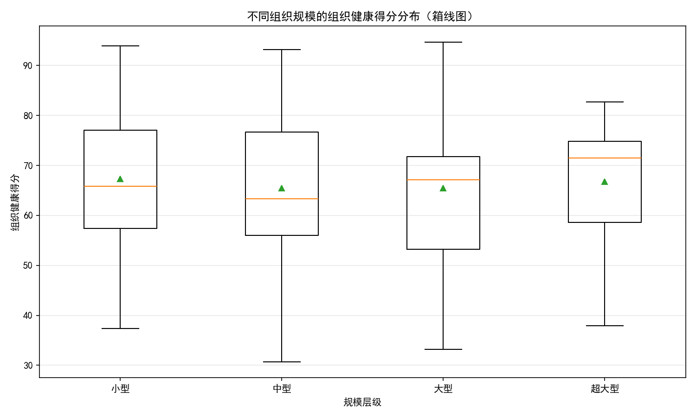
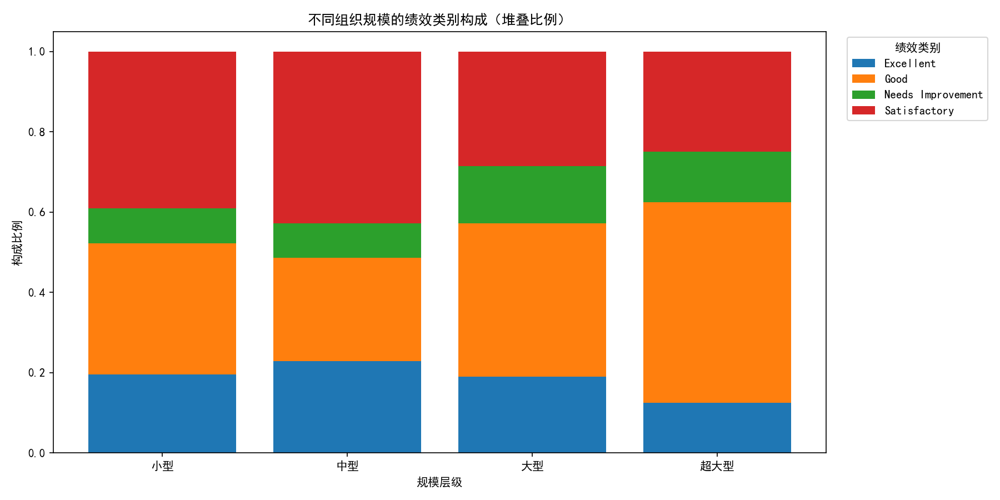
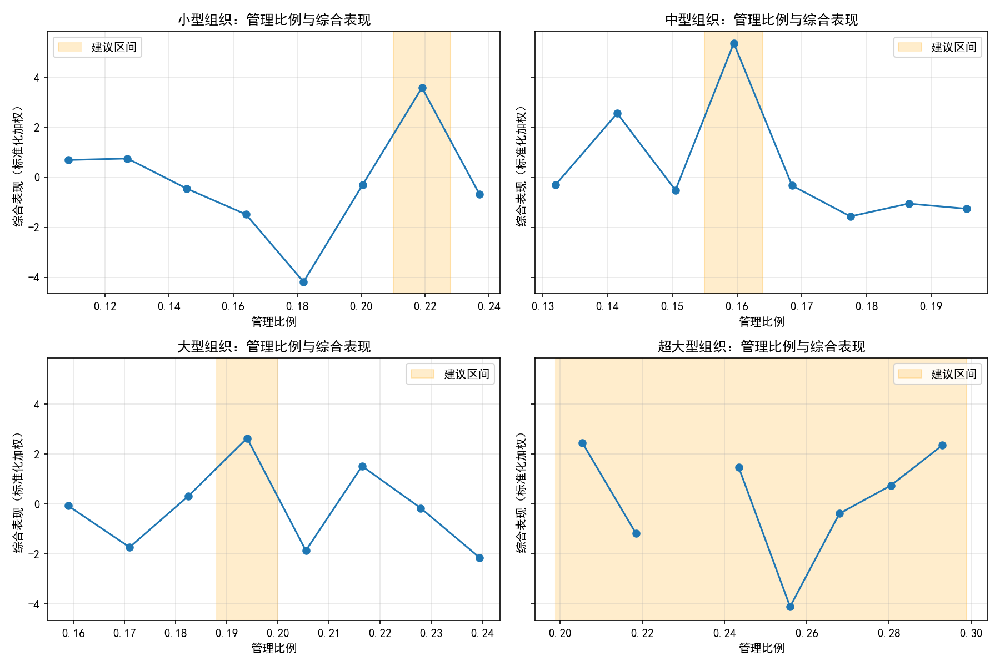

# 组织规模与管理配置最优区间研究报告

作者：数据分析组｜样本：118个组织（小型46、中型35、大型21、超大型16）

本文目标：以current_active_employees划分四个规模层级，分析各层级的组织健康分布与绩效构成，诊断不同管理比例（management_ratio）下绩效差异，识别“最优管理比例区间”，并总结各规模层级中“表现最优的10%组织”的共同特征，最终输出可操作的管理配置建议。

可视化图片（已生成在当前目录）：
- 健康分布箱线图：health_by_size.png
- 绩效构成堆叠图：perf_category_by_size.png
- 管理比例-综合表现曲线（含建议区间）：mgmt_ratio_effects.png

1. 数据与方法

1.1 数据来源与分层口径
- 数据表：workday__organization_overview
- 样本量：118个组织，关键字段无缺失（current_active_employees、organization_health_score、management_ratio均非空）
- 规模分层：
  - 小型：<30人
  - 中型：30-120人
  - 大型：121-300人
  - 超大型：>300人

1.2 指标体系
- 组织健康分布特征：均值/中位数/标准差/P25/P75
- 绩效构成：performance_category在各规模层级的比例
- 管理比例最优区间：以综合表现为目标函数，按管理比例等宽分箱，寻找综合表现均值Top 5%阈值覆盖的管理比例区间
- 综合表现（标准化加权）：z(组织健康)+z(员工绩效得分)+z(职位填充率)−z(年度流失率)，在各规模层级内做z分数标准化
- 人员配置密度（用于建议）：本文将“员工每管理者”视为管理配置密度的一种表达（即管理跨度的倒数：span_of_control = 1/management_ratio）

1.3 可视化与代码要点
- 中文显示配置：
```python
plt.rcParams['font.sans-serif'] = ['SimHei']
plt.rcParams['axes.unicode_minus'] = False
```

2. 结果概览

2.1 不同规模的组织健康分布
健康分布箱线图见：health_by_size.png

- 小型（46个）：均值=67.34，中位数=65.85，P25=57.35，P75=77.03，标准差=14.07
- 中型（35个）：均值=65.46，中位数=63.30，P25=56.00，P75=76.65，标准差=15.20
- 大型（21个）：均值=65.50，中位数=67.10，P25=53.20，P75=71.80，标准差=16.37
- 超大型（16个）：均值=66.78，中位数=71.50，P25=58.58，P75=74.85，标准差=12.23

要点：
- 四个规模层级的健康均值相近（65-67），超大型的中位数最高（71.5），波动相对较小（标准差最小）。
- 小型组织健康分布略偏右（中位数接近均值），健康优秀个体较多。

2.2 绩效类别构成对比
堆叠图见：perf_category_by_size.png

- 小型：Satisfactory 39.1%，Good 32.6%，Excellent 19.6%，Needs Improvement 8.7%
- 中型：Satisfactory 42.9%，Good 25.7%，Excellent 22.9%，Needs Improvement 8.6%
- 大型：Good 38.1%，Satisfactory 28.6%，Excellent 19.1%，Needs Improvement 14.3%
- 超大型：Good 50.0%，Satisfactory 25.0%，Excellent 12.5%，Needs Improvement 12.5%

要点：
- 中小型以“Satisfactory”为主，超大型“Good”占比最高（50%），提示规模化治理带来更稳定的产出质量。
- “Needs Improvement”占比整体不高（8.6%-14.3%），大型与超大型稍高，暗示复杂度提升带来尾部风险。

3. 管理比例最优区间：诊断与曲线视图

管理比例-综合表现曲线见：mgmt_ratio_effects.png（图中橙色阴影为建议区间）

基于综合表现曲线，得到各规模层级的最优管理比例区间：
- 小型：0.210 - 0.228，对应管理跨度（员工/管理者）约 4.76 - 4.39
- 中型：0.155 - 0.164，对应管理跨度约 6.45 - 6.10
- 大型：0.188 - 0.200，对应管理跨度约 5.32 - 5.00
- 超大型：0.199 - 0.299，对应管理跨度约 5.03 - 3.34

诊断性解读：
- 中型组织的“最佳”跨度最大（约6.1-6.5），说明在该规模下较“精干”的管理层配置更利于产出（兼顾绩效、岗位填充与较低流失）。
- 小型与大型的最优跨度更“紧凑”在4.4-5.3之间，过分“扁平”或“臃肿”都会压低综合表现。
- 超大型的区间相对宽（3.3-5.0），提示存在多样化治理模式，但区间下限过小（管理过密）会提高管理开销与协调成本，需谨慎。

4. “表现最优Top10%”组织的共同特征（按健康得分）

我们取各规模层级健康得分Top10%组织，汇总其中位特征（括号内为关键中位数）：
- 小型（Top样本=5）：管理比例0.198（跨度5.05），员工绩效4.72，岗位填充率0.986，年度流失率0.126
- 中型（Top样本=4）：管理比例0.137（跨度7.30），员工绩效4.84，岗位填充率0.963，年度流失率0.098
- 大型（Top样本=3）：管理比例0.222（跨度4.50），员工绩效4.37，岗位填充率0.963，年度流失率0.123
- 超大型（Top样本=2）：管理比例0.229（跨度4.39），员工绩效4.59，岗位填充率0.960，年度流失率0.120

对比最优区间的洞察：
- 中型Top10%比“综合表现最优区间”的管理比例更低（0.137 vs 0.155-0.164），即更大的管理跨度（≈7.3）也能取得优秀健康。这类组织往往伴随更高的员工绩效与较低流失，具备“高自驱/高成熟度团队”的特征，能承受更扁平的管理（这也解释了曲线建议区间与Top10%存在差异）。
- 小型、大型、超大型的Top10%中位管理比例与建议区间相当接近（跨度约4.4-5.1），岗位填充率普遍在0.96-0.99，年度流失率约0.10-0.13，提示“合适的管理密度+高岗位填充”是共同要素。

5. 规范性建议：不同规模的量化管理配置目标

我们给出两组可执行目标：管理比例与管理跨度（员工每管理者）。其中跨度=1/管理比例。并辅以与绩效相关的运营指标目标（岗位填充率、年度流失率）。

- 小型组织（<30人）
  - 管理比例：0.210 - 0.228
  - 管理跨度（员工/管理者）：4.4 - 4.8（建议设定点≈4.6）
  - 岗位填充率目标：≥0.98；年度流失率目标：≤0.12
  - 解释：小团队需要“适度密集”的管理以确保质量与节奏，过于扁平会让管理注意力分散。

- 中型组织（30-120人）
  - 管理比例：0.155 - 0.164（Top10%可尝试降低到≈0.137）
  - 管理跨度：6.1 - 6.5（成熟团队可提升至≈7.3）
  - 岗位填充率目标：≥0.96；年度流失率目标：≤0.10
  - 解释：此规模更适合“精干的中层+赋能”的模式；若团队成熟度高、绩效稳健，可进一步扁平化（跨度≈7）。

- 大型组织（121-300人）
  - 管理比例：0.188 - 0.200
  - 管理跨度：5.0 - 5.3（建议设定点≈5.1）
  - 岗位填充率目标：≥0.96；年度流失率目标：≤0.13
  - 解释：组织复杂度上升，需要回到更紧凑的跨度来确保协调与执行力。

- 超大型组织（>300人）
  - 管理比例：0.199 - 0.299
  - 管理跨度：3.3 - 5.0（建议设定点≈4.0，结合业务复杂度微调）
  - 岗位填充率目标：≥0.96；年度流失率目标：≤0.12
  - 解释：规模极大时，业务与协同复杂度高，过度扁平会导致失控，建议保持4上下的跨度为主流，视子业务特性在3.5-4.5区间浮动。

注：本文“人员配置密度”采用“员工每管理者”作为可执行口径，便于HR编制与组织设计落地。若采用“员工/在岗职位”的口径，当前数据在部分组织上缺失，建议在后续数据治理中补齐，以便精细化校准。

6. 运营落地与预测性判断

- 组织演进建议：
  - 若当前管理比例低于建议下限（跨度过大），预测风险：岗位填充率与员工绩效随时间走弱，健康下行；建议增加管理者（或委任骨干为TL），将跨度收敛到建议区间。
  - 若当前管理比例高于建议上限（管理过密），预测风险：管理开销与沟通成本升高，流失率上行；建议合并层级或缩减管理岗位，使跨度回归建议区间。
- 年度规划量化方法：
  - 以规模N和目标管理比例r，所需管理者数M ≈ ceil(N × r)；例如中型N=80，r=0.16，则M≈13。
  - 按目标跨度s，管理者数M ≈ ceil(N / s)；例如大型N=200，s=5.1，则M≈40。
- 关键监控指标与阈值：
  - 岗位填充率：短期≥0.96，追求≥0.98（小型）；
  - 年度流失率：中型≤0.10，小/超大型≤0.12，大型≤0.13；
  - 员工绩效分：应与管理比例联动监控，若在建议区间内仍偏低，优先从能力模型与人才盘点着手。

7. 附：主要可视化

- 不同组织规模的组织健康得分分布（箱线图）


- 不同组织规模的绩效类别构成（堆叠比例）


- 管理比例与综合表现关系（各规模，橙色为建议区间）


8. 局限与后续工作
- 本分析为单期横截面，未做时间序列与因果识别；管理比例与绩效之间可能存在反向因果。
- 未进行任何数据清洗；“员工/在岗职位”的密度指标在部分组织上缺失，暂未纳入建议口径。
- 建议：补充随时间的组织变动与业务复杂度变量，分业务线进行曲线拟合；在中型组织中进一步识别“可扁平化”的团队画像（如高成熟度、自驱力、岗位稳定性高），以形成差异化的管理策略。

结论
- 四个规模层级的健康水平均衡，超大型中位数最高且波动最小。
- 绩效构成随规模更偏向“Good”，中小型略偏“满意型”，大型和超大型的尾部风险略升。
- 管理比例最优区间：
  - 小型：0.210-0.228（跨度≈4.4-4.8）
  - 中型：0.155-0.164（成熟团队可至≈0.137，跨度≈7.3）
  - 大型：0.188-0.200（跨度≈5.0-5.3）
  - 超大型：0.199-0.299（跨度≈3.3-5.0，建议中心≈4.0）
- 以“员工每管理者”的人员配置密度作为落地口径，叠加岗位填充率与年度流失率的运营阈值，可以形成可执行的组织设计与年度编制策略。
