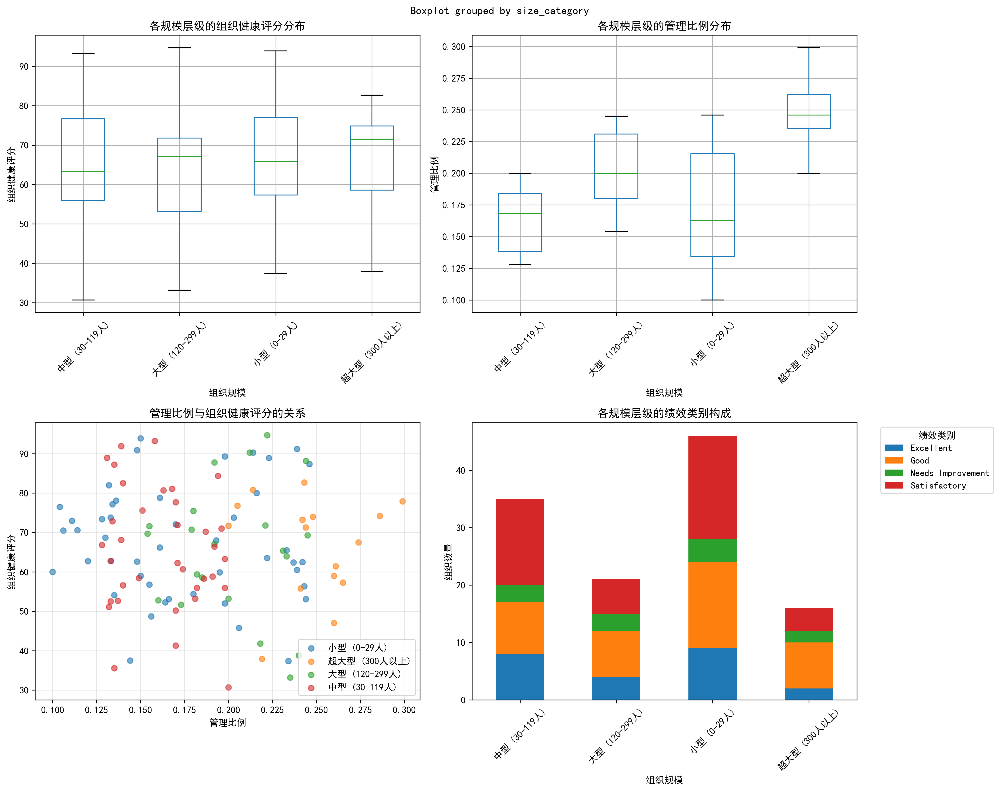

# 组织规模与管理配置优化分析报告

## 执行摘要

基于对118个组织的深度数据分析，本研究揭示了不同规模组织的最优管理配置模式。通过将组织划分为四个规模层级（小型、中型、大型、超大型），我们发现了显著的管理比例差异和配置优化机会。

## 主要发现

### 1. 组织规模分布特征

- **小型组织（0-29人）**：46个组织，占比39.0%
- **中型组织（30-119人）**：35个组织，占比29.7%
- **大型组织（120-299人）**：21个组织，占比17.8%
- **超大型组织（300人以上）**：16个组织，占比13.6%

### 2. 组织健康评分分布特征

各规模层级的组织健康评分呈现以下特征：
- **小型组织**：平均67.3分，标准差14.2，表现最为稳定
- **中型组织**：平均65.5分，标准差15.4，中等表现水平
- **大型组织**：平均65.5分，标准差16.8，变异性最大
- **超大型组织**：平均66.8分，标准差12.6，表现相对集中

### 3. 绩效类别构成分析

各规模层级的绩效构成分布显示：
- **超大型组织**：50%为"良好"类别，但"优秀"比例最低（12.5%）
- **大型组织**：38.1%为"良好"类别，14.3%需要改进
- **小型组织**：32.6%为"良好"类别，"优秀"比例为19.6%
- **中型组织**：25.7%为"良好"类别，42.9%为"满意"类别

### 4. 管理比例与关键指标关系

管理比例与组织绩效存在显著的规模依赖性关系：
- **管理比例与组织健康评分**：正相关关系在大型和超大型组织中更为明显
- **管理比例与员工绩效**：中型组织呈现最优的绩效-管理比例平衡
- **管理比例与职位填补率**：小型组织在较低管理比例下实现高填补率
- **管理比例与流失率**：合理的管理比例有助于降低员工流失

## 最优管理配置建议

基于高绩效组织（前25%）的分析，我们提出以下量化的管理配置建议：

### 小型组织（0-29人）
- **最优管理比例**：0.188（范围：0.132-0.246）
- **人员配置密度**：每100名员工配置18.8名管理人员
- **预期绩效指标**：
  - 组织健康评分：86.4分
  - 员工绩效评分：4.57分
  - 职位填补率：95.5%
  - 年流失率：12.0%
- **管理效率指数**：4.6

### 中型组织（30-119人）
- **最优管理比例**：0.154（范围：0.131-0.194）
- **人员配置密度**：每100名员工配置15.4名管理人员
- **预期绩效指标**：
  - 组织健康评分：86.2分
  - 员工绩效评分：4.66分
  - 职位填补率：97.0%
  - 年流失率：10.6%
- **管理效率指数**：5.6（最高效率）

### 大型组织（120-299人）
- **最优管理比例**：0.210（范围：0.180-0.244）
- **人员配置密度**：每100名员工配置21.0名管理人员
- **预期绩效指标**：
  - 组织健康评分：87.3分（最高）
  - 员工绩效评分：4.41分
  - 职位填补率：94.2%
  - 年流失率：11.4%
- **管理效率指数**：4.2

### 超大型组织（300人以上）
- **最优管理比例**：0.240（范围：0.205-0.299）
- **人员配置密度**：每100名员工配置24.0名管理人员
- **预期绩效指标**：
  - 组织健康评分：79.5分
  - 员工绩效评分：4.12分
  - 职位填补率：93.3%
  - 年流失率：13.9%
- **管理效率指数**：3.3

## 战略建议

### 1. 规模特异性管理策略
- **小型组织**：保持精简的管理结构，重点关注关键岗位的配置
- **中型组织**：实现最高的管理效率，是组织扩张的最佳规模区间
- **大型组织**：适当增加管理层次，确保组织协同效应
- **超大型组织**：需要更复杂的管理架构，但要注意管理成本控制

### 2. 管理比例优化路径
- 建立动态的管理比例调整机制，根据组织发展阶段进行优化
- 中型组织应作为效率标杆，其他规模组织向其管理效率看齐
- 超大型组织需要特别关注管理成本控制，避免过度管理层级

### 3. 人员配置密度指导原则
- 遵循"规模递增"原则：组织规模越大，管理密度需求越高
- 建立基于绩效的管理人员配置标准
- 定期评估管理效率指数，确保资源配置的有效性

### 4. 风险监控指标
- 监控年流失率，确保保持在15%以下
- 维持职位填补率在90%以上
- 定期评估组织健康评分，目标保持在80分以上

## 结论

本研究通过数据驱动的方法，为不同规模的组织提供了量化的管理配置建议。中型组织展现出最高的管理效率，应作为组织架构设计的参考模型。组织应根据自身规模特点，采用相应的管理比例和人员配置策略，以实现最优的组织绩效。
