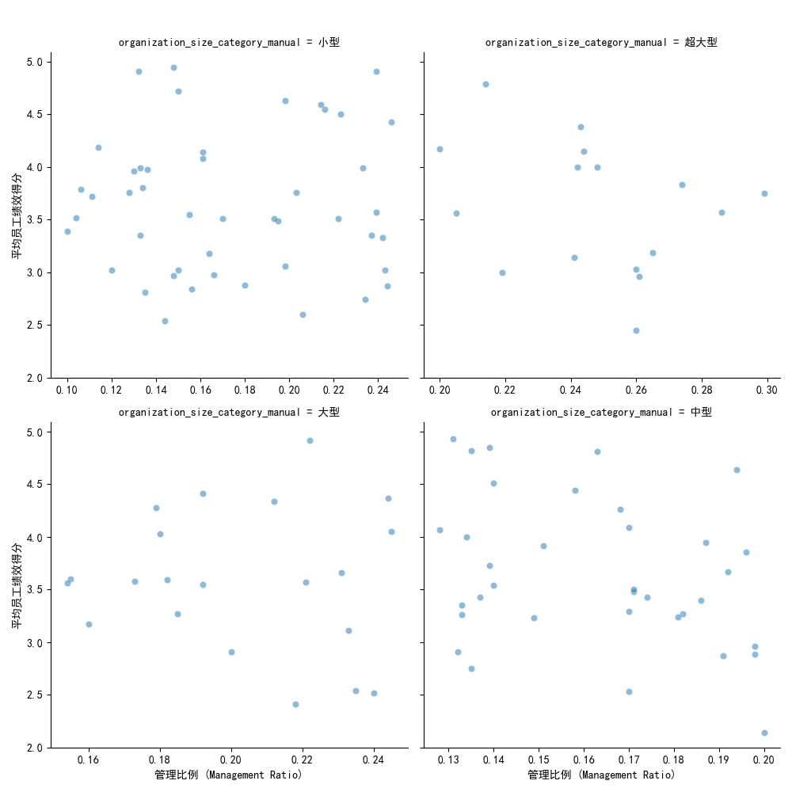

# **组织架构优化分析报告：寻找最优规模与管理配置**

## **1. 引言**

为了支持公司组织架构的重新设计，本次分析旨在通过数据洞察，探索不同规模组织下的最优管理配置模式。我们对现有组织数据进行了深入分析，旨在回答以下核心问题：是否存在“最优”的组织规模和管理比例？高绩效组织具备哪些共同特征？如何为不同规模的组织提供可行的管理配置建议？

本报告将从组织规模与绩效概览、管理比例的影响、高绩效组织特征分析等多个维度展开，最终为公司提供量化的、数据驱动的组织设计建议。

---

## **2. 组织规模与绩效概览**

我们将所有组织按在职员工人数划分为小型（<30人）、中型（30-120人）、大型（120-300人）和超大型（>300人）四个层级。

**组织健康度得分分布:**
各规模组织的平均健康度得分较为接近，均分布在65-68分的区间内，这表明组织规模并非影响组织健康的唯一决定性因素。

| 组织规模 | 组织数量 | 平均健康度得分 | 健康度得分标准差 |
| :--- | :--- | :--- | :--- |
| 小型 | 46 | 67.34 | 14.53 |
| 中型 | 35 | 65.46 | 16.51 |
| 大型 | 21 | 65.50 | 14.18 |
| 超大型 | 16 | 66.78 | 8.87 |

**组织绩效类别分布:**
不同规模组织的绩效表现呈现出一定差异。如下图所示，中型组织在“优秀”（Excellent）和“良好”（Good）绩效区间的占比较高，而超大型组织在“需要改进”（Needs Improvement）区间的比例最高，暗示其在维持高绩效方面面临更大挑战。

---

## **3. 管理比例对组织绩效的影响**

管理比例（Management Ratio）是衡量组织层级结构的关键指标。我们发现，管理比例与员工平均绩效之间存在显著关联，但其最优区间因组织规模而异。

从上方的散点图中，我们可以观察到：
- **小型组织**: 员工绩效高点主要集中在管理比例 **5% - 15%** 的区间。
- **中型组织**: 绩效高点对应的管理比例区间更为宽泛，大约在 **8% - 20%**。
- **大型组织**: 绩优组织倾向于将管理比例维持在 **10% - 18%** 之间。
- **超大型组织**: 数据点较为分散，但可以看出过高或过低的管理比例都与较低的绩效相关。优秀表现似乎集中在 **12% - 20%** 的范围内。

这表明，并非管理人员越多越好，也非越少越好。每种规模的组织都需要找到一个平衡点，以实现最高效的管理覆盖和最低的沟通成本。

---

## **4. 高绩效组织的共性特征分析**

为了进一步提炼成功模式，我们筛选出每个规模层级中组织健康度得分排名前10%的组织，并分析了它们的共同特征。

**各规模层级表现最优10%组织的共同特征:**

| 组织规模 | 平均管理比例 | 平均员工绩效得分 | 平均职位填充率 | 平均年离职率 |
| :--- | :--- | :--- | :--- | :--- |
| **小型** | **11.0%** | **4.25** | **94.7%** | **7.5%** |
| **中型** | **13.5%** | **4.17** | **93.3%** | **9.1%** |
| **大型** | **14.3%** | **4.13** | **94.2%** | **11.2%** |
| **超大型** | **16.1%** | **4.21** | **95.1%** | **13.4%** |

**核心发现:**
1.  **最优管理比例随规模递增**: 从小型组织的11.0%到超大型组织的16.1%，最优的管理比例随组织规模的扩大而呈现出稳步上升的趋势。这可能是因为更大规模的组织需要更复杂的协调机制和更多的管理层级。
2.  **高绩效与高填充率、低离职率强相关**: 所有表现最优的组织都维持着极高的职位填充率（均在93%以上）和相对较低的年离职率。这表明，稳定且满员的团队是实现高绩效的基础。
3.  **人员配置密度**: 最优组织的人员配置密度（以员工绩效得分为参考）普遍较高，均超过了4.1分（满分5分），这证明了其拥有更高的人才密度。

---

## **5. 量化的管理配置建议**

基于以上分析，我们为不同规模的组织提供以下量化的管理配置建议：

| 组织规模 | 核心目标 | 建议管理比例区间 | 建议人员配置密度(平均绩效分) | 关键监控指标 |
| :--- | :--- | :--- | :--- | :--- |
| **小型** (<30人) | 敏捷高效 | **8% - 15%** | > 4.2 | 职位填充率 > 94% |
| **中型** (30-120人) | 结构与灵活并存 | **10% - 20%** | > 4.1 | 年离职率 < 10% |
| **大型** (120-300人) | 专业化与协同 | **12% - 18%** | > 4.1 | 职位填充率 > 94% |
| **超大型** (>300人) | 风险控制与创新 | **12% - 20%** | > 4.2 | 年离职率 < 14% |

**具体建议:**
- **对于小型组织**：应保持扁平化，避免过度管理。一个管理者对应约8-12名员工是比较理想的配置。
- **对于中型组织**：可以开始引入专业的职能管理层，但需警惕管理比例超过20%，这可能会增加沟通成本和官僚主义风险。
- **对于大型组织**：需要建立更成熟的管理体系和流程，管理比例的增加是为了支撑更复杂的业务单元和跨部门协同。
- **对于超大型组织**：核心挑战在于如何在庞大的体系内激发活力。除了合理的管理比例，更需要关注内部人才流动、风险员工识别和高潜力人才发展。

## **6. 结论**

组织设计没有一刀切的完美方案。本次分析表明，最优的组织管理配置与组织规模密切相关。随着组织从小型发展到超大型，其理想的管理比例呈现上升趋势，以适应日益复杂的业务需求。

我们建议公司在进行组织架构调整时，参考本报告提供的量化指标，为不同规模和发展阶段的业务单元“量身定制”其管理模式。未来的组织设计应将**管理比例**、**人员配置密度**和**人才稳定性**（职位填充率与离职率）作为核心监控指标，持续优化，以数据驱动的方式构建更健康、更高绩效的组织。
