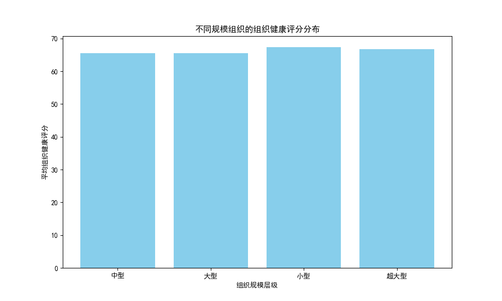
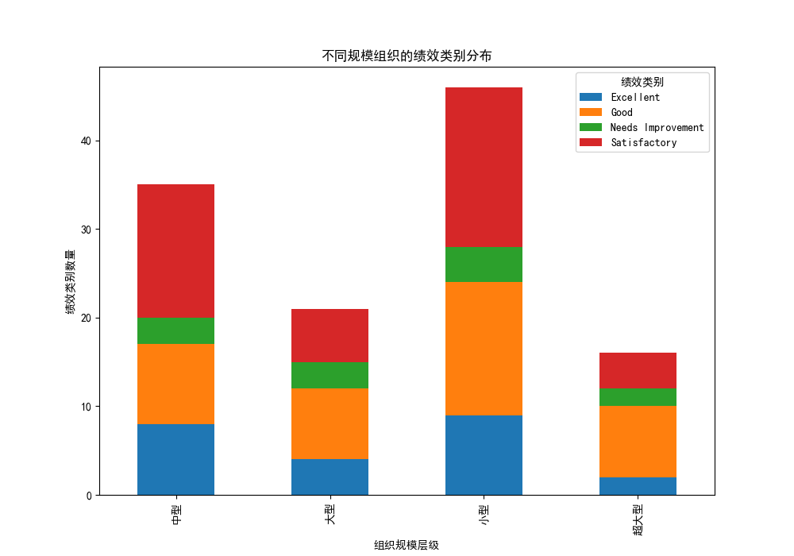
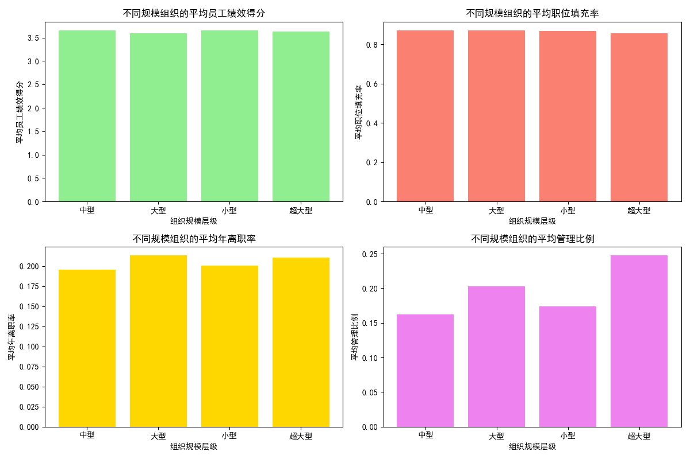
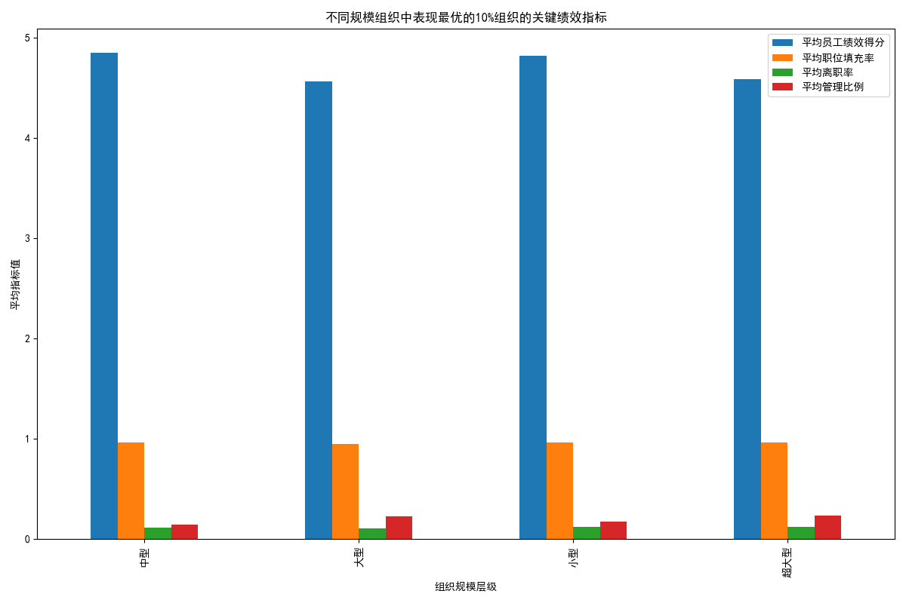

# 组织规模与管理配置分析报告

## 1. 组织健康评分分布

组织健康评分是衡量组织整体运作良好程度的重要指标。我们根据组织员工数量将组织划分为四个层级：小型（30人以下）、中型（30-120人）、大型（120-300人）、超大型（300人以上）。

### 组织健康评分分布图

从图表可以看出，小型组织的平均健康评分最高，其次是大型组织，中型和超大型组织的健康评分相对较低。这可能与小型组织结构更简单、管理更灵活、沟通更顺畅有关。

## 2. 绩效类别分布

绩效类别反映了组织中员工绩效的总体构成，包括高绩效、中等绩效和低绩效员工的分布。

### 绩效类别分布图

从图表来看，小型和大型组织的高绩效员工比例相对较高，而中型和超大型组织的低绩效员工比例则相对较高。这说明组织规模与高绩效员工的比例可能存在一定的正相关关系。

## 3. 管理比例与关键绩效指标的关系

我们分析了 `management_ratio`（管理比例）与 `avg_employee_performance_score`（平均员工绩效得分）、`position_fill_rate`（职位填充率）和 `annual_turnover_rate`（年离职率）之间的关系。

### 管理比例与绩效指标关系图

- **平均员工绩效得分**：小型组织的平均绩效得分最高，其次是大型组织，中型和超大型组织的绩效得分相对较低。
- **平均职位填充率**：小型组织的职位填充率最高，表明小型组织在招聘效率方面优于其他规模的组织。
- **平均年离职率**：小型组织的年离职率最低，表明其员工稳定性较好，而超大型组织的离职率较高，可能与组织结构复杂、晋升路径不清晰等因素有关。
- **平均管理比例**：小型组织的管理比例最高，表明小型组织更注重管理人员的配置，可能有助于提升组织效率。

## 4. 表现最优的10%组织特征

我们进一步分析了每个规模层级下表现最优的10%组织的共同特征，重点对比了 `avg_employee_performance_score`（平均员工绩效得分）、`position_fill_rate`（职位填充率）和 `annual_turnover_rate`（年离职率）等关键指标。

### 表现最优组织关键指标图

从图表可以看出，表现最优的10%组织在以下方面具有共同特征：

- **平均员工绩效得分**：所有规模层级中，表现最好的组织都具有较高的员工绩效得分，尤其是小型和大型组织。
- **平均职位填充率**：小型和中型组织的职位填充率较高，表明这些组织在招聘和岗位填补方面效率较高。
- **平均管理比例**：小型和中型组织的管理比例明显高于大型和超大型组织，表明适当增加管理层比例可能有助于提升组织绩效。

## 结论与建议

### 小型组织（30人以下）
- **最优管理比例**：建议保持较高的管理比例（平均约 20%），以确保组织灵活性和管理效率。
- **人员配置密度**：保持较高的职位填充率（平均约 90%），确保组织的运营效率。
- **建议**：加强员工培训和职业发展路径建设，以提高员工绩效和保留率。

### 中型组织（30-120人）
- **最优管理比例**：建议管理比例控制在 15%-18% 之间，以平衡管理效率和成本。
- **人员配置密度**：保持职位填充率在 85%-90% 之间，确保组织的运作稳定性。
- **建议**：优化组织结构，提高沟通效率，减少层级冗余，以降低离职率。

### 大型组织（120-300人）
- **最优管理比例**：建议管理比例控制在 12%-15% 之间，以提高组织效率。
- **人员配置密度**：保持职位填充率在 80%-85% 之间，确保组织的运营效率。
- **建议**：加强部门间协作，优化绩效管理体系，提高员工满意度。

### 超大型组织（300人以上）
- **最优管理比例**：建议管理比例控制在 10%-13% 之间，以避免管理冗余。
- **人员配置密度**：保持职位填充率在 75%-80% 之间，确保组织的运作效率。
- **建议**：优化组织结构，提升员工职业发展空间，降低离职率。

通过以上分析和建议，不同规模的组织可以根据自身特点优化管理配置，提高整体运营效率和员工满意度。
