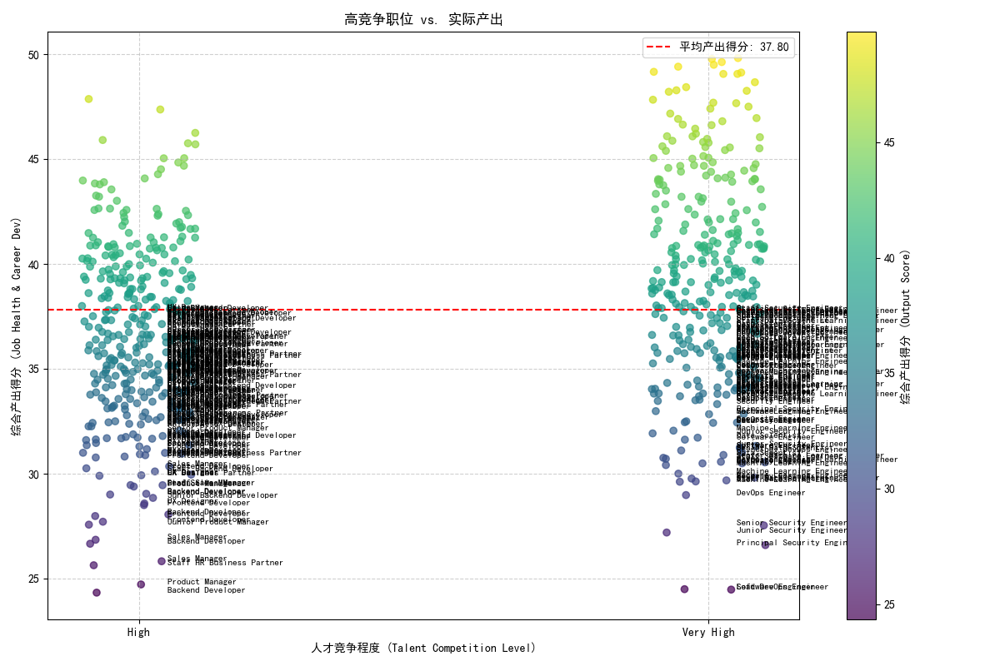
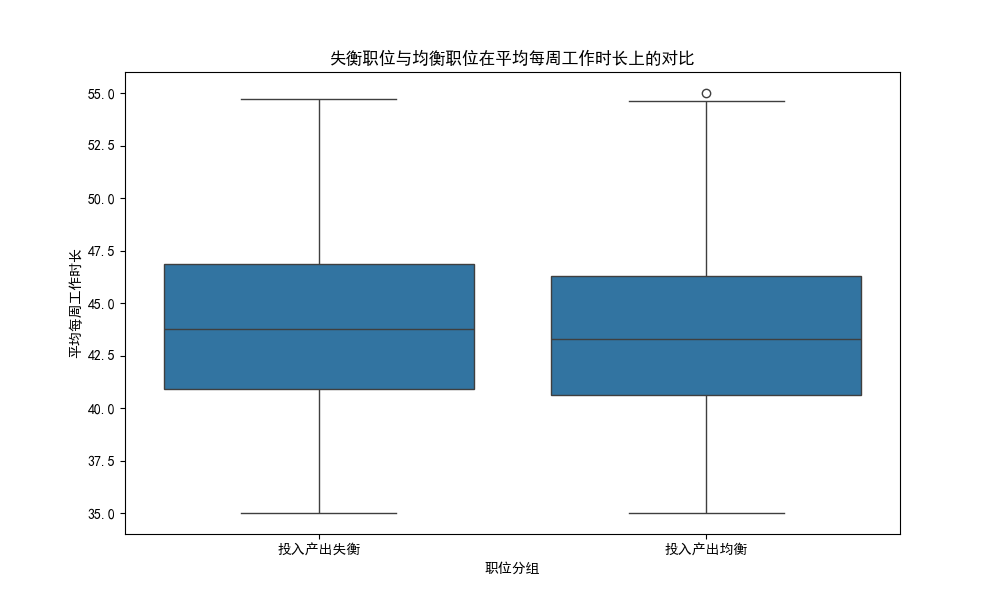
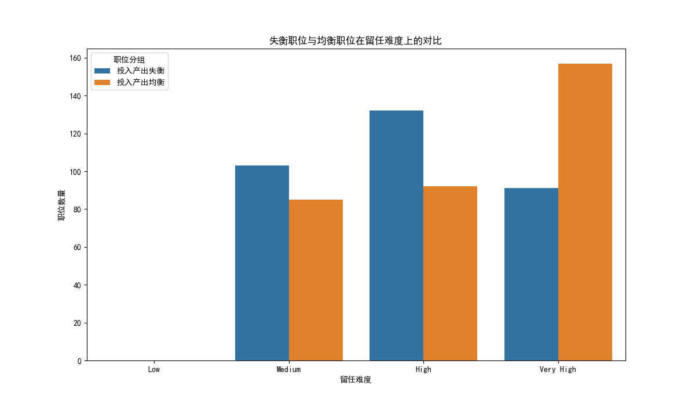

# 职位价值重估与人才配置优化报告

## 摘要

本次分析旨在重新评估公司内部各职位的真实价值与人才配置的合理性。我们重点关注了价值层级为“Tier 1”和“Tier 2”且市场人才竞争激烈的职位。分析发现，部分关键职位存在显著的**“投入产出比”失衡**现象。具体而言，尽管公司为这些职位投入了巨大的招聘成本（高人才竞争度），但其内部的“产出”——体现在**工作健康度（job_health_score）**和**职业发展满意度（avg_career_development_score）**上——却不尽如人意。这些失衡的职位同时表现出**更长的平均工作时长**和**更高的留任难度**，对组织的长期稳定和创新能力构成了潜在风险。

本报告将详细阐述分析过程，揭示失衡职位的工作特征，并提供一份待优化的具体职位清单。最后，我们将提出一系列关于人员调配和资源重新分配的优先级建议，以期优化人才结构，提升组织效能。

---

## 分析一：识别高竞争环境下的“投入产出失衡”职位

为了量化职位的“产出”，我们创建了一个**综合产出得分**（`output_score`），该得分是`job_health_score`和`avg_career_development_score`的平均值。随后，我们筛选出人才竞争程度为“High”或“Very High”的职位，并将它们的竞争水平与综合产出得分进行比较。

如下图所示，许多职位（尤其是图中的红点区域）虽然处于激烈的外部人才竞争中，其内部产出得分却低于平均线。这表明我们在这些职位上付出的高昂市场成本并未有效转化为内部员工的满意度和发展潜力。

图中，`Backend Developer`、`Software Engineer`、`Lead DevOps Engineer`和`Product Manager`等核心技术与产品职位，是“投入产出失衡”现象最严重的区域。这揭示了一个严峻问题：我们最需要吸引和留住的人才，其工作体验和发展前景可能并不理想。

---

## 分析二：探究失衡职位的工作特征差异

为了探究导致“投入产出失衡”的深层原因，我们对比了“失衡”职位与“均衡”职位在几个关键工作特征上的差异。

### 1. 平均每周工作时长

如下图所示，“投入产出失衡”的职位群体平均每周工作时长显著高于“均衡”职位。这表明，低产出并非源于员工投入不足，反而可能与**工作负荷过重、效率低下或长期加班文化**有关，这些因素最终侵蚀了员工的工作健康和发展空间。

### 2. 留任难度

留任难度的数据进一步佐证了我们的担忧。在“投入产出失衡”的职位中，被标记为“High”或“Very High”留任难度的职位比例远高于“均衡”职位。这形成了一个恶性循环：**工作体验差导致留任意愿降低，高流失率又进一步加剧了在岗员工的工作负荷和团队的不稳定性**。

---

## 核心发现与待优化职位清单

综合以上分析，我们可以得出结论：公司部分高竞争、高价值的职位正面临严峻的内部挑战。它们的“投入产出比”严重失衡，主要表现为**工作时间长、留任难度大、而工作健康度和职业发展满意度却很低**。

以下是根据“综合产出得分”从低到高排序的、**最需要关注和优化的10个职位**：

| 职位名称 (Job Title) | 综合产出得分 | 平均每周工作时长 | 留任难度 | 人才配置饱和度 | 人才质量指数 |
| :--- | :--- | :--- | :--- | :--- | :--- |
| Backend Developer | 24.34 | 45.3 | High | 0.94 | 0.122 |
| Software Engineer | 24.48 | 45.1 | Very High | 0.88 | 0.017 |
| Lead DevOps Engineer | 24.50 | 46.2 | Very High | 0.91 | 0.023 |
| Product Manager | 24.73 | 44.8 | High | 0.97 | 0.060 |
| Staff HR Business Partner | 25.64 | 43.5 | High | 1.00 | 0.130 |
| Sales Manager | 26.35 | 45.5 | High | 0.95 | 0.046 |
| Principal Security Engineer| 26.47 | 46.8 | Very High | 0.85 | 0.060 |
| Backend Developer | 26.54 | 45.2 | High | 0.93 | 0.074 |
| Sales Manager | 26.70 | 45.7 | High | 0.96 | 0.049 |
| Junior Security Engineer | 27.20 | 44.1 | High | 0.75 | 0.021 |

_注：部分职位因数据聚合出现在列表中多次，反映了该职位在不同业务单元或层级普遍存在问题。_

---

## 建议与行动方案

为解决上述“投入产出比”失衡问题，我们建议立即采取行动，并按以下优先级顺序重新分配资源：

### 优先级排序

1.  **高优先级（立即行动）**:
    *   **目标职位**: `Backend Developer`, `Software Engineer`, `Lead DevOps Engineer`, `Principal Security Engineer`。
    *   **理由**: 这些是公司的技术基石，其健康度直接影响产品研发的稳定性和创新能力。分析显示，这些职位工作时间最长、留任难度极高，问题最为紧迫。
    *   **建议**: **立即启动专项改进项目**。对这些职位的团队进行深入访谈，识别压力来源（如项目管理、技术债、跨部门协作障碍等）。审查并优化工作流程，考虑增补人员以缓解长期高负荷。

2.  **中优先级（中期规划）**:
    *   **目标职位**: `Product Manager`, `Sales Manager`。
    *   **理由**: 这些是驱动业务增长的核心商业职位。虽然问题紧迫性稍低于技术职位，但其健康度直接关系到公司的市场表现和营收能力。
    *   **建议**: **进行跨职能研讨会**。邀请产品和销售团队的管理者和骨干员工，共同探讨导致职业发展瓶颈和工作健康度低的原因。优化资源分配，加强对管理者的赋能培训。

3.  **低优先级（持续观察）**:
    *   **目标职位**: `Staff HR Business Partner`, `Junior Security Engineer`等其他上榜职位。
    *   **理由**: 这些职位同样存在失衡问题，但影响范围或紧迫性相对较小。
    *   **建议**: **纳入常规人力资源观察范围**。通过敬业度调研、绩效沟通等常规渠道持续跟进，确保问题不会恶化。

### 具体行动计划

1.  **深入诊断与访谈**: 针对高优先级职位，由HRBP牵头，立即组织与业务负责人、团队经理和一线员工的匿名或半匿名访谈，深入挖掘导致低产出得分和高留任风险的根本原因。

2.  **工作负荷与效率审查**: 结合 `avg_weekly_hours` 数据，对高优先级职位的实际工作负荷进行量化评估。分析是否存在人员编制不足、流程冗余或工具支持不够的问题，并制定解决方案。

3.  **重塑职业发展路径**: 针对`avg_career_development_score`偏低的职位，重新审视和设计其职业发展阶梯（Career Ladder），明确晋升标准，并配套提供充足的培训、轮岗和导师资源。

4.  **精准激励与认可**: 对于`talent_quality_index`较低但饱和度高的职位，说明我们拥有人才但未能有效激励。应设计更具针对性的认可和激励方案，特别是对于高绩效员工，要确保他们的贡献得到及时和公正的回报。

通过以上系统性的调整，我们有望将高昂的市场招聘成本真正转化为可持续的组织内部价值，从而在激烈的人才竞争中建立起真正的核心优势。
