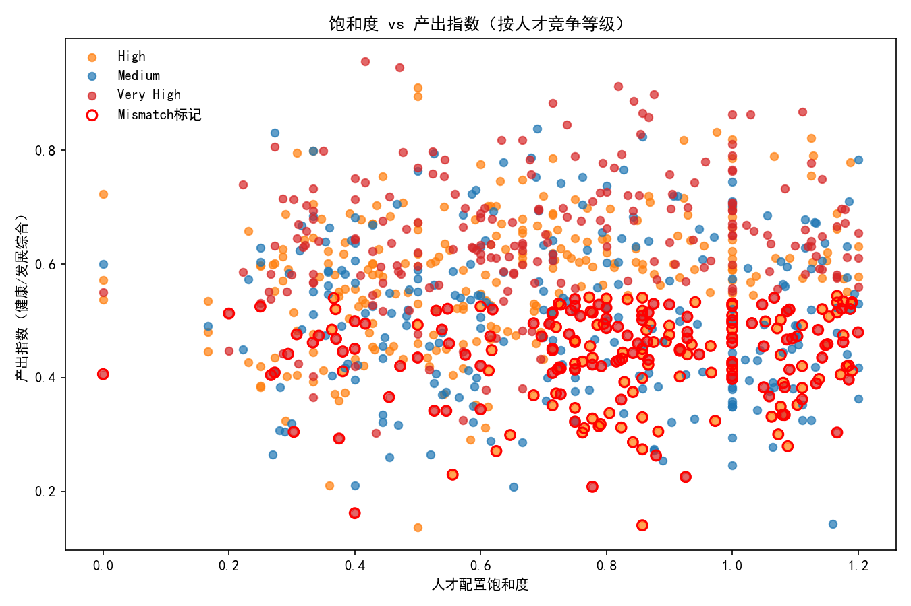
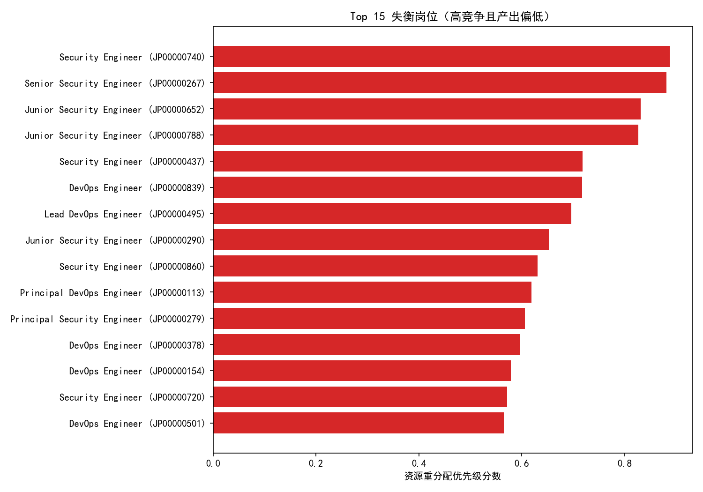

# 职位价值重估报告（面向 Tier 1 / Tier 2）——人才配置饱和度与投入产出诊断

## 摘要
- 覆盖范围：Tier 1/2 岗位共 900 个。
- 识别出“高竞争（High/Very High）但产出偏低且投入偏高/饱和偏高”的失衡岗位共 214 个（占 23.8%）。
- 失衡岗位的工作特征：
  - 平均周工时显著更高：45.05 小时 vs 42.19 小时（其他岗位）。
  - 倒班要求占比更高：25.2% vs 11.1%。
  - 留任难度更高：平均映射分 0.816 vs 0.634；分布中“High/Very High”合计占比 79.9%（其他岗位为 44.6%）。
  - 综合投入指数更高（0.49 vs 0.34），但综合产出指数更低（0.438 vs 0.578）。
- 产出与“人才质量指数/饱和度”的线性相关性较弱（相关系数分别为 -0.009/-0.013），提示组织流程或岗位设计类的结构性问题更可能是产出受限主因。
- 失衡职位集中在 Tier 1 的 Security/DevOps 相关序列，且多处于 Very High 竞争区间。

下文给出指标定义、方法、图示证据、失衡岗位清单（样例 Top 10）、以及人员调配与资源重分配的优先级建议。

---

## 指标定义与方法

- 人才配置饱和度（Talent Saturation）：current_employees_count / active_positions_count（0 分母时记 NaN）。
- 人才质量指数（Talent Quality Index）：high_performer_percentage × career_growth_potential_percentage（两列为 0–1 范围）。
- 产出指数（Output Index）：对 job_health_score 与 avg_career_development_score 分别做 Min-Max 归一化，并以 0.6/0.4 加权求和，更侧重岗位健康。
- 投入指数（Input Index）：0.5×周工时归一化 + 0.3×倒班惩罚(有倒班=1) + 0.2×留任难度映射（Low=0, Medium=0.5, High=0.8, Very High=1.0）。
- 失衡岗位识别逻辑（Mismatch）：
  - 人才竞争等级 ∈ {High, Very High}；
  - 产出指数低于整体中位数；
  - 且（投入指数≥整体上四分位数 或 饱和度≥整体中位数）。
- 资源重分配优先级分数（Realloc Priority）：(投入−产出)×(1+clamp(饱和度,0,2)/2)，兼顾“差值大小”和“饱和放大因子”。

不做任何数据清洗，仅使用给定数据直接分析。

---

## 关键发现（数据支撑）

1) 规模与相关性
- Tier 1/2 合计岗位数：900
- 人才质量指数与产出指数的相关系数：-0.009
- 人才饱和度与产出指数的相关系数：-0.013
解读：单纯增加高绩效占比或提升成长潜力比例，短期内未显著转化为更高的产出；饱和配置也未带来更高产出，提示流程/定位问题。

2) 失衡岗位与其他岗位的对比
- 平均周工时：45.05（失衡） vs 42.19（其他）
- 倒班要求占比：25.2%（失衡） vs 11.1%（其他）
- 平均留任难度映射：0.816（失衡） vs 0.634（其他）
- 投入指数：0.49（失衡） vs 0.34（其他）
- 产出指数：0.438（失衡） vs 0.578（其他）
- 留任难度分布（失衡）：High 41.6%，Very High 38.3%，Medium 20.1%
- 留任难度分布（其他）：Medium 46.9%，High 19.7%，Very High 24.2%，Low 9.2%

3) 失衡岗位集中趋势
- Top 失衡样本多来自 Security Engineer / DevOps Engineer 序列（Tier 1，Very High 竞争），周工时高、倒班多、留任难。

---

## 可视化证据

- 饱和度—产出关系（按竞争等级着色），并高亮失衡岗位


- 失衡岗位优先级 Top15


- 工作特征差异（失衡 vs 其他）


---

## 建议优化的具体职位清单（样例 Top 10）
按资源重分配优先分数排序，节选前 10 个作为示例（完整清单见 mismatch_positions_priority.csv，以及上图“Top15”）：
- JP00000740 — Security Engineer（Tier 1，Very High）：饱和度 1.11；周工时 52.3；倒班=是；产出低，投入高。
- JP00000267 — Senior Security Engineer（Tier 1，Very High）：饱和度 0.78；周工时 48.7；倒班=是；产出低，投入高。
- JP00000652 — Junior Security Engineer（Tier 1，Very High）：饱和度 1.13；周工时 51.8；倒班=是；产出低，投入高。
- JP00000788 — Junior Security Engineer（Tier 1，Very High）：饱和度 0.88；周工时 48.5；倒班=是；产出低，投入高。
- JP00000437 — Security Engineer（Tier 1，Very High）：饱和度 0.75；周工时 48.8；倒班=是；产出低，投入高。
- JP00000839 — DevOps Engineer（Tier 1，Very High）：饱和度 0.73；周工时 52.7；倒班=是；产出低，投入高。
- JP00000495 — Lead DevOps Engineer（Tier 1，Very High）：饱和度 0.60；周工时 50.2；倒班=是；产出低，投入高。
- JP00000290 — Junior Security Engineer（Tier 1，Very High）：饱和度 0.40；周工时 43.2；倒班=是；产出低，投入高。
- JP00000860 — Security Engineer（Tier 1，Very High）：饱和度 1.19；周工时 46.7；倒班=是；产出低，投入高。
- JP00000113 — Principal DevOps Engineer（Tier 1，Very High）：饱和度 0.75；周工时 49.6；倒班=是；产出低，投入高。

共同特征：Very High 竞争、周工时偏高、倒班要求普遍存在、留任难度高。

---

## 人员调配建议（面向失衡岗位）

1) 立即优化配置与负荷
- 饱和度≥1 或接近 1 的岗位（如若已出现 1.0+）：冻结新增与非关键 backfill，优先通过跨团队支援与自动化替代重复性工作，降低人力占用。
- 对周工时>48h 或倒班=是的岗位：实施轮班重构与排班优化，拆解低价值工作，将告警/巡检等高频低产任务自动化，压降非产出性投入。

2) 改善产出瓶颈
- 明确岗位级 OKR 与产出定义，减少非关键流程审批/等待；建立标准化交付模板与SLA，缩短交付周期。
- 引入平台化与自助化工具（DevOps/SecOps），减少人工交付依赖，提高同等人力的边际产出。

3) 保留与激励（针对留任难）
- Very High/High 留任难度岗位优先匹配专项留任计划：轮岗通道、技能进阶预算、夜班/倒班补贴与灵活排班。
- 将“倒班=是”的岗位作为重点：通过班次津贴与轮换机制缓解疲劳，降低离职风险。

4) 人才质量与结构优化
- 质量指数与产出相关性弱，建议转向“结构性能力”建设：关键流程能力认证、工具链掌握度、跨域协作能力训练，避免只追求“高潜/高绩效占比”的表观优化。

---

## 资源重新分配优先级与落地清单

优先级评分：realloc_priority_score 越高，表示“投入高、产出低，且饱和度放大”的紧急程度越高。
建议按三档推进：

- P1（立即行动）
  - 条件：Very High 竞争 且（周工时>48 或 倒班=是 或 饱和度≥1）。
  - 示例：JP00000740、JP00000652、JP00000839、JP00000495、JP00000860。
  - 动作：冻结增配/非关键 backfill；排班与流程双优化；专项留任与自动化投资优先覆盖。

- P2（1个季度内处理）
  - 条件：Very High/High 竞争，投入较高但饱和<1，或周工时 45–48 的边界岗位。
  - 示例：JP00000267、JP00000788、JP00000437、JP00000113。
  - 动作：聚焦流程梳理与能力平台化，设定季度性产出提升 KPI，再决定补员或转岗。

- P3（持续监控）
  - 条件：High 竞争但投入不高或产出接近中位线。
  - 动作：监控周工时与留任难度，实施轻量流程改造与工具升级，防止滑入 P2。

注：完整优先级排序见图表“Top15”与文件 mismatch_positions_priority.csv。

---

## 风险与限制
- 本分析未进行数据清洗，直接基于现有字段；指标归一化与阈值基于样本分布，适合横向对比，不代表绝对标准。
- 人才质量指数与产出关系或存在非线性/滞后效应；建议结合 OKR 完成周期与项目类型进一步分层验证。
- 仅覆盖 Tier 1/2；如需全面资源编排，建议纳入 Tier 3/4 做边际收益评估。

---

## 后续行动建议（Roadmap）
1) 两周内完成 P1 岗位的排班/流程诊断与自动化方案评审（以 Security/DevOps 为先）。
2) 建立岗位级“产出-投入”仪表板（周度更新），纳入：周工时、倒班、留任难度、饱和度、产出指数、在制任务数。
3) 试点两类结构性改造：
   - DevOps：CI/CD 自助化门户、变更审批轻量化、SRE 值班轮换优化。
   - Security：告警自动分流与噪声抑制、标准化应急预案库。
4) 以季度为周期复盘：产出指数提升≥10%、周工时下降≥2h、倒班占比下降≥5pct，作为阶段性验收。

---

## 附：用于绘图的核心 Python 代码片段
说明：以下代码已在分析中运行并生成本文所示图片，包含中文字体设置。

```python
import pandas as pd
import numpy as np
import matplotlib.pyplot as plt

# 字体设置
plt.rcParams['font.sans-serif'] = ['SimHei']
plt.rcParams['axes.unicode_minus'] = False

df = pd.read_csv('tier12_jobs.csv')

# 指标计算
df['talent_saturation'] = np.where(
    df['active_positions_count'] > 0,
    df['current_employees_count'] / df['active_positions_count'],
    np.nan
)
df['talent_quality_index'] = df['high_performer_percentage'] * df['career_growth_potential_percentage']

def minmax_norm(x):
    x = x.astype(float)
    mn, mx = np.nanmin(x), np.nanmax(x)
    return (x - mn) / (mx - mn) if (np.isfinite(mn) and np.isfinite(mx) and mx > mn) else pd.Series(np.full_like(x, np.nan, dtype=float))

df['job_health_norm'] = minmax_norm(df['job_health_score'])
df['career_dev_norm'] = minmax_norm(df['avg_career_development_score'])
df['output_index'] = 0.6 * df['job_health_norm'] + 0.4 * df['career_dev_norm']

hours_norm = minmax_norm(df['avg_weekly_hours'].fillna(np.nan))
retention_map = {'Low': 0.0, 'Medium': 0.5, 'High': 0.8, 'Very High': 1.0}
df['retention_score'] = df['retention_difficulty_level'].map(retention_map)
df['shift_penalty'] = (df['is_work_shift_required'] == 1).astype(int)
df['input_index'] = 0.5 * hours_norm + 0.3 * df['shift_penalty'] + 0.2 * df['retention_score']

# 阈值与失衡识别
output_median = df['output_index'].median()
input_q3 = df['input_index'].quantile(0.75)
sat_median = df['talent_saturation'].median()
df['is_high_comp'] = df['talent_competition_level'].isin(['High','Very High'])
df['is_mismatch'] = (
    df['is_high_comp'] &
    (df['output_index'] <= output_median) &
    ( (df['input_index'] >= input_q3) | (df['talent_saturation'] >= sat_median) )
)

# 图1：饱和度 vs 产出（按竞争等级着色，高亮失衡）
fig, ax = plt.subplots(figsize=(9,6))
color_map = {'Very High':'#d62728', 'High':'#ff7f0e', 'Medium':'#1f77b4'}
for comp, g in df.groupby('talent_competition_level'):
    ax.scatter(g['talent_saturation'], g['output_index'], s=30, alpha=0.7, label=str(comp), c=color_map.get(comp, '#7f7f7f'))
m = df['is_mismatch']
ax.scatter(df.loc[m,'talent_saturation'], df.loc[m,'output_index'], s=50, facecolors='none', edgecolors='red', linewidths=1.5, label='Mismatch标记')
ax.set_xlabel('人才配置饱和度'); ax.set_ylabel('产出指数'); ax.set_title('饱和度 vs 产出指数（按人才竞争等级）')
ax.legend(frameon=False); plt.tight_layout(); plt.savefig('saturation_vs_output.png', dpi=150)

# 图2：失衡岗位Top15（资源重分配优先级）
df['mismatch_score'] = df['input_index'] - df['output_index']
df['sat_factor'] = np.clip(df['talent_saturation'], 0, 2)
df['realloc_priority_score'] = df['mismatch_score'] * (1 + df['sat_factor']/2.0)
top15 = df[df['is_mismatch']].copy().sort_values(['realloc_priority_score','mismatch_score'], ascending=False).head(15)
fig, ax = plt.subplots(figsize=(10,7))
ax.barh(top15['job_title'] + ' (' + top15['job_profile_id'].astype(str) + ')', top15['realloc_priority_score'], color='#d62728')
ax.set_xlabel('资源重分配优先级分数'); ax.set_title('Top 15 失衡岗位（高竞争且产出偏低）')
ax.invert_yaxis(); plt.tight_layout(); plt.savefig('mismatch_top15.png', dpi=150)

# 图3：工作特征对比（失衡 vs 其他）
summary = {
    'avg_weekly_hours': [df[df['is_mismatch']]['avg_weekly_hours'].mean(), df[~df['is_mismatch']]['avg_weekly_hours'].mean()],
    'shift_rate': [ (df[df['is_mismatch']]['is_work_shift_required']==1).mean(), (df[~df['is_mismatch']]['is_work_shift_required']==1).mean() ],
    'ret_score': [ df[df['is_mismatch']]['retention_score'].mean(), df[~df['is_mismatch']]['retention_score'].mean() ]
}
fig, axes = plt.subplots(1,3, figsize=(14,4))
axes[0].bar(['失衡','其他'], summary['avg_weekly_hours'], color=['#d62728','#1f77b4']); axes[0].set_title('平均周工时')
axes[1].bar(['失衡','其他'], summary['shift_rate'], color=['#d62728','#1f77b4']); axes[1].set_title('倒班岗位占比')
axes[2].bar(['失衡','其他'], summary['ret_score'], color=['#d62728','#1f77b4']); axes[2].set_title('留任难度（均值映射分）')
for ax in axes: ax.set_ylim(bottom=0)
plt.suptitle('工作特征差异：失衡岗位 vs 其他岗位', y=1.05, fontsize=12); plt.tight_layout(); plt.savefig('work_features_comparison.png', dpi=150)
```

以上结果可直接支持“职位价值重估”的优化与资源重新分配决策。
