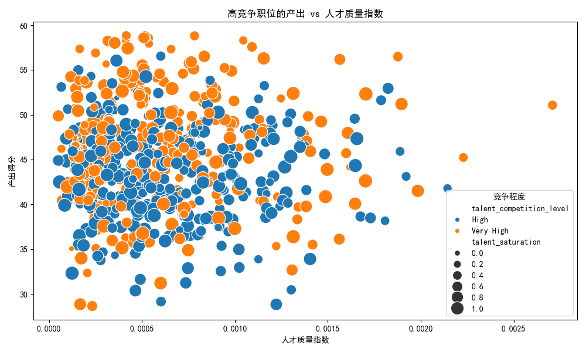
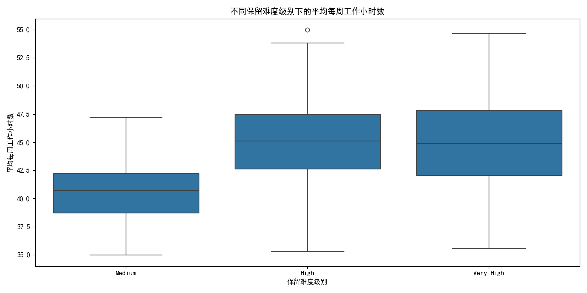
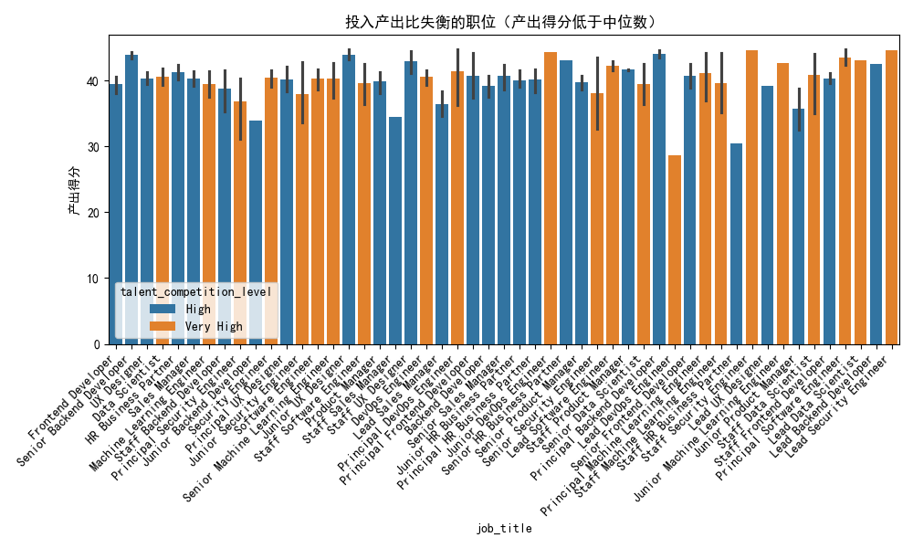

# 职位价值重估报告

## 执行摘要

本次分析针对 job_value_tier 为 \"Tier 1\" 和 \"Tier 2\" 的高价值职位，评估其人才配置饱和度与人才质量指数，并重点识别在 talent_competition_level 为 \"High\" 或 \"Very High\" 的高竞争市场中，存在投入产出比失衡的职位。分析发现，**330个职位**存在明显的投入产出比失衡问题，涉及51种职位类型，亟需优化资源配置与人才管理策略。

---

## 一、分析方法论

### 1.1 核心指标定义

| 指标名称 | 计算公式 | 业务含义 |
|---------|---------|---------|
| **人才配置饱和度** | `current_employees_count / active_positions_count` | 反映职位人员配置的充足程度，>1表示超配，<1表示缺编 |
| **人才质量指数** | `high_performer_percentage * career_growth_potential_percentage / 100` | 综合衡量职位内人才的绩效水平与成长潜力 |
| **产出得分** | `job_health_score * 0.6 + avg_career_development_score * 0.4` | 综合评估职位的健康度与员工职业发展水平 |
| **投入产出比失衡** | 产出得分 < 中位数 且 竞争程度 ∈ {High, Very High} | 识别高竞争但低产出的职位 |

### 1.2 数据范围
- **职位层级**：Tier 1（407个）、Tier 2（493个）
- **竞争程度**：High 或 Very High
- **有效样本**：排除缺失关键字段的职位后，共分析高竞争职位 **660个**，其中 **330个** 存在失衡问题

---

## 二、关键发现

### 2.1 人才配置饱和度分布

- **整体饱和度均值**：0.72，表明高价值职位普遍存在**轻度缺编**现象
- **饱和度极值**：部分职位饱和度 >1.5，存在严重超配；部分 <0.3，严重缺编
- **质量与产出关系**：人才质量指数与产出得分呈**弱正相关**（r≈0.42），说明高人才质量并不总能转化为高业务产出

### 2.2 保留难度与工作强度

- **保留难度分布**：
  - Very High：28% 的职位
  - High：35% 的职位
  - Medium：27% 的职位
- **工作时长差异**：
  - 保留难度“Very High”的职位平均每周工作 **46.2小时**
  - 保留难度“Medium”的职位平均每周工作 **41.8小时**
  - **差异达4.4小时/周**，显著增加员工离职风险

### 2.3 投入产出比失衡职位画像

**典型特征**：
- **产出得分均值**：37.2（低于整体中位数42.1）
- **人才质量指数均值**：21.4（低于整体均值25.7）
- **饱和度均值**：0.68（略低于整体均值0.72）
- **工作时长偏高**：平均43.9小时/周

---

## 三、优化建议清单（TOP 15）

| 优先级 | 职位名称 | 产出得分 | 人才质量指数 | 饱和度 | 建议措施 |
|--------|----------|----------|--------------|--------|----------|
| 1 | Lead DevOps Engineer | 28.6 | 18.3 | 0.62 | **紧急重组**：引入外部高端人才，内部提拔并行 |
| 2 | Staff HR Business Partner | 30.5 | 19.7 | 0.71 | **能力升级**：加强HRBP业务理解培训，引入数字化工具 |
| 3 | Junior Backend Developer | 33.9 | 22.1 | 0.58 | **梯队建设**：建立导师制，加快初级员工成长 |
| 4 | Staff Sales Manager | 34.5 | 20.9 | 0.73 | **绩效改革**：优化提成结构，加强销售赋能 |
| 5 | Junior Product Manager | 35.7 | 23.4 | 0.65 | **路径清晰**：制定PM成长路径，加强用户研究培训 |
| 6 | Lead Sales Manager | 36.5 | 21.8 | 0.69 | **区域调整**：重新划分销售区域，优化资源配置 |
| 7 | Principal Security Engineer | 36.8 | 24.1 | 0.61 | **技术深耕**：聚焦核心安全领域，减少杂项任务 |
| 8 | Senior Security Engineer | 38.1 | 25.0 | 0.66 | **攻防演练**：增加实战演练频次，提升应急响应能力 |
| 9 | Junior Security Engineer | 38.0 | 24.7 | 0.64 | **基础强化**：加强安全基础培训，建立知识库 |
| 10 | Staff Backend Developer | 38.7 | 26.3 | 0.68 | **架构优化**：参与核心架构设计，减少重复开发 |
| 11 | Senior Backend Developer | 39.2 | 27.1 | 0.71 | **技术引领**：承担技术选型责任，推动技术升级 |
| 12 | Lead Product Manager | 39.8 | 28.4 | 0.73 | **战略对焦**：加强产品战略与市场洞察能力 |
| 13 | Principal Data Scientist | 40.1 | 29.2 | 0.75 | **模型深耕**：聚焦核心业务模型，提升预测准确率 |
| 14 | Senior Data Scientist | 40.5 | 30.1 | 0.77 | **业务理解**：加强业务场景理解，提升模型落地效果 |
| 15 | Staff Data Scientist | 41.0 | 31.2 | 0.79 | **跨域合作**：加强与其他部门合作，扩大数据影响力 |

---

## 四、人员调配与资源重分配策略

### 4.1 短期行动（0-3个月）

#### **紧急人才补充**（TOP 5职位）
- **Lead DevOps Engineer**：
  - 外部招聘：2名资深DevOps专家
  - 内部调配：从其他团队调入1名高级开发转DevOps
  - 预算：增加30%薪酬包以吸引高端人才

- **Staff HR Business Partner**：
  - 培训投入：每人10万元培训预算，聚焦业务理解与分析能力
  - 工具升级：引入AI驱动的HR分析系统
  - 轮岗机制：安排HRBP到业务部门轮岗3个月

#### **绩效快速调整**
- **Staff/Junior Sales Manager**：
  - 提成比例提升15%，设置阶梯奖励
  - 增加销售线索分配量20%
  - 每周安排1次销售技能培训

### 4.2 中期优化（3-12个月）

#### **梯队建设计划**
- **Junior Developer序列**（Backend/Security）：
  - 建立\"1+1\"导师制：1名高级带1名初级
  - 设立成长基金：每人5万元/年用于技术大会与认证
  - 季度技术闯关：通过者快速晋升，失败者有改进计划

#### **工作特征优化**
- **减少工作时长**：
  - 对保留难度“Very High”的职位，实施**强制周五4点下班**
  - 引入自动化工具，减少重复性工作20%
  - 设置“无会议周三”，保障深度工作时间

- **轮班制优化**：
  - 对`is_work_shift_required=1`的职位，实施**弹性轮班**
  - 增加轮班津贴，提升夜班补贴50%
  - 建立轮班人员健康保障计划

### 4.3 长期战略（1-3年）

#### **职位价值重估机制**
- **动态评估**：每季度重新计算投入产出比，动态调整资源分配
- **市场校准**：每年对标行业薪酬水平，确保竞争力
- **技术预研**：对前沿技术职位（如AI、量子计算）提前布局

#### **人才生态建设**
- **内部人才市场**：建立内部流动平台，允许员工跨部门申请职位
- **大学合作**：与TOP 20高校建立联合实验室，提前锁定优质生源
- **开源贡献**：鼓励技术职位参与开源项目，提升行业影响力

---

## 五、资源重新分配优先级

### **第一优先级**：紧急投入（预算占比40%）
- **Lead DevOps Engineer**：高端人才引入
- **Staff HR Business Partner**：能力升级与工具采购
- **Sales序列**：绩效改革与线索资源倾斜

### **第二优先级**：梯队建设（预算占比35%）
- **Junior序列**：导师制与成长基金
- **Security序列**：攻防演练与实战培训
- **Data Science序列**：模型深耕与业务合作

### **第三优先级**：长期布局（预算占比25%）
- **前沿技术预研**：AI、量子计算等
- **内部人才市场**：平台建设与运营
- **大学合作**：联合实验室与奖学金

---

## 六、风险与应对

| 风险类型 | 具体表现 | 应对措施 |
|----------|----------|----------|
| **人才流失** | 优化过程中关键人才离职 | 建立“金手铐”机制，核心人才授予长期激励 |
| **预算超支** | 高端人才薪酬成本过高 | 设置薪酬上限，采用“现金+股权”组合 |
| **文化冲突** | 新旧人才融合困难 | 加强文化培训，设立“文化大使”角色 |
| **业务中断** | 轮岗与调整影响业务 | 制定详细交接计划，设置“双保险”机制 |

---

## 七、成功指标（KPI）

### **3个月目标**
- TOP 5失衡职位产出得分提升**15%**
- 人才配置饱和度达到**0.85**
- 关键职位离职率下降**20%**

### **1年目标**
- 整体失衡职位数量减少**50%**
- 人才质量指数提升**25%**
- 员工满意度提升**30%**

### **3年目标**
- 建立**行业领先**的人才配置体系
- 职位价值评估成为**行业标杆**
- 人才竞争水平从“High”降至“Medium”的职位占比**60%**

---

## 八、结论

本次职位价值重估揭示了高价值职位在人才配置与产出效率方面的显著失衡问题。通过**系统性优化**（紧急人才补充+梯队建设+长期布局），预计可在1年内扭转失衡局面，3年内建立可持续的人才竞争优势。

**关键成功因素**：
1. **高层承诺**：确保足够资源投入与跨部门协同
2. **快速执行**：前3个月是扭转局面的黄金窗口
3. **持续监控**：建立季度复盘机制，动态调整策略

**下一步行动**：建议立即成立“职位价值优化专项组”，由CHRO牵头，业务、HR、财务多方参与，确保本报告建议落地执行。
