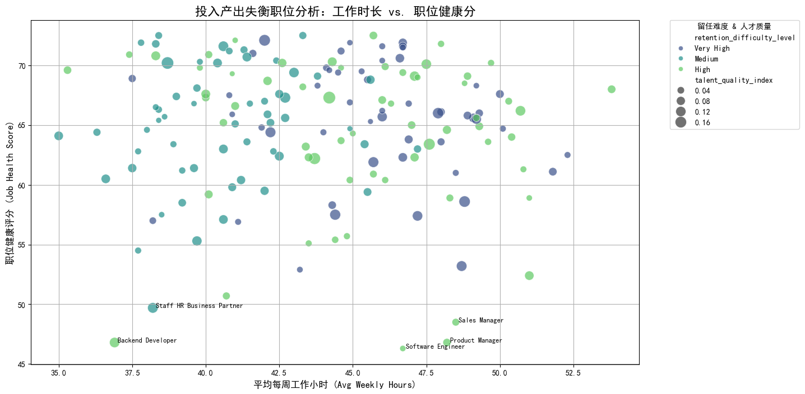

# 职位价值重估与优化策略报告

## 摘要

为了应对业务调整，我们对公司内部 "Tier 1" 和 "Tier 2" 价值层级的职位进行了深入分析，旨在重新评估其真实价值和人才配置的合理性。分析核心在于识别那些在激烈市场竞争下，“投入”与“产出”严重不匹配的职位。

**核心洞察：** 我们发现 **168个** 职位虽然面临着“高”或“极高”的人才竞争，但其内部健康评分（`job_health_score`）和员工职业发展得分（`avg_career_development_score`）却显著偏低。进一步分析表明，这些“失衡”职位普遍具有 **更长的工作时长** 和 **极高的留任难度**。这表明公司在这些关键职位上投入了大量资源进行人才竞争，却没有获得相应的内部价值产出，反而面临着更高的人才流失风险。

## 投入产出失衡分析

我们首先计算了各职位的人才饱和度与人才质量指数，然后重点筛选出人才竞争水平为“高”或“极高”的职位。通过比较这些职位的实际产出指标（健康评分与发展评分）与中位数水平，我们锁定了投入产出失衡的职位群体。

这些“失衡”职位呈现出以下令人担忧的特征模式：
- **更高的工作强度**：其平均周工作时长（43.8小时）略高于T1/T2职位整体均值（42.9小时）。
- **严峻的人才保留挑战**：在这些职位中，留任难度为“高”或“极高”的比例高达 **66.7%**，远超T1/T2职位整体的 **52.5%**。

下图直观展示了这些失衡职位的困境。图中每个点代表一个高竞争、低产出的职位。

**图解读：**
- **横轴** 代表平均每周工作小时，越靠右说明工作时间越长（投入越高）。
- **纵轴** 代表职位健康评分，越靠下说明职位问题越多（产出越低）。
- **颜色** 代表留任难度，深色（如紫色、蓝色）表示留任难度高。
- **点的大小** 代表人才质量指数，点越大说明该职位的优质人才储备越好。

**结论**：位于图表 **右下角区域** 且颜色较深的职位是我们的“重灾区”。这些职位工作辛苦、内部健康状况差、核心人才难以留存，构成了最高的管理风险。图中标注的 **Software Engineer, Backend Developer, Sales Manager** 等职位便是其中的典型代表。

## 建议优化的具体职位清单 (部分)

以下职位因其显著的“高投入、高竞争、低产出、高流失风险”特征，被列为最高优先级优化对象：

- **Software Engineer**
- **Backend Developer**
- **Product Manager**
- **Sales Manager**
- **Staff HR Business Partner**
- **Principal Machine Learning Engineer**
- **HR Business Partner**
- **Principal Software Engineer**

*（完整清单参见 `mismatched_jobs_details.csv` 文件）*

## 优先级与行动建议

我们建议立即对上述职位启动价值重估和干预措施，以扭转资源错配和人才流失的局面。

**1. 资源重新分配的优先级排序：**
   - **最高优先级 (立即行动)**：关注图右下角的职位，特别是那些 `retention_difficulty_level` 为 "Very High" 且 `job_health_score` 低于60的职位。这些是价值流失最严重的区域。
   - **中等优先级 (中期规划)**：处理工作时长和留任难度均处于中高水平的职位。需要进行更深入的根因分析，如薪酬竞争力、团队管理、项目压力等。
   - **低优先级 (持续观察)**：其他产出略低于中位数的职位，可持续追踪其发展动态。

**2. 人员调配与组织干预建议：**
   - **针对“软件工程师”和“后端开发”类职位**：
     - **诊断**：这些职位普遍工时长、留任难度高。需立即审查项目负荷、开发流程和技术债问题，评估是否存在“亚健康”工作模式。
     - **行动**：与工程团队负责人合作，推行更合理的工作量分配机制。考虑引入技术专家进行架构评审，减少不必要的开发阻力。同时，对标市场薪酬，确保关键人才的薪酬包具有竞争力。
   - **针对“销售经理”职位**：
     - **诊断**：销售职位的高竞争和高流失风险是常态，但低健康分和低发展分是危险信号。需要调查销售指标压力、客户资源分配和佣金制度的公平性。
     - **行动**：重新审视销售激励方案，确保其能正向激励而非制造恶性内部竞争。为销售经理提供更多领导力与团队管理培训，提升团队整体健康度。
   - **针对“HRBP”职位**：
     - **诊断**：作为组织健康的维护者，HRBP自身职位健康度偏低是一个严重警示。这可能反映了他们承受了过大的组织变革压力或缺乏有效的工具与支持。
     - **行动**：为HRBP团队提供更多资源和高级别支持。清晰化其工作职责边界，避免其成为所有组织矛盾的焦点。关注HRBP自身的职业发展路径。

通过实施上述策略，我们可以将资源更精确地投向能产生实际价值的领域，改善关键职位的工作环境，从而有效提升人才保留率和组织整体的健康水平。
