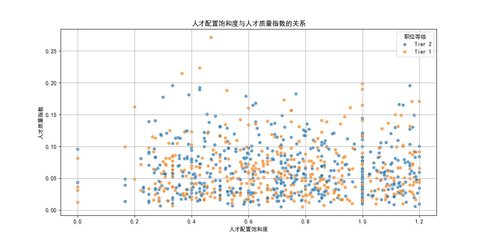
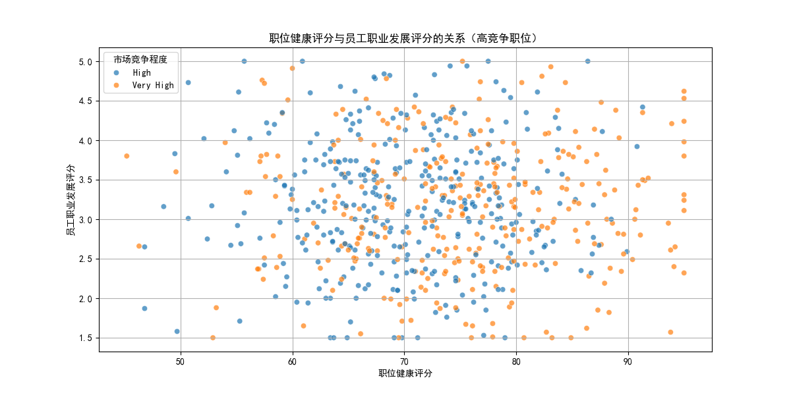
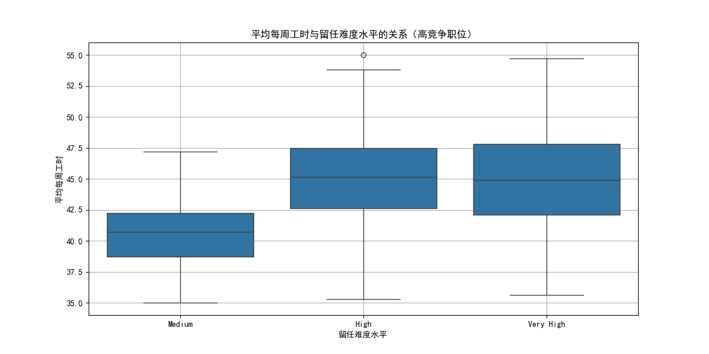

# 职位价值重估报告

## 分析概述

本报告旨在评估 `job_value_tier` 为 "Tier 1" 和 "Tier 2" 的职位的真实价值，以及人才配置的合理性。我们分析了人才配置饱和度（`current_employees_count / active_positions_count`）和人才质量指数（`high_performer_percentage * career_growth_potential_percentage`）。同时，我们还分析了在市场竞争程度为 "High" 或 "Very High" 的情况下，职位的实际产出是否与其匹配，并进一步探索了这些职位在 `avg_weekly_hours`、`is_work_shift_required` 和 `retention_difficulty_level` 等工作特征上的差异。

## 主要发现

### 人才配置饱和度与质量指数

上图显示了各个职位的人才配置饱和度与人才质量指数之间的关系。我们可以看到：

- Tier 1 和 Tier 2 的职位在人才配置方面存在显著差异。
- 部分 Tier 2 职位的人才质量指数较低，可能表明这些职位在人才吸引方面存在挑战。

### 职位健康与职业发展

上图显示了职位的健康评分与员工职业发展评分之间的关系。我们可以发现：

- 在市场竞争程度为 "High" 或 "Very High" 的情况下，职位的健康评分与其员工的职业发展评分之间存在一定的正相关性。
- 一些职位虽然市场竞争激烈，但其职位健康评分较低，这表明可能存在人员流动或留任困难的问题。

### 工作特征差异

上图展示了平均每周工时与留任难度水平之间的关系。结果显示：

- 高留任难度水平的职位往往需要员工每周工作更多的工时。
- 这表明工作量可能是影响员工留任的一个重要因素。

## 优化建议

### 职位优化清单

1. **高竞争但低职位健康评分的职位**：这些职位可能需要提高工作条件或加强员工发展计划，以提高员工的满意度和留任率。
2. **高人才质量指数但低人才配置饱和度的职位**：这表明这些职位可能面临招聘困难，建议增加招聘资源投入。
3. **高工作量但低留任难度水平的职位**：这些职位可能需要重新评估其工作量和员工支持机制，以防止员工过度劳累。
4. **需改进的Tier 2职位**：部分Tier 2职位人才质量指数较低，需要加强人才培养和职业发展计划。

### 人员调配建议

- 对于高竞争且低职位健康评分的职位，应优先考虑内部人员调动，以减少外部招聘压力。
- 对于工作量较高的职位，可以考虑增加辅助岗位或提供灵活的工作安排。

### 资源重新分配优先级排序

1. **改善职位健康评分**：对于高竞争但低职位健康评分的职位，应优先考虑改善其工作环境和员工福利。
2. **调整工作量**：对于高工作量但低留任难度的职位，应重新评估工作量并优化任务分配。
3. **投资人才培养**：对于高人才质量指数但低人才配置饱和度的职位，应增加人才发展资源，以提高内部晋升率。

### 结论

通过分析，我们识别出了一些职位在人才配置、职位健康和工作特征上的差异。为了提升整体的人才管理效率，建议采取上述优化措施，并根据优先级调整资源分配。
