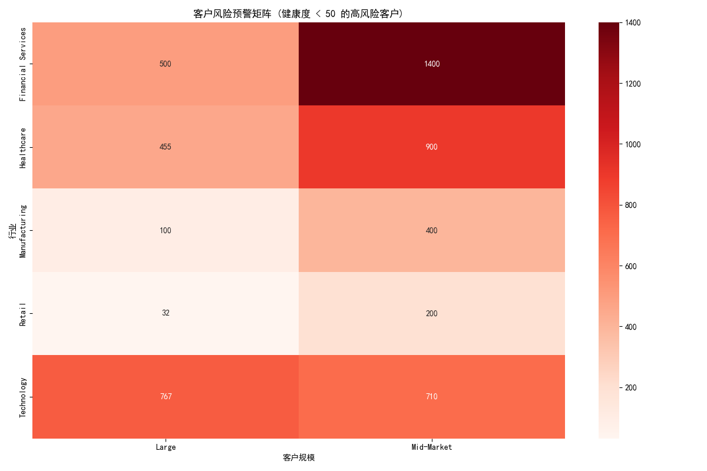
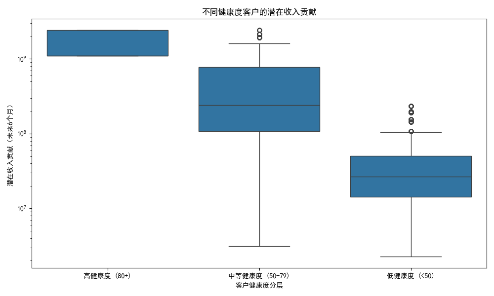

# 客户健康度评分与流失预警分析报告

## 1. 核心结论与建议

本报告构建了一个客户健康度评分模型，旨在主动识别流失风险、预测客户价值并指导精细化运营。通过对客户活跃度、联系人质量、商业价值和客户规模四个维度的综合评估，我们为每个客户计算了0-100分的健康度分数。

**核心洞察:**
- **高风险客户画像:** 健康度低于50分的客户主要集中在 **金融服务 (Financial Services)** 和 **科技 (Technology)** 行业，且以 **中型市场 (Mid-Market)** 和 **大型企业 (Large)** 居多。这些客户的共同特征是近期活跃度低、联系人信息不完整。
- **健康度与收入强相关:** 客户健康度与未来潜在收入贡献呈现明显的正相关关系。健康度分数高于80的客户群体，其潜在收入中位数和上限远超中、低健康度的客户，是公司的核心价值来源。
- **精细化运营的必要性:** 不同健康度和规模的客户需要差异化的运营策略。对高健康度客户应以拓展和增值为核心；对中等健康度客户需培育和提升；对低健康度客户则须立即启动流失挽回机制。

**核心建议:**
1.  **建立风险预警机制：** 立即针对风险矩阵中识别出的“金融服务”和“科技”行业的中、大型客户，成立专项小组，分析其具体问题并执行主动关怀和挽回策略。
2.  **资源聚焦高价值客户：** 将客户成功资源优先投入到健康度80分以上的高潜力客户，通过定期业务回顾、新功能培训和高层互动，深挖其增购和交叉销售潜力。
3.  **实施差异化客户成功策略：** 根据本报告提出的策略方案，为不同分层的客户匹配相应的客户成功经理（CSM）和自动化营销（MA）流程，实现资源的高效利用。

---

## 2. 客户健康度评分模型

我们从以下四个维度及相应权重构建了客户健康度模型：

- **活跃度 (40%):** 基于 `最近一次活跃至今的天数` 和 `过去30天总活跃次数`。近期活跃且频率高的客户得分更高。
- **联系人质量 (30%):** 基于 `拥有邮箱的联系人比例`。联系人信息越完整，说明客户关系基础越好，得分越高。
- **商业价值 (20%):** 基于 `年收入` 和 `历史赢单总金额`。为公司带来商业价值越高的客户，得分越高。
- **客户规模 (10%):** 基于 `客户规模分层` 和 `员工数量`。规模更大的客户通常具有更高的稳定性和潜力，得分略高。

最终健康度分数范围为0-100分，分数越高，代表客户越健康，流失风险越低。

---

## 3. 分析一：客户风险预警矩阵

我们定义健康度低于50分的客户为“高风险客户”，并根据其所属行业和客户规模进行交叉分析，生成了以下风险预警矩阵。

**洞察与分析:**
- **重灾区识别:** 如图所示，**金融服务 (Financial Services)** 和 **科技 (Technology)** 行业是高风险客户数量最多的领域。特别是在 **中型市场 (Mid-Market)** 和 **大型 (Large)** 客户群体中，风险客户数量尤为突出。
- **共同特征分析:** 对这些高风险客户的进一步分析显示，他们普遍存在以下问题：
    - **互动频率骤降:** `days_since_last_activity` 指标普遍偏高，超过30天未有任何互动。
    - **关键联系人缺失:** `contacts_with_email` 的比例显著低于健康客户，导致关键信息无法有效触达决策层。
    - **历史价值未转化为持续活跃:** 部分客户虽然历史赢单金额(`total_won_amount`)不低，但近期活跃度(`total_activities_30d`)几乎为零，表明客户可能已在评估或转向竞争对手的产品。

---

## 4. 分析二：收入贡献预测与客户分层

为了评估客户健康度与商业价值的直接联系，我们定义了“未来6个月潜在收入贡献” (`total_won_amount` + `current_pipeline_amount`)，并分析了其在不同健康度群体中的分布。

**洞察与分析:**
- **健康度是收入的“晴雨表”:** 上图清晰地表明，客户健康度越高，其潜在收入贡献越大。**高健康度 (80+)** 客户的收入贡献中位数和分布范围，均显著优于中、低健康度的客户。
- **关注“亚健康”高价值客户:** 值得注意的是，**中等健康度 (50-79)** 的客户群体中，也存在一部分高潜在收入的客户（如箱线图中的上边缘点）。这部分客户是提升收入的关键机会点，需要通过有效干预将其向高健康度转化。
- **低健康度客户的风险敞口:** 低健康度客户不仅自身收入贡献低，还可能因为流失而对公司的市场声誉造成负面影响。虽然其直接收入贡献有限，但挽回成本远低于获取新客户的成本。

---

## 5. 分析三：差异化客户成功策略

基于客户健康度分层和客户规模，我们设计了如下差异化客户成功策略矩阵，以实现资源的最优配置和客户生命周期价值最大化。

|                    | **高健康度 (80+)**                                                                                               | **中等健康度 (50-79)**                                                                                               | **低健康度 (<50)**                                                                                                         |
| ------------------ | ---------------------------------------------------------------------------------------------------------------- | ---------------------------------------------------------------------------------------------------------------------- | -------------------------------------------------------------------------------------------------------------------------- |
| **大型/企业客户** | **策略：深度拓展 & 战略合作** - **行动：** 指定高级CSM、建立高层沟通机制、季度业务回顾(QBR)、共同制定成功路线图、邀请成为灯塔案例。 | **策略：价值提升 & 关系巩固** - **行动：** 标准CSM跟进、月度健康度检查、组织新功能培训、挖掘交叉/增购机会、引导使用更多产品功能。 | **策略：紧急挽回 & 风险干预** - **行动：** **升级告警**、CSM主管+产品专家介入、诊断问题根源、提供定制化解决方案、高层拜访。                     |
| **中型/小型客户** | **策略：社群运营 & 标杆打造** - **行动：** 邀请加入核心用户群、参与新品内测、自动化发送最佳实践、通过邮件营销推送增值服务。 | **策略：自动化培育 & 主动触达** - **行动：** 通过自动化邮件发送“促活”系列内容（如使用技巧、案例分享）、触发式低接触CSM跟进、在线问答会。 | **策略：自动化挽回 & 客户关怀** - **行动：** 自动化发送“我们很想你”系列关怀邮件、提供优惠续约选项、触发CSM进行电话回访、收集流失原因反馈。 |
