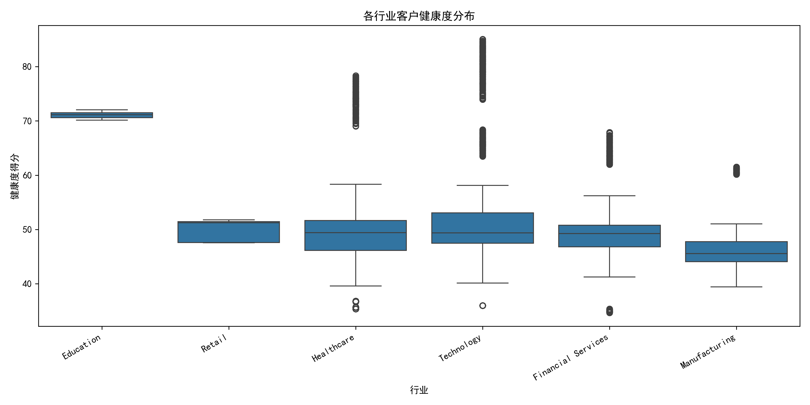
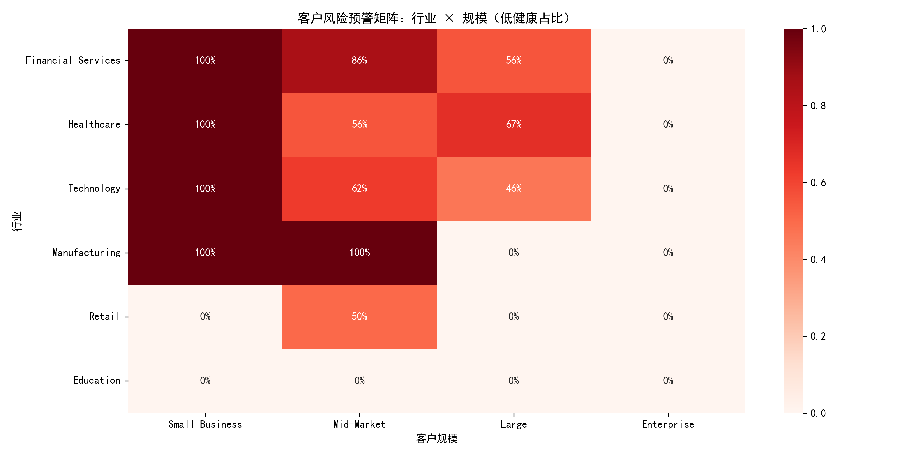
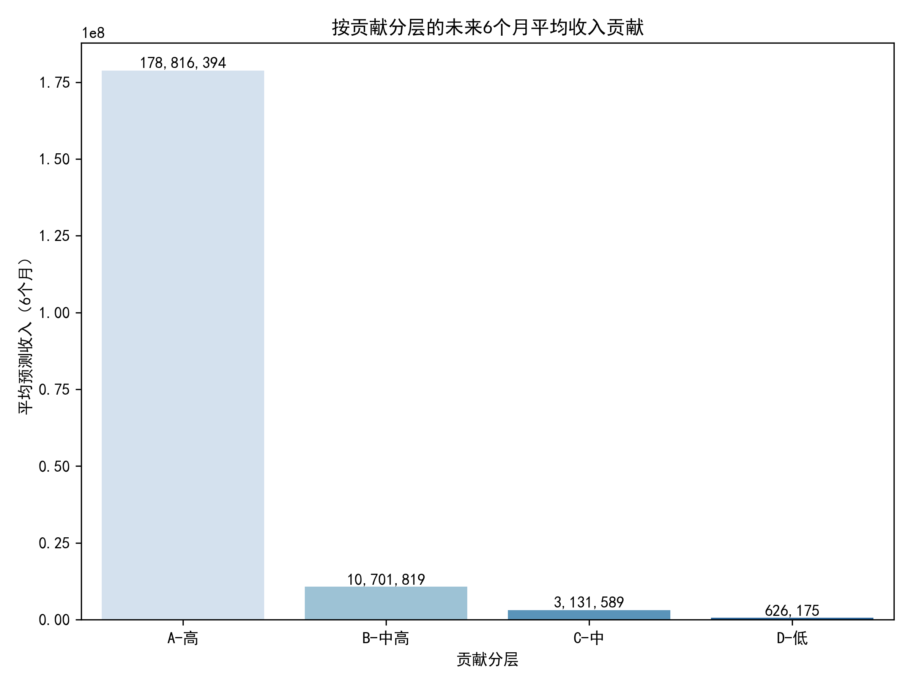
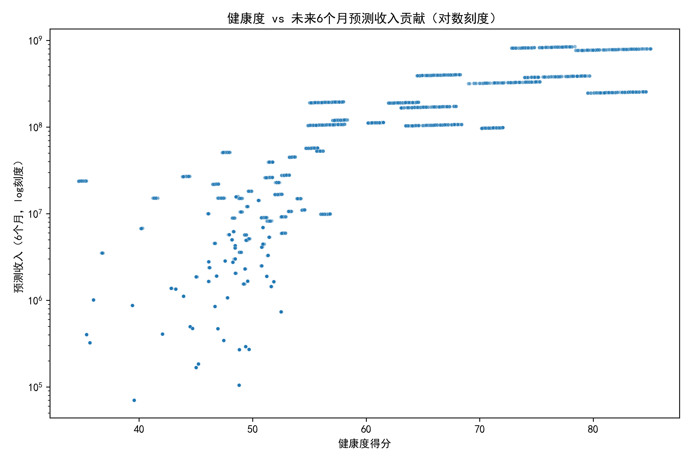

# 客户健康度评分与流失风险预警、收入预测与CS策略（以账户为粒度）

> 样本：10,000 账户；数据来源：salesforce__customer_360_view

## 方法概述
- 评分目标：为每个账户计算0-100分的客户健康度，预测未来6个月收入贡献，并输出行业×规模的风险预警矩阵与分层运营策略。
- 评分维度与权重：
  - 活跃度 40%（近期活跃+30天活动量）
  - 联系人质量 30%（contacts_with_email / total_contacts）
  - 商业价值 20%（annual_revenue 与 total_won_amount）
  - 客户规模 10%（account_size_segment 与 number_of_employees）
- 归一化方法：采用Min-Max到[0,100]；days_since_last_activity取反向（越近越高分）。
- 风险分档：高健康(80+)、中等(50-79)、低健康(<50)。
- 收入预测（6个月）：规则模型
  - 历史Run-rate：total_won_amount / (account_age_days/30) × 6 × 健康因子(0.5→1.0)
  - 管道转化：current_pipeline_amount × [win_rate% × (0.4 + 0.8×health/100)]
  - 预测贡献 = 上述两部分之和

注：绘图使用Python并设置中文字体
```python
plt.rcParams['font.sans-serif'] = ['SimHei']
plt.rcParams['axes.unicode_minus'] = False
```

## 一、健康度评分结果与总体洞察
- 样本数：10,000
- 平均健康度：50.7 分
- 低健康(<50)占比：59%
- 预测6个月收入贡献总和：483,189,900,000
- 健康度与预测贡献的相关系数：0.760（强正相关）

健康度分布（按行业）：



解读：
- 行业间中位数存在差异，结合下节风险矩阵可定位更具体问题行业与规模段。

## 二、客户风险预警矩阵（行业 × 规模）

指标：低健康(<50)占比



高风险单元格（样本≥30，低健康率最高TOP）：
- Healthcare × Small Business：低健康占比 100%（n=600）
- Technology × Small Business：低健康占比 100%（n=600）
- Manufacturing × Mid-Market：低健康占比 100%（n=400）
- Financial Services × Small Business：低健康占比 100%（n=300）
- Manufacturing × Small Business：低健康占比 100%（n=200）
- Financial Services × Mid-Market：低健康占比 85.7%（n=1400）
- Healthcare × Large：低健康占比 66.7%（n=600）
- Technology × Mid-Market：低健康占比 62.5%（n=800）

高风险行业（加权平均低健康率TOP3）：
- 金融服务（Financial Services）
- 医疗健康（Healthcare）
- 科技（Technology）

低健康客户共性画像（<50分）：
- 平均最近活跃天数：25.5 天
- 30天活动数中位数：3 次（活跃度偏低，是主要拖累因子）
- 联系人邮箱覆盖率中位数：90%（联系人质量并非主要短板）
- 年营收中位数：约 98.6M
- 历史成交金额中位数：约 7.38M；当前管道金额中位数：约 7.03M
- 员工人数中位数：566（说明低健康并非仅发生在极小企业）

诊断：
- 低健康主要由“活跃度维度（40%权重）”不足驱动：近30天互动次数偏低，且最近活跃间隔偏长。
- 联系人邮箱覆盖率中位数较高，意味着“能触达”，但“未触达/未互动”是关键问题。
- 特定行业与规模段（如小企业、制造业中端、金融服务）风险集中，需定制化激活与提频策略。

## 三、收入贡献预测与分层
规则模型输出的未来6个月预测贡献分层（四分位）：



- A-高（Top 25%）：占账户数25%，贡献占比92.5%
- B-中高：贡献占比5.5%
- C-中：贡献占比1.6%
- D-低：贡献占比0.3%

健康度与收入关系（对数刻度）：



要点：
- 健康度与未来收入贡献强正相关（r≈0.76）。
- 提升健康度有双重杠杆：
  - Run-rate随健康度上升而放大（0.5→1.0线性）
  - 管道期望转化：factor = win_rate × (0.4 + 0.8×health/100)。例如：健康度+10分，在30%赢率、$10M管道下，额外期望≈$10M × 30% × 0.08 = $0.24M。

## 四、客户成功差异化策略（按健康度×规模）

A. 高健康（80+）：增长与扩展
- Small Business：
  - 自动化触达+套餐化增购（附带限时折扣/功能包），引导自助升级；
  - 通过NPS与应用内提示推动口碑与评价，降低服务成本。
- Mid-Market：
  - 季度业务回顾(QBR)与联合规划，部署多线联系（Champion、经济买家、技术负责人）；
  - 以用量/价值里程碑驱动加购（座席扩容、模块解锁、跨部门复制）。
- Large/Enterprise：
  - 高管赞助+联合路线图（Roadmap Co-creation），发掘多BU/多区域扩张；
  - 解决方案打包（跨产品线Bundling），长期承诺换折扣，建立多年度框架协议。

B. 中健康（50-79）：提频提质，防下滑
- Small Business：
  - 周期化教育（直播/录播/Playbook）+产品内提示，目标：30天活动数≥5次；
  - 营销自动化+场景模板（行业模板包）提升采用深度；
- Mid-Market：
  - 30-60天提升计划：
    - 触发条件：近30天活动<5或最近活跃>21天；
    - 行动：CSM月度业务回顾+用例共创，技术办公时(Office Hour)，关键用例落地；
  - 提升联系人覆盖面：关键岗位≥3人（决策、使用、IT），确保多线；
- Large/Enterprise：
  - 项目化成功计划（里程碑/价值指标/KPI对齐），加强跨部门落地；
  - 引入专家顾问/SA驻场短期辅导，防止复杂组织的采用停滞。

C. 低健康（<50）：挽回与激活
- Small Business（高风险集中）：
  - 规模化挽回：邮件/短信/应用内Nudge的“激活三板斧”（教育视频+模板+限免试用）；
  - 14天再激活目标：把“最近活跃天数”拉至≤14天，“30天活动数”≥3→≥5；
- Mid-Market（如制造业、金融服务风险高）：
  - 30-60-90天挽回计划：
    - 0-30天：CSM+AE联合拜访，明确价值差距与关键用例；
    - 30-60天：部署POC/试点，保证业务价值度量（基线→提升目标）；
    - 60-90天：若未改善，升级至总监级沟通，提出换约/重构方案；
  - 低活动高联系人覆盖（90%）提示“触达但未互动”：更换信息密度与内容类型（用例成功故事、投资回报计算器、行业合规指南）。
- Large/Enterprise（如医疗Large、金融Mid）：
  - 高层介入+项目群治理：建立Steering Committee与双周战情会；
  - 多线触达（≥5关键人），确保技术、采购、业务都在线；
  - 若产品门槛高：提供专业服务包(PS)与培训抵扣券，加快价值实现。

KPI与阈值建议（驱动健康度提升）
- 活跃频次：30天活动数≥5；最近活跃≤14天；
- 联系人覆盖：关键角色覆盖≥3（含决策者），邮箱覆盖率≥80%；
- 管道健康：管道价值/已签比≥0.5；机会赢率≥行业中位数；
- 账户治理：季度QBR出席率≥80%，多线触达比例≥70%。

## 五、运营优先级与落地建议
1) 高风险人群精确投放
- 重点名单：
  - Small Business ×（Technology/Healthcare/Financial Services）
  - Mid-Market × Manufacturing；Mid-Market × Financial Services
  - Large × Healthcare
- 目标：2个周期内把低健康率降低20个百分点。
- 动作：集中内容/训练营，带目标的激活冲刺，跟踪活动频次与时间间隔指标。

2) 贡献驱动分层运营
- A-高：集中资源推动扩张（>90%收益在此），明确跨线索引人与多产品渗透；
- B/C：通过提频和试点扩用，向A迁移；
- D：自动化维系与“拯救性”优惠，设置清晰的价值里程碑，否则降本维持。

3) 产品与数据侧配合
- 在产品内嵌健康度与激活提示；
- 建立流失早预警触发器：
  - 最近活跃>21天 或 30天活动<3 或 管道冻结>30天→自动创建任务；
- A/B测试不同内容策略对激活率与赢率的提升效果。

## 六、可复用产出
- 账户级结果明细：accounts_health_scores.csv（含health_score、risk_level、predicted_6m_contribution、contribution_segment）
- 可视化文件：
  - risk_matrix_heatmap.png
  - health_by_industry_box.png
  - predicted_contribution_by_segment.png
  - health_vs_predicted_contribution.png

## 附：计算要点与可调参数
- 权重：活跃度40%、联系人30%、商业价值20%、规模10%（可按业务阶段调整，如增购期提高商业价值权重）。
- 规模映射：Small=0, Mid=50, Large=80, Enterprise=100；员工数Min-Max与规模各占50%构成规模分。
- 健康度边界：<50、50-79、80+；可按历史流失经验微调。
- 预测模型：Run-rate与管道转化的健康度调节系数可按真实回溯检验更新（当前为业务规则，不涉及训练）。

综上，本次分析识别出小企业与部分行业-规模组合的系统性高风险，且健康度与未来收入高度相关。建议以“激活提频”为第一抓手，叠加分层扩张与行业化打法，优先在高贡献与高风险交叉区投放资源，以实现短期保收与中长期扩张的双目标。
