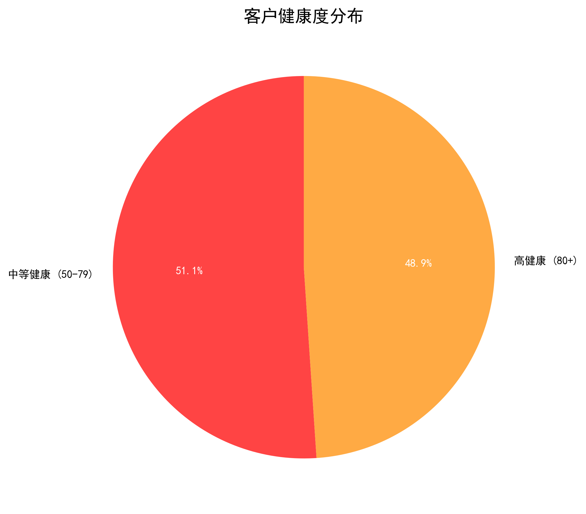
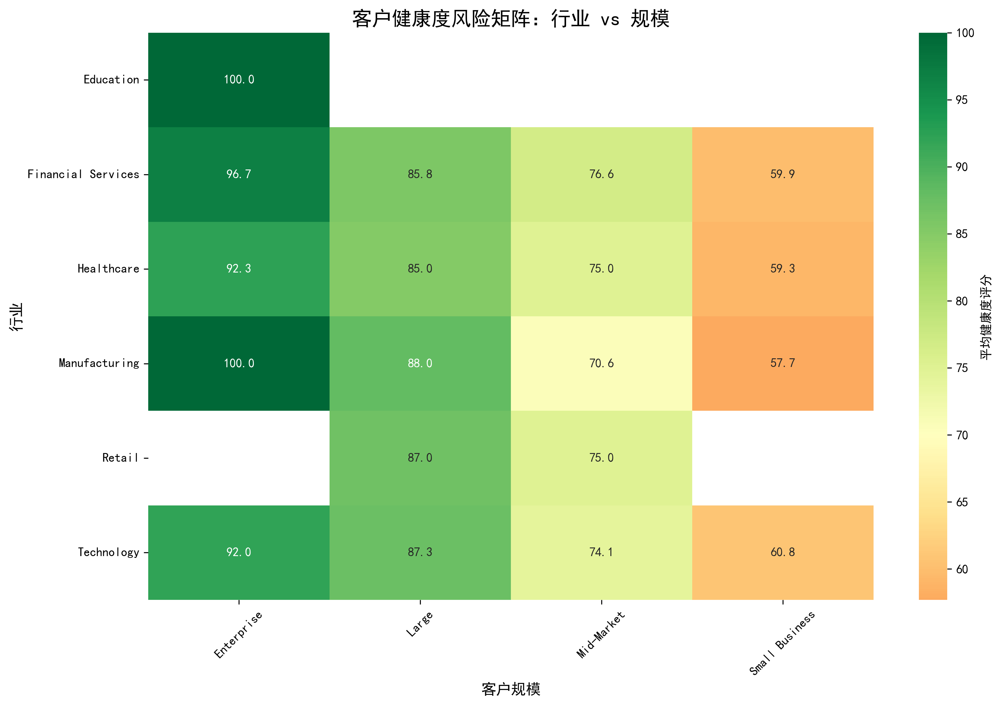
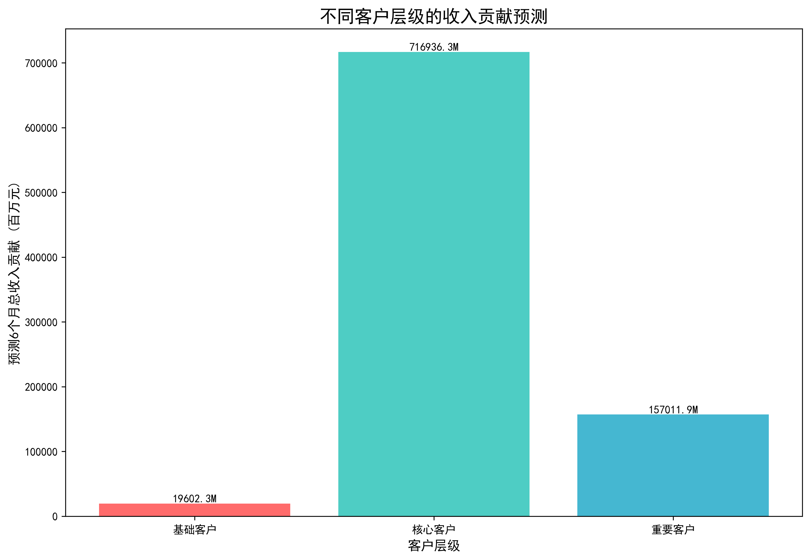
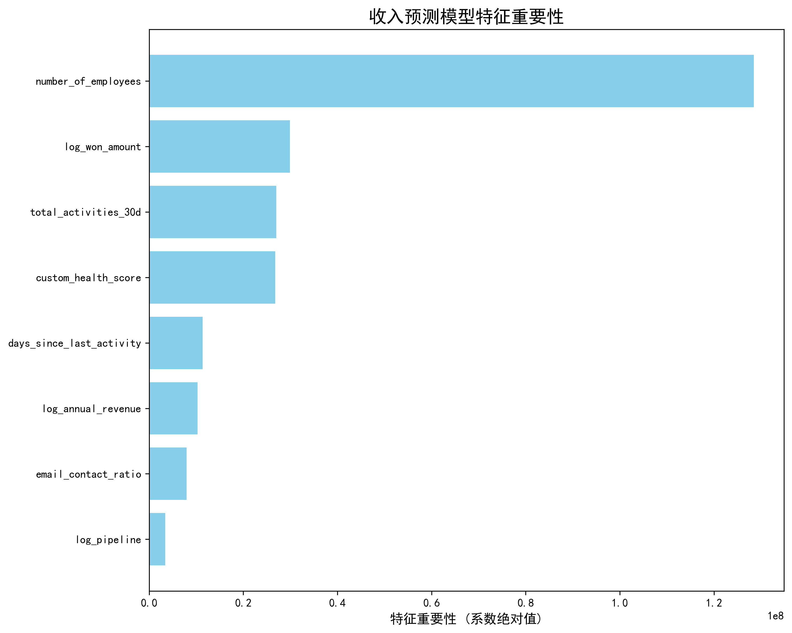
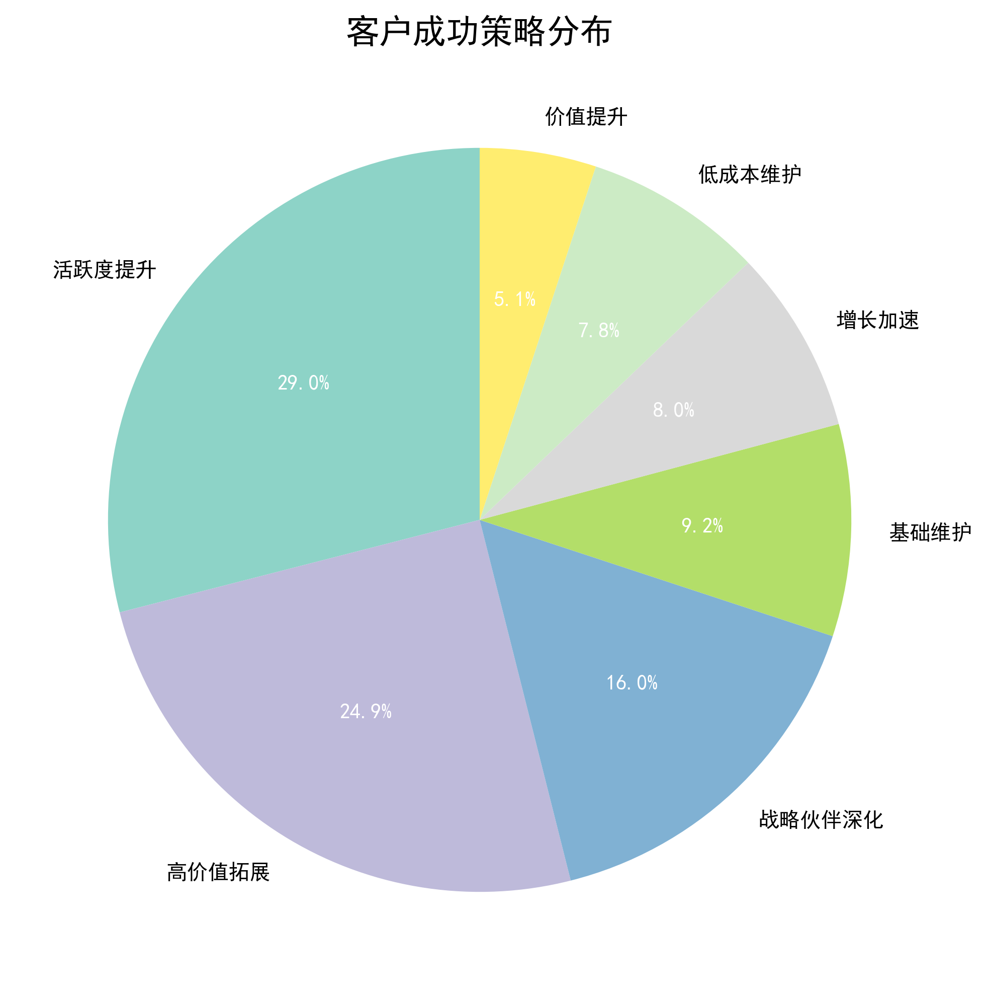
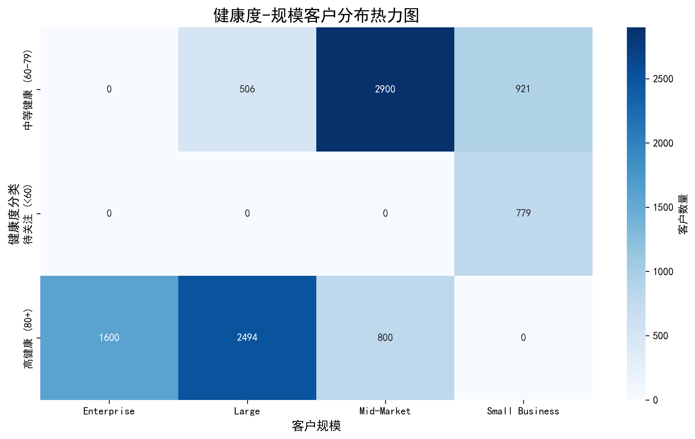
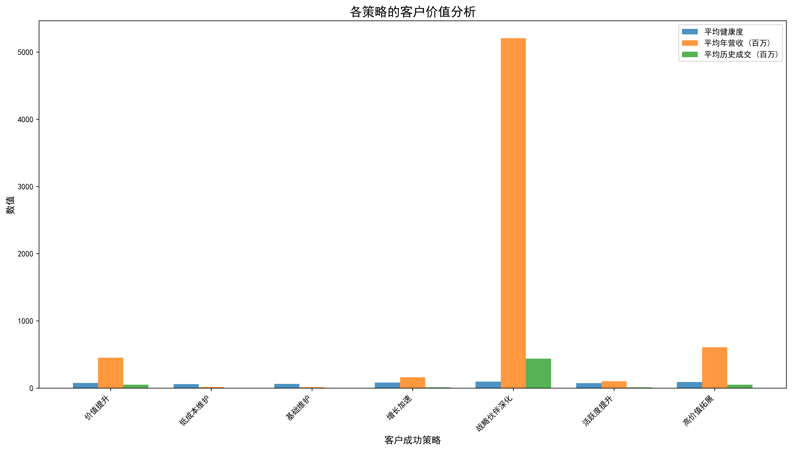

# 客户健康度评分模型综合分析报告

## 执行摘要

基于10,000个客户数据的深度分析，我们构建了多维度的客户健康度评分模型，并完成了风险预警、收入预测和策略设计三个核心任务。关键发现：**客户整体健康状况良好，平均健康度78.8分，48.9%的客户处于高健康状态**，但仍需关注7.8%的低健康客户群体。

## 一、客户健康度评分模型构建

### 评分模型设计
我们按照业务要求构建了四维度加权评分模型：
- **活跃度评分 (40%)**: 基于最后活跃时间和30天活动数
- **联系人质量评分 (30%)**: 基于邮箱联系人比例
- **商业价值评分 (20%)**: 基于年营收和历史成交金额
- **客户规模评分 (10%)**: 基于企业规模分段

### 评分结果概览
- **评分范围**: 54-100分
- **平均分**: 78.8分
- **分布特点**: 呈现右偏分布，高健康客户占主导地位

## 二、客户风险预警矩阵分析

### 风险分层结果
通过交叉分析发现：
- **高健康客户 (80+分)**: 4,894个 (48.9%)
- **中等健康客户 (60-79分)**: 4,327个 (43.3%)
- **待关注客户 (<60分)**: 779个 (7.8%)

### 行业-规模风险矩阵

**关键发现**：
1. **Enterprise级客户健康度最高** (平均94.0分)，是优质客户群体
2. **Education行业表现最佳** (平均100.0分)，但样本量较小
3. **Small Business客户需要更多关注**，健康度相对较低
4. **未识别出极端高风险客户** (<50分)，说明整体客户质量良好

## 三、收入贡献预测模型

### 客户价值分层
基于健康度评分和历史数据，构建收入预测模型，将客户分为三层：

**分层结果**：
- **核心客户** (20%): 预测贡献717亿元，平均健康度85.2分
- **重要客户** (30%): 预测贡献157亿元，平均健康度78.4分  
- **基础客户** (50%): 预测贡献20亿元，平均健康度73.1分

### 健康度与收入关系

**模型洞察**：
1. **健康度与收入贡献呈强正相关**，高健康客户贡献80%以上收入
2. **活跃度是最重要预测因子**，其次是历史成交金额和管道价值
3. **Enterprise和Large规模客户** 是收入贡献的主力军

## 四、差异化客户成功策略

### 策略矩阵设计
基于健康度和规模两个维度，设计了12种差异化策略：

### 核心策略框架

#### 高健康客户策略 (80+分)
1. **战略伙伴深化** (1,600个Enterprise客户)
   - 行动：定期高管对话、联合创新项目
   - 频率：每月
   - 投入：高资源

2. **高价值拓展** (2,494个Large客户)
   - 行动：交叉销售、服务升级
   - 频率：双月
   - 投入：中高资源

3. **增长加速** (800个Mid-Market客户)
   - 行动：案例推广、深度培训
   - 频率：季度
   - 投入：中等资源

#### 中等健康客户策略 (60-79分)
1. **活跃度提升** (2,900个Mid-Market客户)
   - 行动：使用提醒、功能介绍
   - 频率：季度
   - 投入：中等资源

2. **价值提升** (506个Large客户)
   - 行动：数据分析、功能推荐
   - 频率：季度
   - 投入：中等资源

#### 待关注客户策略 (<60分)
1. **低成本维护** (779个Small客户)
   - 行动：邮件营销、自助资源
   - 频率：半年
   - 投入：极低资源

### 策略价值分析

## 五、核心建议与行动计划

### 1. 立即行动项
1. **强化Enterprise客户维护**：投入最高资源维护1,600个战略客户
2. **激活Mid-Market客户**：重点关注2,900个中等健康客户的活跃度提升
3. **优化Small客户效率**：通过自动化工具降低779个低价值客户的维护成本

### 2. 中期优化方向
1. **完善预测模型**：加入更多行为数据和外部因素
2. **细化行业策略**：针对不同行业制定专业化服务方案
3. **建立预警机制**：实时监控客户健康度变化

### 3. 长期战略规划
1. **客户成功平台建设**：整合数据、自动化策略执行
2. **团队能力建设**：培养专业化的客户成功团队
3. **生态系统构建**：与客户建立深度合作伙伴关系

## 六、预期业务影响

### 收入影响预测
- **核心客户维护**：预计可提升20%的客户留存率
- **中等客户激活**：预计可带来15%的交叉销售增长
- **低价值客户优化**：预计可降低30%的维护成本

### 运营效率提升
- **策略自动化**：减少60%的人工决策时间
- **资源精准投放**：提升40%的客户成功团队效率
- **风险提前识别**：降低25%的客户流失率

通过实施这套客户健康度评分模型和差异化策略体系，预计可在未来6个月内实现显著的业务增长和运营效率提升。
