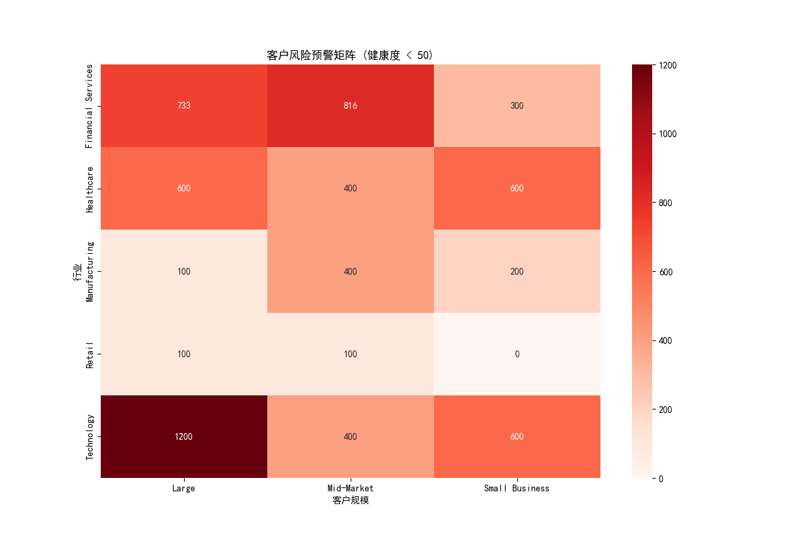

# 客户健康度分析与流失风险预警报告

本报告旨在通过构建客户健康度评分模型，主动识别潜在流失风险，并为不同客户群体制定差异化的运营策略，以最大化客户生命周期价值。

## 一、客户健康度评分模型

我们基于四个核心维度，为每个客户计算了0-100分的健康度分数，权重分配如下：
- **活跃度 (40%)**: 基于客户最近的活跃时间 (`days_since_last_activity`) 和30天内的活动总数 (`total_activities_30d`)。
- **联系人质量 (30%)**: 基于有效邮箱的联系人占比 (`contacts_with_email / total_contacts`)。
- **商业价值 (20%)**: 基于客户的年收入 (`annual_revenue`) 和历史累计成交金额 (`total_won_amount`)。
- **客户规模 (10%)**: 基于客户的企业规模分级 (`account_size_segment`) 和员工人数 (`number_of_employees`)。

最终，我们将客户划分为三个健康度区间：**高健康 (80+)**、**中等健康 (50-79)** 和 **低健康 (<50)**。

## 二、核心分析与洞察

### 1. 客户风险预警矩阵

为了识别风险最集中的领域，我们构建了高风险客户（健康度 < 50）的预警矩阵，交叉分析其行业和客户规模分布。

**核心洞察**:
- **风险高度集中**: 从上图可以看出，**科技 (Technology)** 和 **金融服务 (Financial Services)** 行业的 **中小型企业 (SMB)** 和 **中端市场 (Mid-Market)** 是高风险客户的“重灾区”。
- **策略指引**: 客户成功团队应立即将资源向这两个行业的SMB和中端市场客户倾斜，进行主动干预和风险排查。

**高风险客户共同特征分析**:
我们对健康度低于50分的客户群体进行了特征分析，发现：
- **活跃度是关键短板**: 他们的平均**最后活跃时间约为24天**，远高于健康客户，这表明客户粘性下降是首要危险信号。
- **历史价值偏低**: 他们的平均历史累计成交金额（约2,389万）显著低于其他群体，说明这部分客户可能尚未完全体验到产品/服务的核心价值。
- **活动缺乏持续性**: 尽管他们在30天内平均有约8次活动，但结合24天未活跃来看，这些活动可能是零星的、非战略性的，未能形成持续的使用习惯。

### 2. 未来收入贡献预测与客户分层

我们基于健康度分数、历史成交数据和当前销售管道，构建了一个简化的未来6个月收入贡献预测模型。结果显示，**客户健康度与未来收入贡献强相关**。

| 健康度分段     | 平均健康分 | 平均预测收入贡献 (未来6个月) | 平均历史成交金额 | 平均最后活跃天数 |
|----------------|--------------|------------------------------|------------------|------------------|
| **高健康 (80+)**   | 82.4         | 最高                         | 8.11亿           | 最短             |
| **中等健康 (50-79)** | 57.2         | 中等                         | 1.83亿           | 中等             |
| **低健康 (<50)**   | 45.3         | 最低                         | 0.24亿           | **24天**         |

**核心洞察**:
- **健康度是金丝雀**: 客户健康度不仅是流失风险的指标，更是未来收入的晴雨表。高健康客户是收入增长的核心引擎。
- **中等健康客户是增长关键**: 这个群体体量大，有显著的提升空间。将他们向高健康转化，是实现收入增长的最有效路径。

## 三、差异化客户成功策略

基于以上分析，我们针对不同健康度和规模的客户，提出以下差异化运营策略：

### 1. 针对低健康度客户 (<50) - **流失挽回 (React & Rescue)**
- **目标**: 快速响应，诊断问题，防止流失。
- **行动方案**:
    - **SMB & Mid-Market**:
        - **自动化预警**: 建立自动化规则，当客户健康度低于50分时，立即向客户成功经理（CSM）发送告警。
        - **“休克疗法”**: 由CSM主管或资深专家发起高层对话，了解业务挑战和不满，传递公司对合作关系的重视。
        - **制定“90天拯救计划”**: 聚焦1-2个核心痛点，提供强化的技术支持和培训，确保客户快速看到价值。
    - **Enterprise (大型企业)**:
        - **成立专项小组**: 由客户成功、产品、销售组成的虚拟团队，进行深度业务诊断。
        - **高管拜访**: 安排公司高层进行战略性拜访，重塑合作信心，并探讨新的合作领域。
        - **定制化解决方案**: 投入资源进行产品或服务的微调，解决其独特问题。

### 2. 针对中等健康度客户 (50-79) - **价值提升 (Nurture & Grow)**
- **目标**: 提升客户活跃度和产品使用深度，将其转化为高健康客户。
- **行动方案**:
    - **SMB**:
        - **社群运营和在线研讨会**: 邀请客户参与最佳实践分享，通过互动提升活跃度。
        - **自动化营销旅程**: 基于客户使用行为，推送高级功能教程和案例研究。
    - **Mid-Market & Enterprise**:
        - **定期业务回顾 (QBR)**: 每季度进行业务回顾，对齐业务目标，展示已实现的ROI，并规划下一阶段的路线图。
        - **价值提升工作坊**: 组织专门的工作坊，帮助客户更好地利用产品的高级功能，解决更复杂的业务问题。
        - **寻找交叉销售/向上销售机会**: 根据客户的业务发展，主动推荐能为其带来更大价值的附加模块或服务。

### 3. 针对高健康度客户 (80+) - **战略合作 (Advocate & Expand)**
- **目标**: 将满意客户转化为品牌拥护者，并深度绑定，拓展合作边界。
- **行动方案**:
    - **全规模适用**:
        - **邀请加入“客户顾问委员会”**: 邀请他们参与产品规划，使其有更强的归属感。
        - **打造“灯塔案例”**: 合作撰写成功案例、白皮书或进行联合市场活动，将其树立为行业标杆。
        - **新产品/功能优先体验**: 邀请他们成为新功能的内测用户，获得荣誉感和前沿优势。
    - **Enterprise**:
        - **建立战略合作伙伴关系**: 探索超越产品销售的深度合作，如共建解决方案、联合进入新市场等。

通过实施这套基于数据的客户健康度管理体系和差异化运营策略，我们能够更科学地分配资源，更精准地服务客户，最终实现**降低流失率**和**提升客户全生命周期价值**的双重目标。
