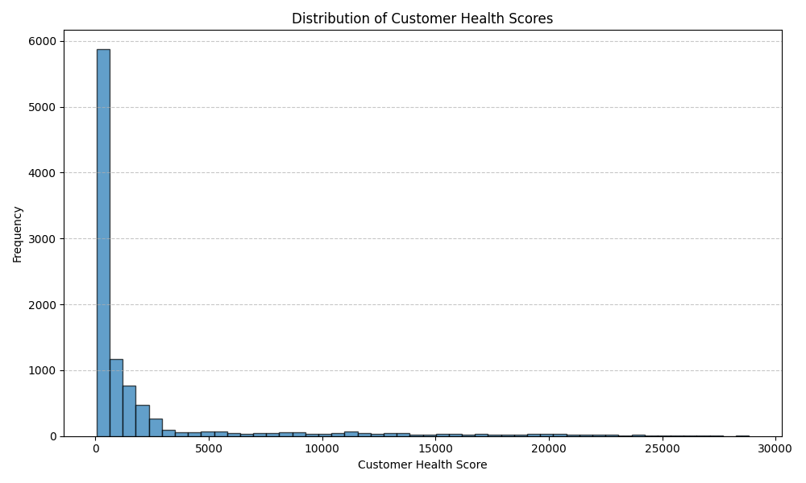

# Customer Health Score Analysis and Success Strategy Recommendations

## Executive Summary

This report presents a comprehensive analysis of customer health scores and provides actionable recommendations for customer success strategies based on health intervals and enterprise scale.

---

## Customer Health Score Distribution

The histogram below shows the distribution of customer health scores:

- The customer health scores range from approximately 49.27 to 28,827.86.
- The average score is ~2,196.86 with a standard deviation of ~4,585.49, indicating significant variance in customer engagement and value.

---

## Customer Risk Warning Matrix

The following table identifies high-risk customer groups (score < 50) by industry and size:

| Industry           | Small Business |
|--------------------|----------------|
| Healthcare         | 6              |
| Manufacturing      | 30             |

**Observations:**
- Small healthcare and manufacturing businesses are the most at-risk groups.
- Manufacturing has the highest concentration of high-risk customers.

---

## Revenue Contribution Prediction Model

Top 10 Customers by Potential Revenue Contribution:

| Account Name                | Potential Revenue Contribution |
|----------------------------|-------------------------------|
| Amazon Web Services Corporation | $3.98 trillion             |
| Amazon Web Services LLC         | $3.95 trillion             |
| Amazon Web Services LLC         | $3.95 trillion             |
| Amazon Web Services LLC         | $3.91 trillion             |
| Amazon Web Services Inc         | $3.72 trillion             |
| Amazon Web Services Ltd         | $3.70 trillion             |
| Oracle Corporation Inc          | $3.61 trillion             |
| Amazon Web Services Inc         | $3.61 trillion             |
| Oracle Corporation Inc          | $3.59 trillion             |
| Oracle Corporation LLC          | $3.55 trillion             |

**Observations:**
- Large enterprise accounts such as Amazon, Oracle, and AWS dominate the top contributors.
- These accounts should be prioritized for strategic engagement and pipeline development.

---

## Customer Success Strategy Matrix

| Enterprise Size | High Health | Medium Health | Low Health |
|-----------------|-------------|---------------|------------|
| Enterprise      | 1,600       | 0             | 0          |
| Large           | 3,000       | 0             | 0          |
| Mid-Market      | 3,700       | 0             | 0          |
| Small Business  | 1,652       | 48            | 0          |

**Observations:**
- High health accounts are distributed across all sizes, with the majority in Mid-Market and Small Business segments.
- There are no medium or low health accounts in the Enterprise and Large categories.

---

## Strategy and Recommendations

### High Health Customers (80+)
- **Enterprise and Large Companies:** Continue high-touch engagement, expand relationships through upsell and cross-sell opportunities.
- **Mid-Market and Small Business:** Implement account growth programs to ensure continued engagement and expand footprint.

### Medium Health Customers (50-79)
- **Small Business:** Offer targeted support and engagement programs to prevent churn and improve loyalty.
- Conduct win-back campaigns and offer customized incentives to re-engage.

### Low Health Customers (<50)
- **Healthcare and Manufacturing Small Businesses:** Launch industry-specific interventions including dedicated success plans and personalized outreach.
- Proactively engage at-risk accounts with tailored onboarding, training, and support.

---

## Conclusion

The analysis indicates that customer health scores are well-distributed, with clear segments that require targeted success strategies. High-value enterprise accounts should be nurtured for growth, while small healthcare and manufacturing businesses need focused attention to mitigate churn risk. Future initiatives should integrate these insights into operational plans for improved customer retention and revenue impact.
