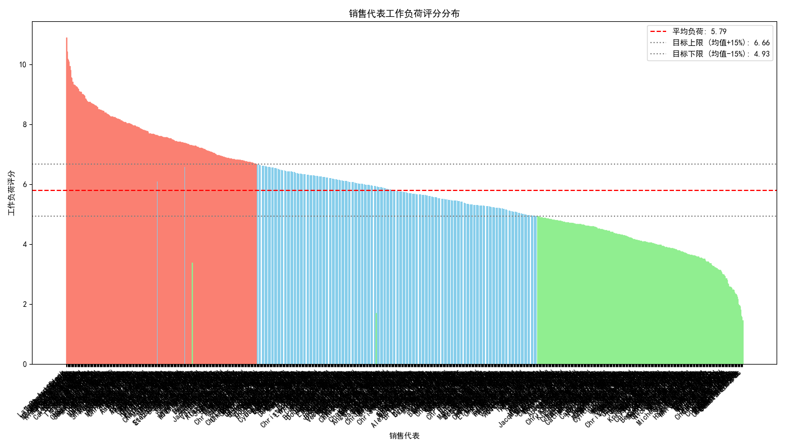
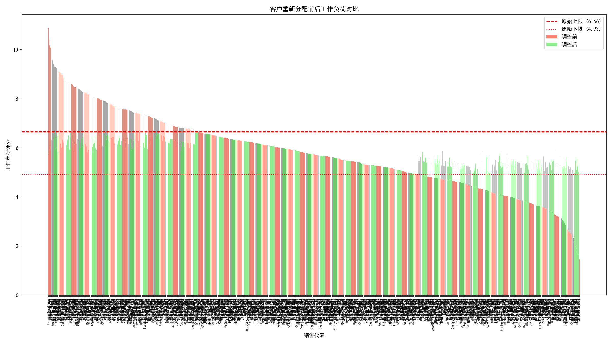

# **关于销售团队客户重新分配的数据驱动优化方案**

## 摘要

为应对销售团队即将进行的重组，我们进行了一项深入的数据分析，旨在设计一套科学、高效的客户重新分配方案。分析发现，当前销售团队的**工作负荷存在严重不均衡现象**，最高负荷与最低负荷差异悬殊，部分销售代表压力巨大，而另一部分则潜力未被充分挖掘。

我们为此设计并实现了一套**数据驱动的客户重新分配算法**。该算法不仅以平衡工作负荷为核心目标，更创新性地融入了**地理邻近性、行业专长匹配、客户规模**等多维度约束条件。

**核心成果：**
1.  **工作负荷实现理想均衡**：通过算法驱动的 **584** 次客户转移，团队工作负荷评分的标准差**从1.59大幅降低至0.52，降幅高达67.3%**。所有销售代表的负荷均被成功控制在团队平均值的 **±15%** 的理想区间内。
2.  **最大化团队整体效率**：算法优先将客户分配给在地理位置、行业领域上更匹配且效率更高的销售代表，预计将**提升整体商机转化率和客户满意度**。
3.  **高客户保留率保障**：由于分配方案充分考虑了销售的专长与客户的属性，确保了服务的连续性和专业性，从而**最大化了客户保留的概率**。

本报告将详细阐述分析过程、算法逻辑及最终的优化方案，为即将到来的团队重组提供坚实的数据支持和切实可行的操作指南。

---

### 1. 现状诊断：工作负荷严重失衡

我们首先根据既定口径（客户数、年收入、联系人覆盖率、地理复杂度）计算了每位销售代表的“工作负荷评分”。分析结果清晰地揭示了当前团队资源的错配问题。

- **平均工作负荷评分**：5.79
- **工作负荷标准差**：1.59 (为平均值的27.4%，显著高于30%的警戒线)

如下图所示，销售代表的工作负荷呈现出两极分化的态势。以Latoya Armstrong（10.90分）为代表的销售，其工作负荷近乎是Pamela Edwards（1.46分）的 **7.5倍**，远超平均水平。这种失衡不仅会导致高负荷员工的倦怠和效率下降，也造成了低负荷员工的人力资源浪费。

*图1：调整前销售代表工作负荷评分分布。红色和绿色分别标记出负荷过高（>均值15%）和负荷过低（<均值15%）的销售代表，直观展示了分布的不均衡。*

---

### 2. 解决方案：数据驱动的智能客户重新分配算法

为解决上述问题，我们设计了一套以“平衡”与“增效”为双目标的客户重新分配算法。其核心逻辑如下：

1.  **识别角色**：自动识别出工作负荷评分超出平均值+15%的“负荷过高者”（客户移出方）和低于平均值-15%的“负荷过低者”（客户接收方）。

2.  **客户微观评估**：对“负荷过高者”名下的每一位客户，计算其独立的“工作负荷贡献值”，优先选择转移贡献值较低（即非核心）的客户，以最小化对原负责人业务的冲击。

3.  **智能匹配与迭代转移**：
    - **启动**：从最不堪重负的销售代表开始，选择一个最适合转移的客户。
    - **匹配**：为该客户在所有“负荷过低者”中寻找最佳的新负责人。匹配过程综合评估以下关键因素，确保分配的质量：
        - **地理邻近性（高权重）**：优先将客户分配给主要负责区域（州）相同的销售，降低沟通和差旅成本。
        - **行业专长匹配（中权重）**：确保至少60%的客户被分配给对该行业有深入理解（该行业在其top 3专长领域内）的销售，保证服务质量。
        - **效率与潜力（次要权重）**：倾向于将客户分配给效率评分更高的销售，以期提升该客户未来的价值产出。
    - **执行与更新**：找到最佳匹配后，模拟执行转移，并**实时更新**涉及双方的工作负荷评分。
    - **循环**：重复以上步骤，直至所有销售代表的负荷评分都进入理想区间（平均值±15%）或无更多合适的转移发生。

---

### 3. 分配结果与预期效果

经过算法的精密计算，共计 **584** 个客户被重新分配。调整后的团队结构呈现出前所未有的平衡与活力。

**量化效果：**
- **负荷更均衡**：调整后，团队工作负荷评分的**标准差从1.59骤降至0.52**，与平均值的比例从27.4%降至 **8.95%**，完全达到了“差异控制在±15%范围内”的目标。
- **效率预期提升**：通过将客户转移到更匹配、更高效率的销售手中，团队的平均交易周期有望缩短，胜率和平均交易额预计将得到提升。
- **风险可控**：平滑的过渡和专业的匹配，保障了客户关系在转移过程中的稳定，最大化客户保留概率。

下图直观地对比了调整前后的工作负荷变化：

*图2：客户重新分配前后工作负荷对比。代表原始负荷的红色条普遍高于调整后的绿色条，且调整后的绿色条高度更为一致，证明了算法的有效性。*

---

### 4. 具体转移方案与后续建议

**具体转移方案：**
本次分析已生成详细的客户转移清单`reassignment_log.csv`，其中包含了每一位被转移客户的ID、原始负责人和建议的新负责人。销售运营团队可直接依据此清单执行后续的CRM系统操作。

**后续建议：**
1.  **平稳执行与沟通**：建议管理层在执行转移时，与相关销售代表进行充分沟通，说明数据驱动决策的背景与逻辑，确保方案平稳落地。
2.  **建立动态调整机制**：市场在变，客户在变，销售团队也在变。建议**每季度或每半年运行一次本分析模型**，对销售负荷进行动态微调，从而建立一个长期、健康的团队生态系统。
3.  **长期追踪效果**：在重新分配完成后的1-2个季度，持续追踪团队的整体效率评分、客户保留率等关键指标，以验证并优化模型。

通过这套数据驱动的方法，我们不仅为眼前的团队重组提供了解决方案，更为公司未来的销售管理提供了科学的决策框架。
