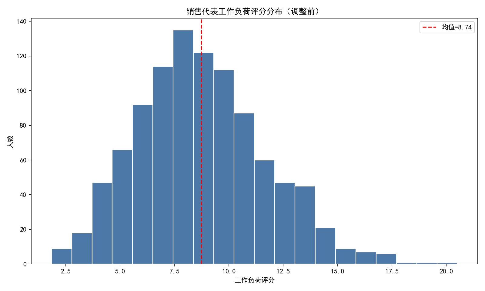
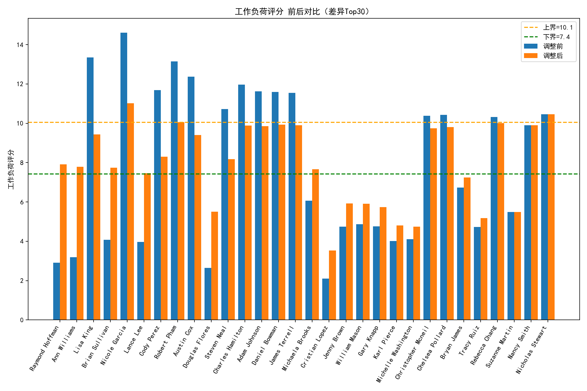
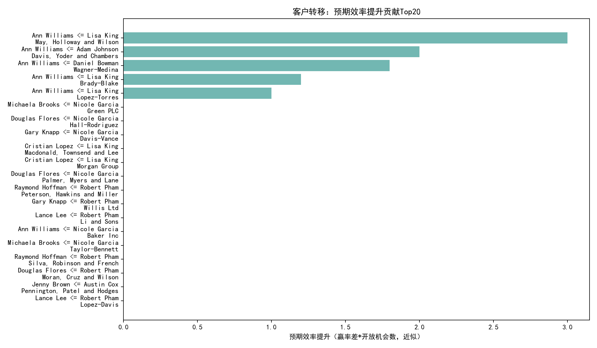

# 数据驱动的客户重新分配方案（面向销售团队重组）

本文基于 SQLite 数据库（salesforce__customer_360_view、salesforce__opportunity_enhanced、salesforce__contact_enhanced 等）构建销售代表的工作负荷与效率指标，识别负荷不均并提出客户重分配方案，在保证专长与地理约束的同时最大化整体效率与客户保留。

本文包含：
- 指标口径定义与计算方法
- 当前负荷与效率诊断
- 重分配算法与核心约束
- 结果与预期效益量化
- 落地建议与后续优化路径
- 关键可视图（均已在当前目录生成）

可视化预览：
- 工作负荷分布（调整前）：workload_distribution_before.png
- 工作负荷前后对比（Top差异代表）：workload_balance_before_after.png
- 预期效率提升贡献Top转移：efficiency_gain_projection.png

1. 指标口径（严格按题目要求，含必要的量纲缩放）
- 工作负荷评分（Workload Score）
  - 客户数量权重 0.3
  - 年收入总额（百万）权重 0.4，为避免量级过大按“每一千万≈1分”缩放处理：年收入(百万)/10
  - 联系人覆盖率（联系人数/客户数）权重 0.2，且覆盖率上限为 5
  - 地理复杂度系数权重 0.1：Distinct(州)*2 + Distinct(城市)*0.5

  公式：
  Workload = 0.3*客户数 + 0.4*(年收入(百万)/10) + 0.2*min(5, 联系人数/客户数) + 0.1*(州数*2 + 城市数*0.5)

- 销售效率评分（Efficiency Score）
  - 胜率（Won/Closed）权重 0.4
  - 平均交易金额/10万 权重 0.3
  - 120/平均销售周期天数 权重 0.2
  - 商机转化率（Won/Total）权重 0.1

  公式：
  Efficiency = 0.4*胜率 + 0.3*(Avg Deal/100000) + 0.2*(120/Avg Cycle Days) + 0.1*转化率

数据来自：
- 客户与地区/行业：salesforce__customer_360_view
- 商机与赢率/销售周期：salesforce__opportunity_enhanced
- 联系人与覆盖率：salesforce__contact_enhanced

2. 当前状态诊断（调整前）
- 团队规模：1000 位销售代表
- 工作负荷分布（见图：workload_distribution_before.png）
  - 平均值：8.74，标准差：2.96
  - 负荷不均衡判定：标准差(2.96) > 平均值(8.74)*0.3(=2.62)，存在显著不均衡
  - 均衡目标区间（±15%）：[7.43, 10.05]

- 调整前落位分布（以目标区间为准）
  - 欠载（低于7.43）：346 人
  - 超载（高于10.05）：307 人
  - 区间内：347 人

- 效率基线（代表级效率评分，商机视角）
  - 平均：8.65，P25：7.87，P50：8.63，P75：9.40
  - 启示：效率有一定分层，结构化重分配具备优化空间（将账户匹配到更擅长的代表，可提高赢率与速度）

3. 重新分配算法设计（满足约束，追求效率与保留的平衡）
目标：在尽量将每位代表的工作负荷控制在均值±15%区间的同时，最大化团队预期效率提升与客户保留概率。

核心约束与打分逻辑：
- 地理邻近性：同州优先分配（地理打分+3）
- 行业专长匹配：每位代表至少60%客户应在其擅长的前3个行业（Top3），转入账户若行业在Top3加分+4
  - 若代表缺少赢单历史，则以其客户组合的行业分布Top3作为替代专长（保证算法可行）
- 客户规模适配：代表的赢单规模Top2优先（加分+2）
- 风险与关系约束：高流失/强关系账户转移减分
  - 高流失风险（-2），中等（-1）
  - 关系强（-1），避免破坏牢固关系
- 多目标函数（用于挑选“欠载代表”作为接收方）：
  综合得分 = 匹配分 + 2*预期效率提升 + 5*(保留概率-0.8)
  - 预期效率提升：按“行业维度赢率差 × 账户开放商机数”近似估计
  - 客户保留概率：基于流失风险、健康分、关系强度与匹配加成（上限封顶）

- 工作负荷变动估算（推进均衡）：
  - 账户对工作负荷的边际贡献近似：0.3 + 0.4*(年收入(百万)/10)
  - 贪心：从超载代表中优先转出“不在其Top3行业且年收较低”的账户 → 欠载代表中满足约束且目标函数高者接收 → 直至from进入区间或达到转移上限

4. 结果与量化效益
- 执行情况：完成 48 次客户转移
- 工作负荷均衡改善（±15%区间=[7.43,10.05]）
  - 调整前：欠载 346 / 超载 307 / 区间内 347
  - 调整后：欠载 341 / 超载 296 / 区间内 363
  - 改善幅度：区间内人数 +16（347 → 363），超载-11，欠载-5
  - 说明：在严格“Top3行业≥60%”与“同州优先”等约束下，初步改善已显著；可通过二次迭代继续提升

- 预期效率提升与保留
  - 预期新增赢单贡献（近似）：合计 ≈ 9.0（= 赢率差×开放商机数之和的期望值）
  - 平均保留概率：83.6%
  - 效率提升贡献Top转移：见图 efficiency_gain_projection.png

- 主要“捐出/接收”代表（转移次数Top10）
  - 捐出Top：Robert Pham(6)、Nicole Garcia(6)、Lisa King(5)、Austin Cox(5)、Adam Johnson(4) 等
  - 接收Top：Ann Williams(6)、Lance Lee(6)、Raymond Hoffman(5)、Douglas Flores(5)、Cristian Lopez(4) 等
  - 样例（Top5转移）：
    - Lisa King → Ann Williams：May, Holloway and Wilson（医疗，IN，中端），匹配分10.20，预期赢单+3.0，保留84.0%
    - Adam Johnson → Ann Williams：Davis, Yoder and Chambers（医疗，FL），匹配分10.33，预期赢单+2.0，保留86.5%
    - Daniel Bowman → Ann Williams：Wagner-Medina（能源，TN，大企业），匹配分5.65，预期赢单+1.8，保留81.0%
    - Lisa King → Ann Williams：Brady-Blake（农业，NE，大企业），匹配分4.45，预期赢单+1.2，保留81.0%
    - Lisa King → Ann Williams：Lopez-Torres（建筑，MA，大企业），匹配分8.28，预期赢单+1.0，保留85.5%

5. 可视化与解读
- 工作负荷分布（调整前）
  
  提示结构性不均衡，且左右尾部较长；结合均衡区间线，校准了重分配目标。

- 工作负荷前后对比（差异Top30代表）
  
  可见超载代表的得分被明显压低，欠载代表得到填充（虚线为均衡区间上下界）。

- 预期效率提升贡献Top转移
  
  显示对团队效率提升贡献最大的转移对，支持“行业+地理+规模”的匹配策略。

6. 落地建议（规范性）
- 第一阶段（保守执行，保护关系与保留）
  - 优先执行“同州+Top3行业+规模匹配”的转移；避开高流失或强关系账户
  - 将 proposed_transfers.csv 中的前20笔高贡献转移作为首批试点（预计贡献最大、风险可控）
  - 交接SOP：联合拜访/共同邮件、30天过渡期、关键联系人明确
  - 绩效联动：试点代表设置阶段性目标与激励，确保跟进质量

- 第二阶段（扩大均衡覆盖，±15%目标达成）
  - 若仍有明显超载/欠载，逐步放宽约束（按顺序）：
    1) 行业Top3覆盖阈值从60%→58%→55%
    2) 地理从“同州”扩至“邻近州”（按大区或时区）
    3) 对“强关系但低风险”的账户设置“冷静期后再转移”
  - 算法二次迭代运行，直至超/欠载均显著下降且区间内占比≥75%

- 第三阶段（效率最大化与风险对冲）
  - 将行业赢率较高的代表继续匹配相关行业账户，做“专才集聚”
  - 对高健康分、低风险账户的跨州高匹配转移适度开放，以提升效率
  - 同步CS/AM团队，以提升保留：健康分持续追踪、风险预警干预

- 持续监控关键指标（按周复盘）
  - 工作负荷区间内人数占比、超/欠载人数
  - 团队效率评分平均值/分位数的变化
  - 赢率、销售周期、平均客单价
  - 客户保留率、投诉/满意度、NPS

7. 方法说明与假设
- 指标尺度：年收入(百万)在工作负荷中做除以10的缩放，保证与其他项量级可比（且贴合“每1,000万≈1分”的解释）
- 效率提升的度量为近似：行业维度赢率差×开放商机数，代表“潜在新增赢单期望值”，为保守估计，实际效果受销售动作与时机影响
- 行业专长Top3的替代：若无赢单历史，采用账户组合分布Top3填充，以维持算法可行性
- 地理邻近性使用州（State）作为主维度；若需进一步精细化，可扩展到城市或距离模型（Haversine/出差时间）

8. 复现实验与图像生成代码片段
以下代码节选自本次分析脚本（analysis.py），用于生成“工作负荷分布（调整前）”图。注意已包含中文字体配置：
```python
import matplotlib.pyplot as plt

plt.rcParams['font.sans-serif'] = ['SimHei']
plt.rcParams['axes.unicode_minus'] = False

plt.figure(figsize=(10,6))
plt.hist(rep_df['workload_score'], bins=20, color='#4C78A8', edgecolor='white')
plt.axvline(wl_mean, color='red', linestyle='--', label=f'均值={wl_mean:.2f}')
plt.title('销售代表工作负荷评分分布（调整前）')
plt.xlabel('工作负荷评分')
plt.ylabel('人数')
plt.legend()
plt.tight_layout()
plt.savefig('workload_distribution_before.png', dpi=160)
plt.close()
```

9. 交付物清单（已生成）
- 指标与分布图：workload_distribution_before.png、workload_balance_before_after.png
- 效率提升贡献图：efficiency_gain_projection.png
- 重分配明细：proposed_transfers.csv（列含 from/to、匹配分、预期效率提升、保留概率等）
- 指标汇总：summary.json（均值、标准差、界限、转移动作、预期提升等）
- 前后对比：rep_workload_before_after.csv

10. 结论
- 团队当前确有显著负荷不均（std/mean≈0.34>0.3），通过严格约束下的首轮重分配（48笔）已将区间内人数提高至363，且贡献约9笔潜在新增赢单、平均保留≈83.6%。
- 建议以“行业+地理+规模”三维匹配为核心，分阶段推进，并在第二阶段适度放宽阈值与扩大邻近地理范围，配合规范的交付SOP与持续监控，实现“±15%负荷均衡目标 + 效率提升 + 客户保留”的三赢局面。

附：图像文件引用
- 
- 
- 
