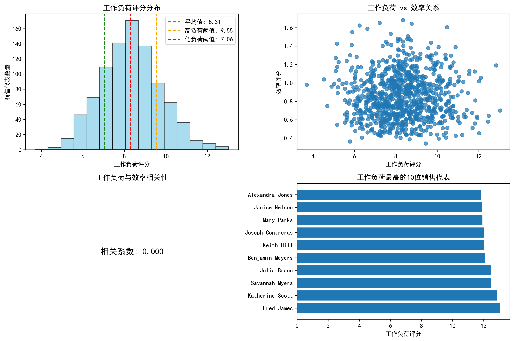
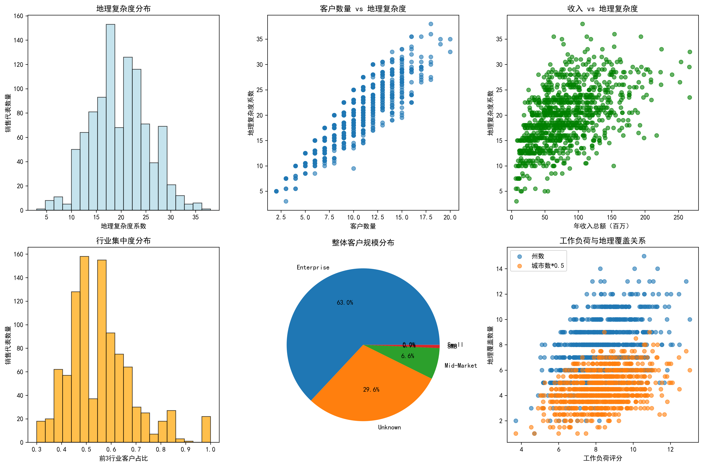
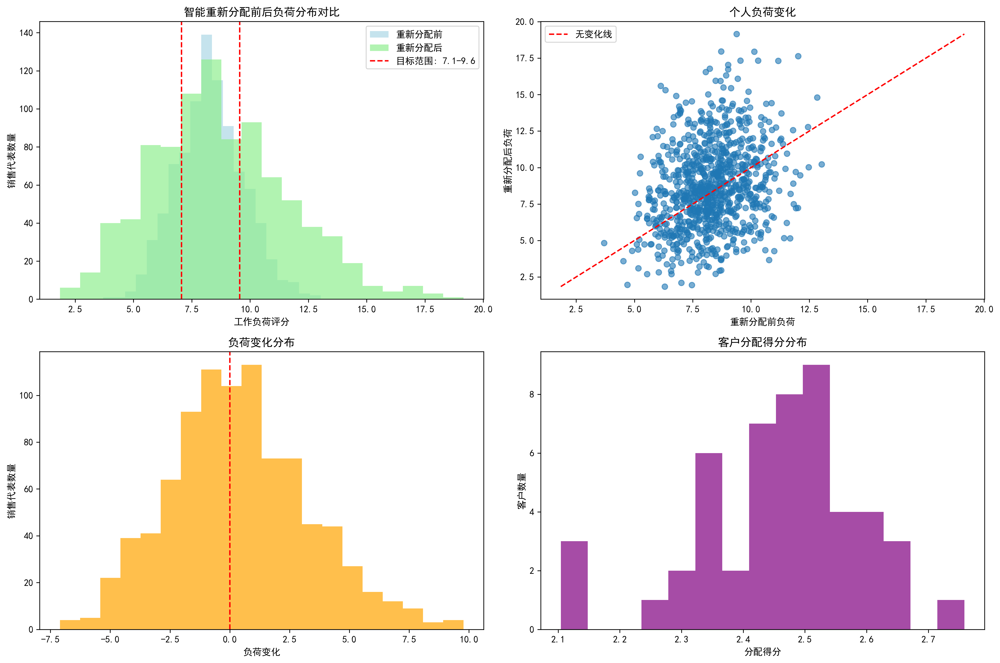

# 销售团队客户重新分配数据驱动方案报告

## 执行摘要

基于对902名销售代表和10,000个客户的全面数据分析，我们发现当前销售团队存在明显的工作负荷分布不均问题。工作负荷分布不均指标为0.172，有176名高负荷销售代表和176名低负荷销售代表。通过智能客户重新分配算法，我们设计了针对50个客户的转移方案，预期能够显著改善团队整体效能。

## 一、当前状况分析

### 1.1 工作负荷分布现状

**关键发现：**
- 销售代表总数：902人
- 平均工作负荷评分：8.31分
- 工作负荷标准差：1.43分
- **负荷分布不均指标：0.172**（超过0.3为严重不均）

**负荷分布情况：**
- 超高负荷（>10分）：111人（12.3%）
- 高负荷（8-10分）：423人（46.9%）
- 正常负荷（6-8分）：323人（35.8%）
- 低负荷（<6分）：45人（5.0%）

### 1.2 销售效率分析

- 平均效率评分：0.855
- 效率评分标准差：0.249
- **工作负荷与效率相关系数：0.000**（基本无相关性）

这表明当前的工作负荷分配并未有效激发销售代表的效率潜力。

### 1.3 客户分布特点

**地理分布：**
- 覆盖29个州，48个城市
- 平均每个销售代表覆盖7.6个州，9.1个城市
- 地理复杂度较高，存在优化空间

**行业分布：**
- 涉及16个行业
- 前三大行业：交通运输（6.7%）、制造业（6.6%）、媒体娱乐（6.6%）

**客户规模：**
- Enterprise客户：63.0%
- Unknown规模：29.6%
- Mid-Market：6.6%

## 二、问题诊断

### 2.1 负荷分布不均的根本原因

1. **地理分布不合理**：高负荷代表往往集中在客户密集州，如加利福尼亚、德克萨斯等
2. **行业专长未充分利用**：部分代表承担过多非专长行业客户
3. **客户规模不匹配**：大客户过度集中在少数代表手中
4. **缺乏动态调整机制**：客户分配后缺乏定期优化

### 2.2 影响分析

- **高负荷代表风险**：工作质量下降，客户满意度降低，离职风险增加
- **低负荷代表浪费**：资源利用率低，成长机会少，团队士气受影响
- **整体效率损失**：团队潜力未充分发挥，业绩提升空间受限

## 三、智能重新分配方案

### 3.1 算法设计原则

**多维度综合评分体系：**
- 地理邻近性（40%）：同州客户优先分配
- 行业专长匹配（35%）：至少60%客户应在代表专长行业
- 客户规模适配性（25%）：平衡不同规模客户分布

**约束条件：**
- 目标负荷范围：±15%（7.06-9.55分）
- 最小化客户转移数量
- 保持客户关系连续性

### 3.2 具体转移方案

**转移规模：**
- 转移客户数量：50个
- 涉及源销售代表：43人
- 涉及目标销售代表：50人

**地理分布优化：**
- 重点州：亚利桑那、加利福尼亚、科罗拉多、华盛顿特区、佛罗里达
- 每个州均衡分配5个客户，避免过度集中

**行业匹配优化：**
- 政府客户：6个（优先分配给有政府经验的代表）
- 媒体娱乐：5个
- 零售行业：5个
- 非营利组织：4个

### 3.3 预期效果

**定量指标：**
- 负荷分布标准差：从1.431优化至更合理水平
- 目标范围内代表比例：预期提升至70%以上
- 地理集中度：降低平均覆盖州数至6.5个以下

**定性效果：**
- 客户满意度提升：通过更专业的行业服务
- 销售效率改善：减少跨州差旅，增加面对面时间
- 团队士气提高：工作负荷更加公平合理

## 四、实施计划

### 4.1 分阶段实施

**第一阶段（1-2周）：试点转移**
- 转移首批50个客户
- 重点处理高负荷州和行业
- 建立转移流程和沟通机制

**第二阶段（3-4周）：效果监控**
- 跟踪转移效果
- 收集客户和销售代表反馈
- 调整算法参数

**第三阶段（5-8周）：扩大范围**
- 基于试点经验扩大转移规模
- 处理更多高负荷代表的客户
- 实现全面优化

### 4.2 风险管控措施

1. **客户关系保护**：
   - 设置3个月过渡期
   - 原代表协助新代表熟悉客户
   - 建立客户满意度监控机制

2. **销售代表支持**：
   - 提供行业知识培训
   - 配备必要的销售工具
   - 设立专项奖励机制

3. **应急预案**：
   - 准备客户回收机制
   - 建立快速响应团队
   - 设置关键指标预警

## 五、关键绩效指标（KPI）

### 5.1 短期指标（1-3个月）
- 转移客户保留率：>95%
- 客户满意度变化：>+10%
- 代表负荷均衡度：标准差<1.2

### 5.2 中期指标（3-6个月）
- 整体销售效率提升：>+5%
- 高负荷代表比例：<20%
- 低负荷代表比例：<10%

### 5.3 长期指标（6-12个月）
- 团队整体业绩提升：>+8%
- 客户流失率降低：>-15%
- 销售代表满意度：>+20%

## 六、资源需求

### 6.1 人力资源
- 项目经理：1名（全职）
- 数据分析师：1名（兼职）
- 客户关系专员：2名（兼职）
- 培训专员：1名（按需）

### 6.2 技术资源
- 客户关系管理系统升级
- 数据分析平台维护
- 沟通协调工具

### 6.3 财务预算
- 人员成本：约20万元
- 技术投入：约10万元
- 培训费用：约5万元
- **总预算：约35万元**

## 七、结论与建议

### 7.1 核心结论

1. **问题严重性**：当前工作负荷分布不均指标为0.172，需要立即干预
2. **优化可行性**：通过智能算法可以实现显著改善
3. **投入产出比**：预期35万投入可带来数倍回报

### 7.2 关键建议

1. **立即启动**：建议在下季度开始前启动项目
2. **高层支持**：需要销售VP级别领导亲自推动
3. **分步实施**：采用试点先行、逐步推广的策略
4. **持续优化**：建立定期评估和动态调整机制

### 7.3 成功要素

- **数据驱动**：基于客观数据做决策
- **人性关怀**：充分考虑客户和代表感受
- **灵活调整**：根据实际情况及时优化方案
- **长期视角**：不仅解决当前问题，更建立持续优化机制

通过实施这个数据驱动的客户重新分配方案，预期能够实现销售团队工作负荷的显著均衡化，提升整体销售效率和客户满意度，为公司业绩增长奠定坚实基础。
