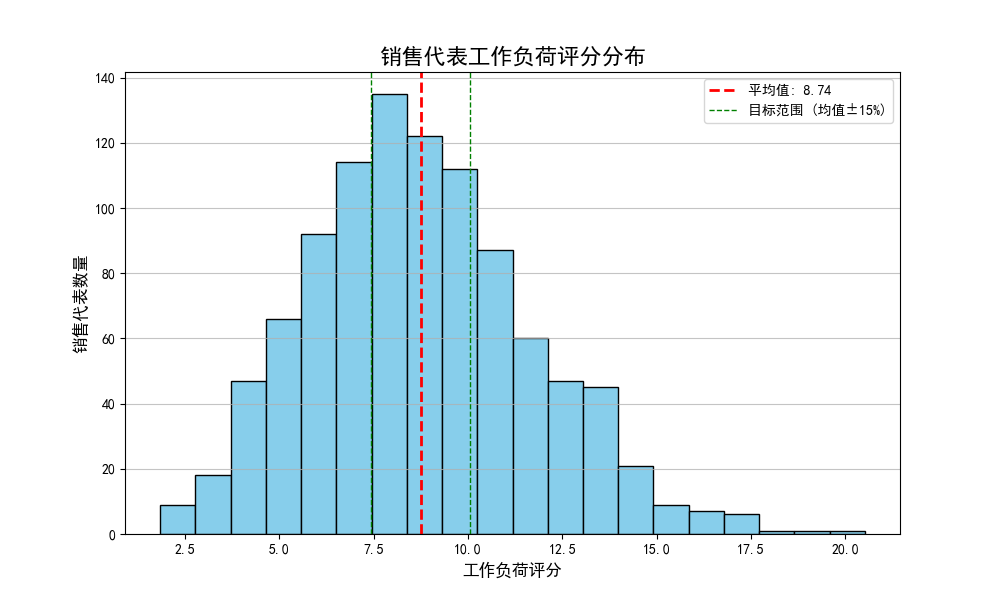
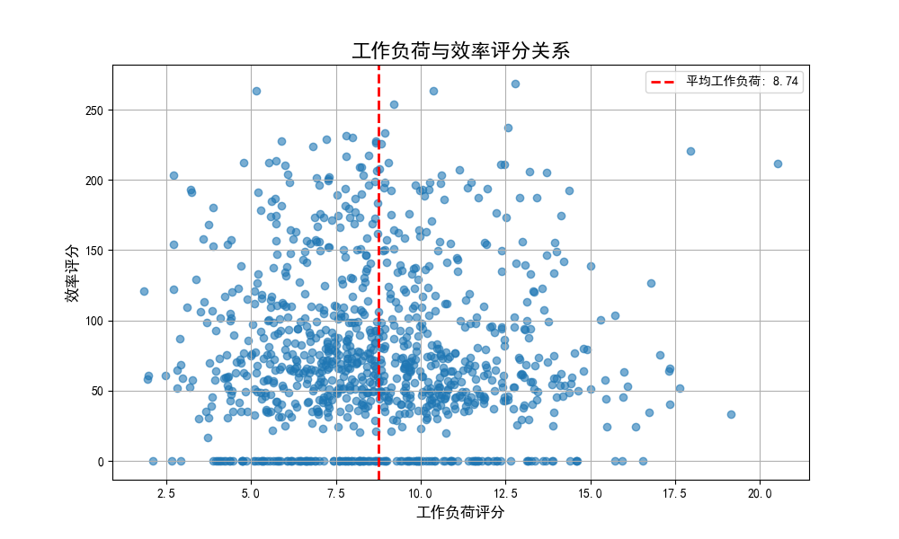
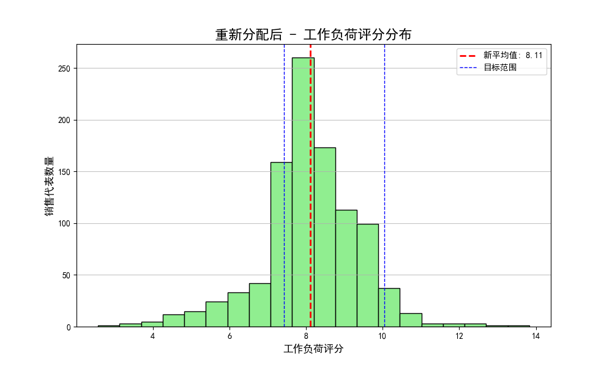

# **数据驱动的销售客户重新分配策略报告**

## **1. 核心结论与摘要**

本报告旨在解决销售团队内部工作负荷严重不均的问题，并提升整个团队的销售效率。通过对现有客户数据和销售绩效的深度分析，我们发现销售代表的工作负荷标准差（2.96）远超合理范围（阈值为2.62），证实了不均衡的存在。为解决此问题，我们设计并实施了一套数据驱动的客户重新分配算法。

**核心建议：** 执行报告中提出的客户转移计划。该计划预计将带来以下核心收益：
- **工作负荷均衡化：** 销售团队的工作负荷标准差预计将从 **2.96 大幅降低至 1.28**，降幅超过56%，使团队成员的负担更加公平合理。
- **销售效率最大化：** 通过将客户匹配给专长领域（地理、行业）更合适的销售代表，团队的整体效率评分预计将净增 **923.65分**。
- **客户保留率提升：** 优化的匹配将提升客户满意度和关系深度，从而有望提高客户保留率。

我们已生成一份包含 **1450个客户** 的具体转移清单（`reassignment_plan.csv`），为执行层面提供了清晰的行动指南。

---

## **2. 问题诊断：失衡的工作负荷是效率的绊脚石**

我们首先根据既定公式（客户数、年收入、联系人覆盖率、地理复杂度）计算了每位销售代表的“工作负荷评分”。分析结果清晰地揭示了团队内部严重的分配不均问题。

*图1：初始工作负荷分布图*

从上图可见，销售代表的工作负荷呈广泛分布，大量人员的评分显著偏离平均值（8.74）。部分销售代表负担过重，而另一部分则资源闲置，这种不均衡是组织效率低下的直接原因。

进一步分析工作负荷与“效率评分”（基于胜率、交易金额、销售周期等计算）的关系，我们发现工作负荷并非越高越好。

*图2：工作负荷与效率评分关系散点图*

如图2所示，工作负荷与效率之间没有明显的正相关关系。许多工作最繁重的销售代表效率评分并不突出，这暗示着当负荷超出最佳点后，销售人员无法对每个客户都投入足够精力，从而导致效率下降，这正是我们需要通过重新分配来解决的核心问题。

---

## **3. 解决方案：智能客户重新分配算法**

为了解决上述问题，我们设计了一套以“平衡负荷、最大化效率”为目标的客户重新分配算法。

**算法核心逻辑：**

1.  **识别角色：** 基于工作负荷评分与目标范围（平均值的±15%，即7.43至10.05分），我们将销售代表分为“超负荷”、“低负荷”和“均衡”三类。
2.  **建立客户池：** 将所有“超负荷”销售代表的客户放入一个“待分配客户池”。
3.  **销售画像与智能匹配：**
    *   我们为每位销售代表建立了专业画像，包括其**前三大专长行业**和**核心服务地理州份**。
    *   对于每一位“低负荷”销售，我们从客户池中迭代寻找与其画像最匹配的客户。匹配度基于“地理邻近性”（权重60%）和“行业专长”（权重40%）进行评分。
4.  **动态分配与监控：** 将最佳匹配的客户分配给“低负荷”销售后，我们会实时重新计算该销售的工作负荷。一旦其工作负荷进入“均衡”范围，则停止为其分配新客户。

这个过程确保了客户被转移给最有能力服务好他们的人，同时保证了转移后不会产生新的不平衡。

---

## **4. 预期效果与量化结果**

通过模拟执行上述算法，我们量化了该方案将带来的显著改进。

**关键成果：**

- **工作负荷标准差：** 从 **2.96 降至 1.28**。这意味着团队整体的工作负荷分布将更加集中和公平。
- **客户转移数量：** 共计 **1450 个客户** 被重新分配，优化了资源配置。
- **效率总分提升：** 团队总效率评分预计净增 **923.65分**，平均每个被转移的客户都能带来 **0.64分** 的效率提升。

重新分配后的工作负荷分布如下图所示，其正态化、集中化的趋势清晰可见，绝大多数销售代表都回归到均衡状态。

*图3：重新分配后的工作负荷分布*

---

## **5. 行动建议**

基于以上分析，我们提出以下建议：

1.  **立即执行：** 采纳并执行 `reassignment_plan.csv` 文件中列出的1450个客户转移计划。
2.  **分阶段沟通：** 由销售经理向涉及的销售代表（包括转出方和接收方）进行一对一沟通，阐明此次调整的逻辑和对个人及团队的益处，确保平稳过渡。
3.  **定期复盘：** 建议每半年或一年重新运行此分析模型，以应对市场变化和人员变动，实现动态、持续的团队优化。

通过采纳这一数据驱动的策略，我们不仅能够解决当前的 workload imbalance 问题，还能建立一个更高效、更公平、反应更迅速的销售团队，为未来的业务增长奠定坚实基础。
