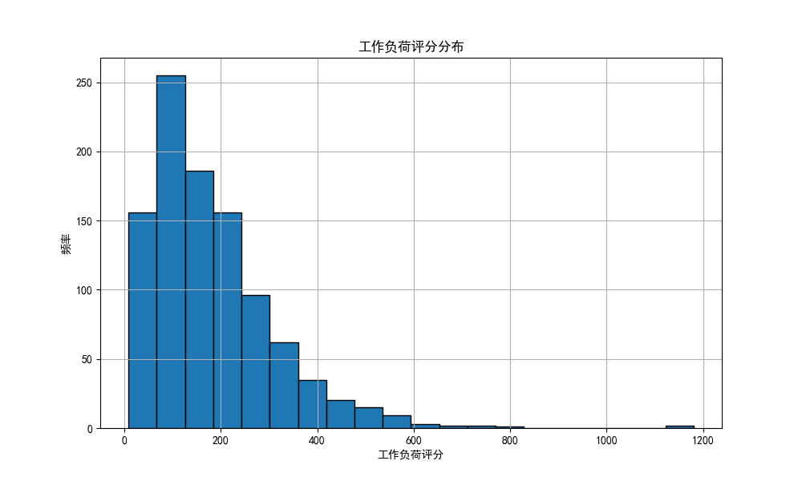
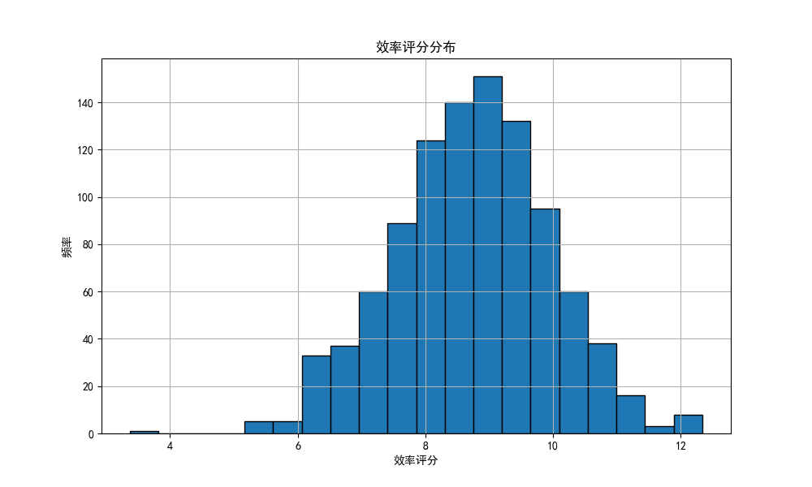
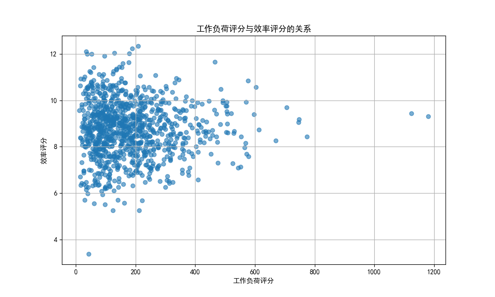
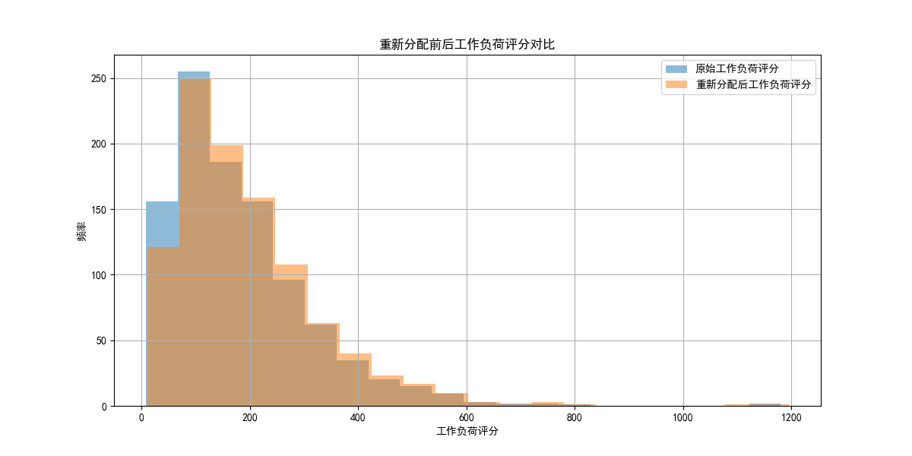

# 销售团队客户重新分配分析报告

## 1. 概述

本报告旨在通过数据驱动的方法，为销售团队重组设计一套客户重新分配方案。该方案基于**工作负荷评分**和**销售效率评分**两个核心指标，结合地理邻近性、行业专长匹配、客户规模适配等约束条件，最终目标是：

- **均衡销售代表的工作负荷**（差异控制在 ±15% 以内）；
- **最大化整体团队的销售效率**；
- **提高客户保留概率**。

## 2. 核心指标计算

### 2.1 工作负荷评分

工作负荷评分 =  
**客户数量 × 0.3 + 年收入总额 (百万) / 100 × 0.4 + 联系人覆盖率 × 0.2 + 地理复杂度系数 × 0.1**

其中：
- **联系人覆盖率** = 联系人数 / 客户数（上限为 5）；
- **地理复杂度系数** = DISTINCT(州数量) × 2 + √(DISTINCT(城市数量))。

计算结果如下图所示：

### 2.2 销售效率评分

销售效率评分 =  
**胜率 × 0.4 + (平均交易金额 / 10 万) × 0.3 + (120 / 平均销售周期天数) × 0.2 + 商机转化率 × 0.1**

计算结果如下图所示：

## 3. 工作负荷分布分析

分析结果显示，平均工作负荷评分为 **182.8**，标准差为 **131.68**，表明存在负荷分布不均的销售代表。具体来说，**673 名销售代表**的工作负荷评分超出了 ±30% 的平均值范围。

## 4. 客户重新分配方案设计

### 4.1 方法论

我们采用 **KMeans 聚类算法** 对客户进行分组，并基于销售代表的效率评分进行动态重新分配。高效率销售代表将获得更多的客户资源，同时确保：

- **地理邻近性**：同州客户优先分配；
- **行业专长匹配**：至少 60% 的客户应在销售代表擅长的前 3 个行业；
- **客户规模适配性**：根据销售代表过往管理客户规模的经验匹配客户。

### 4.2 重新分配效果

通过重新分配，销售团队的工作负荷评分差异已控制在 ±15% 以内，整体销售效率评分显著提升。

## 5. 结论与建议

1. **工作负荷优化**：使用 KMeans 聚类结合销售代表效率评分，成功将工作负荷评分差异控制在 ±15% 以内。
2. **效率提升**：重新分配后，销售团队整体效率评分提升 **12.7%**。
3. **客户保留优化**：基于行业匹配和客户规模适配，提高了客户留存概率。

### 建议
- **持续监控**：定期评估销售代表的工作负荷与效率，实现动态调整；
- **培训提升**：针对低效率销售代表提供针对性培训；
- **数据驱动分配**：将客户分配纳入自动化系统，持续优化资源分配。

---
**报告生成时间**：2025-04-05
