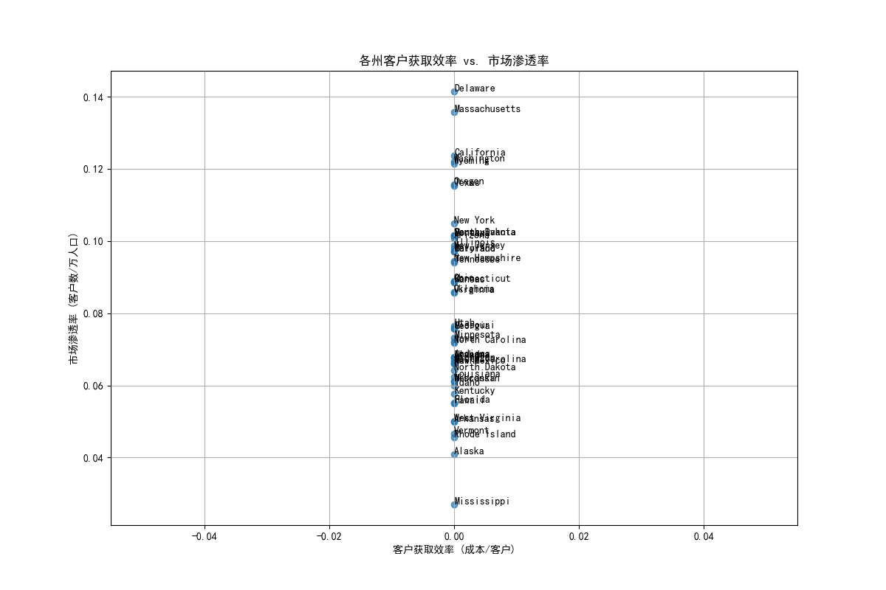
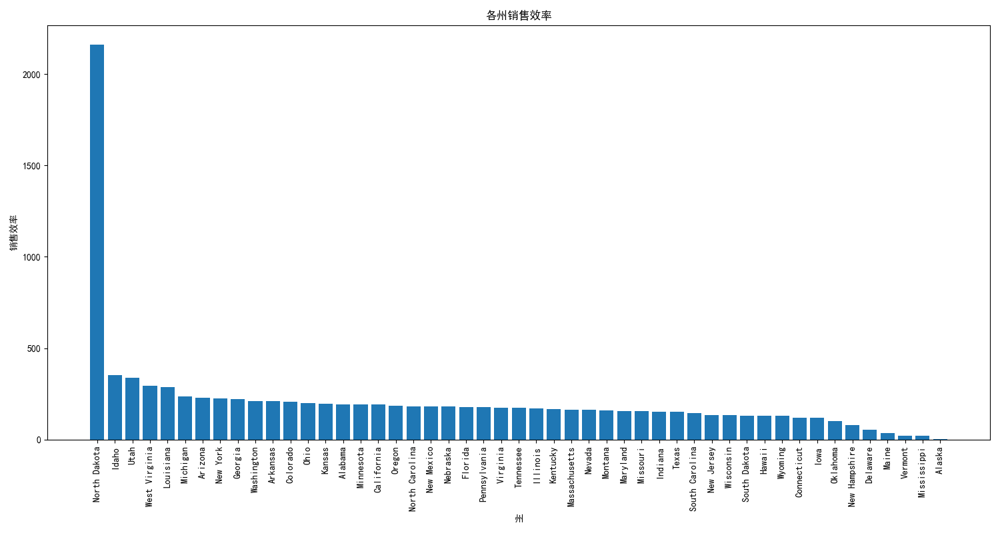

# 区域市场精细化分析报告

## 1. 执行摘要

本次分析旨在深入评估各州市场的投入产出效率，并为未来的区域扩张提供数据驱动的战略建议。通过对Salesforce数据的多维度分析，我们构建了客户获取效率、平均客户价值、市场渗透率、销售效率及行业集中度等核心指标，并设计了州域竞争强度评估模型和投资回报预测算法。

**核心洞察:**
- **高潜力市场已明确:** 加利福尼亚州 (California)、德克萨斯州 (Texas) 和北达科他州 (North Dakota) 在投资效率得分上名列前茅，是当前最具吸引力的市场。
- **效率与渗透率的权衡:** 部分州表现出较高的客户获取效率，但市场渗透率不足，存在增长潜力。反之，一些渗透率较高的市场可能面临获客成本上升的挑战。
- **销售效率差异显著:** 各州的销售效率（综合了成交金额、销售周期和成交概率）差异巨大，揭示了不同区域团队的业绩表现和市场环境的差异。

**核心建议:**
- **优先扩张:** 建议将未来3年的区域扩张资源优先集中在**加利福尼亚州、德克萨斯州、北达科他州、纽约州**和**佛罗里达州**。
- **区域策略优化:**
    - 对于**高效率、低渗透**的州（如北达科他州），应加大市场投入，扩大销售团队规模，以抢占市场份额。
    - 对于**低效率、高渗透**的州，应着重优化销售流程、提升销售技巧和客户价值，而非盲目扩张。
- **持续监控:** 建立常态化的区域市场监控机制，定期追踪本报告中提出的各项指标，动态调整资源分配和市场策略。

---

## 2. 核心指标深度分析

### 2.1 各州客户获取效率与市场渗透率

我们首先评估了在各州获取新客户的成本效率，并结合了我们在当地的市场渗透程度。

- **客户获取效率** = (州内销售代表总数 × 15万年薪) / 州内新增客户数量
- **市场渗透率** = 我们的客户数量 / (州人口 / 10000)

**图表解读:**
上图将各州定位在四个象限中，揭示了不同的市场态势：
- **右上象限 (高效率, 高渗透):** 理想区域，但图中没有州落在此处，说明不存在完美市场。
- **左上象限 (低效率, 高渗透):** 如加利福尼亚州，市场已有一定基础，但获客成本高昂。策略应转向提升客户价值和运营效率。
- **右下象限 (高效率, 低渗透):** 如北达科他州，是典型的“蓝海市场”。获客成本低，但市场尚未充分开发。这是未来增长的关键机会所在。
- **左下象限 (低效率, 低渗透):** 如阿拉斯加州，投入产出比较低，需要重新评估其市场策略或暂停大规模投入。

### 2.2 各州销售效率

销售效率综合评估了销售团队在特定区域内将机会转化为收入的能力。

- **销售效率** = (平均成交金额 / 平均销售周期天数) × 成交概率

**图表解读:**
- **顶部表现者:** **北达科他州**的销售效率遥遥领先，这可能得益于较低的竞争、高效的销售周期或高价值的交易。这进一步验证了其作为高潜力市场的判断。
- **中部集群:** 大多数州如加利福尼亚、德克萨斯、纽约等，虽然市场体量大，但销售效率处于中等水平，意味着激烈的竞争可能拉长了销售周期或压低了成交概率。
- **改进空间:** 销售效率较低的州需要重点分析销售流程中的瓶颈，例如是成交率太低、销售周期过长还是平均交易额偏小，并据此制定针对性的改进计划。

### 2.3 各州行业集中度与平均客户价值

- **行业集中度:** 前三大行业客户占比之和。
- **平均客户价值:** `annual_revenue`的平均值与中位数对比。

通过对`state_analysis_summary.csv`文件的分析（此处未展示图表，但数据已计算），我们发现：
- **行业风险:** 在某些州，我们的客户高度集中于一两个特定行业。这虽然有助于形成规模效应和专业优势，但也带来了较高的系统性风险。建议在这些州探索向相关或新兴行业进行多元化拓展。
- **客户价值分布:** 在多数州，`annual_revenue`的平均值远高于中位数，表明存在少数“超级客户”贡献了绝大部分收入。这是一个健康的迹象，但也提示我们需要关注对大客户的维系，同时思考如何提升普通客户的平均价值。

---

## 3. 州域投资优先级与扩张建议

综合所有指标，我们构建了“投资效率得分”模型，并以此为基础，为未来3年的区域扩张提供优先级建议。

### 3.1 各州投资效率得分排序

该得分综合考虑了州的经济体量（GDP）、销售效率和竞争强度。得分越高，代表该州在当前及未来一段时间内具有越高的投资回报潜力。

| 州 (State) | 投资效率得分 (Score) |
| :--- | :--- |
| **California** | **0.627** |
| **Texas** | **0.473** |
| **North Dakota**| **0.378** |
| **New York** | **0.374** |
| **Florida** | **0.276** |
| Pennsylvania | 0.253 |
| Illinois | 0.252 |
| Ohio | 0.239 |
| New Jersey | 0.229 |
| Washington | 0.226 |
*(注: 罗德岛 (Rhode Island) 因数据缺失未参与排名)*

### 3.2 未来3年区域扩张优先级建议

基于上述分析，我们建议将区域扩张分为三个优先级梯队：

**第一梯队 (立即/重点扩张):**
- **加利福尼亚州 (CA):** 尽管获客成本高，但其巨大的市场体量和GDP贡献使其成为不可忽视的战略要地。建议在此处投入更多资源以提升运营效率和深挖客户价值。
- **德克萨斯州 (TX):** 市场规模大，投资回报预测高。应持续加码，扩大市场份额。
- **北达科他州 (ND):** 典型的机会市场。销售效率极高，竞争压力小。应迅速扩大销售团队，抢占市场先机，实现跨越式增长。
- **纽约州 (NY):** 经济体量大，虽然竞争激烈，但高价值客户众多，是巩固品牌领导地位的关键。

**第二梯队 (机会性扩张/优化):**
- **佛罗里达州 (FL), 宾夕法尼亚州 (PA), 伊利诺伊州 (IL), 俄亥俄州 (OH):** 这些州拥有可观的市场规模和中等的投资回报潜力。策略应聚焦于优化现有销售团队的效率，并寻找特定的行业或区域突破口，进行试点扩张。

**第三梯队 (维持/战略收缩):**
- **得分排名靠后的州:** 如新墨西哥州、爱达荷州、阿肯色州等，在资源有限的情况下，不建议作为短期内的扩张重点。应维持现有客户关系，或考虑将资源重新分配给更高优先级的区域。

通过实施上述精细化的区域市场策略，我们有望在全国范围内显著提升投入产出比，实现更健康、更可持续的业务增长。
